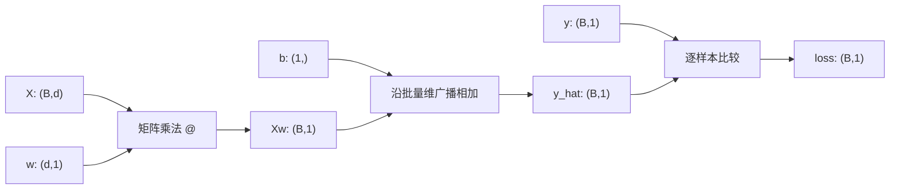
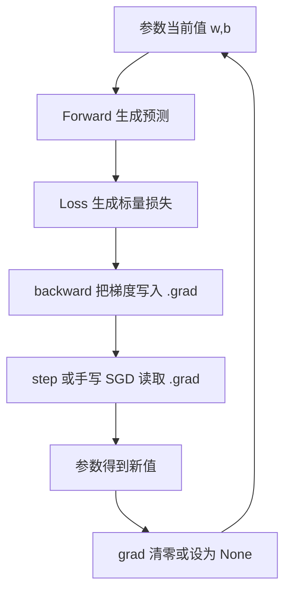
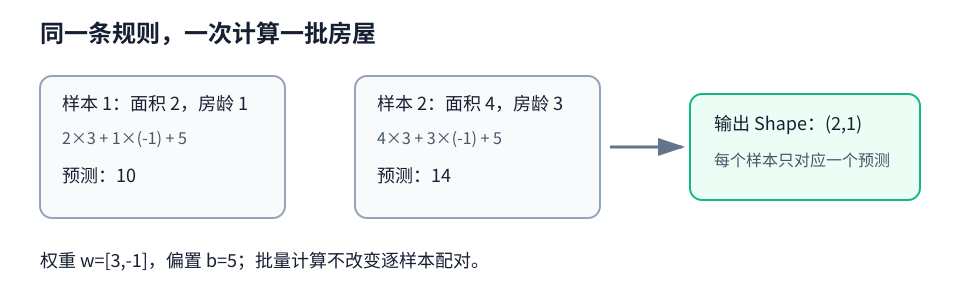
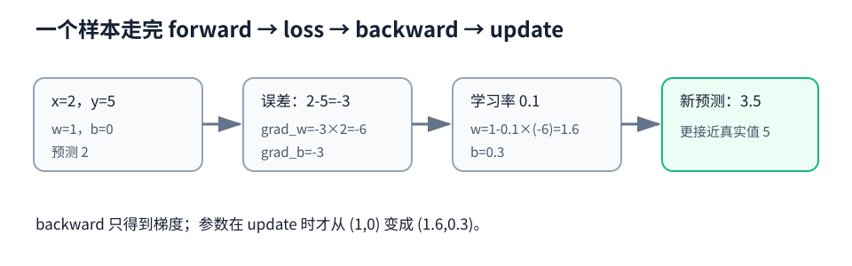
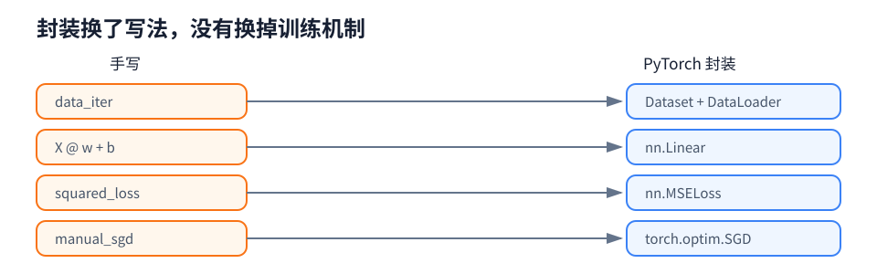
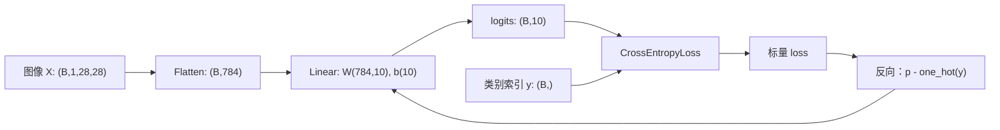
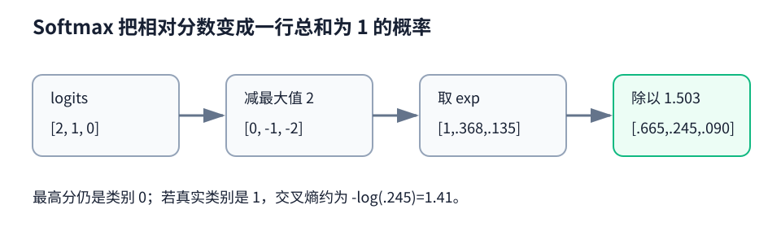
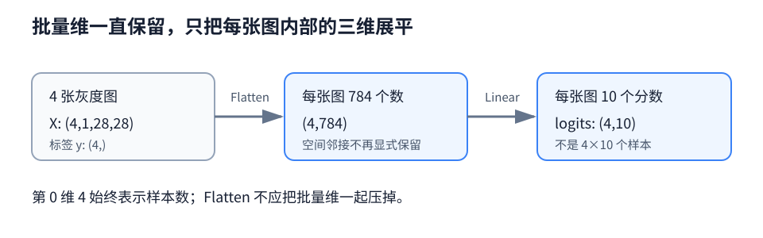
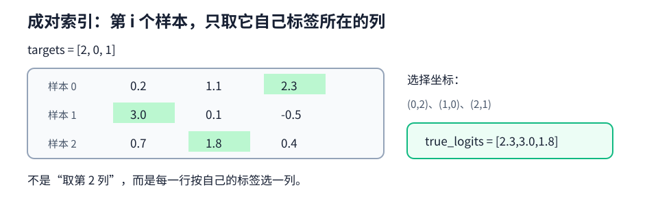
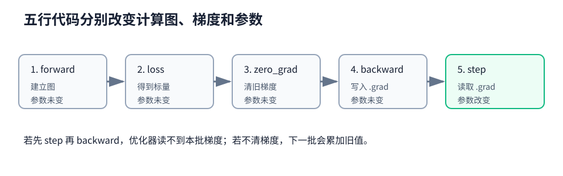

# 第三章：线性神经网络

> 发布日期：2026-08-12 · 阅读时间约 35 分钟 · PyTorch

[返回首页](../README.md) · [线性回归完整代码](../code/ch03/linear_regression.py) · [Softmax 回归完整代码](../code/ch03/softmax_regression.py)

## 一句话主线

模型先根据输入给出预测，损失函数负责判断“错得有多离谱”，反向传播算出“每个参数该往哪边改”，优化器再真正修改参数。以后模型会从一条直线变成 CNN、Transformer，但这条训练主线不会变。


本章有两个任务：

| 任务 | 模型输出 | 常用损失 | 常看指标 |
| --- | --- | --- | --- |
| 线性回归 | 一个连续数值，如房价 | 均方误差 MSE | MSE、RMSE、MAE |
| Softmax 回归 | 每个类别一个分数 logits | 交叉熵 | 准确率、混淆矩阵 |

它们看似不同，训练时却都遵循同一套五步：

```python
output = model(X)                          # 1. Forward
loss = loss_fn(output, y)                 # 2. Loss
optimizer.zero_grad(set_to_none=True)     # 3. 清除旧梯度
loss.backward()                           # 4. Backward
optimizer.step()                          # 5. Update
```

先记住一句话：`backward()` 只负责算梯度，`step()` 才负责改参数。

---

## 3.1 线性回归：让一条线尽量贴近数据

### 它在解决什么问题

假设我们想根据房屋面积和房龄预测价格。最朴素的想法是：面积每增加一点，价格按某个比例增加；房龄每增加一点，价格按另一个比例变化；最后再加一个基础价格。

这就是线性回归：

$$
\hat y = w_1x_1+w_2x_2+\cdots+w_dx_d+b
$$

写成矩阵形式：

$$
\hat{\mathbf y}=\mathbf X\mathbf w+b
$$

符号并不神秘：

- $\mathbf X$ 是这一批样本的特征；
- $\mathbf w$ 是每个特征对应的权重；
- $b$ 是偏置，相当于整条直线整体上移或下移；
- $\hat{\mathbf y}$ 是模型猜出的结果；
- $\mathbf y$ 是真实答案。

### Shape 比公式更容易暴露错误

假设一批有 $B$ 个样本，每个样本有 $d$ 个特征：

| 张量 | Shape | 含义 |
| --- | --- | --- |
| `X` | `(B, d)` | $B$ 个样本，每个有 $d$ 个特征 |
| `w` | `(d, 1)` | 每个特征一个权重 |
| `b` | `(1,)` | 一个共享偏置 |
| `X @ w` | `(B, 1)` | 每个样本一个加权和 |
| `y_hat`、`y` | `(B, 1)` | 预测值与真实值 |



这里最危险的错误不是程序报错，而是程序不报错：如果 `y_hat` 是 `(B, 1)`、`y` 是 `(B,)`，两者相减会按照广播规则变成 `(B, B)`。模型仍能运行，但算的已经不是逐样本误差。

因此完整代码中明确使用：

```python
targets = targets.reshape_as(predictions)
```

它表达的不是“为了好看而改形状”，而是确保第 $i$ 个预测只和第 $i$ 个标签比较。

### 模型怎么知道自己猜得不好

回归常用平方损失：

$$
\ell^{(i)}=\frac{1}{2}\left(\hat y^{(i)}-y^{(i)}\right)^2
$$

对白话来说，它做了两件事：先量出预测和答案的距离，再平方。平方以后正负误差不会抵消，大错误还会受到更重的惩罚。

前面的 $\frac12$ 不影响最优解，只是求导时能与平方产生的 2 抵消：

$$
\frac{\partial \ell}{\partial \hat y}=\hat y-y
$$

需要注意，`nn.MSELoss()` 的定义没有这个 $\frac12$，所以它的数值会是上式的两倍。这不代表实现错了，只要学习率与训练逻辑匹配即可。

### 参数到底是怎样学出来的

梯度可以理解成“损失对参数变化的敏感程度”。若某个方向会让损失增大，我们就朝反方向走：

$$
\mathbf w\leftarrow\mathbf w-\eta\frac{\partial L}{\partial\mathbf w},
\qquad
b\leftarrow b-\eta\frac{\partial L}{\partial b}
$$

$\eta$ 是学习率：

- 太大：每一步跨得太远，损失可能震荡、发散甚至出现 `NaN`；
- 太小：方向也许正确，但走得极慢；
- 合适：损失总体下降，参数逐渐稳定。

所谓小批量随机梯度下降（mini-batch SGD），就是每次只看一小批样本来估计方向。它比每次只看一个样本稳定，又比每次使用整个数据集便宜，还能发挥矩阵并行计算的优势。



图里最容易混淆的地方是：参数值和参数梯度是两份不同状态。`backward()` 更新的是 `.grad`，SGD 更新的才是参数值。

### 新手例子：两套房为什么能一次算完

设面积权重为 3，房龄权重为 -1，基础价格为 5。现在有两个样本：

- 房屋 A：面积 2、房龄 1，预测为 $2\times3+1\times(-1)+5=10$；
- 房屋 B：面积 4、房龄 3，预测为 $4\times3+3\times(-1)+5=14$。

把它们写成批量矩阵：

$$
X=\begin{bmatrix}2&1\\4&3\end{bmatrix},\quad
w=\begin{bmatrix}3\\-1\end{bmatrix},\quad b=5,
$$

则 $Xw+b=[10,14]^\mathsf T$，输出 Shape 为 <code>(2,1)</code>。矩阵乘法只是同时执行了两次相同规则，没有把两个样本混在一起。



**这个例子说明了什么？** 每个特征先乘自己的权重，再加共享偏置；批量维只负责一次处理多个样本。

**新手最容易误解什么？** <code>(2,1)</code> 表示 2 个样本各 1 个预测，不是一个样本有两个输出。标签也应保持相同 Shape，避免广播成两两比较。

---

## 3.2 线性回归：从零开始实现

完整程序：[code/ch03/linear_regression.py](../code/ch03/linear_regression.py)

这里的“从零”不是完全不使用 PyTorch，而是不使用 `nn.Linear`、`nn.MSELoss` 和优化器封装。张量运算和自动求导仍交给 PyTorch，这样我们能把注意力放在训练机制上。

### 代码分成哪几块

| 代码组件 | 作用 | 对应概念 |
| --- | --- | --- |
| `synthetic_data` | 按已知 $w,b$ 生成带噪声数据 | 可控实验 |
| `data_iter` | 打乱并按批次取数据 | mini-batch |
| `linreg` | 计算 `X @ weight + bias` | 前向传播 |
| `squared_loss` | 计算逐样本误差 | 目标函数 |
| `loss.mean().backward()` | 求平均损失对参数的梯度 | 反向传播 |
| `manual_sgd` | 沿负梯度方向修改参数 | 优化 |

### 重点代码怎样逐行读

完整程序把关键步骤写成“一行代码配一行中文注释”。阅读时不要只看函数名，建议给每一行回答三个问题：输入 Shape 是什么、输出 Shape 是什么、它有没有改变参数或梯度状态。

```python
# 1. Forward：用当前参数产生预测 (B,1)。
predictions = linreg(batch_features, weight, bias)
# 2. Loss：逐样本损失取均值，得到标量。
loss = squared_loss(predictions, batch_labels).mean()
# 3. Backward：梯度进入 weight.grad 与 bias.grad，参数值尚未变化。
loss.backward()
# 4. Update：读取梯度修改参数，并清掉本批梯度。
manual_sgd([weight, bias], learning_rate)
```

执行完四行后的状态变化如下：

| 时刻 | 参数值 | `.grad` | 计算图 |
| --- | --- | --- | --- |
| Forward 后 | 未变 | 仍是旧值或 `None` | 已建立 |
| `backward()` 后 | 未变 | 写入本批梯度 | 反向使用后通常被释放 |
| SGD 后 | 已改变 | 被设为 `None` | 更新动作不入图 |

### 为什么先生成“假数据”

我们先指定真实参数：

$$
\mathbf w=[2,-3.4]^\mathsf T,\qquad b=4.2
$$

再生成数据：

$$
\mathbf y=\mathbf X\mathbf w+b+\epsilon
$$

其中 $\epsilon$ 是很小的随机噪声。训练结束后，如果模型学到的参数接近 `[2, -3.4]` 和 `4.2`，说明数据、损失、梯度与更新链路基本正确。这比只看到“loss 下降了”更有说服力，因为错误的指标统计有时也会制造下降假象。

### `yield` 在做什么

`data_iter` 不是一次返回全部批次，而是在每次迭代时返回一批，然后暂停在当前位置：

```python
yield features[batch_indices], labels[batch_indices]
```

这叫生成器。它适合数据管线，因为调用者只拿当前需要的一批，不必先复制出所有批次。`random.shuffle(indices)` 则让每轮看到的样本组合不同，减少固定顺序造成的偏差。

### 为什么损失用 `mean()`，SGD 就不再除批量大小

本程序使用：

```python
loss = squared_loss(predictions, batch_labels).mean()
loss.backward()
parameter -= learning_rate * parameter.grad
```

因为 `mean()` 已经把梯度除以了本批样本数，手写 SGD 不能再除一次。另一种同样正确的组合是 `loss.sum().backward()`，然后更新时除以当前批次的真实大小。

记忆规则很简单：

| 反向传播前的聚合 | 更新时怎么处理 |
| --- | --- |
| `loss.mean()` | 不再除 batch size |
| `loss.sum()` | 除以当前真实 batch size |

两套写法不要混用。尤其最后一批可能不足预设的 `batch_size`，如果需要除，必须用 `X.shape[0]` 或 `y.numel()`。

### 梯度为什么必须清除

PyTorch 默认把新梯度累加到 `.grad`，而不是覆盖旧梯度。这是为了支持梯度累积和共享参数等场景。普通 mini-batch 训练希望每批独立，因此更新后要清掉旧梯度：

```python
parameter.grad = None
```

将梯度设为 `None` 与填成全零都能开始下一批，但 `None` 往往减少一次内存写入；如果某参数下一轮根本没有梯度，也更容易被识别。

### 为什么更新要放进 `torch.no_grad()`

参数更新是优化动作，不是模型前向的一部分。如果直接执行 `parameter -= ...`，自动求导会尝试记录这次原地操作，甚至因修改需要梯度的叶子张量而报错。

`torch.no_grad()` 的意思是：“这个代码块里的运算不用加入计算图。”它和清梯度是两件不同的事：

- `no_grad`：控制是否记录新计算；
- `grad = None`：清除已经算出来的旧梯度。

### 新手例子：一个样本走完一次 SGD

只看一个样本：<code>x=2</code>、真实值 <code>y=5</code>。初始参数 <code>w=1</code>、<code>b=0</code>，学习率为 0.1。

1. 前向：$\hat y=2\times1+0=2$。
2. 误差：$\hat y-y=2-5=-3$。
3. 使用 $\frac12(\hat y-y)^2$ 时，$\partial L/\partial w=-3\times2=-6$，$\partial L/\partial b=-3$。
4. 更新：$w=1-0.1\times(-6)=1.6$，$b=0-0.1\times(-3)=0.3$。
5. 用新参数再预测：$2\times1.6+0.3=3.5$，比原来的 2 更接近 5。



**这个例子说明了什么？** 梯度的负号告诉我们提高 <code>w</code> 和 <code>b</code> 会让这次预测更接近答案；更新动作沿负梯度方向移动。

**新手最容易误解什么？** <code>backward()</code> 结束时参数仍是 1 和 0，只是 <code>.grad</code> 里出现 -6 和 -3；手写更新后参数才改变。

---

## 3.3 线性回归：PyTorch 简洁实现

同一份完整程序也包含简洁实现：[code/ch03/linear_regression.py](../code/ch03/linear_regression.py)

框架只是替我们封装了重复工作，并没有改变原理：

| 从零实现 | PyTorch 封装 | 封装了什么 |
| --- | --- | --- |
| `data_iter` | `TensorDataset` + `DataLoader` | 样本索引、打乱、分批 |
| `X @ w + b` | `nn.Linear` | 参数创建、注册和前向 |
| `squared_loss` | `nn.MSELoss` | 稳定且统一的损失接口 |
| `manual_sgd` | `torch.optim.SGD` | 读取梯度并更新参数 |

### Dataset 和 DataLoader 不要混为一谈

- `Dataset` 回答“第 $i$ 个样本是什么”；
- `DataLoader` 回答“用什么顺序、每次拿多少、是否并行加载”。

`TensorDataset(features, labels)` 要求各张量第 0 维相同，因为同一个索引位置会组成一个样本。

### `nn.Linear(2, 1)` 的权重为什么是 `(1, 2)`

数学里常写 $XW$，但 PyTorch 的 `Linear` 把每个输出神经元的权重存成一行，因此 `weight` 的 Shape 是：

```text
(out_features, in_features)
```

前向内部相当于：

$$
\operatorname{Linear}(X)=XW^\mathsf T+b
$$

所以输入 `(B, 2)` 乘 `weight.T` 的 `(2, 1)`，输出是 `(B, 1)`。

### `train()`、`eval()` 与梯度开关解决的不是同一件事

| 写法 | 改变模型行为 | 关闭梯度记录 | 常用位置 |
| --- | --- | --- | --- |
| `model.train()` | 是，切到训练模式 | 否 | 训练循环开始 |
| `model.eval()` | 是，切到评估模式 | 否 | 验证、测试、推理前 |
| `torch.no_grad()` | 否 | 是 | 临时不需要梯度的计算 |
| `torch.inference_mode()` | 否 | 是，并减少更多开销 | 纯验证与推理 |

线性层本身没有 Dropout 或 BatchNorm，所以 `train/eval` 暂时看不出区别。保留标准写法，是为了代码换成更深模型时不会埋坑。推荐评估组合：

```python
model.eval()
with torch.inference_mode():
    predictions = model(features)
```

### 新手例子：封装前后逐项对照

同一批 <code>X:(4,2)</code> 和 <code>y:(4,1)</code>，手写版与简洁版做的事情完全对应：

1. <code>data_iter</code> 手动选 4 行；<code>DataLoader</code> 返回同样的一个批次。
2. <code>X @ w + b</code> 得到 <code>(4,1)</code>；<code>nn.Linear(2,1)</code> 也得到 <code>(4,1)</code>。
3. 手写平方损失与 <code>nn.MSELoss</code> 都把预测和标签逐样本比较。
4. 手写 <code>parameter -= lr * grad</code> 与 <code>optimizer.step()</code> 都在反向之后改变参数。



**这个例子说明了什么？** 简洁实现省掉的是参数注册、分批和更新的样板代码，训练链路没有少一步。

**新手最容易误解什么？** <code>optimizer.step()</code> 不会替你执行前向、计算损失或反向传播；它只读取已经存在的梯度。

---

## 3.4 从回归走向分类：Softmax 回归

### 分类模型输出的不是概率，而是 logits

Fashion-MNIST 有 10 个类别。模型先为每个类别给一个原始分数：

$$
\mathbf O=\mathbf X\mathbf W+\mathbf b
$$

对于一个批次：

| 张量 | Shape |
| --- | --- |
| 原图 `X` | `(B, 1, 28, 28)` |
| 展平后 | `(B, 784)` |
| 权重 `W` | `(784, 10)` |
| 偏置 `b` | `(10,)` |
| 输出 `logits` | `(B, 10)` |
| 标签 `y` | `(B,)`，值为 0～9 的整数 |

`logit` 只是“相对支持度”，可以是任意实数，不要求在 0 到 1 之间，也不要求总和为 1。

### Softmax 怎样把分数变成概率

对第 $i$ 个样本、第 $j$ 个类别：

$$
p_{ij}=\frac{\exp(o_{ij})}{\sum_{k=1}^{C}\exp(o_{ik})}
$$

这样每个概率都为正，同一样本所有类别概率之和为 1。Softmax 表达的是互斥类别之间的竞争，因此适合“每张图只属于一个类别”的单标签多分类。

如果一个样本可以同时拥有多个标签，例如一张图同时包含“汽车”和“行人”，通常应对每个类别独立使用 sigmoid，而不是 Softmax。

### 为什么 Softmax 要先减最大值

直接计算 `exp(1000)` 会溢出。但同一行 logits 同时减去一个常数，不会改变 Softmax 结果：

$$
\frac{e^{o_j-c}}{\sum_k e^{o_k-c}}
=\frac{e^{o_j}}{\sum_k e^{o_k}}
$$

令 $c=\max_k o_k$ 后，最大的指数输入变为 0，其余都不大于 0，于是不会发生指数上溢。这就是代码 `stable_softmax` 中先减每行最大值的原因。

### 交叉熵为什么只盯着真实类别

若真实类别为 $y_i$，单个样本的交叉熵是：

$$
\ell_i=-\log p_{i,y_i}
$$

- 真实类别概率接近 1：损失接近 0；
- 真实类别概率很小：负对数迅速变大；
- 自信地猜错：受到很重惩罚。

从 logits 直接计算时，可以写成更稳定的形式：

$$
\ell_i=\log\left(\sum_j e^{o_{ij}}\right)-o_{i,y_i}
$$

完整的从零实现使用 `torch.logsumexp` 计算这一式子，避免“先得到极小概率，再对它取对数”造成下溢。

Softmax 与交叉熵组合还有一个漂亮结果。对 logits 的梯度是：

$$
\frac{\partial \ell}{\partial o_j}=p_j-\mathbb{1}(j=y)
$$

白话解释：所有错误类别的分数按预测概率往下压；真实类别的分数则往上推。模型越自信地猜错，纠正力量越大。



这张图也说明了一个关键接口：`CrossEntropyLoss` 的左输入是 logits，右输入是类别索引；中间不需要手动插入 Softmax 或 one-hot。

### 为什么预测时不用真的计算 Softmax

Softmax 不会改变类别排序，所以：

```python
prediction = logits.argmax(dim=1)
```

与先 Softmax 再 `argmax` 的类别结果完全相同。只有需要展示概率、做置信度分析或阈值决策时，才需要显式计算概率。

### 新手例子：三个分数怎样变成概率

某个样本的 logits 是 <code>[2,1,0]</code>：

1. 为稳定计算，三项都减最大值 2，得到 <code>[0,-1,-2]</code>；排序没有改变。
2. 取指数，约为 <code>[1,0.368,0.135]</code>。
3. 三项之和约为 1.503，分别除以它，得到概率 <code>[0.665,0.245,0.090]</code>。
4. 若真实类别是 1，交叉熵约为 $-\log(0.245)=1.41$。



**这个例子说明了什么？** Softmax 关心分数之间的相对差距；同减一个常数不改变结果，却能避免 <code>exp</code> 上溢。

**新手最容易误解什么？** logits 可以是负数，也不需要和为 1。训练时 <code>CrossEntropyLoss</code> 要接收 logits，不要先手动 Softmax。

---

## 3.5 Fashion-MNIST：数据进入模型前发生了什么

Fashion-MNIST 的每张图是单通道 $28\times28$ 灰度图，共 10 类服饰。`transforms.ToTensor()` 通常完成两件事：把图像变为浮点张量，并把像素缩放到 `[0, 1]`。

线性分类器先用 `Flatten` 把每张图从 `(1, 28, 28)` 展成 `(784,)`。这一步不会丢掉像素值，但会丢掉“相邻像素在空间上相邻”的结构信息，所以 Softmax 回归只能作为图像分类基线，后续 CNN 会更擅长利用局部结构。

训练集设置 `shuffle=True`，测试集通常设为 `False`：

- 训练打乱是为了避免固定顺序影响梯度；
- 测试不需要随机性，固定顺序更方便复现和定位样本；
- `shuffle=False` 不会改变最终整集准确率。

标签必须是 `torch.long` 的类别索引，Shape 为 `(B,)`。使用 `CrossEntropyLoss` 时通常不要把标签手动转成 one-hot。

### 新手例子：4 张图进模型后每一维代表什么

设 DataLoader 返回 4 张灰度图：

1. 原批次 <code>X.shape=(4,1,28,28)</code>：4 是样本数，1 是灰度通道，后两维是高宽。
2. <code>Flatten</code> 只合并每个样本内部的 <code>1×28×28</code>，得到 <code>(4,784)</code>。
3. <code>Linear(784,10)</code> 为每张图输出 10 个类别分数，得到 <code>(4,10)</code>。
4. 标签 <code>y.shape=(4,)</code>，例如 <code>[9,0,3,3]</code>，每个整数对应一张图。



**这个例子说明了什么？** 批量维从输入到输出一直是 4，模型没有把 4 张图拼成一张图。

**新手最容易误解什么？** <code>Flatten</code> 应从第 1 维开始，不能把批量维也压掉；否则会得到一条长度 3136 的向量，样本边界消失。

---

## 3.6 Softmax 回归：从零开始实现

完整程序：[code/ch03/softmax_regression.py](../code/ch03/softmax_regression.py)

从零版本手写了四个关键部分：

1. 参数 `weight:(784,10)` 与 `bias:(10,)`；
2. 展平和线性前向，得到 `logits:(B,10)`；
3. 使用 `logsumexp` 的稳定交叉熵；
4. 在 `no_grad` 中执行 SGD，并清除旧梯度。

### 如何从 logits 取出每个样本的真实类别分数

假设 `targets = [2, 0, 4]`，我们想取第 0 行第 2 列、第 1 行第 0 列、第 2 行第 4 列。代码使用成对高级索引：

```python
row_index = torch.arange(targets.numel(), device=targets.device)
true_logits = logits[row_index, targets]
```

结果是一维张量 `(B,)`，每个位置对应一个样本的真实类别分数。

### 指标统计最常见的“看似合理”错误

`accuracy_count` 返回的是正确样本个数：

```python
(logits.argmax(dim=1) == targets).sum().item()
```

因此跨批统计时直接累加正确个数，最后除总样本数。不能把这个数再乘 batch size。

损失则要先看 reduction：

- 若得到逐样本损失，累加 `loss_vector.sum()`；
- 若 `loss_fn` 返回批平均值，累加 `loss.item() * 本批样本数`；
- 最后统一除以总样本数。

不能直接把每批平均损失相加再除批次数，因为最后一批往往更小，每批等权会产生偏差。

### 新手例子：三行 logits 怎样各取自己的真实类别

假设三个样本的标签是 <code>[2,0,1]</code>。那么需要取的坐标是：

- 样本 0：第 0 行第 2 列；
- 样本 1：第 1 行第 0 列；
- 样本 2：第 2 行第 1 列。

若三行 logits 分别为 <code>[0.2,1.1,2.3]</code>、<code>[3.0,0.1,-0.5]</code>、<code>[0.7,1.8,0.4]</code>，则真实类别分数是 <code>[2.3,3.0,1.8]</code>。



**这个例子说明了什么？** 成对高级索引是在每一行选择不同的列，输出仍是一条长度为批量大小的向量。

**新手最容易误解什么？** <code>logits[:, targets]</code> 会组合所有行和多个列，产生额外维度；它不是“每行按自己的标签取一个数”。

---

## 3.7 Softmax 回归：PyTorch 简洁实现

简洁模型只有两层：

```python
model = nn.Sequential(
    nn.Flatten(),
    nn.Linear(784, 10),
)
```

`Flatten` 没有参数，`Linear` 的参数量是：

$$
784\times10+10=7850
$$

模型末尾没有 `Softmax`，因为：

```python
loss_fn = nn.CrossEntropyLoss()
```

已经在内部稳定地融合了 `log_softmax` 和负对数似然。把概率传给它，相当于对同一输出重复处理，不仅语义错误，还会削弱梯度并损失数值稳定性。

### 标准训练循环逐句解释

```python
logits = model(features)
```

前向只负责从输入得到分数，不修改参数。

```python
loss = loss_fn(logits, targets)
```

把 `(B,10)` 的 logits 与 `(B,)` 的类别索引比较，默认返回当前批次的平均损失标量。

```python
optimizer.zero_grad(set_to_none=True)
```

清掉上一个批次留下的梯度。设为 `None` 通常比把整块梯度张量写成零更省内存写入。

```python
loss.backward()
```

沿计算图从损失反向计算梯度，把结果写进各参数的 `.grad`。参数值此时还没有改变。

```python
optimizer.step()
```

优化器读取 `.grad`，按照 SGD 规则原地更新参数。它不会自动求梯度，也不会自动清除下一轮不需要的旧梯度。

### 类别不平衡怎么办

若某些类别远少于其他类别，可以传入类别权重：

```python
class_weight = torch.tensor([...], device=device)
loss_fn = nn.CrossEntropyLoss(weight=class_weight)
```

权重长度必须等于类别数，并与 logits 位于同一设备。权重不是越大越好：它表达“错过这个类别有多贵”，应结合训练集频率、业务代价和验证集结果确定。

### 新手例子：五行训练代码分别改变什么

以一个批次为单位逐行看状态：

1. <code>logits = model(X)</code>：建立前向计算图，参数值不变。
2. <code>loss = loss_fn(logits,y)</code>：图末端得到标量损失，参数值仍不变。
3. <code>zero_grad()</code>：清除上一批梯度，不是清参数。
4. <code>loss.backward()</code>：把本批梯度写入每个参数的 <code>.grad</code>，参数值仍不变。
5. <code>optimizer.step()</code>：读取 <code>.grad</code>，此时参数才改变。



**这个例子说明了什么？** 训练循环里的每行职责单一；出错时可以逐步检查输出 Shape、损失、梯度和参数差值。

**新手最容易误解什么？** <code>zero_grad()</code> 放在 <code>backward()</code> 之后会把刚算出的梯度清掉；它应在当前批反向之前执行。

---

## 完整代码与运行方法

### 1. 安装依赖

```bash
pip install torch torchvision
```

### 2. 运行线性回归

```bash
python code/ch03/linear_regression.py
```

默认依次运行从零实现和简洁实现。只运行一种：

```bash
python code/ch03/linear_regression.py --implementation scratch
python code/ch03/linear_regression.py --implementation concise --epochs 5
```

预期现象：损失快速下降，学到的 `w` 接近 `[2.0, -3.4]`，`b` 接近 `4.2`。因为数据包含噪声，不会完全相等。

### 3. 先离线检查 Softmax 代码

```bash
python code/ch03/softmax_regression.py --smoke-test --implementation both --epochs 2
```

`--smoke-test` 使用程序生成的可学习假图像，不下载数据。它只能证明代码链路能跑通，不能代表 Fashion-MNIST 的实际效果。

### 4. 训练 Fashion-MNIST

```bash
python code/ch03/softmax_regression.py --implementation concise --epochs 10
```

首次运行会下载数据到 `data/`。有可用 NVIDIA GPU 时，默认自动选择 CUDA；也可明确指定：

```bash
python code/ch03/softmax_regression.py --device cpu
python code/ch03/softmax_regression.py --device cuda
```

---

## 常见问题：先按这个顺序排查

### 损失完全不下降

1. 打印输入、标签和输出的 Shape、dtype、device；
2. 确认回归标签与预测 Shape 一致；
3. 确认分类损失收到 logits，而不是 Softmax 后的概率；
4. 检查参数的 `.grad` 是否为 `None` 或全零；
5. 确认执行了 `backward()` 和 `step()`；
6. 检查是否在 `inference_mode()` 中误做训练；
7. 最后再调学习率和初始化。

### 训练损失下降，但测试准确率很低

先排除训练/测试预处理不一致、标签映射错误和评估统计错误。如果代码无误，常见原因是过拟合或训练集与测试集分布不同。线性模型在图像任务上能力有限，也可能只是模型表达能力不足。

### 出现 `NaN` 或 `inf`

先降低学习率，再检查是否直接对巨大 logits 做 `exp`、是否对 0 取 `log`、输入是否存在异常值。分类优先使用接收 logits 的 `nn.CrossEntropyLoss`，而不是手动先 Softmax 再取对数。

### CUDA 报设备不一致

模型参数、输入、标签和类别权重必须位于同一设备。常见修复是：

```python
model = model.to(device)
features = features.to(device)
targets = targets.to(device)
```

---

### 面试八股加练：不能只背结论

<details>
<summary>16. 【八股深答】MSE 与 MAE 都能做回归损失，为什么训练表现不同？</summary>

**结论：**MSE 平滑、对大误差惩罚更重；MAE 对离群点更稳健，但在误差为 0 处不可导且梯度大小几乎恒定。**机制：**单样本误差为 $e$ 时，MSE 梯度正比于 $2e$，大误差产生大更新；MAE 的次梯度主要是 $\operatorname{sign}(e)$。**工程影响：**数据含异常值时 MSE 可能被少量样本支配，MAE 又可能在最优点附近来回摆动，可考虑 Huber 损失折中。**误区：**“MAE 一定更好”不成立，损失还隐含噪声分布假设。**追问：**MSE 对应高斯噪声的极大似然，MAE 更接近拉普拉斯噪声假设。

</details>

<details>
<summary>17. 【八股深答】为什么 CrossEntropyLoss 接收 logits，而不是概率？</summary>

**结论：**它内部把 `log_softmax` 与负对数似然合并，既避免重复计算，也更数值稳定。**机制：**直接算 $\log(\exp z_y/\sum_j\exp z_j)$ 会遇到大 logits 溢出和小概率取对数下溢；减去最大值并用 log-sum-exp 可稳定求值。**工程影响：**模型末层输出 `(B,C)` 原始分数，标签用 `(B,)` 的 long 类别索引。**误区：**先 Softmax 不会让数学目标“更完整”，反而改变输入语义并可能削弱稳定性。**追问：**二分类用一个 logit 时，可用 `BCEWithLogitsLoss`，同样不要预先 Sigmoid。

</details>

<details>
<summary>18. 【八股深答】训练损失下降但验证损失上升，应该怎样判断而不是立刻换模型？</summary>

**结论：**先确认评估链路无误，再把它视为过拟合候选证据。**机制：**训练目标只约束训练样本，容量足够的模型可以继续记忆细节而泛化恶化。**工程影响：**固定数据划分，使用 `eval()` 和无梯度模式，核对预处理一致；随后再尝试早停、正则化、增广或更多数据。**误区：**一次验证波动不能证明过拟合，数据泄漏和训练/评估模式错误也会制造相同曲线。**追问：**若训练和验证损失都高，更像欠拟合、优化失败或标签问题，处理方向不同。

</details>

## 本章速查表

| 问题 | 结论 |
| --- | --- |
| `backward()` 会更新参数吗？ | 不会，只计算并累加梯度 |
| `optimizer.step()` 会计算梯度吗？ | 不会，只读取已有梯度更新参数 |
| 为什么每批清梯度？ | PyTorch 默认累加梯度 |
| 回归最危险的 Shape 坑？ | `(B,1)` 与 `(B,)` 相减会广播成 `(B,B)` |
| `CrossEntropyLoss` 接什么？ | 原始 logits 与 `long` 类型类别索引 |
| 模型末尾要加 Softmax 吗？ | 配合 `CrossEntropyLoss` 时不要加 |
| 预测类别要算 Softmax 吗？ | 不需要，直接对 logits 做 `argmax` |
| 评估推荐组合？ | `model.eval()` + `torch.inference_mode()` |
| Epoch 平均损失怎么统计？ | 每批均值乘本批样本数，求和后除总样本数 |
| Softmax 回归是非线性模型吗？ | 不是，类别决策边界仍是线性的 |

---

## 主动回忆：先遮住答案再作答

<details>
<summary>1. 为什么 backward 之前要把逐样本损失变成标量？</summary>

`backward()` 本质上计算向量-雅可比积。标量损失可以默认以上游梯度 1 开始反传；非标量输出则需要显式提供同 Shape 的上游梯度。对逐样本损失求和或平均，是最常见的标量化方式。

</details>

<details>
<summary>2. `loss.sum()` 与 `loss.mean()` 都能训练吗？</summary>

都能。`sum` 的梯度会随批量大小增大，`mean` 已按批量大小归一化。学习率与手写更新规则必须和 reduction 成对：若反传平均损失，更新时不要再次除 batch size。

</details>

<details>
<summary>3. 为什么模型评估时既要 `eval()`，又要关闭梯度？</summary>

两者职责不同。`eval()` 改变 Dropout、BatchNorm 等模块的行为；`inference_mode()` 或 `no_grad()` 关闭 autograd 记录，节省时间和显存。只用其中一个都不完整。

</details>

<details>
<summary>4. 为什么 CrossEntropyLoss 前不能再加 Softmax？</summary>

`CrossEntropyLoss` 期望原始 logits，内部用稳定的 log-sum-exp 完成 log-softmax 与负对数似然。提前 Softmax 会重复变换、降低数值稳定性，并改变梯度。

</details>

<details>
<summary>5. 为什么 Softmax 回归仍然只能学到线性决策边界？</summary>

任意两个类别的 logits 之差仍是输入的线性函数。两类得分相等的位置满足一个线性方程，因此边界是直线、平面或更高维超平面。Softmax 只是归一化分数，没有增加非线性表达能力。

</details>

<details>
<summary>6. 如何证明一次训练真的更新了参数？</summary>

在一个很小的 batch 上保存更新前参数，执行 forward、loss、backward、step，再比较参数是否改变；同时检查损失是有限数、关键参数的 `.grad` 不是 `None`，Shape 与参数一致。

</details>

<details>
<summary>7. [Shape] 若 `X=(32,2)`、`w=(2,1)`、`b=(1,)`，前向和损失各是什么 Shape？</summary>

`X @ w` 为 `(32,1)`，加上沿批量维广播的 `b` 后仍为 `(32,1)`。若标签也整理为 `(32,1)`，逐样本平方损失为 `(32,1)`；调用 `.mean()` 后得到零维标量张量，可直接执行 `backward()`。

</details>

<details>
<summary>8. [广播诊断] 为什么 `(32,1) - (32,)` 会得到 `(32,32)`？怎样修复？</summary>

广播会从末尾维度对齐：`(32,1)` 与 `(32,)` 被理解成 `(32,1)` 与 `(1,32)`，两个单例维分别扩展，结果成为 `(32,32)`。应在计算损失前用 `targets.reshape_as(predictions)`，让两者都为 `(32,1)`。

</details>

<details>
<summary>9. [代码推演] 连续两批都不清梯度，第二次 `backward()` 后 `.grad` 保存什么？</summary>

保存第一批梯度与第二批梯度之和，而不是只有第二批梯度。若这是有意的梯度累积，应在累计若干批后再 `step()` 并清梯度；普通 mini-batch 训练则应在每次反向前或更新后清除旧梯度。

</details>

<details>
<summary>10. [代码推演] `optimizer.zero_grad(set_to_none=True)` 放在 `step()` 后可以吗？</summary>

可以，关键约束是下一次 `backward()` 前旧梯度必须已清除。常见模板把它放在 forward/loss 后、backward 前，逻辑边界更清楚；放在本批 `step()` 后也能得到相同结果，但发生异常或提前 `continue` 时更容易遗漏。

</details>

<details>
<summary>11. [数值稳定] logits 为 `[1000, 999, 998]` 时，直接 Softmax 为什么危险？</summary>

`exp(1000)` 会超出普通浮点数范围，产生 `inf`，随后分母和除法可能得到 `NaN`。同一行先减最大值后变为 `[0,-1,-2]`，Softmax 概率不变，但指数都在 `(0,1]`，计算稳定。

</details>

<details>
<summary>12. [接口] 分类标签为什么通常是 `(B,)` 的 long 索引，而不是 `(B,10)` one-hot？</summary>

单标签交叉熵只需知道每个样本的真实类别位置。索引标签更省内存，框架可直接选择相应 logit；`nn.CrossEntropyLoss` 的常规类别索引接口要求 `torch.long` 和 Shape `(B,)`。软标签、标签平滑等特殊情况才可能传入概率分布。

</details>

<details>
<summary>13. [指标] 三个 batch 分别有 32、32、5 个样本，怎样汇总平均损失？</summary>

若每批损失是 mean，应计算 `(loss1×32 + loss2×32 + loss3×5) / 69`。不能计算 `(loss1+loss2+loss3)/3`，因为那会让只有 5 个样本的最后一批与 32 个样本的批次拥有相同权重。

</details>

<details>
<summary>14. [故障诊断] 训练准确率始终约 10%，最先检查什么？</summary>

先拿一个 batch 检查图像 Shape、标签范围和 dtype，再检查 logits 是否为 `(B,10)`、损失是否直接接 logits、参数梯度是否存在、`step()` 是否执行。10 类任务长期约 10% 通常意味着接近随机猜测；确认链路无误后再检查学习率、数据预处理和模型容量。

</details>

<details>
<summary>15. [模型能力] 为什么增加训练轮数也无法让 Softmax 回归学会复杂曲线边界？</summary>

训练更久只能在当前函数族中寻找更好的参数，不能改变函数族本身。Softmax 回归的 logits 是输入的仿射函数，任意两类等分位置仍是线性超平面；要表达复杂边界，需要加入隐藏层与非线性激活函数，这正是第四章的主题。

</details>

## 学完这一章应该能做到

- 用自己的话讲清“前向、损失、反向、更新”的因果关系；
- 看到公式时能写出批量维和特征/类别维；
- 解释 `backward`、`zero_grad`、`step` 各自负责什么；
- 分清 logits、概率、类别索引和 one-hot；
- 正确统计跨批次损失与准确率；
- 独立运行两份完整程序，并根据输出定位常见问题。

下一章会在这套训练骨架上加入隐藏层和激活函数，让模型从“只能画直线”升级为能够拟合非线性关系。

[下一章：多层感知机](ch04-multilayer-perceptrons.md) · [返回总目录](../README.md)
