# 第四章：多层感知机

> GitHub 复习版 · PyTorch · 参考现有第四章 PDF 全 101 页与项目代码索引后原创重写

[返回首页](../README.md) · [本章完整代码目录](../code/ch04)

## 一句话主线

线性模型只能画直线，MLP 用“隐藏层 + 非线性”学会弯曲的规律；但模型会表达只是第一步，还要靠验证集、正则化、正确的计算图与初始化，让它学得动、不过度记忆，并在线上分布变化后仍保持可信。

## 章节地图

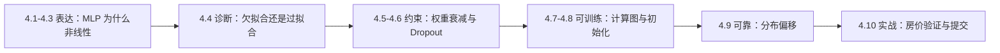

建议把本章分三遍读：第一遍只看直觉和图，第二遍追踪公式与 Shape，第三遍运行完整代码并做文末主动回忆。

---

## 4.1 多层感知机：为什么多一层还不够

### 一句话核心

隐藏层提供新的特征组合，激活函数负责把这些组合“掰弯”；没有激活函数，再多 `Linear` 也能合并为一层。

线性模型的边界像一把直尺。它能把平面切成两半，却很难表达“中间一圈属于 A、外面属于 B”这种弯曲边界。MLP 在输入和输出之间增加隐藏表示：第一层不急着作答，而是先学习“哪些输入模式值得关注”，再由输出层组合这些模式。

设一批输入为 $\mathbf X\in\mathbb R^{B\times d}$，隐藏宽度为 $h$，类别数为 $q$：

$$
\mathbf Z=\mathbf X\mathbf W_1+\mathbf b_1,
\qquad
\mathbf H=\sigma(\mathbf Z),
\qquad
\mathbf O=\mathbf H\mathbf W_2+\mathbf b_2.
$$

| 张量 | Shape | 白话含义 |
| --- | --- | --- |
| $\mathbf X$ | `(B, d)` | 一批原始特征 |
| $\mathbf W_1$ | `(d, h)` | 每个隐藏单元怎样组合输入 |
| $\mathbf H$ | `(B, h)` | 网络自己学出的中间特征 |
| $\mathbf W_2$ | `(h, q)` | 怎样把隐藏特征组合成类别分数 |
| $\mathbf O$ | `(B, q)` | 未归一化的 logits |

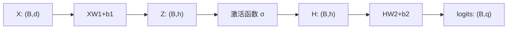

如果去掉 $\sigma$：

$$
(\mathbf X\mathbf W_1+\mathbf b_1)\mathbf W_2+\mathbf b_2
=\mathbf X(\mathbf W_1\mathbf W_2)+(\mathbf b_1\mathbf W_2+\mathbf b_2),
$$

右边仍是一次仿射变换。这就是“只堆线性层没有用”的严格原因。

### 三种常见激活

| 激活 | 直觉 | 优点 | 主要风险 |
| --- | --- | --- | --- |
| ReLU | 负值关掉，正值原样通过 | 快；正区间梯度稳定 | 单元长期落在负区间会“死亡” |
| Sigmoid | 把数压到 `(0,1)` | 适合门控或概率含义 | 大绝对值处饱和，梯度接近 0 |
| Tanh | 把数压到 `(-1,1)` | 零中心 | 同样会饱和 |

完整实验：[activations.py](../code/ch04/activations.py)。它做三件事：数值验证两层可合并、打印三种激活的导数、追踪 `(8,4) -> (8,6) -> (8,3)`。

忘记时先查：有没有激活函数 → 激活放在了哪一层之后 → 预激活是否几乎全负或进入饱和区 → 每层 Shape 是否保留批量维。

### 新手例子：为什么 XOR 逼着边界“拐弯”

- **小输入**：四个点 `(0,0)`、`(1,1)` 属于 A 类，`(0,1)`、`(1,0)` 属于 B 类；这就是一个 2 特征、2 类的 XOR 小数据集。
- **逐步过程**：尝试用一条直线切平面，会发现无论横切、竖切还是斜切，总有同类点落在线两侧。连续写两层 Linear 仍可合并成一层，问题没有改变；在中间加 ReLU 后，隐藏单元可分别构造“沿不同方向是否越过阈值”的特征，再由输出层组合。
- **输出**：纯线性模型无法把四点全分对；`Linear → ReLU → Linear` 已具有表达弯折边界的能力。
- **说明什么**：隐藏层增加中间特征，激活函数才真正打破线性复合；二者要配合。
- **最容易误解什么**：不是“层数达到 2 就自动非线性”。若两层之间没有激活，再深仍只是一次仿射变换。

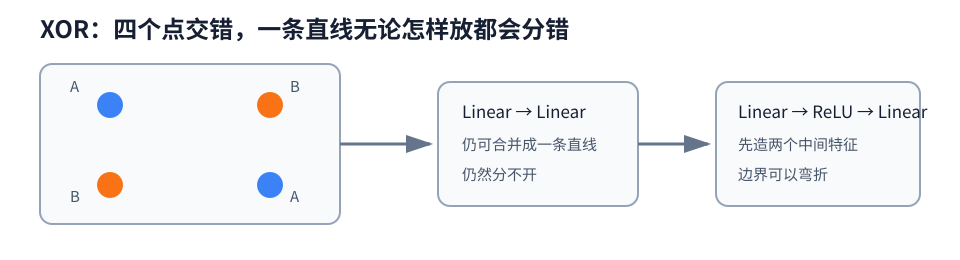

---

## 4.2 从零实现 MLP：亲手看见四组参数

### 一句话核心

“从零”最有价值的地方不是重复造框架，而是亲眼确认参数、logits、损失和梯度的生命周期。

两层 MLP 有四组参数：

$$
\mathbf W_1\in\mathbb R^{d\times h},\quad
\mathbf b_1\in\mathbb R^h,\quad
\mathbf W_2\in\mathbb R^{h\times q},\quad
\mathbf b_2\in\mathbb R^q.
$$

在完整程序中，$d=2,h=16,q=3$。一批 `X` 的 Shape 是 `(B,2)`，标签 `y` 是 `(B,)`，输出 logits 是 `(B,3)`。

### 为什么模型返回 logits

交叉熵不需要先显式算概率。稳定写法是：

$$
\ell_i=-o_{i,y_i}+\log\sum_{j=1}^{q}\exp(o_{i,j}).
$$

`logsumexp` 会先平移最大值，避免很大的 logit 指数上溢、很小的概率下溢为 0。只有展示概率时才调用 `softmax`；训练损失直接消费 logits。

### 五步训练法在从零版里怎样落地

```python
logits = forward(batch_X, params)              # 1. Forward: (B,2)->(B,3)
loss = cross_entropy(logits, batch_y).mean()   # 2. Loss: (B,)->标量
# 梯度已在上一轮 step 后设为 None              # 3. zero_grad
loss.backward()                                # 4. backward
sgd_step(params, learning_rate)                # 5. step，并再次清梯度
```

这里 `loss.mean()` 已经除过真实批量大小，手写更新时不能再除一次。若用 `loss.sum().backward()`，更新时才应除以当前批的 `X.shape[0]`。最后一批常不足设定的 `batch_size`，所以任何归一化都不能偷偷使用固定常数。

完整程序：[mlp_from_scratch.py](../code/ch04/mlp_from_scratch.py)。关键职责如下：

| 代码块 | 负责什么 | 最该观察什么 |
| --- | --- | --- |
| `make_data` | 生成离线三分类点 | `X(N,2)`、`y(N,)` |
| `initialize_parameters` | 创建叶子参数 | 先缩放，再 `requires_grad_()` |
| `forward` | 两次仿射 + ReLU | logits 而非概率 |
| `cross_entropy` | 稳定逐样本损失 | 返回 `(B,)` |
| `sgd_step` | 在 `no_grad` 中更新 | 更新后 `grad=None` |

忘记时先查：四组 Shape → 参数是不是叶子 → loss 用 `sum` 还是 `mean` → 梯度有没有清理 → 最后一批是否按真实样本数统计。

### 新手例子：先用纸笔核对一遍四组参数

- **小输入**：`B=2、d=2、h=3、q=2`，所以 `X` 可以是 `[[1,-1],[0,2]]`，Shape 为 `(2,2)`。
- **逐步过程**：`X(2,2) @ W1(2,3) + b1(3,)` 广播后得到隐藏量 `(2,3)`；ReLU 不改 Shape；再乘 `W2(3,2)` 并加 `b2(2,)`，得到 `(2,2)` logits。参数量依次是 `2×3、3、3×2、2`。
- **输出**：输出 Shape 是 `(2,2)`，四组参数总量是 `6+3+6+2=17`。
- **说明什么**：从零实现前先把 Shape 和参数量算通，能在 loss 之前拦住大多数矩阵乘错误。
- **最容易误解什么**：激活值 `H(2,3)` 不是参数；它每个 batch 都会变化，也不应被交给优化器。

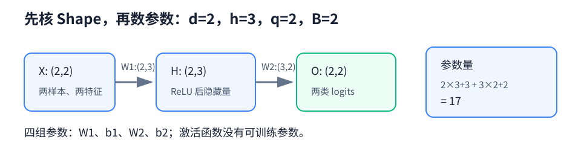

---

## 4.3 PyTorch 简洁实现：封装不等于不用理解

### 一句话核心

框架替你管理参数、梯度和更新，但不会替你保证 Shape、损失输入、评估口径或模式切换正确。

从零版与框架版的映射很直接：

| 从零职责 | PyTorch 封装 |
| --- | --- |
| `X @ W + b` | `nn.Linear` |
| `clamp_min(0)` | `nn.ReLU` |
| 手写层序 | `nn.Sequential` |
| `logsumexp` 交叉熵 | `nn.CrossEntropyLoss` |
| 手写参数列表 | `model.parameters()` |
| 手写 SGD | `torch.optim.SGD` |
| `param.grad=None` | `optimizer.zero_grad(set_to_none=True)` |

注意 `nn.Linear(in_features, out_features).weight` 的存储 Shape 是 `(out_features, in_features)`。内部计算等价于：

$$
\mathbf Y=\mathbf X\mathbf W^\top+\mathbf b.
$$

`CrossEntropyLoss` 的契约必须背熟：输入是 `(B,q)` 浮点 logits；标签是 `(B,)` 的 `torch.long` 类别索引。类别不平衡时可传 `weight.shape == (q,)`，权重也必须与 logits 在同一设备。

完整程序：[mlp_concise.py](../code/ch04/mlp_concise.py)。它把数据生成、初始化、训练和评估分开，并展示下面这组模式搭配：

| 场景 | 模式 | 梯度控制 | 作用 |
| --- | --- | --- | --- |
| 训练 | `model.train()` | 默认开启 | Dropout/BN 按训练方式工作 |
| 验证 | `model.eval()` | `torch.inference_mode()` | 行为确定、不开计算图 |
| 仅临时不求导 | 模式不变 | `torch.no_grad()` | 不记录新梯度，但可继续使用张量 |
| 纯推理 | `model.eval()` | `torch.inference_mode()` | 更严格、更省跟踪开销 |

`eval()` 不会关闭梯度，`no_grad()` 也不会关闭 Dropout。它们控制的是两条不同的开关。

### 新手例子：`Sequential` 到底替你登记了什么

- **小输入**：建立 `Sequential(Linear(2,3), ReLU(), Linear(3,2))`，再送入 `X.shape=(4,2)`。
- **逐步过程**：第一层输出 `(4,3)`，ReLU 保持 `(4,3)`，第二层输出 `(4,2)`；`model.parameters()` 递归找到两层 Linear 的 weight 和 bias，ReLU 没有参数。一次 `backward()` 后，这四组参数各自得到同 Shape 的 `.grad`，`optimizer.step()` 才读取它们并更新。
- **输出**：模型有 4 个 Parameter 张量、共 17 个标量参数，logits Shape 为 `(4,2)`。
- **说明什么**：框架减少的是登记和更新的样板代码，不会改变 MLP 的 Shape、计算图和五步训练逻辑。
- **最容易误解什么**：`model.parameters()` 能发现参数，不等于参数已经更新；没有 `backward()` 的梯度和 `step()`，数值不会变化。

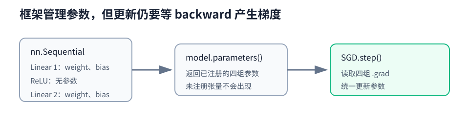

---

## 4.4 模型选择：训练得好不等于学得好

### 一句话核心

训练误差回答“记住训练数据了吗”，验证误差回答“对没见过的同分布数据还能工作吗”。

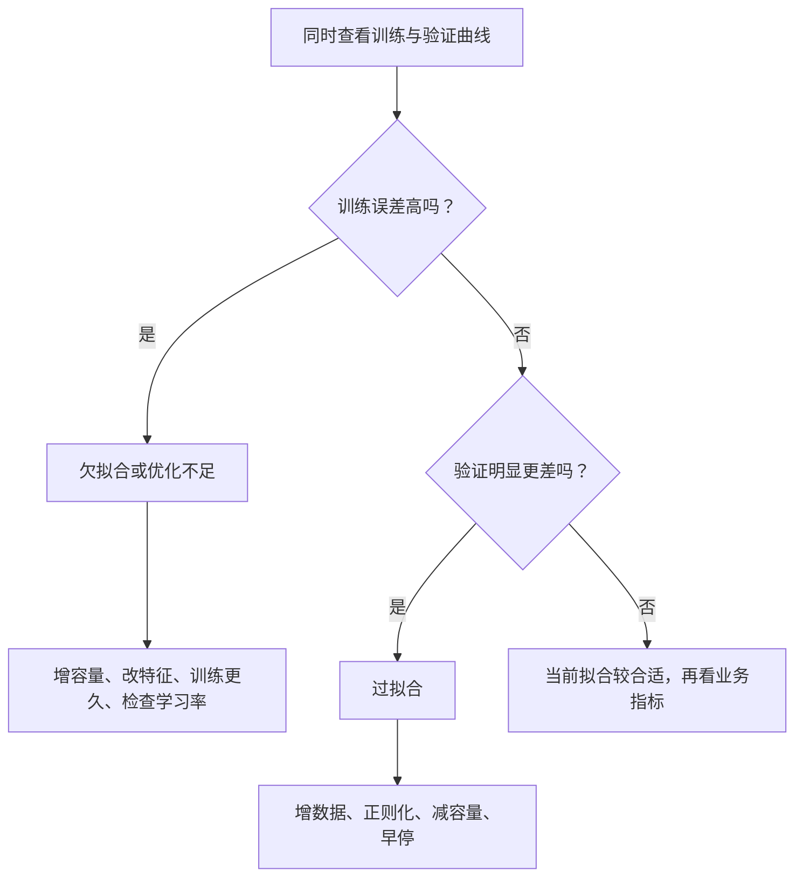

三个集合的职责不要混：

- 训练集：优化参数；
- 验证集：选模型、学习率、正则强度等超参数；
- 测试集：所有选择结束后，做一次最终报告。

反复用测试集挑方案，就是把测试信息慢慢泄漏进模型选择，最终数字会过于乐观。

完整程序：[fitting_diagnostics.py](../code/ch04/fitting_diagnostics.py)。真实规律是三次多项式：只用常数项会欠拟合，用到三次项较合适，使用 20 个高阶特征会提高有效容量和过拟合风险。程序还把标签固定为 `(B,1)`；若预测是 `(B,1)`、标签是 `(B,)`，减法会静默广播为 `(B,B)`，损失对象已经完全错了。

K 折验证适合数据较少时：每个样本恰好一次做验证，其余 $K-1$ 折训练，最终报告均值和标准差。代价是训练成本约增加 $K$ 倍。

### 新手例子：三个模型该选谁

- **小输入**：模型 A 的训练/验证误差是 `0.40/0.42`，B 是 `0.10/0.12`，C 是 `0.01/0.31`。
- **逐步过程**：A 两边都高，说明连训练规律都没学够；C 训练几乎完美却在验证集明显变差，说明记忆训练细节；B 两边都低且间隔小。
- **输出**：当前证据应选择 B；A 诊断为欠拟合，C 诊断为过拟合。
- **说明什么**：模型选择依据是未参与参数更新的数据表现，而不是训练误差的排行榜。
- **最容易误解什么**：训练－验证间隔小不自动代表好。A 的间隔也小，但两边都差；必须同时看绝对水平与差距。

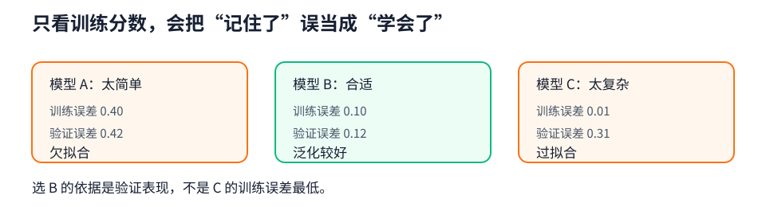

---

## 4.5 权重衰减：不让模型把某个方向押得太重

### 一句话核心

L2 正则在原损失上惩罚大权重，让模型少依赖极端系数，常用较小的训练性能代价换取更稳的验证表现。

$$
L_{\text{reg}}(\mathbf w,b)
=L(\mathbf w,b)+\frac{\lambda}{2}\lVert\mathbf w\rVert_2^2.
$$

在普通 SGD 中：

$$
\mathbf w\leftarrow(1-\eta\lambda)\mathbf w
-\eta\nabla_{\mathbf w}L.
$$

所以“每步衰减多少”由学习率 $\eta$ 和正则强度 $\lambda$ 共同决定。调大学习率以后，不能假设原 `weight_decay` 仍是同样的实际强度。

完整程序：[weight_decay.py](../code/ch04/weight_decay.py)。它构造“小样本、高维度”的易过拟合场景，并用参数组只衰减 `weight`：

```python
optimizer = torch.optim.SGD([
    {"params": [model.weight], "weight_decay": weight_decay},
    {"params": [model.bias], "weight_decay": 0.0},
], lr=0.01)
```

工程上还常把偏置、归一化层的缩放和平移参数排除在衰减之外。`AdamW` 把权重收缩与自适应梯度更新解耦；它与在 Adam 的损失中简单加入 L2 项不应机械视为完全相同。

诊断时至少同时看：训练损失、验证损失、权重范数。只看到范数更小，不能直接宣布模型更好；$\lambda$ 过大同样会欠拟合。

### 新手例子：权重 10 一步会缩到哪里

- **小输入**：单个权重 `w=10`，任务梯度为 `2`，学习率 `η=0.1`；比较 `λ=0` 与 `λ=0.5`。
- **逐步过程**：无衰减时 `w'=10-0.1×2=9.8`；有 L2 时总梯度为 `2+λw=2+5=7`，所以 `w'=10-0.1×7=9.3`。
- **输出**：同一个任务梯度下，无衰减得到 `9.8`，带衰减得到 `9.3`。
- **说明什么**：正则项不是另一个评价指标，而是直接给参数更新增加一股朝 0 的力量。
- **最容易误解什么**：权重衰减不会无条件改善模型。`λ` 太大时，真正有用的权重也会被压得过小，训练和验证都可能变差。

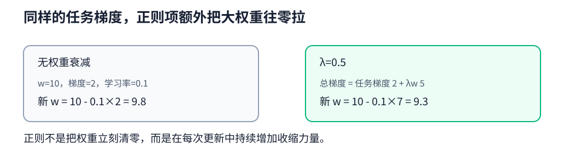

---

## 4.6 Dropout：训练时故意让网络少依赖固定搭档

### 一句话核心

Dropout 在训练时随机把部分激活置零，并对保留值放大；评估时关闭随机性，直接使用完整网络。

若丢弃概率为 $p$，inverted dropout 定义为：

$$
h'=\begin{cases}
0, & \text{概率 }p,\\
\dfrac{h}{1-p}, & \text{概率 }1-p.
\end{cases}
$$

因此 $\mathbb E[h']=h$。训练和评估的平均尺度保持一致，评估时不用再乘 $1-p$。

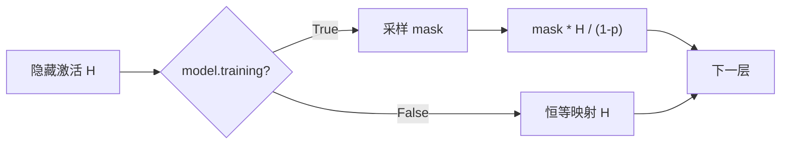

完整程序：[dropout.py](../code/ch04/dropout.py)。它直接验证两点：大量全 1 输入经过 50% dropout 后均值仍接近 1；`train()` 下两次输出通常不同，`eval()` 下两次输出相同。

常见错法：把 `p` 当保留概率、忘记除以 $1-p$、验证时忘记 `eval()`、在输出 logits 后随意加 Dropout。Dropout 与 BatchNorm 的相对位置也不能只凭口诀，应依据架构经验和验证实验决定。

### 新手例子：丢一半后为何保留值要翻倍

- **小输入**：隐藏激活 `[2,2,2,2]`，丢弃概率 `p=0.5`；某次随机 mask 恰好是 `[1,0,1,0]`。
- **逐步过程**：先按 mask 保留第 1、3 项，再把保留值除以 `1-p=0.5`，所以 `2/0.5=4`。
- **输出**：这次输出是 `[4,0,4,0]`，平均仍为 `2`；在许多随机 mask 上取期望，也等于原激活。
- **说明什么**：inverted dropout 在训练期完成尺度补偿，因此评估期直接用完整激活即可。
- **最容易误解什么**：`p=0.5` 是丢弃概率，不是保留概率；进入 `eval()` 后也不要再手动乘 `0.5`。

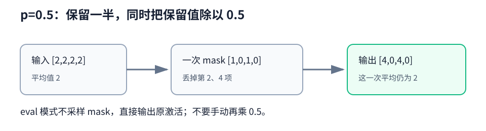

---

## 4.7 前向传播、反向传播与计算图

### 一句话核心

前向传播计算数值并记录依赖，反向传播沿依赖图反向应用链式法则，把贡献累加到叶子参数的 `.grad`。

对一个极小计算：

$$
z=xw+b,\qquad a=\operatorname{ReLU}(z),\qquad
L=\frac12(a-y)^2,
$$

梯度路径是：

$$
\frac{\partial L}{\partial w}
=\frac{\partial L}{\partial a}
\frac{\partial a}{\partial z}
\frac{\partial z}{\partial w}.
$$

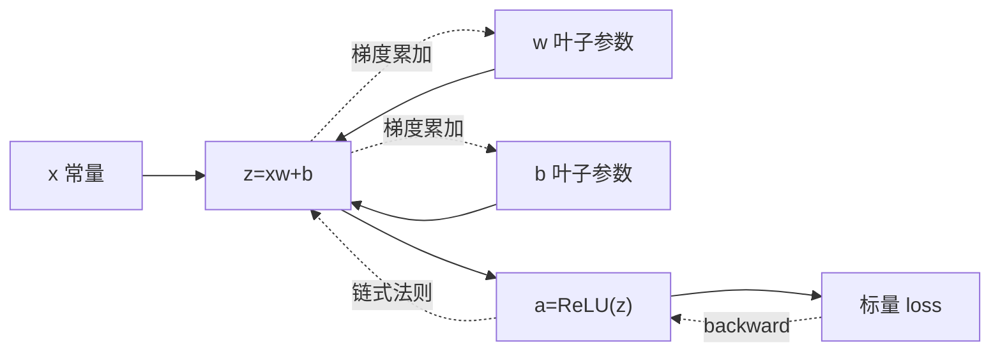

完整程序：[autograd_graph.py](../code/ch04/autograd_graph.py)。阅读时分清四件事：

- `backward()` 只算梯度，不改参数；
- 叶子参数默认保留 `.grad`，中间张量要 `retain_grad()` 才保留；
- 梯度默认累加，第二次反传前不清理会得到两次贡献之和；
- 图通常在 `backward()` 后释放，下一批通过新一次 forward 重建。

`detach()` 针对某个张量切断后续梯度路径；`no_grad()` 针对一个代码块不建新图；`inference_mode()` 更适合纯推理。不要为了“第二次 backward 不报错”就长期滥用 `retain_graph=True`，它会保留大量中间状态。

### 新手例子：沿一条三段路径把梯度乘回来

- **小输入**：`x=2、w=3、b=-1、y=1`，前向定义 `z=xw+b`、`a=ReLU(z)`、`L=½(a-y)²`。
- **逐步过程**：前向得到 `z=5、a=5、L=8`；反向的三个局部导数是 `∂L/∂a=4`、`∂a/∂z=1`、`∂z/∂w=x=2`；沿路径相乘。
- **输出**：`w.grad=4×1×2=8`，`b.grad=4×1×1=4`。
- **说明什么**：反向传播不是重新猜参数，而是把每个算子的局部导数按计算图链式组合，并把多路径贡献累加。
- **最容易误解什么**：`backward()` 到这里仅把 `8` 写入 `.grad`，`w` 仍是 `3`；只有优化器 `step()` 才会改变它。

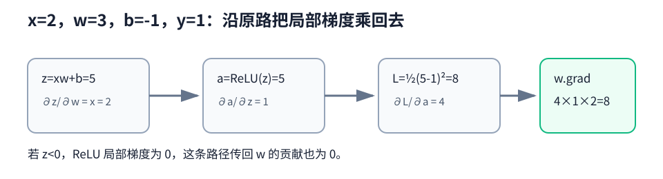

---

## 4.8 数值稳定性与初始化：让信号穿过深层网络

### 一句话核心

初始化不只是“随机给个值”，它要同时打破神经元对称性，并让前向激活与反向梯度在多层传播后仍处于合理尺度。

深层梯度可粗略看成许多局部雅可比的乘积：

$$
\frac{\partial L}{\partial \mathbf h^{(l)}}
=\frac{\partial L}{\partial \mathbf h^{(L)}}
\prod_{k=l+1}^{L}
\frac{\partial \mathbf h^{(k)}}{\partial \mathbf h^{(k-1)}}.
$$

如果每个因子的典型尺度长期小于 1，乘积会趋近 0；长期大于 1，则可能爆炸。

| 初始化 | 典型方差思想 | 常见搭配 |
| --- | --- | --- |
| Xavier/Glorot | 同时考虑 `fan_in`、`fan_out` | Tanh、近线性激活 |
| He/Kaiming | 约为 $2/\text{fan\_in}$ | ReLU 家族 |

隐藏权重不能全部置零。若同层神经元起点完全相同，它们得到相同输入、相同输出和相同梯度，以后仍同步变化，等于只剩一个神经元的复制品。偏置置零通常没有这个问题，因为随机权重已经打破对称。

完整程序：[initialization_stability.py](../code/ch04/initialization_stability.py)。它比较 `Tanh + Xavier`、`ReLU + He`、`ReLU + std=1` 的首尾激活标准差和第一层梯度标准差，并单独验证全零权重的对称梯度。

出现 `NaN` 时的排查顺序：先找第一个非有限 loss 的 step → 检查输入和标签是否有限 → 逐层记录激活范围 → 查看梯度范数 → 核对学习率、初始化与激活 → 再考虑梯度裁剪。裁剪只能压住爆炸症状，不能替代合理结构和初始化。

### 新手例子：每层只差一倍，十层后差多少

- **小输入**：假设梯度反传经过 10 层，每层局部导数的典型尺度分别取 `0.5`、`1` 或 `2`。
- **逐步过程**：链式法则让这些尺度连乘：`0.5^10≈0.001`、`1^10=1`、`2^10=1024`。
- **输出**：第一种让早期层几乎收不到梯度，第二种保持尺度，第三种可能把梯度放大到上千倍。
- **说明什么**：深层稳定性是乘法效应；初始化要让典型激活和局部梯度不要在每层系统性缩小或放大。
- **最容易误解什么**：目标不是让每个梯度严格等于 1，而是让整体分布处于可训练范围；真实网络还受激活、数据和残差路径影响。

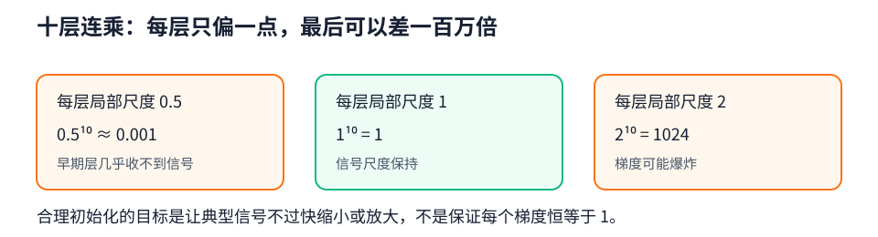

---

## 4.9 环境与分布偏移：验证集很好，为什么上线会坏

### 一句话核心

模型学到的是训练分布中的规律；当输入分布、类别比例或标签机制改变时，训练代码完全正确也可能失效。

| 偏移类型 | 主要变化 | 例子 | 可能手段 |
| --- | --- | --- | --- |
| 协变量偏移 | $p(x)$ 变，$p(y\mid x)$ 近似不变 | 相机、地区或客群变化 | 目标域采样、重要性加权 |
| 标签偏移 | $p(y)$ 变，$p(x\mid y)$ 近似不变 | 疾病基线率变化 | 估计新先验、校准 |
| 概念偏移 | $p(y\mid x)$ 变 | 欺诈策略或用户偏好改变 | 新标签、重训、修改任务 |

在协变量偏移假设下，目标风险可写为：

$$
\mathbb E_{q(x,y)}[\ell]
=\mathbb E_{p(x,y)}\left[
\frac{q(x)}{p(x)}\ell
\right].
$$

但前提非常强：标签机制保持，且目标域的重要区域被源域覆盖。若目标域出现训练中从未见过的区域，密度比可能极大，重加权也不能凭空创造标签知识。

完整程序：[distribution_shift.py](../code/ch04/distribution_shift.py)。它用合成二维分类展示同分布、协变量偏移和概念偏移，并说明重要性加权只能针对前者的特定条件。

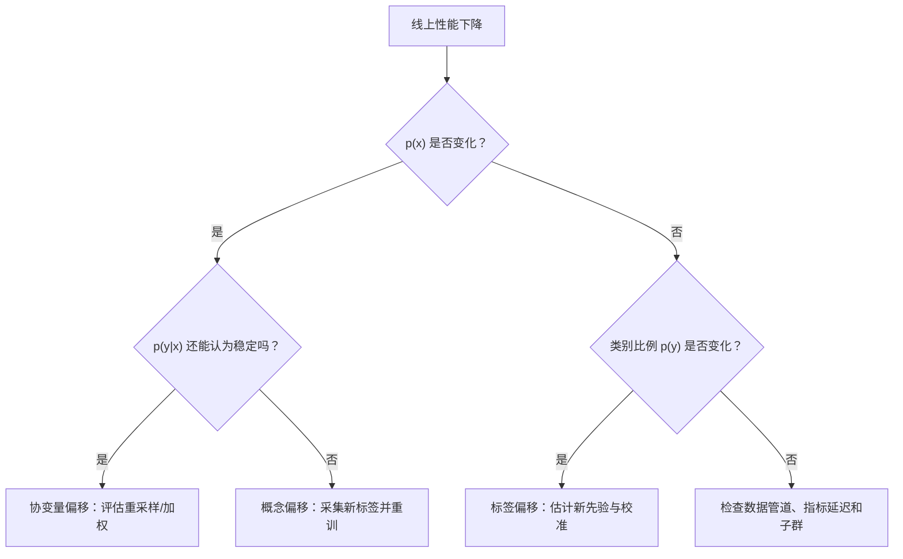

线上监控不能只看输入均值。至少连接特征分布、预测分布、延迟标签性能、置信度校准和关键子群指标，并提前规定告警后的降级或再训练动作。

### 新手例子：准确率下降前先判断“哪里变了”

- **小输入**：三个上线变化：①训练多为白天照片，上线夜间照片增多；②训练猫狗各 50%，上线狗占 90%；③欺诈者改变策略，同样特征现在对应不同标签。
- **逐步过程**：①主要是输入 `p(x)` 变化，先按协变量偏移检查；②主要是类别先验 `p(y)` 变化，检查标签偏移与校准；③是 `p(y|x)` 变化，属于概念偏移，需要新标签验证规则。
- **输出**：三个现象分别归到协变量偏移、标签偏移、概念偏移，后续处理方向不同。
- **说明什么**：发现“线上掉点”只是症状，先辨认变化对象，才知道重加权、校准还是重训是否合理。
- **最容易误解什么**：不能把所有分布变化都叫协变量偏移；若判定规则已经变了，给旧样本重新加权也学不到新规则。


---

## 4.10 Kaggle 房价：重点是可信验证，不是提交按钮

### 一句话核心

竞赛流水线的价值在于：预处理无泄漏、训练验证完全隔离、指标实现稳定、每折重新初始化，并能用选定配置在全量训练集上复现。

房价常用 log-RMSE：

$$
\operatorname{logRMSE}
=\sqrt{\frac1n\sum_{i=1}^{n}
\left(\log \hat y_i-\log y_i\right)^2}.
$$

它更重视相对误差：把 10 万预测成 12 万，与把 100 万预测成 120 万，在 log 比例上接近。若模型直接预测价格，算指标前必须保证预测为正；完整离线程序选择直接预测 `log(price)`，再用 `exp()` 还原，因此训练目标与指标更一致。

完整程序：[house_price_pipeline.py](../code/ch04/house_price_pipeline.py)。它不下载 Kaggle 数据，而是用合成表格完整走通：

1. 数值列只用当前训练折拟合均值与标准差；
2. 类别列转 one-hot，训练、验证和测试列空间一致；
3. 每折新建预处理器和模型；
4. 报告 5 折 log-RMSE 均值与标准差；
5. 超参数确定后，使用全部训练数据重训并预测测试集。


真实提交前还要核对：`Id` 顺序、行数、列名、缺失值、无穷值、预测是否为正、随机种子、代码与配置版本。公共榜单也是一种反馈，反复对它调参同样可能过拟合。

### 新手例子：一个验证价格怎样偷偷泄漏进均值

- **小输入**：某一折训练价格是 `[10,12,14]`，验证价格只有 `[100]`；预处理先做减均值。
- **逐步过程**：正确流程只在训练折拟合均值 `12`，验证值中心化为 `100-12=88`。若先用全数据求均值，会得到 `(10+12+14+100)/4=34`，验证值变成 `66`，它已参与定义自己的输入。
- **输出**：正确验证变换结果是 `88`；泄漏流程得到 `66`，并让训练特征也提前感知验证折。
- **说明什么**：K 折不只要切模型训练数据；任何“从数据拟合”的预处理器也必须每折只 fit 训练部分。
- **最容易误解什么**：标准化没有标签字段也可能泄漏。验证特征本身参与均值、方差或类别词表拟合，就已污染独立评估。


---

## 本章代码怎么运行

所有程序独立、离线、可直接复制运行：

```powershell
python code/ch04/activations.py
python code/ch04/mlp_from_scratch.py
python code/ch04/mlp_concise.py
python code/ch04/fitting_diagnostics.py
python code/ch04/weight_decay.py
python code/ch04/dropout.py
python code/ch04/autograd_graph.py
python code/ch04/initialization_stability.py
python code/ch04/distribution_shift.py
python code/ch04/house_price_pipeline.py
```

建议不要一次全抄。先运行，再把每个程序的训练五步注释删掉，尝试凭记忆补回；随后故意改错一个 Shape 或模式开关，观察断言与输出怎样暴露问题。

## 常见坑与排查速查

| 现象 | 首要怀疑 | 检查方式 |
| --- | --- | --- |
| 多层网络像线性模型 | 漏激活 | 打印模块树，检查 `Linear` 之间是否有激活 |
| 交叉熵不降 | 先 Softmax、标签 Shape/dtype 错 | logits `(B,q)`；标签 `(B,)` 且 `long` |
| loss 异常但不报错 | 广播 | 强制预测与标签同为 `(B,1)` |
| 第二批梯度越来越大 | 未清梯度 | `zero_grad(set_to_none=True)` 的位置 |
| 验证结果每次变化 | Dropout 未关闭 | `model.eval()` + `inference_mode()` |
| 训练好、验证差 | 过拟合或泄漏 | 看学习曲线、重新审计划分与预处理 |
| 深层 loss 变 NaN | 学习率/初始化/输入异常 | 找第一个非有限层，记录激活与梯度范数 |
| 离线好、线上差 | 分布偏移 | 分特征、时间、子群比较线上线下分布 |
| K 折异常乐观 | 折间复用模型或预处理泄漏 | 每折新建模型，预处理只 fit 训练折 |

## 主动回忆：先遮住答案再作答

下面 20 题不要连续点开。先口述或写下答案，再展开对照；答错后去对应小节和程序定位，而不是只背结论。

<details>
<summary>1. 为什么没有激活函数时，多层 Linear 仍等价于一层？</summary>

因为仿射变换的复合仍是仿射变换：$(XW_1+b_1)W_2+b_2=X(W_1W_2)+(b_1W_2+b_2)$。层数增加了写法，却没有增加非线性决策边界。代码排查时看相邻参数层之间是否真正经过激活，而不只看模块数量。
</details>

<details>
<summary>2. `X(B,d) -> H(B,h) -> logits(B,q)` 中四组参数 Shape 是什么？</summary>

$W_1(d,h)$、$b_1(h,)$、$W_2(h,q)$、$b_2(q,)$。PyTorch 的 `nn.Linear` 权重内部存为 `(out,in)`，因此对应层的 `.weight` 分别是 `(h,d)` 与 `(q,h)`；这只是存储约定不同。
</details>

<details>
<summary>3. ReLU 的优势和“死亡 ReLU”分别是什么？</summary>

ReLU 在正区间导数为 1，计算简单、较少饱和；负区间导数为 0。如果某个单元长期收到负预激活，它就几乎没有梯度，称为死亡 ReLU。应检查学习率、初始化和预激活分布，必要时考虑 LeakyReLU。
</details>

<details>
<summary>4. 为什么交叉熵应直接输入 logits，而不是先 Softmax？</summary>

稳定交叉熵会融合 `log_softmax`/`logsumexp`，避免显式概率上溢或下溢。`nn.CrossEntropyLoss` 的输入是 `(B,q)` logits，标签是 `(B,)` 类别索引；预测展示时才按需 `softmax`。
</details>

<details>
<summary>5. `loss.sum()` 与 `loss.mean()` 对手写 SGD 有什么影响？</summary>

`sum` 的梯度随批量大小放大，更新时常除当前批真实样本数；`mean` 已完成平均，不能再除一次。必须让损失归约和更新公式成对匹配，尤其不能把最后一批当成固定 `batch_size`。
</details>

<details>
<summary>6. 通用五步训练法是什么？每步改变了什么状态？</summary>

Forward 计算输出并建图；Loss 归约出优化目标；`zero_grad` 清旧 `.grad`；`backward` 按链式法则写入/累加梯度；`step` 读取梯度修改参数。`backward` 不会更新参数，`step` 不会替你重新计算梯度。
</details>

<details>
<summary>7. `model.eval()` 与 `torch.inference_mode()` 为什么要同时用？</summary>

`eval()` 控制 Dropout、BatchNorm 等模块行为；`inference_mode()` 关闭 autograd 和额外跟踪。前者不关梯度，后者不改模块模式。纯评估的推荐组合是两者同时使用。
</details>

<details>
<summary>8. 为什么 `(B,1)` 预测减 `(B,)` 标签是危险的？</summary>

广播会把二者扩成 `(B,B)`，每个预测与整批所有标签比较。程序可能不报错但目标已错。回归应在进入损失前明确断言或重塑，使预测与标签都为 `(B,1)`。
</details>

<details>
<summary>9. 怎样从训练/验证误差判断欠拟合与过拟合？</summary>

训练与验证都差，优先怀疑欠拟合、特征不足或优化没完成；训练很好而验证明显差，优先怀疑过拟合。判断应结合随 epoch 变化的曲线、基线和业务尺度，而不是只凭某个固定阈值。
</details>

<details>
<summary>10. 为什么不能用测试集反复调参？</summary>

每次根据测试结果做选择都把测试信息泄漏进方案，测试集不再提供无偏的最终估计。验证集负责选择；测试集应在流程冻结后使用一次，或严格限制查看频率。
</details>

<details>
<summary>11. L2 正则为什么可能改善泛化？学习率为何会影响衰减强度？</summary>

L2 惩罚大权重，减少模型对少数特征和噪声的极端依赖。普通 SGD 更新含 $(1-\eta\lambda)w$，所以实际每步收缩由学习率 $\eta$ 和正则系数 $\lambda$ 共同决定；改学习率后要重新审视 `weight_decay`。
</details>

<details>
<summary>12. AdamW 与“在 Adam 损失中加 L2”为什么不能简单视为完全相同？</summary>

Adam 的自适应缩放会作用于耦合进梯度的 L2 项；AdamW 将权重衰减从自适应梯度更新中解耦，收缩语义更直接。工程上还常用参数组排除 bias 和归一化参数。
</details>

<details>
<summary>13. Dropout 训练时为什么除以 `1-p`？评估时做什么？</summary>

一个激活只有 $1-p$ 的概率保留，保留后除以 $1-p$ 可让期望仍等于原值。评估时 Dropout 是恒等映射，不丢弃也不缩放；必须通过 `model.eval()` 关闭随机行为。
</details>

<details>
<summary>14. 为什么梯度默认累加？什么时候这是有用的？</summary>

同一叶子参数可能从多条图路径、多个损失或多个微批次收到贡献，数学上应相加。它支持梯度累积和多任务损失；普通逐批训练则必须在每次反传前清理旧梯度。
</details>

<details>
<summary>15. `detach()`、`no_grad()` 和 `inference_mode()` 如何区分？</summary>

`detach()` 从某个张量处切断路径；`no_grad()` 让一个代码块不记录新梯度；`inference_mode()` 面向纯推理，进一步关闭版本等跟踪。目标网络常用 `detach`，手写参数更新常用 `no_grad`，验证常用 `eval + inference_mode`。
</details>

<details>
<summary>16. 梯度消失/爆炸的机理是什么？</summary>

深层反传是许多局部雅可比的连乘；典型尺度持续小于 1 会消失，持续大于 1 会爆炸。初始化、激活、归一化和残差连接都在帮助控制信号尺度。排查时记录逐层激活和梯度范数，而非只盯总 loss。
</details>

<details>
<summary>17. Xavier 与 He 初始化怎么选？为什么隐藏权重不能全零？</summary>

Tanh 或近线性激活常从 Xavier 开始，ReLU 家族常用 He/Kaiming。选择依据是激活造成的方差变化。隐藏权重全零会让同层神经元保持完全对称，接收相同梯度，无法学出分工。
</details>

<details>
<summary>18. 协变量偏移、标签偏移和概念偏移分别改变什么？</summary>

协变量偏移主要改变 $p(x)$ 且假设 $p(y|x)$ 稳定；标签偏移改变 $p(y)$ 且近似假设 $p(x|y)$ 稳定；概念偏移直接改变 $p(y|x)$。三者诊断和修复不同，不能把所有线上退化都交给重要性加权。
</details>

<details>
<summary>19. 重要性加权什么时候可能有效，什么时候一定要谨慎？</summary>

当目标域标签机制近似不变，且目标支持集被源域覆盖时，可用 $q(x)/p(x)$ 加权源样本估计目标风险。密度比极端、目标域出现未覆盖区域或概念已变化时，方差巨大且无法创造缺失知识，应采集目标域数据或限制模型用途。
</details>

<details>
<summary>20. 正确的 K 折房价流程怎样避免泄漏？</summary>

每折用 $K-1$ 折拟合预处理统计并训练一个全新模型，只 transform 留出的验证折；记录 log-RMSE，最后汇总均值和标准差。超参数确定后，才在全部训练数据上重新 fit、重训并预测测试集。每折复用模型或用全数据提前算标准化统计都会污染验证。
</details>

## 复习闭环

- 10 分钟：只看章节地图、五幅机制图和排查表。
- 30 分钟：运行 `mlp_from_scratch.py`，从 Shape 口述每一步。
- 45 分钟：运行拟合、正则、初始化三个实验，解释结果而不是只看数值。
- 次日：遮住答案完成 20 道主动回忆；错题回到对应程序制造一次同类错误。
- 一周后：不看正文写出五步训练模板、`eval + inference_mode`、三类偏移和 K 折无泄漏流程。

[上一章：线性神经网络](ch03-linear-neural-networks.md) · [下一章：深度学习计算](ch05-deep-learning-computation.md) · [返回总目录](../README.md)
