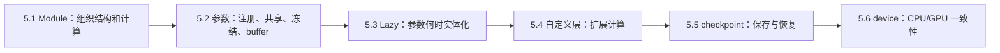
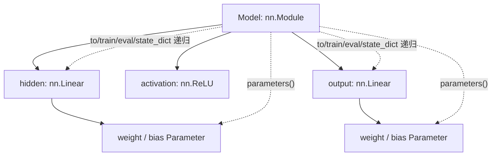
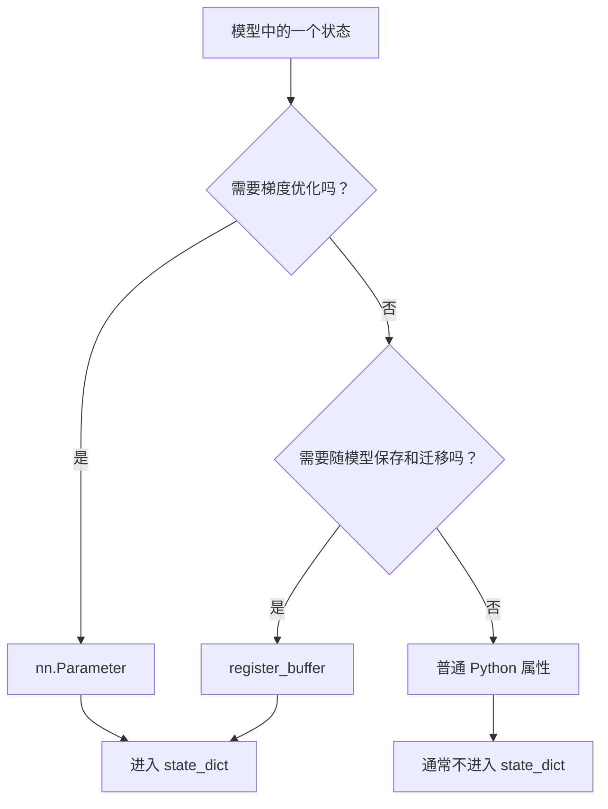
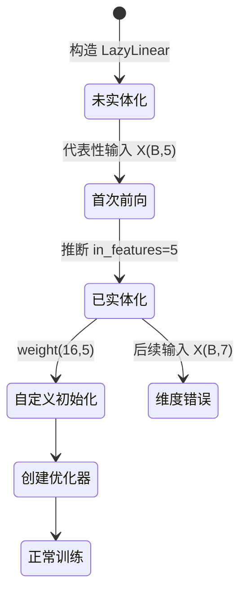
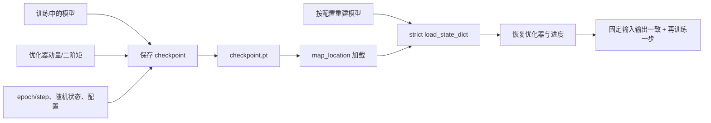
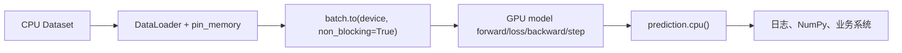
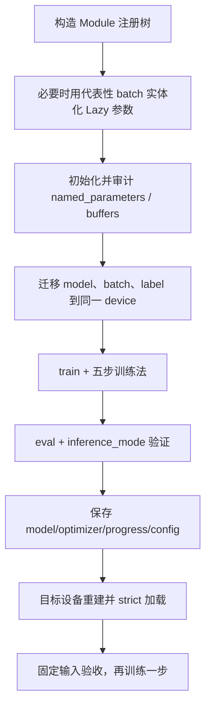

# 第五章：深度学习计算

> GitHub 复习版 · PyTorch · 参考现有第五章 PDF 全 63 页与项目代码索引后原创重写

[返回首页](../README.md) · [本章完整代码目录](../code/ch05)

## 一句话主线

一个可用的深度学习模型不只是 `forward` 公式，而是“模块结构 + 参数与 buffer + 运行模式 + 设备 + 可恢复状态”的整体；第五章就是把这些零散对象组织成能训练、能迁移、能保存、能复现的工程系统。

## 章节地图



本章最值得建立的心智模型是：任何模型故障都可以先问六个问题——层注册了吗、参数需要梯度吗、优化器看得到吗、状态能保存吗、对象在同一设备吗、训练/评估模式正确吗。

---

## 5.1 层和块：`nn.Module` 到底替我们管了什么

### 一句话核心

`nn.Module` 把计算图的结构、可训练参数、持久状态和递归操作统一到一棵注册树里。

初学时很容易把模型理解成一个普通 Python 函数：输入 `X`，返回 `Y`。但训练系统还需要找到所有参数、把它们交给优化器、整体迁移设备、切换 Dropout/BN 模式、保存状态、挂载 hooks。`nn.Module` 的价值就在于把这些能力绑定到同一棵树。



### `__init__` 和 `forward` 分工

- `__init__`：声明长期存在的子层、参数和 buffer；
- `forward`：描述本次输入怎样流过这些对象；
- `model(X)`：先经过 `Module.__call__`，处理 hooks 等框架逻辑，再进入 `forward`。

因此不建议直接调用 `model.forward(X)`。也不要在 `forward` 里每次新建 `nn.Linear`：那会每次得到新参数，优化器和 `state_dict` 也无法稳定管理它。

### 三种组合工具

| 工具 | 是否注册子层 | 是否自动执行 | 适合场景 |
| --- | --- | --- | --- |
| `nn.Sequential` | 是 | 按顺序自动执行 | 单输入单输出的直线型网络 |
| `nn.ModuleList` | 是 | 否 | 循环、残差、按条件选择 |
| 普通 Python `list` | 否 | 否 | 不应存放需要被模型管理的层 |

`ModuleList` 像“登记过的零件箱”：框架知道里面有哪些层，但不会猜这些层怎样连接。数据流必须在 `forward` 中自己写。

完整程序：[modules_and_blocks.py](../code/ch05/modules_and_blocks.py)。它包含基本 MLP、自写 Sequential、ModuleList 残差堆叠和共享参数动态块。输入主线如下：

| 模型 | 输入 | 中间 Shape | 输出 |
| --- | --- | --- | --- |
| `MLP` | `(B,8)` | `(B,16)` | `(B,3)` |
| `MySequential` | `(B,8)` | `(B,16)` | `(B,3)` |
| `ResidualStack` | `(B,8)` | 每块仍 `(B,8)` | `(B,8)` |
| `SharedDynamicBlock` | `(B,8)` | 共享层调用两次 | `(B,8)` |

忘记时先查：有没有 `super().__init__()` → 层是否绑定为属性/放入 `ModuleList` → 是否调用 `model(X)` → `forward` 每条分支 Shape 是否可对齐。

---

## 5.2 参数管理：注册、求导、优化、保存是四回事

### 一句话核心

一个张量“属于模型”不等于“会被训练”；要分别确认它是否注册、是否求梯度、是否交给优化器，以及是否随模型保存和迁移。

先把三类状态分清：



| 状态 | `parameters()` | `state_dict()` | `model.to(device)` | 优化器默认更新 |
| --- | --- | --- | --- | --- |
| `nn.Parameter` | 是 | 是 | 是 | 若交给优化器且需梯度，则是 |
| 持久 buffer | 否 | 是 | 是 | 否 |
| 普通 Tensor 属性 | 否 | 否 | 否 | 否 |
| 普通 Python 配置 | 否 | 否 | 不适用 | 否 |

典型 buffer 包括 BatchNorm 的运行均值/方差、固定 mask、位置索引等。它们是模型状态，却不应该沿梯度更新。

### 初始化与审计

`model.apply(function)` 会沿注册树递归访问子模块，常用于按层类型初始化。审计时组合使用：

- `named_modules()`：看结构树；
- `named_parameters()`：看可训练候选、Shape、`requires_grad`；
- `named_buffers()`：看非参数状态；
- `state_dict()`：看最终会保存的张量键。

如果你确信某层存在，但这些接口都找不到，常见原因是把层放进了普通 `list`，或把可学习张量写成普通 `Tensor`。

### 权重共享与冻结

同一个 `Module` 对象调用两次，只有一套参数。若损失有两条路径使用它，则梯度为路径贡献之和：

$$
\frac{\partial L}{\partial \mathbf W}
=\left.\frac{\partial L}{\partial \mathbf W}\right|_{\text{path 1}}
+\left.\frac{\partial L}{\partial \mathbf W}\right|_{\text{path 2}}.
$$

冻结参数用 `parameter.requires_grad_(False)`；这不等于 `model.eval()`。冻结控制 autograd，`eval` 控制 Dropout/BatchNorm 等模块行为。冻结 BatchNorm 的 affine 参数并不会自动停止其运行统计更新。

完整程序：[parameter_management.py](../code/ch05/parameter_management.py)。程序会打印参数、buffer、`state_dict` 键，冻结第一层后完成一次训练，并验证共享层只有一套权重。

忘记时先查：`named_parameters` 有它吗 → `requires_grad` 是否为真 → 优化器参数组包含它吗 → 反传后 `.grad` 是否存在 → 是否意外共享同一对象。

---

## 5.3 延后初始化：不知道输入维度时，参数何时才真正存在

### 一句话核心

Lazy 模块把输入维度推断延迟到首次 forward；便利的代价是参数生命周期多了“未实体化”阶段。

普通线性层在构造时就知道：

$$
\mathbf W\in\mathbb R^{d_{out}\times d_{in}}.
$$

`nn.LazyLinear(out_features=16)` 暂时只知道 $d_{out}=16$，不知道 $d_{in}$。当第一批 `X.shape == (B,5)` 到来，它才创建 `weight.shape == (16,5)`。



稳妥流程：

1. 构建含 Lazy 层的模型；
2. 用代表性 batch 做 dry run；
3. 打印参数 Shape 与输出 Shape；
4. 对已实体化参数执行自定义初始化；
5. 重新 forward，建立使用新参数值的图；
6. 再创建和审计优化器。

为什么初始化后要重新 forward？初始化会原地修改参数版本，旧图保存的是修改前的中间状态；继续复用旧图可能触发版本错误，也不符合“用新参数做本轮前向”的训练语义。

完整程序：[lazy_initialization.py](../code/ch05/lazy_initialization.py)。它打印首次前向前后的参数状态，验证 `(8,5) -> (8,16) -> (8,3)`，完成一次训练，并故意用 `(8,7)` 输入触发维度契约错误。

Lazy 只推断一次，不是“每批自动适应任意维度”。在编译、分布式包装、模型导出等生命周期更严格的流程中，更应先实体化再进入后续工具。

---

## 5.4 自定义层：大多数时候只写 `forward`

### 一句话核心

只要 `forward` 由 PyTorch 可微张量运算组成，autograd 会自动拼接反向传播；自定义层通常不需要手写 `backward`。

### 三类自定义状态

1. 无参数层：只定义计算，例如逐样本中心化；
2. 带参数层：用 `nn.Parameter` 注册需要学习的张量；
3. 带固定状态层：用 `register_buffer` 保存并迁移不训练的张量。

一个自定义线性层可写为：

$$
\mathbf Y=\mathbf X\mathbf W^\top+\mathbf b,
$$

其中 `weight.shape == (out_features, in_features)`。`F.linear(X, weight, bias)` 只负责计算，不持有状态；`nn.Linear` 则同时持有、注册和初始化参数。自定义层常用“自己注册 `Parameter` + 调 `F.linear`”复用成熟算子。

### 广播为什么既方便又危险

逐特征缩放使用：

$$
\mathbf Y_{B\times D}
=\mathbf X_{B\times D}\odot\boldsymbol\gamma_D+oldsymbol\beta_D.
$$

`gamma(D,)` 会沿批量维广播，这是想要的。但错误 Shape 也可能合法广播，所以自定义层应显式检查最后一维。回归中 `(B,1)-(B,) -> (B,B)` 是最经典的静默错误；`keepdim=True` 和 Shape 断言不是多余装饰，而是语义保护。

完整程序：[custom_layers.py](../code/ch05/custom_layers.py)。它组合 `MyLinear`、逐特征仿射、中心化层，并从六个维度验收：

| 检查 | 问题 |
| --- | --- |
| Shape | 输入输出维度是否符合契约 |
| 数值 | 中心化后每行均值是否接近 0 |
| dtype/device | 状态和输入是否兼容 |
| grad | 输入和所有 Parameter 是否有有限梯度 |
| registration | `named_parameters` 是否发现可学习张量 |
| persistence | `state_dict` 是否包含 Parameter 与 buffer |

只有需要自定义底层算子或特殊梯度规则时，才考虑 `torch.autograd.Function`。对普通组合层手写 backward，往往只是增加错误面。

---

## 5.5 读写文件：能加载不等于能恢复训练

### 一句话核心

可靠 checkpoint 要保存模型数值、优化器历史、进度、随机状态和关键配置，并通过固定输入验证恢复前后一致。

`state_dict` 是“名字 → 张量”的映射，不包含 Python 模型结构与 `forward` 代码。因此加载顺序必须是：先用代码重建兼容结构，再把状态填进去。



### 推理权重与训练 checkpoint 的区别

| 目标 | 最少需要 |
| --- | --- |
| 只做推理 | 模型 `state_dict` + 结构代码 + 推理配置 |
| 恢复训练 | 上述内容 + optimizer/scheduler + epoch/step + 随机状态 |
| 严格复现 | 再加数据划分、采样器状态、版本、预处理和确定性设置 |

Adam 的一阶、二阶矩不是可有可无的附件，它们决定下一步怎样更新。只加载模型权重再新建 Adam，虽然能继续跑，但优化轨迹已经改变。

### 加载时的安全与兼容

- 使用 `map_location="cpu"` 可把 GPU 保存的张量安全映射到 CPU；
- `strict=True` 要求键和 Shape 完全匹配；
- `strict=False` 适合有意识的迁移学习，但必须审计 `missing_keys` 与 `unexpected_keys`；
- 不要加载来源不明的 pickle 模型；纯张量状态优先使用 `weights_only=True`，但“只加载可信文件”仍是底线。

完整程序：[checkpoints.py](../code/ch05/checkpoints.py)。它在系统临时目录保存，退出自动清理；恢复后比较固定输入最大误差，并再执行一个训练步验证优化器可用。

忘记时先查：结构配置是否一致 → `map_location` → 键与 Shape 报告 → 模式是否切到 `eval` → 固定输入输出是否一致 → 优化器状态是否恢复。

---

## 5.6 GPU：关键不是写 `.cuda()`，而是保持设备一致

### 一句话核心

同一个算子参与运算的模型参数、buffer、输入、标签和新建常量必须位于同一设备；GPU 是否更快还取决于批量规模和数据传输。



### `.to(device)` 的两个容易忽略点

1. `model.to(device)` 会递归迁移已注册的 Parameter 和 buffer；普通 Tensor 属性不会自动迁移。
2. `tensor.to(device)` 通常返回目标设备上的张量，应写 `X = X.to(device)` 接住返回值。

设备一致性可写成一个简单约束：

$$
\operatorname{device}(\mathbf X)
=\operatorname{device}(\mathbf y)
=\operatorname{device}(\theta)
=\operatorname{device}(\text{buffers}).
$$

### 为什么 GPU 计时容易骗人

CUDA 默认异步：CPU 提交内核后可能立即继续，若直接读时钟，只测到“提交任务”的时间。准确测量边界要先后调用 `torch.cuda.synchronize()`；还应预热并重复多次。

`memory_allocated` 是活跃张量占用，`memory_reserved` 还包含缓存分配器保留的空间。`reserved` 很高不自动等于泄漏；若排查泄漏，应观察随迭代持续增长的活跃张量、意外保留的计算图和 Python 引用。

完整程序：[device_management.py](../code/ch05/device_management.py)。它在 CUDA 存在时使用 GPU，否则自动回退 CPU；一批数据经历 `(B,10) -> (B,24) -> (B,3)`，训练后把预测移回 CPU。

GPU 不一定让小模型更快。小 batch、频繁 `.cpu()`/`.to()` 往返、输入管道慢和内核启动开销，都可能抵消并行收益。先用剖析和正确计时找瓶颈，再调批量、数据加载或混合精度。

---

## 一条完整的模型生命周期



这条链上任一环都可能造成“代码能跑但模型不对”：未注册层不会被训练，未注册 Tensor 不随设备迁移，Lazy 参数未实体化就初始化，评估忘记切模式，checkpoint 只存权重却声称可无缝续训。

## 本章代码怎么运行

所有程序独立、离线、可直接复制运行：

```powershell
python code/ch05/modules_and_blocks.py
python code/ch05/parameter_management.py
python code/ch05/lazy_initialization.py
python code/ch05/custom_layers.py
python code/ch05/checkpoints.py
python code/ch05/device_management.py
```

运行时不要只看最后的“通过”。建议在每个程序中暂停并预测：`named_parameters` 会打印哪些键、某个张量会在哪台设备、`state_dict` 是否包含某状态、首次 forward 后 Lazy 权重会是什么 Shape。

## API 极简映射

| 需求 | 推荐 API | 关键提醒 |
| --- | --- | --- |
| 定义模型块 | 继承 `nn.Module` | `super().__init__()`；调用 `model(X)` |
| 串行层 | `nn.Sequential` | 适合直线型单输入输出 |
| 注册层列表 | `nn.ModuleList` | 不自动执行 |
| 注册可学习张量 | `nn.Parameter` | Shape 与 forward 运算一致 |
| 注册非训练状态 | `register_buffer` | 进入保存/迁移，不进优化器 |
| 递归初始化 | `model.apply(fn)` | 先识别层类型和激活 |
| 冻结参数 | `requires_grad_(False)` | 不等于 `eval()` |
| 延后推断输入维 | `nn.LazyLinear` | dry run 后初始化/建优化器 |
| 无状态线性计算 | `F.linear` | 权重为 `(out,in)` |
| 保存模型状态 | `model.state_dict()` | 不含结构代码 |
| 跨设备加载 | `torch.load(..., map_location=...)` | 加载可信文件 |
| 迁移模型 | `model.to(device)` | 只递归注册状态 |

## 常见坑与排查速查

| 现象 | 首要怀疑 | 排查动作 |
| --- | --- | --- |
| 优化器找不到层 | 普通 `list` 或未注册 Parameter | 对照 `named_modules`、`named_parameters` |
| 参数一直不变 | 冻结、没进 optimizer、无梯度 | 查 `requires_grad`、参数组、`.grad` |
| `state_dict` 少键 | 普通 Tensor/list | 改用 Parameter、buffer、ModuleList |
| 模型迁 GPU 后仍报 CPU/CUDA 混用 | 普通 Tensor 属性或 batch 未迁移 | 打印所有参与运算对象 `.device` |
| Lazy 层初始化失败 | 参数未实体化 | 用代表性 batch dry run |
| 自定义层前向对、训练错 | 参数没注册或广播错 | 检查 grad、state_dict、明确 Shape 断言 |
| checkpoint 能加载但结果不同 | 结构、模式或预处理不一致 | strict 键检查 + 固定输入对照 |
| 恢复后 loss 突跳 | 未恢复 optimizer/scheduler | 检查完整 checkpoint |
| GPU 计时异常快 | 未同步 | 计时边界 `cuda.synchronize()` |
| 显存持续增长 | 保存了带图 Tensor | 日志用 `.item()`/`.detach()`，查 Python 引用 |

## 主动回忆：先遮住答案再作答

下面 20 题覆盖解释、Shape、代码推演和故障诊断。先在纸上或脑中回答完整，再展开答案。

<details>
<summary>1. `nn.Module` 相比普通 Python 函数，多提供哪些核心能力？</summary>

它维护子模块、Parameter 和 buffer 注册树，并基于这棵树提供递归参数发现、设备迁移、训练/评估模式、状态保存、hooks 等能力。优化器、checkpoint 和 `.to()` 都依赖规范注册，而不只依赖 `forward` 的数值结果。
</details>

<details>
<summary>2. 为什么应该调用 `model(X)`，而不是 `model.forward(X)`？</summary>

`model(X)` 先进入 `Module.__call__`，由框架处理前后向 hooks、模式相关逻辑等，再调用 `forward`。直接调用 `forward` 会绕过这层机制；普通训练和推理都应调用模块对象。
</details>

<details>
<summary>3. `Sequential`、`ModuleList` 和普通 `list` 有什么区别？</summary>

`Sequential` 注册并按顺序执行；`ModuleList` 只注册，执行顺序由自定义 `forward` 决定；普通 `list` 两者都不做。需要训练的层放普通 list 后，优化器、`.to()` 与 `state_dict` 可能都找不到它。
</details>

<details>
<summary>4. 一个残差块为何要求 `X + block(X)` 的 Shape 一致？</summary>

逐元素相加需要可广播 Shape；标准残差通常要求完全一致，例如二者都是 `(B,D)`。若特征维改变，应使用投影分支对齐。不要让意外广播掩盖结构错误，最好显式断言 Shape。
</details>

<details>
<summary>5. Parameter、buffer、普通 Tensor 属性如何选择？</summary>

需要梯度优化用 `nn.Parameter`；需要随模型保存和设备迁移但不优化用 `register_buffer`；只是不参与张量状态管理的临时值或配置可用普通属性。选择后再用 `named_parameters`、`named_buffers`、`state_dict` 验证。
</details>

<details>
<summary>6. `requires_grad=True` 是否保证参数一定会更新？</summary>

不保证。它只允许 autograd 求梯度；参数还必须参与 loss 的计算、反传后得到 `.grad`、被交给优化器，并实际调用 `optimizer.step()`。排查不更新时应逐项检查这条链。
</details>

<details>
<summary>7. `state_dict` 中有什么，又没有什么？</summary>

它包含注册 Parameter 和持久 buffer 的命名张量状态，不包含 Python 模型类、`forward` 代码和普通属性。加载前必须重建兼容结构，并用键与 Shape 验证状态含义。
</details>

<details>
<summary>8. 同一个 Linear 在 forward 中使用两次，有几套参数？梯度怎样算？</summary>

只有一套 Parameter。计算图中两条使用路径对同一叶子权重的梯度贡献会相加到同一个 `.grad`。这是权重共享，不是复制；也要注意多路径可能改变梯度尺度。
</details>

<details>
<summary>9. 冻结参数与 `model.eval()` 为什么互不替代？</summary>

冻结通过 `requires_grad_(False)` 控制是否求参数梯度；`eval()` 控制 Dropout、BatchNorm 等模块行为。冻结 BN 参数不会自动停止运行统计更新，`eval` 也不会阻止普通参数求梯度。
</details>

<details>
<summary>10. `LazyLinear(16)` 在输入 `(8,5)` 首次前向后，权重和输出 Shape 是什么？</summary>

它推断 `in_features=5`，所以 `weight.shape == (16,5)`、`bias.shape == (16,)`，输出为 `(8,16)`。此后输入最后一维必须保持 5，Lazy 不会为 `(8,7)` 自动重建一套参数。
</details>

<details>
<summary>11. 为什么 Lazy 模型最好先 dry run，再初始化和创建优化器？</summary>

首次前向前参数可能是 `UninitializedParameter`，没有最终 Shape；许多初始化、统计、分布式或优化器审计流程需要真实参数。用代表性输入实体化、核对 Shape、初始化后重新 forward，再创建优化器，生命周期最清楚。
</details>

<details>
<summary>12. 初始化 Lazy 参数后为什么要重新 forward？</summary>

初始化原地修改了参数值与版本，旧前向图基于修改前的状态。训练语义应让本轮损失来自新参数的 forward；复用旧图还可能触发 autograd 的原地版本检查错误。
</details>

<details>
<summary>13. 自定义层什么时候不需要手写 backward？</summary>

只要 `forward` 由 PyTorch 支持自动求导的张量算子组成，autograd 会自动连接局部梯度，通常只写 `forward`。只有自定义底层算子或确需特殊梯度规则时才使用 `autograd.Function`。
</details>

<details>
<summary>14. `nn.Linear` 与 `F.linear` 的职责有什么不同？</summary>

`nn.Linear` 是有状态 Module，持有并注册 weight/bias；`F.linear` 是无状态函数，只按 `X @ weight.T + bias` 计算。自定义层常用 Parameter 保存状态，再调用 `F.linear` 复用计算。
</details>

<details>
<summary>15. 怎样验收一个自定义层，而不只看它“能运行”？</summary>

用小张量同时检查输出值与 Shape、dtype、device、参数与 buffer 注册、`state_dict`、输入和参数梯度是否存在且有限。对广播维写显式断言；必要时用数值梯度或 `gradcheck` 验证。
</details>

<details>
<summary>16. 为什么只保存 `model.state_dict()` 不能称为无缝恢复训练？</summary>

它足以恢复模型数值做推理，却没有 Adam 动量、调度器、epoch/step、随机状态等训练上下文。重新创建优化器会改变后续更新轨迹；完整续训 checkpoint 必须保存这些状态和关键配置。
</details>

<details>
<summary>17. `strict=False` 加载成功后，为什么仍必须审计返回结果？</summary>

它允许缺失键和额外键，只说明加载过程没有因这些不匹配中断，不保证语义正确。必须检查 `missing_keys`、`unexpected_keys`，确认被跳过的层正是计划中的迁移差异，而非拼写或结构错误。
</details>

<details>
<summary>18. 怎样验证 checkpoint 恢复真的正确？</summary>

在目标设备按配置重建结构，严格核对键和 Shape，恢复模型与优化器；让保存前后模型都 `eval()`，对固定输入比较输出最大误差；若要续训，再执行一个训练步并确认优化器状态可用。
</details>

<details>
<summary>19. `model.to(device)` 会迁移哪些对象，为什么普通 Tensor 属性可能报错？</summary>

它递归迁移已注册 Parameter 和 buffer。普通 Tensor 属性不在注册树中，会停留原设备；当 CUDA 输入与 CPU 常量参与同一运算时就会报设备不一致。应把持久固定张量注册为 buffer，或显式迁移。
</details>

<details>
<summary>20. 为什么 GPU 计时前后要同步？`reserved` 很高是否等于泄漏？</summary>

CUDA 默认异步，未同步的计时常只测到 CPU 提交内核的时间；在测量边界调用 `torch.cuda.synchronize()`。`reserved` 含缓存分配器保留空间，不自动等于泄漏；应结合 `allocated` 是否随迭代增长、计算图和 Python 引用排查。
</details>

## 复习闭环

- 10 分钟：从“结构树 + 三类状态 + 生命周期”三张图重建全章。
- 30 分钟：运行 `modules_and_blocks.py` 和 `parameter_management.py`，先预测打印键再看输出。
- 30 分钟：运行 Lazy 与自定义层程序，故意把输入最后一维改错，解释错误来自哪里。
- 30 分钟：运行 checkpoint 程序，删掉 optimizer 状态后解释为什么只能“继续跑”而非“无缝续训”。
- 次日与一周后：遮住答案完成 20 题，并从空白写出 CPU/GPU 自适应五步训练模板。
