# 第六章：卷积神经网络

> 章节定位：D2L 2.0 第 6 章 · PyTorch · 建议分两次阅读，每次 35～45 分钟

[卷积基础完整代码](../code/ch06/convolution_basics.py) · [LeNet 完整训练代码](../code/ch06/lenet_smoke.py) · [官方章节目录](https://zh.d2l.ai/chapter_convolutional-neural-networks/index.html)

## 一句话主线

卷积神经网络不再把图片当作一串互不相干的数字，而是让一个小窗口在整张图上复用同一套参数：先寻找局部模式，再逐层把局部模式组合成更大的结构。

## 章节地图

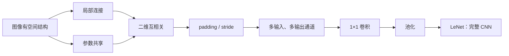

本章不是一组孤立 API。它回答的是一条连续的问题链：

1. 为什么把图像展平会浪费结构？
2. 小卷积核怎样读取一个局部区域？
3. 怎样控制特征图大小？
4. 灰度图变成几十个通道后，卷积怎样计算？
5. 怎样逐步压缩空间并完成分类？

### 学习时区分三件事

| 类型 | 本章内容 |
| --- | --- |
| 建议记住 | 卷积核 Shape、输出尺寸公式、`Conv2d` 的 NCHW 顺序 |
| 建议会推 | 参数量、每层 Shape、多通道求和、感受野扩大 |
| 建议亲手做 | 手写互相关、打印逐层 Shape、跑通一次 LeNet 更新 |

---

## 6.1 从全连接层到卷积：先承认图片不是普通向量

### 展平到底丢了什么

一张 $28\times28$ 灰度图确实可以展平成 784 维向量，但“数值还在”不等于“结构还在”。展平之后，模型不知道两个相邻位置原来是邻居，也不知道左上角的一条边和右下角同样形状的一条边应该用相似方式处理。

全连接层让每个输出与全部输入相连。若输入是 $1000\times1000$ 图片，输出仍有 $1000\times1000$ 个隐藏单元，仅一个输入通道时，权重数量就可能达到 $10^{12}$ 量级。问题不是电脑“再快一点”就能彻底解决，而是模型没有利用图像的先验结构。

卷积引入两个非常朴素的假设：

- **局部性（locality）**：判断某处有没有边缘，通常先看附近像素，不必一上来读取整张图；
- **参数共享（weight sharing）**：识别左上角竖边的方法，也可以拿到右下角继续用。

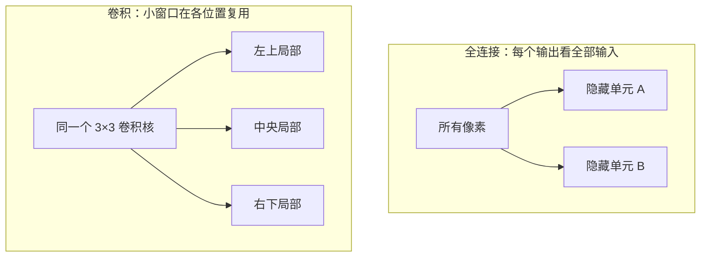

### 参数量差异不是小修小补

假设输入与输出都是单通道 $28\times28$：

- 全连接到 784 个输出：$784\times784+784=615440$ 个参数；
- 一个 $3\times3$ 卷积：$3\times3+1=10$ 个参数。

卷积输出虽然有许多空间位置，但这些位置共享同一个核，所以参数量不随图片面积线性增加。这里节省参数并不是白拿的：它把“同一个局部模式可能出现在任意位置”写成了模型假设。如果任务本身依赖绝对位置，这个假设也可能过强。

### 平移等变不等于平移不变

这两个词很容易混淆：

- **平移等变（translation equivariance）**：输入中的物体向右移，卷积特征也大致向右移；
- **平移不变（translation invariance）**：输入移动后，最终输出基本不变。

单独的卷积更接近“等变”。经过池化、全局汇聚以及分类头后，模型才可能对小范围位移表现出一定不敏感。现实中的 padding、stride 和边界也会破坏严格等变，所以不要把它当成无条件数学保证。

### 新手例子：同一条竖边换位置，要不要重学

- **问题/小输入**：两个 `2×2` 局部块都为 `[[1,0],[1,0]]`，只是一个在图像左上、一个在右下；卷积核为 `[[1,-1],[1,-1]]`。
- **逐步过程**：核在左上块计算 `1×1+0×(-1)+1×1+0×(-1)=2`；滑到右下的相同块，仍用同一组四个权重，计算也为 2。
- **具体输出**：两处对应特征值都是 `2`，卷积核参数只保存一份。
- **说明什么**：局部性让核只看附近，参数共享让同一模式在不同位置用同一检测规则。
- **常见误解**：卷积平移等变就代表最终分类结果天然平移不变；卷积特征通常会随输入一起移动，后续汇聚才可能增强不变性。

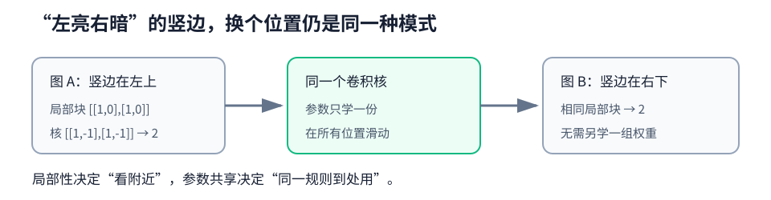

---

## 6.2 图像卷积：小窗口究竟算了什么

### PyTorch 的“卷积”实际计算互相关

设二维输入为 $X$，卷积核为 $K$，核高、宽分别为 $k_h,k_w$。在不填充、步幅为 1 时：

$$
Y_{i,j}=\sum_{a=0}^{k_h-1}\sum_{b=0}^{k_w-1}X_{i+a,j+b}K_{a,b}
$$

白话解释：把核盖在输入的一个小区域上，对应位置相乘，再把所有乘积相加，得到输出中的一个数；随后窗口移动一个位置，重复同样动作。

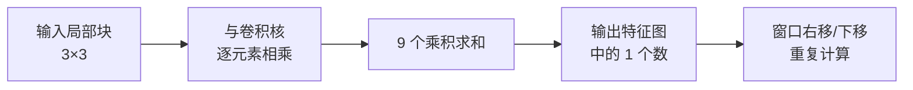

例如：

$$
X=\begin{bmatrix}1&2&0\\0&1&3\\2&1&0\end{bmatrix},\qquad
K=\begin{bmatrix}1&-1\\0&1\end{bmatrix}
$$

左上角输出只使用 $X$ 左上的 $2\times2$ 区域：

$$
1\times1+2\times(-1)+0\times0+1\times1=0
$$

计算整张输出时，输入是 $(3,3)$，核是 $(2,2)$，因此输出是 $(2,2)$。

严格数学卷积还会先把核上下、左右翻转；深度学习库通常不翻转，所以实现的是互相关（cross-correlation）。训练时核本来就是学出来的，是否预先翻转不会削弱模型表达能力，因此行业里仍习惯把层叫“卷积层”。

### 一个差分核为什么能找边缘

考虑横向核 $[1,-1]$。如果相邻像素相同，输出是 0；如果从暗变亮，输出为负；如果从亮变暗，输出为正。它实际上在问：“左右两个位置变化了多少？”

这揭示了特征图（feature map）的含义：每个输出位置是在报告“这个局部区域与某种模式有多匹配”。浅层核常会学出边缘、方向或颜色对比，深层则把这些简单模式组合成纹理、部件乃至更抽象语义。

### 核不需要人工指定

边缘核可以手写，但真实任务中的卷积核由反向传播学习：

1. 卷积核先随机初始化；
2. 前向计算得到特征和预测；
3. 损失衡量预测错误；
4. `loss.backward()` 计算损失对核中每个元素的梯度；
5. `optimizer.step()` 更新核。

因为同一个核在许多位置复用，它收到的是这些位置贡献的梯度之和。这正是“参数共享”在反向传播中的对应表现。

### 感受野：一个神经元到底看到了多大范围

某层一个位置能够受输入中哪些区域影响，这个区域叫感受野（receptive field）。单个 $3\times3$ 卷积只直接看 $3\times3$，但堆叠两层步幅 1 的 $3\times3$ 卷积后，第二层一个位置已经间接看到第一层的多个位置，对原图感受野扩大为 $5\times5$；三层则是 $7\times7$。

小核堆叠的价值是：

- 逐步扩大感受野；
- 中间插入更多非线性；
- 通常比一个超大核更省参数。

感受野不是“这一位置只会用到这么多像素”的模糊比喻，而是可以沿网络连接精确追踪的依赖范围。

### 新手例子：手算整张二维互相关输出

- **问题/小输入**：输入 `[[1,2,0],[0,1,3],[2,1,0]]`，核 `[[1,-1],[0,1]]`，步幅 1、无填充。
- **逐步过程**：四个 `2×2` 窗口分别做对应元素乘积求和：左上 0、右上 6、左下 0、右下 -2。
- **具体输出**：输出 Shape 为 `(2,2)`，数值为 `[[0,6],[0,-2]]`。
- **说明什么**：输出中的一个格只对应一个局部窗口；整张特征图就是同一规则在各位置的报告。
- **常见误解**：以为 PyTorch 会先翻转卷积核；`Conv2d` 前向采用互相关，但可学习核会适应该约定。

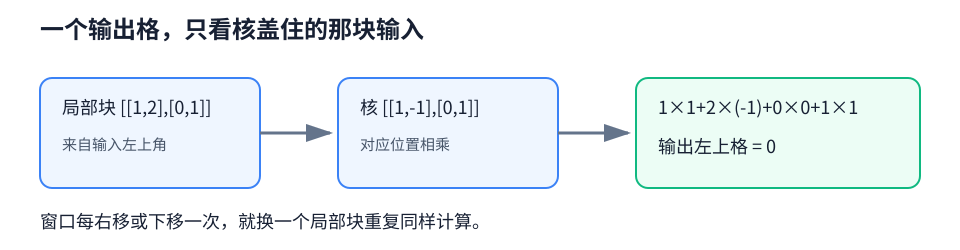

---

## 6.3 填充和步幅：控制窗口从哪里走、每步走多远

### 输出尺寸公式

对高度方向，输入高为 $H$、核高为 $K_h$、上下总填充对应单边 $P_h$、步幅为 $S_h$ 时：

$$
H_{out}=\left\lfloor\frac{H+2P_h-K_h}{S_h}\right\rfloor+1
$$

宽度同理：

$$
W_{out}=\left\lfloor\frac{W+2P_w-K_w}{S_w}\right\rfloor+1
$$

符号对应 PyTorch：

```python
nn.Conv2d(in_channels, out_channels,
          kernel_size=(K_h, K_w),
          padding=(P_h, P_w),
          stride=(S_h, S_w))
```

先在纸上预测 Shape，再运行代码打印 Shape，远比遇到全连接层报错后倒查更高效。

### padding：给边界发言机会

没有填充时，边缘像素参与窗口计算的次数更少，特征图还会层层缩小。padding 在图像四周补值，PyTorch 普通卷积默认补 0。

对于奇数核、步幅 1，若希望输出尺寸与输入相同，常取：

$$
P_h=\frac{K_h-1}{2},\qquad P_w=\frac{K_w-1}{2}
$$

因此 $3\times3$ 核常配 padding 1，$5\times5$ 核常配 padding 2。但“same”不是说边界与内部完全等价：边界窗口看到了一部分人为补出的 0，统计性质仍可能不同。

### stride：一次跨几格

stride 2 表示窗口每次跨两格。它既做特征提取，也做下采样：输出高宽大约减半，计算量随之显著减少，但空间细节也会丢失。

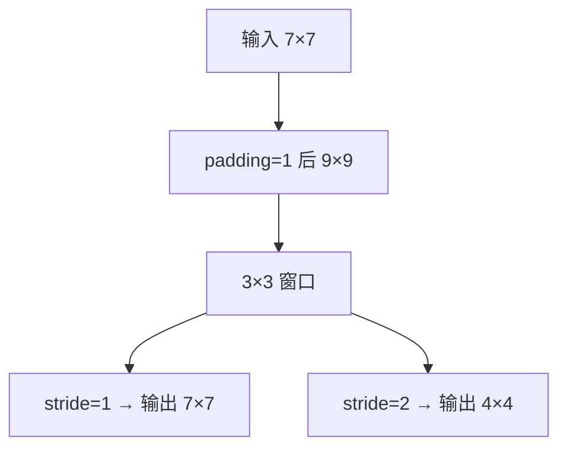

一个常见心算例子：输入 $7\times7$，核 $3\times3$，padding 1，stride 2：

$$
\left\lfloor\frac{7+2-3}{2}\right\rfloor+1=4
$$

输出就是 $4\times4$，不是简单地把 7 除以 2 后得到 3。

### 新手例子：先补边，再按步幅数落点

- **问题/小输入**：输入高宽 `5×5`，核 `3×3`，单边 padding=1，stride=2。
- **逐步过程**：补边后的有效画布为 `7×7`；核左上角可落在坐标 0、2、4，共 3 个位置；公式是 `floor((5+2-3)/2)+1`。
- **具体输出**：高宽均为 3，所以输出 Shape 为 `(N,C_out,3,3)`。
- **说明什么**：padding 改可用边界，stride 改窗口落点间距，尾部放不下完整窗口时下取整。
- **常见误解**：stride=2 就永远把高宽精确除以 2；奇数尺寸和填充会使结果需要按公式计算。

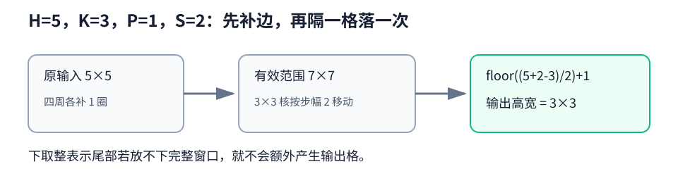

---

## 6.4 多输入、多输出通道：通道是“同一位置的不同描述”

### 先读懂 Conv2d 的四维 Shape

PyTorch 图像批次使用 NCHW 顺序：

| 对象 | Shape | 含义 |
| --- | --- | --- |
| 输入 `X` | `(N, C_in, H, W)` | 批量、输入通道、高、宽 |
| 权重 `weight` | `(C_out, C_in, K_h, K_w)` | 每个输出通道拥有一整组多输入通道核 |
| 偏置 `bias` | `(C_out,)` | 每个输出通道一个偏置 |
| 输出 `Y` | `(N, C_out, H_out, W_out)` | 每张图得到 `C_out` 张特征图 |

RGB 图片的 `C_in=3`。更深层的 `C_in` 不再是红绿蓝，而是上一层学到的多种特征图。

### 一个输出通道怎样融合全部输入通道

对第 $o$ 个输出通道：

$$
Y_o=\sum_{c=1}^{C_{in}}X_c\star K_{o,c}+b_o
$$

$\star$ 表示二维互相关。每个输入通道分别与自己的二维核计算，结果逐元素相加，才得到一个输出通道。若要 $C_{out}$ 个输出通道，就准备 $C_{out}$ 组这样的核。

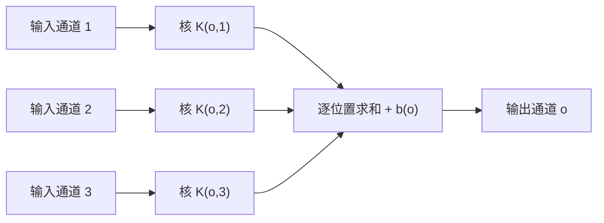

标准卷积参数量为：

$$
C_{out}(C_{in}K_hK_w+1)
$$

最后的 1 来自偏置；若 `bias=False`，则去掉。注意参数量不含 $H,W$，因为空间位置共享权重。

### 1×1 卷积不是“什么也没看”

$1\times1$ 卷积确实不看相邻像素，但会读取同一位置的全部输入通道。对每个空间位置，它等价于：

$$
\mathbf y_{i,j}=W\mathbf x_{i,j}+\mathbf b
$$

因此它可以：

- 改变通道数，例如从 256 压到 64；
- 在通道之间重新组合信息；
- 配合激活函数增加逐位置非线性；
- 在 Inception、ResNet 的捷径和 NiN 中降低计算或对齐 Shape。

它保持 $H,W$ 不变，只改变每个位置“用多少个数字来描述自己”。配套程序将手写矩阵乘法结果与 `F.conv2d` 的 $1\times1$ 输出逐项对齐。

### 新手例子：两个输入通道怎样合成一个输出值

- **问题/小输入**：同一空间位置的两通道值为 `[3,5]`，一个 `1×1` 输出核的通道权重为 `[2,-1]`，偏置为 `0.5`。
- **逐步过程**：通道 1 贡献 `3×2=6`，通道 2 贡献 `5×(-1)=-5`，最后加偏置 0.5。
- **具体输出**：该输出通道在此位置的值是 `6-5+0.5=1.5`。
- **说明什么**：一个输出通道会读取全部输入通道并求和；`1×1` 卷积是在每个位置做共享的通道线性变换。
- **常见误解**：认为每个输入通道独立变成一个输出通道；标准卷积先跨所有输入通道融合，再为每个输出通道使用不同的一组核。

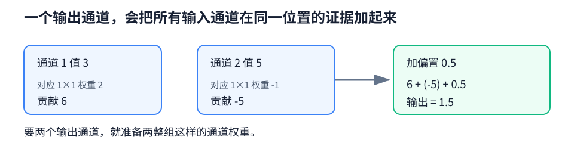

---

## 6.5 池化层：压缩局部信息，不负责学习卷积核

### 最大池化与平均池化

池化窗口同样在空间上滑动，但没有可训练权重：

$$
Y_{i,j}=\max_{(a,b)\in\mathcal W}X_{i+a,j+b}
$$

或

$$
Y_{i,j}=\frac{1}{|\mathcal W|}\sum_{(a,b)\in\mathcal W}X_{i+a,j+b}
$$

- 最大池化问：“这个局部有没有强响应？”
- 平均池化问：“这个局部的平均响应多大？”

最大池化适合保留最显著检测结果，平均池化更平滑。二者没有绝对赢家，要看网络设计和任务。

### 池化一般不混合通道

输入 `(N,C,H,W)` 经过普通 `MaxPool2d` 后仍有 `C` 个通道。池化窗口独立作用于每个通道，不会把通道 1 与通道 2 加在一起。输出尺寸使用与卷积相同的公式，只是“核大小”换成“池化窗口大小”。

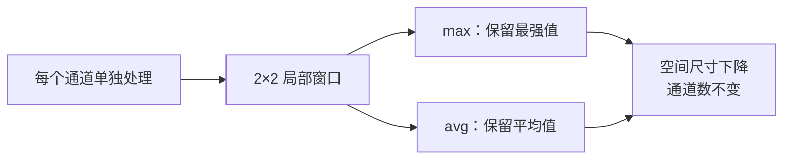

池化能让特征对小位移更稳健，但不是免费午餐。过早、过强下采样会让小目标、细线和精确位置消失。现代网络也常用 stride 卷积完成下采样，或在末尾使用全局平均池化替代大型全连接层。

### 新手例子：同一窗口做最大池化和平均池化

- **问题/小输入**：一个 `2×2` 窗口为 `[[1,3],[2,0]]`。
- **逐步过程**：最大池化比较四项，最大值为 3；平均池化求和 6，再除以 4。
- **具体输出**：最大池化输出 `3`，平均池化输出 `1.5`；二者都把四格压成一格。
- **说明什么**：最大池化保留最强响应，平均池化保留局部平均水平；普通池化没有可训练权重。
- **常见误解**：池化会把多个通道也合在一起；`MaxPool2d`/`AvgPool2d` 默认逐通道独立处理，只改变空间高宽。

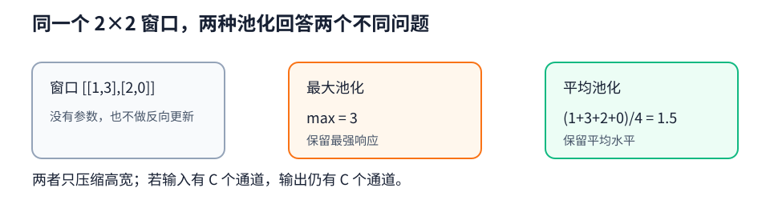

---

## 6.6 LeNet：把零件组装成一条完整流水线

### 它为什么是重要的教学模型

LeNet 的历史价值不仅是“层数很少”，而是它清楚展示了 CNN 的经典组织方式：

> 卷积提取局部模式 → 激活引入非线性 → 池化压缩空间 → 重复 → 展平 → 全连接分类。

原始风格使用 sigmoid 与平均池化。配套 smoke test 保留层次与 Shape，但把 sigmoid 换成 ReLU，让小型合成任务在 CPU 上几轮内稳定收敛。将代码中的 `activation = nn.ReLU` 改为 `nn.Sigmoid`，即可观察经典激活在这个设置下收敛更慢的现象。

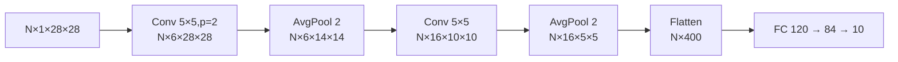

### 每层 Shape 与参数量

以下按 10 类输出计算经典结构参数量：

| 层 | 输出 Shape（省略 N） | 可训练参数 |
| --- | --- | ---: |
| 输入 | `(1,28,28)` | 0 |
| `Conv2d(1,6,5,padding=2)` | `(6,28,28)` | $6(1\times5\times5+1)=156$ |
| `AvgPool2d(2,2)` | `(6,14,14)` | 0 |
| `Conv2d(6,16,5)` | `(16,10,10)` | $16(6\times5\times5+1)=2416$ |
| `AvgPool2d(2,2)` | `(16,5,5)` | 0 |
| `Flatten` | `(400)` | 0 |
| `Linear(400,120)` | `(120)` | $400\times120+120=48120$ |
| `Linear(120,84)` | `(84)` | $120\times84+84=10164$ |
| `Linear(84,10)` | `(10)` | $84\times10+10=850$ |

总计 61706 个参数。一个值得留意的事实是：绝大多数参数仍集中在第一个全连接层，而不是卷积层。这也解释了后来的 NiN、GoogLeNet 等模型为什么喜欢用全局平均池化减少大型分类头。

### 为什么 `Flatten` 不能写死得不明不白

第二次池化后得到 `(N,16,5,5)`，展平后是 `(N,400)`，因此下一层才能写 `Linear(400,120)`。若前面修改 padding、stride、输入大小或池化层，400 也会变化。

遇到 `mat1 and mat2 shapes cannot be multiplied`，不要先乱改 `Linear` 数字。正确排查顺序是：从输入开始打印每层 Shape，找到第一次与预测不一致的位置，再决定架构应如何调整。

### 新手例子：一张 28×28 图怎样走到 10 类

- **问题/小输入**：单张灰度图 `(1,28,28)`，按本章 LeNet 的两次卷积和池化前向。
- **逐步过程**：`1×28×28 → 6×28×28 → 6×14×14 → 16×10×10 → 16×5×5`；再展平 `16×5×5=400`，经过 `400→120→84→10`。
- **具体输出**：单张图得到长度 10 的 logits；批量 B 时为 `(B,10)`。
- **说明什么**：每层 Shape 决定下一层输入维，`Linear(400,120)` 的 400 是从前面结构推出来的。
- **常见误解**：`Flatten` 会把 batch 也合进去；`nn.Flatten()` 默认从维 1 开始，只把每个样本的通道和空间维合并。

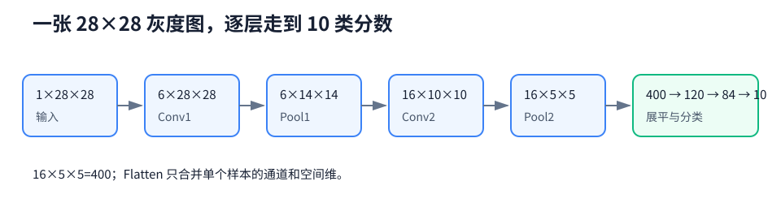

---

## 完整代码怎么读

### 程序一：卷积基础逐项对照

[打开 `convolution_basics.py`](../code/ch06/convolution_basics.py)

| 代码块 | 它验证什么 | 读代码时盯住什么 |
| --- | --- | --- |
| `corr2d` | 手写二维互相关 | 窗口切片与逐元素乘积求和 |
| `corr2d_multi_in` | 多输入通道融合 | 各通道结果最后求和 |
| `corr2d_multi_in_out` | 多输出通道 | 每组核产生一张输出特征图 |
| `corr2d_1x1` | $1\times1$ 卷积等价矩阵乘法 | 展平的是空间位置，不是混掉空间 |
| `pool2d` | max/avg 池化 | 无参数、每个窗口只给一个值 |
| `torch.testing.assert_close` | 手写值与框架值一致 | 测试的不只是 Shape，还有数值 |

关键的 Shape 补维：

```python
image[None, None]          # (H,W) -> (1,1,H,W)
edge_kernel[None, None]    # (K_h,K_w) -> (1,1,K_h,K_w)
```

第一个 `None` 补批量/输出通道维，第二个补输入通道维。这里不是随便“多套两层括号”，而是在满足 `F.conv2d` 的 NCHW 输入与 OIHW 权重约定。

### 程序二：真正训练一次 LeNet

[打开 `lenet_smoke.py`](../code/ch06/lenet_smoke.py)

它使用合成任务：图中亮条纹是竖直则标签 0，是水平则标签 1。数据虽然简单，训练链路却完整：

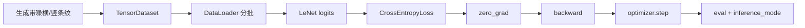

训练批次中的七个关键动作逐句解释：

```python
features = features.to(device)          # 输入搬到模型所在设备
targets = targets.to(device)            # 标签也必须在同一设备
logits = model(features)                # 前向得到 (N,2)，这里不是概率
loss = loss_fn(logits, targets)         # 交叉熵比较分数与 long 标签
optimizer.zero_grad(set_to_none=True)   # 清掉上一批梯度
loss.backward()                         # 计算梯度，参数值尚未改变
optimizer.step()                        # 读取梯度并真正更新参数
```

程序还专门处理了两个容易被忽略的细节：

- epoch 损失用“批均值 × 本批样本数”累计，再除总样本数，末尾小批不会被错误地等权；
- 评估同时使用 `model.eval()` 与 `torch.inference_mode()`：前者控制层行为，后者关闭梯度记录。

### 运行方式

```bash
python code/ch06/convolution_basics.py
python code/ch06/lenet_smoke.py --device cpu
```

两份程序都不下载数据。第一份应打印各个小张量并显示“全部对照测试通过”；第二份会打印 LeNet 每一层 Shape，随后训练若干轮并验证测试准确率超过 90%。

---

## Hot 100 算法迁移：239. 滑动窗口最大值

> 出处：[LeetCode 热题 100 官方题单](https://leetcode.cn/studyplan/top-100-liked/)<br>
> 原题直达：[239. 滑动窗口最大值](https://leetcode.cn/problems/sliding-window-maximum/)<br>
> 完整答案：[hot100_sliding_window_maximum.py](../code/ch06/hot100_sliding_window_maximum.py)

### 为什么它和本章有关

卷积与池化都让固定大小的窗口在输入上移动。算法题也移动一个长度为 <code>k</code> 的窗口，但问题变成：相邻窗口重叠很多，怎样不从头扫描 <code>k</code> 个元素就得到最大值？

连接只到这里。最大池化通常对每个窗口独立计算，单调队列则利用连续窗口之间的重叠复用状态；它不是神经网络层，也没有可学习参数。

### 原题的原创摘要

给定整数序列和窗口长度 <code>k</code>。窗口每次向右移动一格，请依次返回每个完整窗口里的最大元素。

### 本题学习目标

- 说清队列为什么保存“下标”而不是只保存值；
- 建立两个不变量：下标仍在窗口内，队列对应数值从大到小；
- 解释每个元素最多入队、出队各一次，因此总时间是 $O(n)$；
- 区分“维护窗口最大值”和“每次重新扫描窗口”。

### 白话例子：<code>[1,3,-1,-3,5]</code>，<code>k=3</code>

队列只留下“将来还有可能成为最大值”的下标：

1. 读到 1：队列是 <code>[1]</code>。
2. 读到 3：旧的 1 更小、位置也更早。只要 3 还在窗口，1 就不可能成为最大值，所以弹出 1，队列变成 <code>[3]</code>。
3. 读到 -1：队列为 <code>[3,-1]</code>。第一个窗口形成，队首 3 是答案。
4. 读到 -3：队列为 <code>[3,-1,-3]</code>。窗口 <code>[3,-1,-3]</code> 的答案仍是 3。
5. 读到 5：下标最早的 3 已离开新窗口；而 -1、-3 都被更晚且更大的 5 压住，于是队列只剩 <code>[5]</code>，答案为 5。

核心代码只有两次“清理”：

~~~python
# 清掉已经离开左边界的下标。
if candidates and candidates[0] < left:
    candidates.popleft()

# 清掉队尾不大于新值的旧候选，保持对应数值递减。
while candidates and nums[candidates[-1]] <= value:
    candidates.pop()

# 队首始终是当前完整窗口最大值的下标。
candidates.append(right)
~~~

**这个例子说明了什么？** 不是把所有窗口提前存起来，而是每移动一步，只删除过期候选和已经不可能胜出的候选。

**新手最容易误解什么？** 队列应保存下标。只保存数值时，重复值出现后很难判断队首到底是否已经离开窗口。

### 复杂度与易错点

- 时间复杂度：$O(n)$。一个下标只入队一次，也最多从队首或队尾离开一次。
- 空间复杂度：$O(k)$。队列只保存当前窗口内的候选。
- 易错点 1：先算当前左边界，再删除队首过期下标。
- 易错点 2：窗口在 <code>right >= k-1</code> 时才完整，不能过早输出。
- 易错点 3：弹出相等旧值是安全的，因为更晚的相等值会在窗口中停留更久。

运行离线自测：

~~~bash
python code/ch06/hot100_sliding_window_maximum.py
~~~

---

## 常见坑与排错顺序

### 1. `Conv2d` 报期望若干通道，实际却收到另一个数

先打印 `x.shape`。PyTorch 默认需要 `(N,C,H,W)`，单张灰度图 `(H,W)` 需要补成 `(1,1,H,W)`。如果数据是 NHWC，不能只改 `in_channels`，而应明确执行 `x = x.permute(0,3,1,2)`。

### 2. 卷积后接全连接时报矩阵无法相乘

从输入起逐层打印 Shape，重新计算 padding、stride 与池化后的高宽。不要凭感觉修改 `Linear` 的输入数；这会掩盖更早的 Shape 错误。

### 3. 输出尺寸总比预期小一格

把数字代入带下取整的公式，检查是否忘记 padding，或把总填充 $2P$ 错写成 $P$。还要确认 `kernel_size`、`stride` 是否为二元组，各方向参数可能不同。

### 4. 模型能跑，但参数量异常巨大

检查是否过早 `Flatten`，以及全连接层输入是否仍包含很大的 $H\times W$。卷积不怕较大特征图的参数量，但全连接会把空间位置分别连权重。

### 5. 池化后通道数为什么没变

这是正常行为。普通池化在每个通道内独立滑动，只压缩高宽。要改变通道数，应使用卷积，尤其是 $1\times1$ 卷积。

### 6. 训练准确率停在随机水平

按这个顺序查：标签与任务是否对应 → logits/targets Shape 和 dtype → loss 是否有限 → 梯度是否为 `None` → `step()` 后参数是否变化 → 学习率与激活函数。不要第一步就把网络加深。

### 7. CPU 上很慢或显存不足

先减 batch size、输入分辨率和通道数；再检查是不是保存了带计算图的所有中间输出。下采样越晚，后续层计算越贵。调试阶段先用合成小输入验证链路。

---

## Hot 100 加练（本章共 3 题）

原有 #239 之外，新增 [#48 旋转图像](https://leetcode.cn/problems/rotate-image/) 与 [#73 矩阵置零](https://leetcode.cn/problems/set-matrix-zeroes/)，练二维坐标变换、原地更新和矩阵标记。白话推导见[新增题完整解析](leetcode-hot100-expanded-practice.md#第-6-章二维局部结构)，完整代码分别见 [hot100_rotate_image.py](../code/ch06/hot100_rotate_image.py) 与 [hot100_set_matrix_zeroes.py](../code/ch06/hot100_set_matrix_zeroes.py)。

## 主动回忆：先遮住答案再作答

建议拿纸写出关键词、公式或 Shape，再打开答案。只在脑中说“我好像懂了”不算完成回忆。

<details>
<summary>1. 展平图片并没有删掉像素值，为什么仍说它丢失了空间结构？</summary>

展平只保留数值及固定顺序，却没有把“相邻像素应该优先共同处理”和“同一局部模式可出现在不同位置”写进模型。全连接层必须从数据中分别为不同位置学习类似关系，参数更多、样本效率更低；卷积则用局部连接与共享权重直接编码这些先验。

</details>

<details>
<summary>2. 局部性和参数共享分别解决什么问题？</summary>

局部性让一个隐藏位置只连接附近区域，减少单次连接与计算；参数共享让同一个卷积核在所有空间位置复用，进一步大幅减少参数，并使同一种模式能在不同位置被检测。两者共同把全连接式巨型权重张量约束为小卷积核。

</details>

<details>
<summary>3. 为什么单个卷积层更准确地说是平移等变，而不是平移不变？</summary>

输入模式发生平移时，对应特征响应通常也随之平移，输出并没有保持原样，这叫等变。不变要求最终表示或预测基本不随平移变化，通常需要池化、全局汇聚或数据增强等共同促成；边界与步幅还会使严格等变失效。

</details>

<details>
<summary>4. 手写二维互相关时，输出左上角的一个数怎样得到？</summary>

取与卷积核同样大小的输入左上局部块，让它与核对应元素相乘，再把所有乘积求和；若该输出通道有偏置，再加偏置。随后窗口按 stride 移到下一个位置。

</details>

<details>
<summary>5. 深度学习中的 Conv2d 为什么通常算互相关却仍叫卷积？</summary>

数学卷积会翻转核，互相关不翻转。神经网络中的核通过训练学习，预先是否翻转只改变参数表示，不改变可学习函数集合，因此实践中沿用“卷积”这个名称，框架内部通常直接做互相关。

</details>

<details>
<summary>6. 输入高 11、核高 3、padding 1、stride 2，输出高是多少？</summary>

代入公式：$\lfloor(11+2\times1-3)/2\rfloor+1=\lfloor10/2\rfloor+1=6$。一定要保留最后的 `+1`，并注意 padding 在上下两侧共贡献 $2P$。

</details>

<details>
<summary>7. 为什么 padding 不只是为了“让 Shape 好看”？</summary>

无填充时边界像素参与卷积的次数更少，层叠后空间尺寸快速缩小，边缘信息更早消失。适当填充既能控制尺寸，也让边界在更多窗口中参与计算。但补零会引入人工边界，因此不能说边界与内部完全等价。

</details>

<details>
<summary>8. stride 变大带来哪三类直接影响？</summary>

输出高宽下降、计算量减少、空间细节和精确位置信息减少。它同时改变后续层的感受野步进，因此不是单纯“加速开关”；小目标任务中过早使用大 stride 可能损害效果。

</details>

<details>
<summary>9. 权重 Shape 为 `(16,3,5,5)` 的 Conv2d 表示什么？参数量是多少？</summary>

它有 3 个输入通道、16 个输出通道，每对输入—输出通道使用一个 $5\times5$ 核。若有偏置，参数量为 $16(3\times5\times5+1)=1216$；其中每个输出通道只有一个偏置。

</details>

<details>
<summary>10. 一个输出通道为什么必须对所有输入通道的卷积结果求和？</summary>

输出通道是在形成一种新的综合特征。每个输入通道先用对应二维核提供一份证据，这些证据在相同空间位置相加，再加偏置，才能得到一张输出特征图。若不求和，就仍是分离的输入—输出通道对，而不是指定的一个输出通道。

</details>

<details>
<summary>11. 1×1 卷积能做什么，不能做什么？</summary>

它能在每个空间位置混合和变换通道、升降通道数，并在配合激活时增加逐位置非线性；它不能单独读取相邻像素，因此不会直接提取更大空间纹理。其本质是同一个线性层在所有空间位置共享。

</details>

<details>
<summary>12. 最大池化与平均池化的差异是什么？它们会改变通道数吗？</summary>

最大池化保留窗口内最强响应，平均池化保留平均水平。普通二维池化在各通道独立进行，只改变空间高宽，不融合也不改变通道数；输出通道仍等于输入通道。

</details>

<details>
<summary>13. 为什么说池化提供的是一定程度的位移稳健性，而不是绝对不变性？</summary>

只要强响应仍落在同一池化窗口内，小位移可能得到相同最大值；一旦跨过窗口边界、遇到 stride 采样差异或靠近填充边界，输出就可能变化。多层网络最终是否不变还取决于后续结构和训练数据。

</details>

<details>
<summary>14. 两层 stride=1、无空洞的 3×3 卷积为什么具有 5×5 感受野？</summary>

第二层一个位置读取第一层连续 $3\times3$ 位置；第一层最左与最右位置各自又向原图外扩一格。合并依赖范围后，每增加一层 3×3 卷积，单方向感受野增加 2，所以从 3 扩到 5。

</details>

<details>
<summary>15. LeNet 中 `(N,16,5,5)` 为什么展平为 `(N,400)` 而不是 `(400,)`？</summary>

展平只合并每个样本的通道和空间维，必须保留批量维 N，才能让全连接层一次处理一批样本。$16\times5\times5=400$，因此每个样本是一条 400 维向量，整批是 `(N,400)`。

</details>

<details>
<summary>16. 为什么 LeNet 的多数参数在全连接层，而不是卷积层？</summary>

卷积核在全部空间位置共享，同一个 $5\times5$ 核不会因图像上有很多位置而复制参数；全连接层却为 400 个输入与 120 个输出的每一对连接保存独立权重，仅该层就有 48120 个参数。因此后续架构倾向减少大型全连接头。

</details>

<details>
<summary>17. `loss.backward()` 和 `optimizer.step()` 在训练卷积核时分别做什么？</summary>

`backward()` 沿计算图计算损失对卷积核、偏置等参数的梯度，并把结果累积进 `.grad`，但不修改参数值；`step()` 读取这些梯度，按优化规则真正更新参数。下一批前还要清除旧梯度。

</details>

<details>
<summary>18. 修改卷积或池化配置后出现全连接 Shape 报错，最可靠的处理步骤是什么？</summary>

准备一个最小输入，从第一层开始逐层打印 Shape；同时用卷积输出公式预测高宽，找到第一次不一致的位置。确认新卷积编码器的最终 `(C,H,W)` 后，再把 `Linear` 输入改成 $C\times H\times W$，或使用合适的自适应池化固定尺寸。

</details>

---

### 面试八股加练：不能只背结论

<details>
<summary>19. 【八股深答】卷积的局部连接和参数共享分别带来什么？</summary>

**结论：**局部连接利用邻近像素关系并减少单次连接范围；参数共享让同一模式检测器在所有位置复用，大幅减少参数。**机制：**一个 $k_h\times k_w$ 核滑过空间，同一组权重参与多个输出位置。**工程影响：**参数量主要由核大小和通道数决定，而不直接随输入高宽增加；但计算量仍会随输出位置增加。**误区：**参数共享不等于所有通道共用同一个核，每个输出通道仍有对应全部输入通道的权重。**追问：**标准卷积是平移等变而非天然平移不变，池化和全局汇聚只提供一定稳健性。

</details>

<details>
<summary>20. 【八股深答】1×1 卷积为什么不是“什么也没看”？</summary>

**结论：**它不扩大单层空间感受野，却会在每个像素位置混合全部输入通道。**机制：**对固定 $(h,w)$，1×1 卷积等价于对通道向量做共享线性变换，可升维、降维和配合激活增加非线性。**工程影响：**Inception 用它压缩大核前的通道，残差投影用它对齐 Shape，NiN 用它构造逐像素 MLP。**误区：**它不是恒等映射；只有特定权重和相同通道数时才可能实现恒等。**追问：**若要混合邻域空间信息，仍需大于 1 的核、空洞卷积或其他空间算子。

</details>

<details>
<summary>21. 【八股深答】感受野变大是否等于模型一定看懂更大物体？</summary>

**结论：**理论感受野只表示可能影响某输出的输入范围，不保证这些位置贡献均匀或模型已学会利用。**机制：**堆叠卷积、步幅和空洞都会扩大理论范围，但有效感受野受权重、非线性和训练数据影响，常集中在中心。**工程影响：**不能只按层数判断上下文能力，还要检查特征分辨率、任务指标和可视化/消融。**误区：**扩大步幅虽增大感受野，却也可能过早丢失细节。**追问：**两层 stride=1 的 3×3 卷积理论感受野为 5×5，并带来两次非线性。

</details>

## 学完本章应该能做到

- 不看笔记解释卷积为什么适合图像，而不只会说“参数少”；
- 根据 NCHW 输入和 OIHW 权重写出每层 Shape 与参数量；
- 手算一个二维互相关输出，并解释多通道为何要求和；
- 分清 padding、stride、pooling 对尺寸和信息的不同影响；
- 解释 $1\times1$ 卷积的通道混合作用；
- 独立跑通两份代码，并能证明一次 `step()` 确实更新了卷积核。

下一章会把这些基本零件组合成不同架构思想：更深更宽、重复块、并行分支、规范化、残差捷径与稠密拼接。

[上一章：深度学习计算](ch05-deep-learning-computation.md) · [下一章：现代卷积神经网络](ch07-modern-convolutional-neural-networks.md) · [返回总目录](../README.md)
