# 第七章：现代卷积神经网络

> 章节定位：D2L 2.0 第 7 章 · PyTorch · 重点不是背网络，而是看懂每次架构改动解决了什么

[六类现代 CNN 完整代码](../code/ch07/modern_cnn_blocks.py) · [官方章节目录](https://zh.d2l.ai/chapter_convolutional-modern/index.html)

## 一句话主线

现代 CNN 的演进不是不断堆层数，而是在回答四个问题：怎样稳定地训练更深网络、怎样用更少参数表达更多模式、怎样同时看不同尺度，以及怎样让早期信息和梯度顺畅流到后面。

## 章节地图：把模型名看成一条思想时间线


不要把这一章背成“年份—层数—准确率”表。更持久的记忆方式是：

| 架构/技术 | 它主要在反抗什么 |
| --- | --- |
| AlexNet | 手工特征主导、深 CNN 难以规模化训练 |
| VGG | 网络结构杂乱、深度增加缺少统一积木 |
| NiN | 卷积后局部变换太简单、大型全连接头参数太多 |
| GoogLeNet | 不知道该选哪一种卷积尺度、计算预算有限 |
| BatchNorm | 深层训练对初始化和学习率敏感、中间激活漂移 |
| ResNet | 网络加深后优化反而变差、恒等映射不易学 |
| DenseNet | 特征重复学习、早期信息到后层路径太长 |

---

## 7.1 AlexNet：证明“特征可以学出来”

### 它真正改变的不是层数数字

在早期视觉流水线中，人们往往先人工设计边缘、纹理等特征，再把特征交给分类器。AlexNet 展示了另一条道路：只提供图片和标签，让多层卷积自己形成从低级边缘到高级语义的表征。

它与 LeNet 在骨架上并不陌生，都是“卷积编码器 + 全连接分类头”，关键差异在规模与训练技术：

| 对比 | LeNet | AlexNet 思路 |
| --- | --- | --- |
| 数据与任务 | 小型灰度图 | 大规模彩色自然图像 |
| 网络规模 | 较浅、通道少 | 更深、更宽、参数多 |
| 激活 | sigmoid | ReLU |
| 下采样 | 平均池化 | 最大池化 |
| 正则化 | 较少 | Dropout、数据增强 |
| 计算 | 早期硬件 | 借助 GPU 并行训练 |

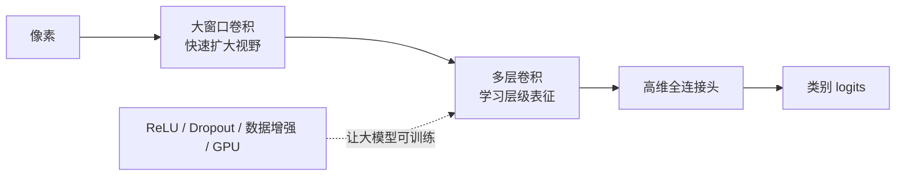

### ReLU 为什么在深网络中重要

$$
\operatorname{ReLU}(x)=\max(0,x)
$$

对正数区域，ReLU 导数为 1，不像 sigmoid 在绝对值较大时容易进入导数接近 0 的饱和区。它不能保证任何深网都不发生梯度问题，但在当时显著改善了深层 CNN 的优化速度。

### Dropout 放在全连接头意味着什么

训练时，Dropout 随机把部分激活置零，并对保留激活做尺度补偿；评估时不再随机丢弃。它迫使模型不要过度依赖某几个神经元的固定组合。

这也解释了为何验证必须调用 `model.eval()`：如果忘记，预测会因 Dropout 每次随机掩码而波动。`torch.inference_mode()` 只关闭梯度，不会替你切换 Dropout。

### 大卷积核不是现代网络的固定答案

AlexNet 首层使用较大窗口与步幅，适合其较高分辨率输入和当时计算条件。后来架构更常使用连续小核。学习历史结构时应该理解设计约束，而不是把 `11×11` 当成所有首层卷积的标准答案。

配套代码中的 `AlexNetSmall` 使用 $7\times7$ 首层和缩小通道，适配 $64\times64$ 合成图；保留的是“较大首层、连续卷积、池化、Dropout 全连接头”这一思想，不声称复刻竞赛规模。

### 新手例子：ReLU 怎样让正响应和梯度直接通过

- **问题/小输入**：某层两个预激活值为 `z=[-2,3]`。
- **逐步过程**：ReLU 对每项计算 `max(0,z)`；负值 -2 被截成 0，正值 3 原样保留。局部导数分别是 0 和 1。
- **具体输出**：前向得到 `[0,3]`；反向上游梯度若为 `[1,1]`，传给 z 的梯度为 `[0,1]`。
- **说明什么**：正数区域不会像饱和 sigmoid 那样额外缩小梯度，这是 AlexNet 深层训练更顺畅的一项原因。
- **常见误解**：使用 ReLU 就不会有梯度问题；长期落在负半轴的单元仍可能没有梯度，初始化、学习率和残差路径仍重要。

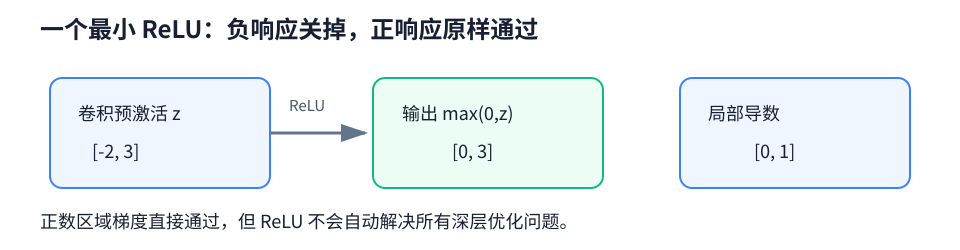

---

## 7.2 VGG：把网络设计变成“重复积木”

### VGG 块的规则

典型 VGG 块执行：

1. 若干个 $3\times3$、padding 1 的卷积，每个后接 ReLU；
2. 一个 $2\times2$、stride 2 的最大池化；
3. 块内保持高宽，块末将高宽减半；
4. 随着空间变小，通道数通常增加。

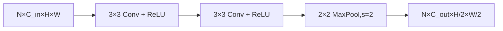

代码中用一个配置表就能改变网络：

```python
configuration = ((1, 32), (1, 64), (2, 128), (2, 256))
```

每个二元组表示“这个块有几层卷积、输出多少通道”。把重复模式封装为函数，不只是少写几行代码，而是让架构可以被系统地比较和缩放。

### 为什么偏爱连续小核

两层 stride 1 的 $3\times3$ 卷积具有 $5\times5$ 感受野。若输入输出通道都近似为 $C$，忽略偏置：

- 一层 $5\times5$ 参数：$25C^2$；
- 两层 $3\times3$ 参数：$18C^2$。

连续小核通常参数更少，而且中间多一次非线性。但这只是常见设计理由，不代表在所有硬件、所有任务上两层小核都必然更快或更好。实际速度还受内存访问、并行实现和通道配置影响。

### VGG 留下的更持久遗产

VGG 本身的全连接头很重，但“重复标准块，阶段间下采样并升通道”的设计语言影响深远。看到现代 backbone 中的 stage，可以把它理解为 VGG 模块化思想的延续与改进。

### 新手例子：两层小核为什么能看见 5×5

- **问题/小输入**：输入、输出通道都取 `C=8`，比较一层 `5×5` 与两层 stride=1 的 `3×3`，忽略偏置。
- **逐步过程**：第一层 `3×3` 看 3 格范围，第二层再向四周扩 1 格，感受野成为 `5×5`；参数分别为 `25×8×8` 与 `2×9×8×8`。
- **具体输出**：单层大核有 1600 个权重，两层小核有 1152 个；合适 padding 下二者高宽相同。
- **说明什么**：连续小核能用更少参数得到同级感受野，中间还多一次非线性。
- **常见误解**：参数少就必然实际运行更快；两层有两次派发和中间激活，真实延迟还受硬件实现影响。

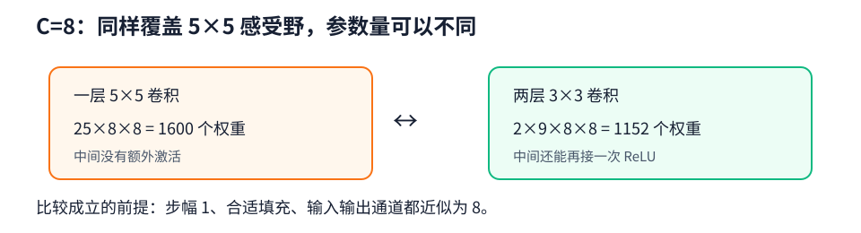

---

## 7.3 NiN：在每个像素位置上再放一个小网络

### 普通卷积后为什么还需要 1×1

普通卷积对局部窗口做一次线性加权，再接激活。NiN 块在空间卷积后接多个 $1\times1$ 卷积，相当于对每个空间位置的通道向量应用共享的小型多层感知机：

$$
\mathbf h_{i,j}^{(1)}=\sigma(W_1\mathbf x_{i,j}+b_1),\qquad
\mathbf h_{i,j}^{(2)}=\sigma(W_2\mathbf h_{i,j}^{(1)}+b_2)
$$

它没有扩大空间感受野，却增强了同一位置上的通道组合能力。


### 全局平均池化怎样替代大型全连接层

NiN 的末端让输出通道数等于类别数。若最后特征为 `(N,C,H,W)`，全局平均池化计算：

$$
z_{n,c}=\frac{1}{HW}\sum_{i=1}^{H}\sum_{j=1}^{W}X_{n,c,i,j}
$$

输出变成 `(N,C)`，每个类别通道只剩一个全局平均分数。好处是参数极少、输入尺寸更灵活，也让“通道—类别”的对应更直接。

代价是分类头的自由度被强约束。如果空间布局对任务很关键，过早全局平均可能丢掉有用信息。它是有目的的结构选择，不是无条件优于全连接层。

### 新手例子：两个类别通道怎样直接变成 logits

- **问题/小输入**：最后特征有两个 `2×2` 通道，类别 0 为 `[[1,3],[2,0]]`，类别 1 为 `[[0,0],[2,2]]`。
- **逐步过程**：全局平均池化分别把四格求和再除 4，得到 `6/4` 和 `4/4`。
- **具体输出**：logits 为 `[1.5,1.0]`，argmax 预测类别 0；输入 `(1,2,2,2)` 变为 `(1,2)`。
- **说明什么**：当最后通道数等于类别数时，每个通道可看作该类在各位置的证据图，GAP 只做空间平均且不新增参数。
- **常见误解**：GAP 会把通道也平均成一个数；它只消去 H、W，每个通道各保留一个平均值。

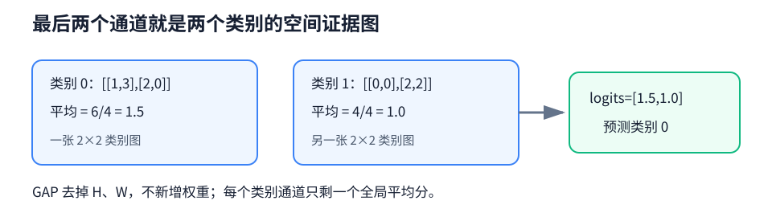

---

## 7.4 GoogLeNet：不知道选哪个尺度，就让多个尺度并行

### Inception 块在做什么

一张图中可能同时有细线、小纹理和大物体。单一路径必须预先决定卷积核大小；Inception 块让不同路径并行处理同一个输入：

- $1\times1$ 卷积分支；
- $1\times1$ 降维后接 $3\times3$；
- $1\times1$ 降维后接 $5\times5$；
- $3\times3$ 池化后接 $1\times1$。

所有分支保持相同 $H,W$，最后沿通道维拼接：

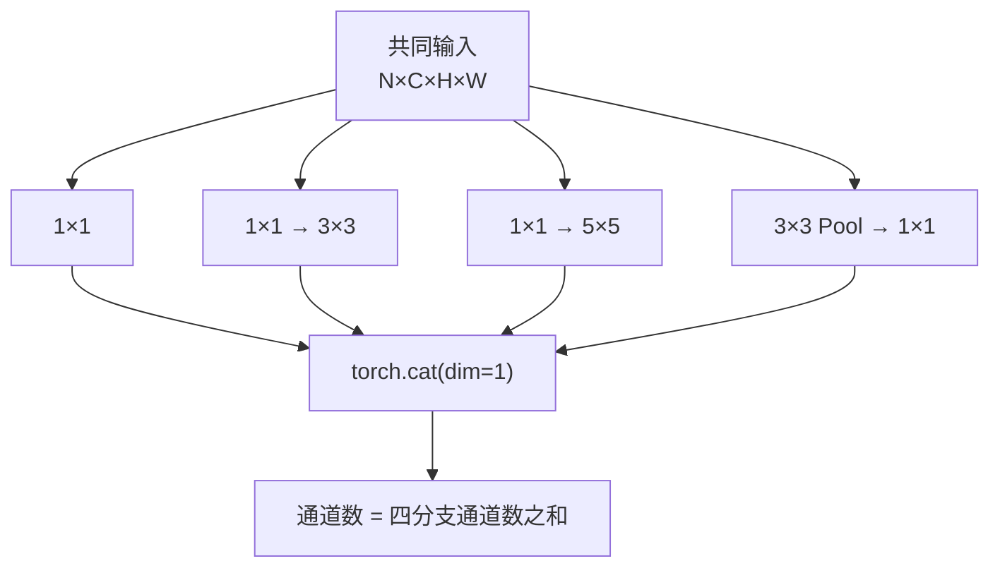

若四条分支分别输出 $c_1,c_2,c_3,c_4$ 个通道，则：

$$
C_{out}=c_1+c_2+c_3+c_4
$$

这里是 `cat`，不是 `+`。拼接要求高宽相同，通道可以不同；残差相加则要求整个 Shape 一致。

### 1×1 降维为什么能省很多计算

假设输入 192 通道，要得到 64 个 $3\times3$ 输出通道：

- 直接卷积：$192\times64\times3\times3=110592$ 个权重；
- 先用 $1\times1$ 压到 32 通道，再做 $3\times3$：
  $192\times32+32\times64\times3\times3=24576$ 个权重。

忽略偏置后只需原来的约 22%。降维也可能损失信息，所以中间通道数是需要验证的容量—成本权衡。

### 并行不等于免费

Inception 把“选哪种核”转化为“给各分支多少通道”。它提升多尺度表达，也增加分支设计和 Shape 管理复杂度。现代硬件上，理论 FLOPs 少不一定代表真实延迟最低，因为分支调度和内存访问同样影响速度。

### 新手例子：四个分支到底怎样拼

- **问题/小输入**：共同输入 `(1,16,8,8)`；四分支输出通道分别为 4、6、8、2，padding 使高宽都保持 `8×8`。
- **逐步过程**：沿 `dim=1` 做 `torch.cat`，批量维和高宽不变，只把四段通道接在一起。
- **具体输出**：通道数 `4+6+8+2=20`，输出 Shape `(1,20,8,8)`。
- **说明什么**：Inception 用通道拼接保留不同尺度分支的全部结果，下一层同时读取它们。
- **常见误解**：把 `cat` 写成逐元素 `+`；相加要求四路整个 Shape 一致，且输出通道不会变成总和。

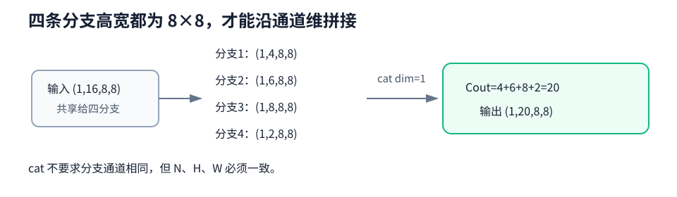

---

## 7.5 批量规范化：让中间激活保持可训练的尺度

### 公式每一项在做什么

对一个 mini-batch 中的某个特征维度：

$$
\mu_B=\frac{1}{m}\sum_{i=1}^{m}x_i,
\qquad
\sigma_B^2=\frac{1}{m}\sum_{i=1}^{m}(x_i-\mu_B)^2
$$

$$
\hat x_i=\frac{x_i-\mu_B}{\sqrt{\sigma_B^2+\epsilon}},
\qquad
y_i=\gamma\hat x_i+\beta
$$

- 减均值：把当前特征移到 0 附近；
- 除标准差：控制尺度；
- $\epsilon$：避免方差极小时除零；
- $\gamma,\beta$：可学习缩放和平移，保留模型恢复合适分布的能力。

### 卷积 BN 到底沿哪些维统计

输入为 `(N,C,H,W)` 时，`BatchNorm2d(C)` 为每个通道独立统计，对 `(N,H,W)` 三个维度求均值和方差。因此均值、方差、$\gamma$、$\beta$ 各有 $C$ 个，而不是每个像素位置一套参数。

全连接输入 `(N,D)` 的 BN 通常沿 N 统计，每个特征维 D 独立处理。

### 训练态与评估态不是同一套统计

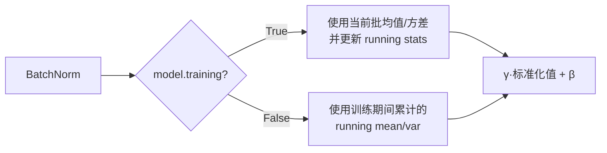

训练时使用当前批次统计量，并更新运行均值与方差；评估时使用运行统计量，使单样本推理也有稳定结果。因此验证前忘记 `model.eval()` 会造成指标波动，尤其在批量很小时更明显。

### 常见放置顺序与边界

常用顺序是 `Conv(bias=False) → BatchNorm → ReLU`。BN 自带可学习平移 $\beta$，所以前面的卷积偏置常可省略。

BN 不是“任何模型都必须加”的魔法层：

- 批量太小时，统计量噪声大；
- 训练与推理数据分布偏移时，运行统计可能失配；
- 它不会自动解决标签错误、过拟合或错误学习率；
- 序列和生成模型中还常使用 LayerNorm 等替代方案。

配套代码的 `check_batch_norm()` 直接按公式对 `(N,C,H,W)` 手算训练态输出，再与 `F.batch_norm` 数值对齐。

### 新手例子：两个数完整走一遍 BN

- **问题/小输入**：一个特征的小批量值 `x=[1,3]`；为方便手算取 `epsilon=0`、`gamma=2`、`beta=0.5`。
- **逐步过程**：均值为 2，方差为 `((1-2)^2+(3-2)^2)/2=1`；标准化后 `[-1,1]`；再乘 2、加 0.5。
- **具体输出**：`[-1.5,2.5]`。真实代码使用正 epsilon，数值会非常接近而非完全相同。
- **说明什么**：标准化控制当前特征尺度，gamma/beta 又让模型能学习合适的缩放和平移。
- **常见误解**：训练和评估总用当前批统计；`eval()` 下应使用训练累计的 running mean/var，单样本也能稳定推理。

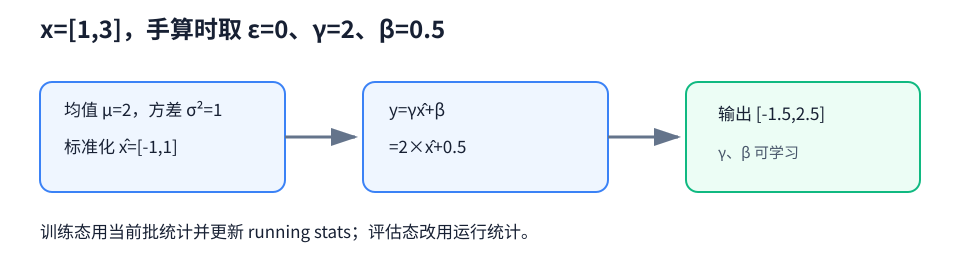

---

## 7.6 ResNet：让深层网络至少容易学会“什么都别改”

### 深度增加为什么可能让训练误差反而变高

更深模型理论上可以把新增层学成恒等映射，从而至少不差于浅模型。但普通堆叠结构未必容易通过优化找到恒等映射。训练误差随深度恶化不一定是过拟合，因为过拟合通常表现为训练误差低、验证误差高；这里连训练集都更难拟合。

### 残差块改学“改变量”

希望得到目标映射 $H(x)$。普通层直接拟合 $H(x)$；残差块改为拟合：

$$
F(x)=H(x)-x,
\qquad
H(x)=F(x)+x
$$

若最合理的操作是保持输入，残差分支只需把 $F(x)$ 学到接近 0。

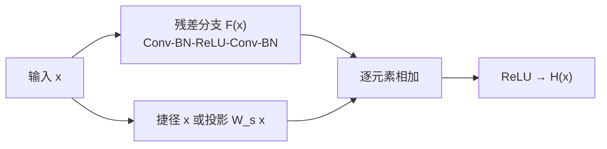

从梯度角度，若 $y=F(x)+x$：

$$
\frac{\partial y}{\partial x}=\frac{\partial F(x)}{\partial x}+I
$$

恒等项 $I$ 提供了一条直接路径。它不保证梯度永不爆炸或消失，但显著改善了很深网络的优化条件。

### 什么时候捷径需要 1×1 投影

只有 `F(x)` 与捷径输出 Shape 完全相同才能相加。若主路通过 stride 2 把空间减半，或改变通道数，捷径必须同步对齐：

```python
nn.Conv2d(C_in, C_out, kernel_size=1, stride=stride)
```

$1\times1$ 投影负责改变通道，stride 负责改变高宽。若 Shape 已一致，使用 `nn.Identity()` 最直接。

### 相加与拼接不要混为一谈

- ResNet：`residual + shortcut`，Shape 相同，通道数不增加；
- Inception/DenseNet：`torch.cat(..., dim=1)`，高宽相同，通道数相加。

这个区别会直接影响后续层输入通道与参数量。

### 新手例子：残差是加回去，不是接在后面

- **问题/小输入**：捷径输入 `x=[2,-1]`，残差分支输出 `F(x)=[0.5,1]`，两者 Shape 都是 `(2,)`。
- **逐步过程**：逐元素相加得到 `[2+0.5,-1+1]=[2.5,0]`；再经过 ReLU。
- **具体输出**：`[2.5,0]`，Shape 仍为 `(2,)`。
- **说明什么**：主路学习的是对原输入的改变量；若最优是恒等映射，只需让 `F(x)` 接近 0。
- **常见误解**：残差连接沿通道拼接成长度 4；ResNet 用 `+`，只有通道或高宽不同时才先用 `1×1` 投影对齐。

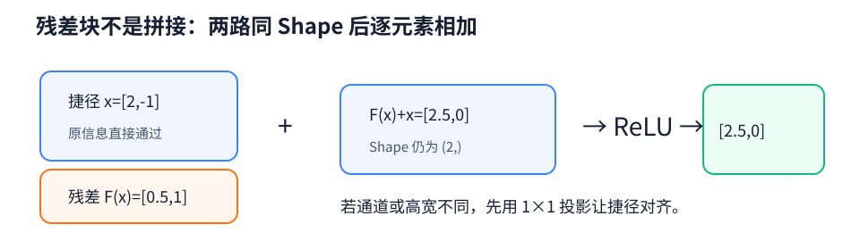

---

## 7.7 DenseNet：不是把旧特征覆盖掉，而是全部带到后面

### 稠密块怎样连接

设第 0 层输入为 $x_0$，后续各层：

$$
x_\ell=H_\ell([x_0,x_1,\ldots,x_{\ell-1}])
$$

$[\cdot]$ 表示沿通道拼接。第 $\ell$ 层能直接读取块内所有历史特征，它只生成 $k$ 个新通道，$k$ 叫增长率（growth rate）。

若块输入通道为 $C_0$，经过 $L$ 层后：

$$
C_{out}=C_0+Lk
$$

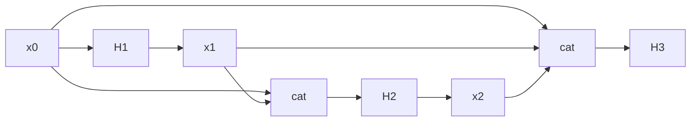

这种连接促进特征复用，也为梯度提供短路径；但拼接使通道不断增长，中间激活的内存开销可能很高。

### 过渡层为什么不可少

DenseBlock 内通常不改变空间尺寸，只增加通道。过渡层常执行：

1. `BatchNorm + ReLU`；
2. $1\times1$ 卷积压缩通道；
3. $2\times2$ 平均池化把高宽减半。

它像“整理站”：控制通道膨胀并完成阶段间下采样。

### ResNet 与 DenseNet 的核心差异

| 对比 | ResNet | DenseNet |
| --- | --- | --- |
| 融合方式 | 逐元素相加 | 沿通道拼接 |
| 后续通道 | 通常不因捷径增加 | 每层按增长率增加 |
| 信息观念 | 学习对输入的修正 | 保留并复用所有历史特征 |
| Shape 要求 | 相加两路 Shape 完全相同 | 拼接各路 H、W 相同 |
| 主要成本 | 深层计算 | 中间激活和拼接内存 |

两者都改善信息与梯度流，但不是同一种连接换了名字。

### 新手例子：增长率怎样让通道逐层增加

- **问题/小输入**：DenseBlock 输入通道 `C0=6`，有 3 层，每层增长率 `k=4`，高宽始终相同。
- **逐步过程**：第 1 层只产生 4 个新通道，与旧 6 通道拼成 10；后两层依次拼成 14、18。
- **具体输出**：块输出通道 `6+3×4=18`；每一层的输入通道分别是 6、10、14。
- **说明什么**：DenseNet 保留历史特征，每层只贡献 k 个新特征，通道增长可精确追踪。
- **常见误解**：每层会用新 4 通道覆盖旧通道；实际是沿通道拼接，正因不断保留才需要过渡层控制内存和通道数。

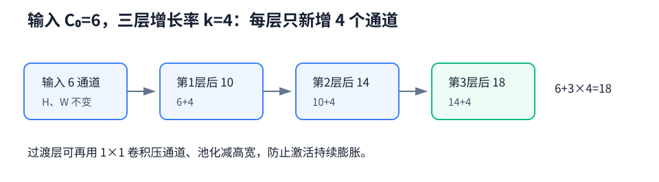

---

## 七种思想放在同一张表里

| 名称 | 基本单元 | 特征融合 | 分类头倾向 | 最值得带走的思想 |
| --- | --- | --- | --- | --- |
| AlexNet | 大规模卷积堆叠 | 串行 | 大型全连接 | 表征学习可在大数据上胜任视觉 |
| VGG | 重复 $3\times3$ 块 | 串行 | 传统全连接 | 用规则模块管理深度 |
| NiN | 空间卷积 + $1\times1$ | 串行通道变换 | 全局平均 | 每个位置也可有小型网络 |
| GoogLeNet | Inception | 多分支 `cat` | 全局平均 | 多尺度并行与瓶颈降维 |
| BatchNorm | 规范化层 | 不适用 | 不适用 | 管理激活尺度和训练/推理统计 |
| ResNet | 残差块 | `+` | 全局平均 | 学残差、建捷径 |
| DenseNet | 稠密块 | `cat` 全部历史 | 全局平均 | 显式特征复用 |

---

## 完整代码：不是只看 `nn.Sequential`

[打开 `modern_cnn_blocks.py`](../code/ch07/modern_cnn_blocks.py)

这份程序没有下载大型数据集，而是把每种架构缩小到 CPU 可快速运行的规模。每个模型都接受 `(N,1,64,64)`，输出 `(N,10)`。它验证的不是 ImageNet 准确率，而是以下机制真的连通：

- 卷积/池化的 Shape；
- Inception 分支通道拼接；
- ResNet 主路与捷径相加；
- DenseNet 历史特征拼接和通道增长；
- BatchNorm 公式与框架输出一致；
- logits → loss → 清梯度 → 反向 → 更新 → 评估的完整链路。

### 模块与章节对应

| 代码对象 | 对应概念 | 最值得读的语句 |
| --- | --- | --- |
| `AlexNetSmall` | ReLU、最大池化、Dropout 全连接头 | `model.train()/eval()` 对 Dropout 的影响 |
| `vgg_block` | 重复小卷积块 | 循环中如何更新 `channels_in` |
| `nin_block` | 逐位置通道 MLP | 连续 `Conv2d(..., kernel_size=1)` |
| `Inception` | 多尺度并行 | `torch.cat(outputs, dim=1)` |
| `check_batch_norm` | BN 公式 | 对 `(0,2,3)` 求均值、方差 |
| `Residual` | 恒等/投影捷径 | `residual + shortcut` |
| `DenseBlock` | 所有历史特征复用 | `torch.cat(features, dim=1)` |
| `transition_block` | 压通道与下采样 | $1\times1$ 卷积 + 平均池化 |

### 一次训练步逐行理解

```python
features = torch.randn(2, 1, 64, 64).to(device)  # 合成图像，NCHW
targets = torch.randint(0, 10, (2,)).to(device)   # long 类别索引
model.train()                                      # BN/Dropout 进入训练态
logits = model(features)                           # 前向，Shape=(2,10)
loss = loss_fn(logits, targets)                    # 交叉熵直接接 logits
optimizer.zero_grad(set_to_none=True)              # 清除历史梯度
loss.backward()                                    # 计算并写入 .grad
optimizer.step()                                   # 真正更新参数
```

程序在 `step()` 前复制第一组参数，更新后比较两者，避免只看到“没报错”就误以为训练有效。随后：

```python
model.eval()
with torch.inference_mode():
    evaluated = model(features)
```

这里让 Dropout 停止随机屏蔽，让 BN 使用运行统计量，并关闭 autograd 记录。

### 运行方式

```bash
# 一次检查全部六种模型
python code/ch07/modern_cnn_blocks.py --model all --device cpu

# 只检查一个模型
python code/ch07/modern_cnn_blocks.py --model resnet
python code/ch07/modern_cnn_blocks.py --model densenet
```

预期看到每个模型的参数量、输出 Shape、单步损失和“更新通过”。随机合成标签没有真实可学习规律，因此损失不代表模型优劣；这只是结构与训练链路 smoke test。

---

## 常见坑与排错顺序

### 1. Inception 在 `cat` 时报高宽不一致

逐分支打印 Shape。若 stride 都是 1，则 $3\times3$ 要 padding 1，$5\times5$ 要 padding 2，池化要 padding 1，才能保持相同 H、W。`cat(dim=1)` 只允许通道维不同。

### 2. 残差相加时报尺寸不匹配

检查主路是否改变了 stride 或通道。只要 `(C,H,W)` 任一改变，捷径就需投影；通常用带相同 stride 的 $1\times1$ 卷积。不能用 `cat` 临时绕过，因为那会改变残差块定义和后续通道数。

### 3. DenseBlock 后下一层通道数写错

使用公式 `C_out = C_in + num_layers * growth_rate`。DenseLayer 返回的是“新增特征”，DenseBlock 输出才是“旧特征与所有新增特征”的拼接。

### 4. BN 训练正常，单张推理结果却异常

确认保存与加载了 `running_mean`、`running_var`，并在推理前 `model.eval()`。还要确认训练与推理预处理一致；运行统计无法修复数据分布完全变化。

### 5. batch size 很小时 BN 指标波动

小批量均值与方差噪声较大。可尝试更大批量、冻结 BN、累积更可靠统计，或根据任务改用 GroupNorm/LayerNorm。不要通过在验证时保留训练态来“提高指标”，那会让样本相互影响并产生不可靠评估。

### 6. 网络加深后训练损失更差

先排除学习率、初始化、归一化和 Shape 错误，再观察梯度范数。残差连接改善优化，但不会替代正确训练配置，也不能修复数据与标签问题。

### 7. 参数量不多，显存却很高

显存还要保存中间激活供反向使用。DenseNet 的拼接、较大输入分辨率和晚下采样都会增加激活占用。降低 batch size、输入尺寸或增长率，比只盯着参数量更有效。

### 8. 用参数量直接判断速度

参数少不保证延迟低。并行分支、频繁小算子、特征拼接和内存访问都可能成为瓶颈。实际部署要在目标硬件上测吞吐、延迟、显存和精度。

---

## 主动回忆：先遮住答案再作答

建议分两轮：第一次回答 1～10，隔一天回答 11～20。回答时至少写出一个因果词，例如“因为”“所以”“如果……则……”。

<details>
<summary>1. AlexNet 相比 LeNet，最值得记住的变化有哪些？</summary>

它把 CNN 扩展到更大数据和更真实视觉任务，网络更深更宽，使用 ReLU、最大池化、Dropout 和数据增强，并借助 GPU 训练。核心意义是证明多层网络能端到端学习有效视觉表征，而不只是增加了几层卷积。

</details>

<details>
<summary>2. 为什么 `model.eval()` 与 `torch.inference_mode()` 不能互相替代？</summary>

`eval()` 改变 Dropout、BatchNorm 等层的行为，但不会关闭梯度记录；`inference_mode()` 关闭 autograd 相关开销，却不会把层切到评估态。可靠推理通常两者一起使用。

</details>

<details>
<summary>3. 两层 3×3 卷积与一层 5×5 卷积相比，有哪些常见优势？</summary>

两者感受野都可达到 5×5。在近似相同通道数下，两层 3×3 权重约为 $18C^2$，少于 5×5 的 $25C^2$，且中间多一次非线性。真实速度与效果仍受硬件、通道和任务影响，不能只凭公式下绝对结论。

</details>

<details>
<summary>4. VGG 块为什么通常在块末池化、同时逐阶段增加通道？</summary>

块内保持高宽便于重复同样的卷积模板，块末统一下采样形成清晰 stage。空间位置减少后增加通道，可用更多特征种类描述更抽象信息，同时控制总体计算量；这是一种常见容量分配策略。

</details>

<details>
<summary>5. NiN 中连续 1×1 卷积到底增加了什么能力？</summary>

它们在每个空间位置对通道向量做共享的线性变换与非线性激活，增强通道之间的组合能力。它们不会扩大空间感受野，因此仍需前面的空间卷积读取邻域。

</details>

<details>
<summary>6. 全局平均池化如何把 `(N,C,H,W)` 变成分类输出？</summary>

它对每个样本、每个通道的全部 H×W 位置求平均，得到 `(N,C)`。如果末层通道数 C 等于类别数，每个通道的平均响应就可直接作为对应类别分数，避免大型全连接头。

</details>

<details>
<summary>7. Inception 四分支为什么能在通道维拼接？输出通道怎么算？</summary>

所有分支通过合适的 padding 和 stride 保持相同 N、H、W，因此允许在 `dim=1` 拼接。若分支输出通道分别为 $c_1,c_2,c_3,c_4$，最终通道为四者之和。

</details>

<details>
<summary>8. Inception 的大核分支前为什么先放 1×1 卷积？</summary>

$1×1$ 先压缩输入通道，使后续 $3×3$ 或 $5×5$ 卷积处理更少通道，从而显著减少参数和计算；它还能学习哪些通道组合应送入该尺度分支。压得过窄会损失容量，所以中间通道需调节。

</details>

<details>
<summary>9. `torch.cat` 与逐元素 `+` 的 Shape 规则有什么不同？</summary>

沿通道 `cat` 要求 N、H、W 一致，通道可以不同，输出通道相加；逐元素相加要求整个 Shape 一致，输出 Shape 不变。Inception/DenseNet 主要拼接，ResNet 主要相加。

</details>

<details>
<summary>10. BatchNorm 中为什么标准化以后还需要可学习的 γ 和 β？</summary>

固定零均值、单位方差可能限制该层需要的表示。$\gamma$ 和 $\beta$ 允许模型重新选择每个特征的尺度与中心；必要时甚至可恢复某种原分布，因此规范化不是强迫所有最终激活永远标准化。

</details>

<details>
<summary>11. 对 `(N,C,H,W)` 使用 BatchNorm2d 时，均值和方差沿哪些维计算？</summary>

每个通道独立，对 N、H、W 三个维度统计。因此一共有 C 组均值与方差，$\gamma$、$\beta$ 也各有 C 个。它不会为每个像素坐标单独维护参数。

</details>

<details>
<summary>12. BN 训练态与评估态分别使用什么统计量？</summary>

训练态用当前 mini-batch 的均值和方差完成标准化，并更新运行统计；评估态用训练期间累计的 running mean/variance。这样单样本推理不必依赖当前批次的其他样本，结果也更稳定。

</details>

<details>
<summary>13. 为什么 Conv-BN 组合中卷积常写 `bias=False`？</summary>

卷积偏置会在后续 BN 减均值时被抵消，而 BN 自己有可学习平移参数 $\beta$。因此卷积偏置通常冗余，关掉可少一些参数；如果卷积后没有相应 BN，则不能照搬这个规则。

</details>

<details>
<summary>14. ResNet 为什么说是在学习残差 F(x)，而不是直接学习 H(x)？</summary>

块输出被写成 $H(x)=F(x)+x$，主路只负责学习目标映射相对输入的改变量 $F(x)=H(x)-x$。若最佳映射接近恒等，主路只需趋近零，比普通层显式拟合恒等通常更容易优化。

</details>

<details>
<summary>15. 残差捷径什么时候必须使用 1×1 投影？</summary>

当主路改变通道数或通过 stride 改变空间尺寸时，原始 x 无法与 F(x) 逐元素相加。捷径用相同 stride 的 $1×1$ 卷积对齐 `(C,H,W)`；Shape 已相同时可直接使用 Identity。

</details>

<details>
<summary>16. 残差连接为何有利于梯度传播？</summary>

对 $y=F(x)+x$，局部导数包含 $\partial F/\partial x+I$，恒等项提供直接路径，使梯度不必完全穿过残差分支的所有变换。它改善优化条件，但不保证任何配置下都没有梯度爆炸或消失。

</details>

<details>
<summary>17. DenseBlock 输入通道 24、4 层、growth rate 12，输出多少通道？</summary>

每层只新增 12 个通道，旧特征全部保留并拼接，所以输出为 $24+4×12=72$ 通道。第 4 层本身收到的输入则是 $24+3×12=60$ 通道。

</details>

<details>
<summary>18. DenseNet 的过渡层负责哪两种压缩？</summary>

$1×1$ 卷积压缩通道维，平均池化压缩空间高宽。它控制稠密块持续拼接造成的通道膨胀，并在阶段之间完成下采样。

</details>

<details>
<summary>19. ResNet 和 DenseNet 都有短连接，它们最本质的差异是什么？</summary>

ResNet 用相加把新旧表示融合，通道通常不因捷径增长，强调学习对输入的修正；DenseNet 用拼接保留所有历史表示，通道随层数按增长率增加，强调显式特征复用。因此它们的 Shape 规则和内存行为不同。

</details>

<details>
<summary>20. 为什么 smoke test 通过不能说明模型在真实数据上有效？</summary>

smoke test 只能确认导入、Shape、前向、损失、梯度和参数更新链路能运行，可能再排除 NaN/Inf。随机或简单合成数据不覆盖真实分布、泛化、类别不平衡和训练预算；模型优劣仍需正确数据划分、指标和可复现实验验证。

</details>

---

### 面试八股加练：不能只背结论

<details>
<summary>21. 【八股深答】BatchNorm 训练态和评估态为什么必须区分？</summary>

**结论：**训练态用当前 mini-batch 统计量并更新运行统计；评估态用累计的 running mean/variance，避免预测依赖同批其他样本。**机制：**同一样本在训练态会随同批样本改变归一化结果，运行统计用于近似总体分布。**工程影响：**验证前必须 `eval()`；小 batch 时统计噪声大，可考虑 LayerNorm、GroupNorm 或冻结 BN。**误区：**关闭梯度不等于切到评估态，`no_grad()` 不会改变 BN 统计行为。**追问：**γ、β 让归一化后仍能学习合适尺度和平移，避免表达能力被强行限制。

</details>

<details>
<summary>22. 【八股深答】残差连接为什么有助于深层网络优化？</summary>

**结论：**它给信息和梯度提供一条近似恒等的短路径，让新增层至少容易学成“不要改动”。**机制：**若 $y=x+F(x)$，反向有 $\partial y/\partial x=I+\partial F/\partial x$，梯度不必完全依赖多层乘积。**工程影响：**相加前 Shape 必须一致，不一致时用 1×1 投影；残差改善可优化性但不保证不爆炸或必然泛化更好。**误区：**不能简单说梯度“完全不衰减”，因为后续层、归一化和 $F$ 分支仍影响整体 Jacobian。**追问：**pre-norm 与 post-norm 的梯度路径不同，是 Transformer 中常见延伸问题。

</details>

<details>
<summary>23. 【八股深答】Inception 的拼接与 ResNet 的相加有何本质不同？</summary>

**结论：**拼接保留各分支特征并增加通道，相加要求同 Shape 并把分支融合到同一表示空间。**机制：**`cat(dim=1)` 的输出通道是各分支通道之和；逐元素加法输出 Shape 不变。**工程影响：**Inception 后续层输入通道要按总和计算，ResNet 投影则要对齐通道和步幅。**误区：**两者都叫多分支，但不能互换，否则参数量、内存和信息组合方式都会变化。**追问：**DenseNet 也用通道拼接，但它跨层累积所有先前特征，内存增长更明显。

</details>

## 学完本章应该能做到

- 看到模型名时先说出“解决的问题”和“核心连接”，而不是只背层数；
- 独立写出 VGG、NiN、Inception、Residual、DenseBlock 的最小版本；
- 对 Inception 的拼接与 ResNet 的相加提前判断 Shape；
- 解释 BN 在训练和评估时为何行为不同；
- 用公式算出 $1×1$ 瓶颈节省的参数、DenseBlock 增长后的通道；
- 跑通完整代码，并用参数前后对比证明 `optimizer.step()` 生效。

下一章会把关注点从二维空间移向序列：输入不再只有“哪里”，还多了“先后顺序”，模型需要携带随时间变化的隐藏状态。

[上一章：卷积神经网络](ch06-convolutional-neural-networks.md) · [下一章：循环神经网络](ch08-recurrent-neural-networks.md) · [返回总目录](../README.md)
