# 第 8 章：循环神经网络

> 复习定位：从“样本彼此独立”走向“当前判断依赖过去”  
> 内容脉络：8.1–8.7 · PyTorch · 离线可运行  
> 原创学习笔记，章节顺序参考[《动手学深度学习》官方目录](https://zh.d2l.ai/chapter_recurrent-neural-networks/index.html)

[时间序列完整代码](../code/ch08/sequence_forecasting.py) · [字符 RNN 完整代码](../code/ch08/char_rnn_language_model.py)

## 一句话主线

RNN 的核心不是“网络里画了一个圈”，而是：**用同一套参数反复读取序列，把截至当前时刻的信息压进隐状态，再用这个状态预测下一步；训练时把计算图沿时间展开，让误差穿过这些重复步骤向后传播。**

## 本章地图

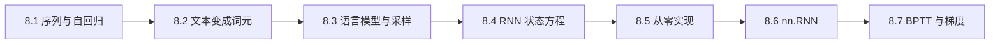

| 学习类型 | 本章应该掌握什么 |
| --- | --- |
| 要记住 | 输入/状态/输出的 Shape，困惑度定义，随机采样与顺序采样的状态策略 |
| 要推出来 | 序列标签右移一位、RNN 状态方程、BPTT 中连乘导致梯度消失或爆炸 |
| 要亲手实现 | 滞后特征、字符词表、RNN 前向、状态截断、梯度裁剪、自回归预测 |

---

## 8.1 序列模型：顺序本身就是信息

### 重新打开时先看这里

- **本节位置**：先认识序列数据和自回归预测，还没有进入 RNN。
- **核心直觉**：普通回归把每个样本当成互不相干的照片；序列模型处理的是录像，当前帧与前后帧有关。
- **数学与 Shape**：过去 <code>tau</code> 个数形成一个 <code>(B,tau)</code> 特征批，下一时刻是 <code>(B,1)</code> 标签。
- **代码落点**：<code>make_lagged_dataset</code> 用滑动窗口把一条序列改造成监督学习数据。
- **复习闭环**：不看答案，画出长度 6、窗口 3 时的全部输入和标签。
- **忘记后的排查顺序**：先看时间索引 → 再看窗口终点 → 再查训练/测试是否按时间切分。

### 为什么不能继续假设独立同分布

图像分类中，打乱两张图片的先后顺序通常不改变各自标签；但把“我 / 喜欢 / 学习”打乱成“学习 / 我 / 喜欢”，语义已经变化。时间序列、文字、音频、视频与用户行为都包含这种顺序依赖。

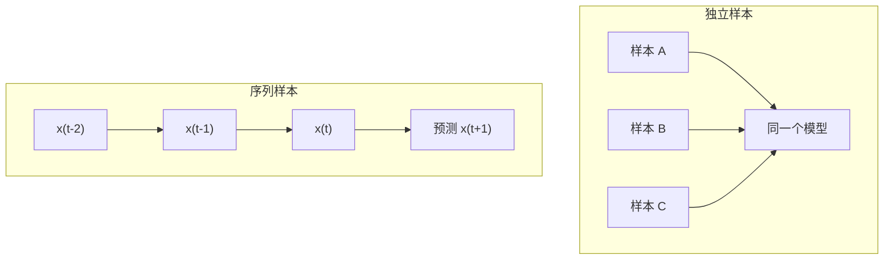

序列建模最朴素的做法是只看固定长度的过去：

$$
\hat{x}_t=f(x_{t-1},x_{t-2},\ldots,x_{t-\tau}).
$$

$\tau$ 叫时间窗口或滞后长度。它把无限历史近似成有限历史，也把序列问题变成普通监督学习问题。

假设原序列为：

~~~text
10, 12, 15, 14, 18, 20
~~~

取 <code>tau=3</code> 后：

| 特征 X | 标签 y |
| --- | --- |
| [10, 12, 15] | 14 |
| [12, 15, 14] | 18 |
| [15, 14, 18] | 20 |

代码中：

~~~python
windows = series.unfold(0, tau + 1, 1)  # (N-tau, tau+1)
features = windows[:, :-1]              # (N-tau, tau)
labels = windows[:, -1:]                 # (N-tau, 1)
~~~

标签使用 <code>-1:</code> 而不是 <code>-1</code>，是为了保留最后一维，保证预测和标签都是 <code>(B,1)</code>。若一个是 <code>(B,1)</code>、另一个是 <code>(B,)</code>，相减会静默广播成 <code>(B,B)</code>，训练对象就变成批内两两误差。

### 单步预测和多步预测不是同一道题

- **单步预测**：每次拿真实历史预测下一点。
- **递归多步预测**：第一步之后没有未来真值，只能把自己的预测塞回窗口。
- **直接多步预测**：模型一次输出未来 $k$ 步，输出 Shape 为 <code>(B,k)</code>。

递归预测会累积误差：第一步偏一点，第二步收到的输入就已经不是训练时的真实数据，后续偏差可能越来越大。因此训练损失很好，不等于远期预测一定好。

### 为什么按时间切分数据

若先随机打乱所有窗口再划分，高度重叠的窗口可能分散到训练集与测试集，训练数据还可能间接包含测试时刻之后的信息。基础做法是较早时间训练、较晚时间验证和测试；严谨调参可使用滚动验证。

完整程序：[sequence_forecasting.py](../code/ch08/sequence_forecasting.py)

~~~bash
python code/ch08/sequence_forecasting.py --epochs 120
~~~

程序同时报告单步与递归多步 MSE。重点不是追求固定数值，而是观察“把自己的答案重新当输入”怎样放大误差。

### 新手例子：窗口 3 怎样把一条序列变成监督数据

- **小输入**：序列 `[10, 12, 15, 14, 18]`，滞后长度 `tau=3`。
- **逐步过程**：先滑出长度为 `tau+1=4` 的窗口：`[10,12,15,14]`、`[12,15,14,18]`；每个窗口前三个数作为特征，最后一个数作为下一时刻标签。
- **具体输出**：`X=[[10,12,15],[12,15,14]]`，Shape 为 `(2,3)`；`y=[[14],[18]]`，Shape 为 `(2,1)`。
- **这个例子说明了什么？** 序列模型并没有凭空获得标签，而是用“过去 3 点 → 下一点”把时间顺序改写成普通监督学习样本。
- **新手最容易误解什么？** `windows[:,-1]` 会得到 `(2,)`；若预测是 `(2,1)`，二者相减会广播成 `(2,2)`。保留标签列应写 `windows[:,-1:]`。

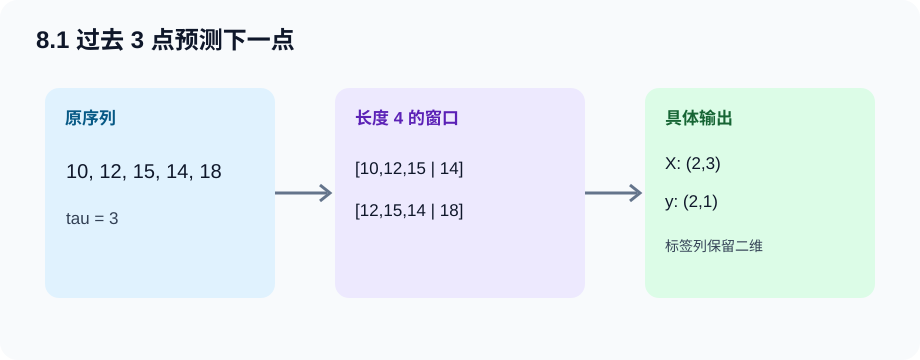

---

## 8.2 文本预处理：模型只能接收数字

### 重新打开时先看这里

- **本节位置**：把自然语言变成整数序列，是语言模型的输入管线。
- **核心直觉**：词元化决定“模型眼中的一个单位是什么”，词表决定“每个单位用哪个整数表示”。
- **数学与 Shape**：一条长度为 $T$ 的字符序列先变成 <code>(T,)</code> 索引，成批后为 <code>(B,T)</code>。
- **代码落点**：<code>CharVocab.encode/decode</code>。
- **复习闭环**：手算一个短词的索引与反向解码。
- **排查顺序**：原始字符串 → 规范化 → 词元列表 → 词表索引 → 批量 Shape。

### 字符、单词还是子词

| 粒度 | 优点 | 代价 |
| --- | --- | --- |
| 字符 | 词表小、几乎没有未登录词、教学直观 | 序列很长，一个字符语义弱 |
| 单词 | 单位语义清晰、序列较短 | 词表巨大，稀有词和未登录词严重 |
| 子词 | 在词表大小与表达能力之间折中 | 分词算法与反切分更复杂 |

本章采用字符级模型，让注意力集中在 RNN 机制。真实 NLP 系统通常使用 BPE、WordPiece 等子词方案。

### 词表不只是一个集合

词表通常保存：

- <code>idx_to_token</code>：索引到词元，用于把预测结果还原为文字；
- <code>token_to_idx</code>：词元到索引，用于编码输入；
- <code>&lt;unk&gt;</code>：遇到词表外词元时的兜底索引；
- 变长批次常有 <code>&lt;pad&gt;</code>，生成任务还常有 <code>&lt;bos&gt;</code>、<code>&lt;eos&gt;</code>。

代码把字符排序后编号，使映射稳定。若无序编号，不同运行可能得到不同索引，旧 checkpoint 即使 Shape 相同也会把字符含义完全解错。

频率过滤能缩小词表、减少参数，但会丢掉低频信息。输入和输出权重都含与词表大小 $V$ 成正比的参数，因此词表选择也是内存与计算选择。

### 新手例子：五个字符怎样编码、遇到生字符怎么办

- **小输入**：固定词表 `{<unk>:0, t:1, i:2, m:3, e:4, !:5}`，待编码文本是 `time?`。
- **逐步过程**：按字符切成 `[t,i,m,e,?]`；前四个字符分别查到 `1,2,3,4`，问号不在词表，因此落到 `<unk>` 的索引 `0`。
- **具体输出**：索引序列 `[1,2,3,4,0]`，单条 Shape 为 `(5,)`；两条等长文本堆叠后为 `(2,5)`。反向解码得到 `time<unk>`。
- **这个例子说明了什么？** 词元化决定切成什么单位，词表只负责把这些单位稳定地映射成整数；两步不能混为一次操作。
- **新手最容易误解什么？** 索引 `1` 没有天然的“t”含义；只有与建模时同一份词表配套才成立。换了编号却复用旧 checkpoint，Shape 虽对，语义已经全错。

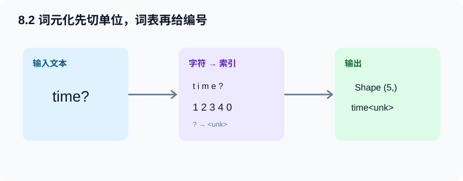

---

## 8.3 语言模型和数据集：把原句右移一位就是监督信号

### 语言模型在估计什么

一句话 $x_1,x_2,\ldots,x_T$ 的联合概率由链式法则分解为：

$$
P(x_1,x_2,\ldots,x_T)
=\prod_{t=1}^{T}P(x_t\mid x_1,\ldots,x_{t-1}).
$$

训练时不必人工标类别，只需将原序列右移一位：

~~~text
输入：t i m e _ t r a v e l l e
标签：i m e _ t r a v e l l e r
~~~

监督信号来自数据自身，所以这是自监督学习。

### n 元语法为什么会组合爆炸

若作一阶马尔可夫近似：

$$
P(x_t\mid x_1,\ldots,x_{t-1})\approx P(x_t\mid x_{t-1}),
$$

只需统计相邻词元。但看更长上下文时，$n$ 元组合数量随 $|\mathcal V|^n$ 快速增长，很多组合从未在训练语料出现。RNN 用固定维隐状态压缩可变长历史，参数量不随时间步增长，正是在绕开固定 $n$ 的表格统计。

### 自然语言频率为什么是长尾

真实语料里少数词元极常见，大量词元只出现少数几次，词频大致呈幂律长尾。统计一元、二元、三元词组时，阶数越高，可能组合越多，观测到的有效组合反而越稀疏。因此：

- 高频不等于信息量高，空格、标点、功能词往往很常见；
- 低频组合的经验概率极不可靠，需要平滑或参数共享；
- 增大语料通常会继续发现新词，词表不是天然封闭的；
- 训练批应按词元总数统计 loss，不能把长短子序列简单等权平均。

RNN 的价值之一正是参数共享：相似上下文不必对应完全独立的计数格子，而可借连续隐状态共享统计强度。

### 顺序采样与随机采样

| 对比 | 顺序采样 | 随机采样 |
| --- | --- | --- |
| 子序列关系 | 相邻批次在语料中连续 | 每批子序列起点打乱 |
| 状态策略 | 可把上一批末状态传给下一批 | 每批重新初始化状态 |
| 是否截断图 | 必须 <code>state.detach()</code> | 新状态本身没有旧图 |
| 优点 | 数值记忆可跨子序列延续 | 批间相关性低、逻辑直接 |

<code>state.detach()</code> 不是清零。它保留状态数值，只切断“这个值怎样由上一批参数算出”的计算图。忘记 detach 会让图跨批不断变长，内存与反向时间持续增长，还可能出现“第二次反向传播同一计算图”的错误。

### 对齐是最值得手算的一步

程序中 <code>X,Y</code> 都是 <code>(B,T)</code>，模型按时间优先输出 <code>(T*B,V)</code>：

~~~python
targets = Y.T.reshape(-1)        # (B,T) -> (T,B) -> (T*B,)
logits, state = model(X, state)  # (T*B,V)
loss = loss_fn(logits, targets)
~~~

不能直接写 <code>Y.reshape(-1)</code>：它按“样本 0 的全部时间，再样本 1 的全部时间”排列；前向的拼接则按“时间 0 的全部样本，再时间 1 的全部样本”排列。两者 Shape 虽相同，配对却错误。

### 新手例子：Shape 一样，标签顺序为什么仍可能错

- **小输入**：`B=2,T=3`，标签矩阵 `Y=[[b,c,d],[y,z,w]]`；模型按时间优先输出，即先放时刻 0 的两条样本，再放时刻 1、2。
- **逐步过程**：模型的 6 行依次对应 `[b,y,c,z,d,w]`。先转置得到 `[[b,y],[c,z],[d,w]]`，再展平，正好得到同一顺序。
- **具体输出**：正确标签是 `Y.T.reshape(-1)=[b,y,c,z,d,w]`；错误的 `Y.reshape(-1)=[b,c,d,y,z,w]`，两者 Shape 都是 `(6,)`。
- **这个例子说明了什么？** 交叉熵不仅要求行数相同，还要求第 `r` 行 logits 与第 `r` 个标签指向同一个“时间步、样本”位置。
- **新手最容易误解什么？** 只做 Shape 断言抓不住这种错位；应给每个位置放不同的可读符号，手工核对展平顺序。

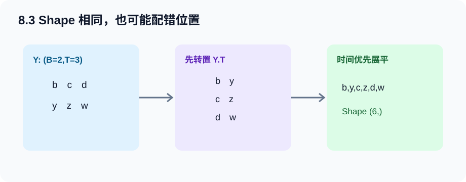

---

## 8.4 循环神经网络：同一套参数反复更新记忆

普通隐藏层只根据当前输入：

$$
\mathbf H_t=\phi(\mathbf X_t\mathbf W_{xh}+\mathbf b_h).
$$

RNN 加入上一时刻隐状态：

$$
\mathbf H_t=\phi(
\mathbf X_t\mathbf W_{xh}
+\mathbf H_{t-1}\mathbf W_{hh}
+\mathbf b_h),
$$

$$
\mathbf O_t=\mathbf H_t\mathbf W_{hq}+\mathbf b_q.
$$

白话解释：<code>X_t @ W_xh</code> 负责理解“现在看到什么”，<code>H_previous @ W_hh</code> 负责读取“此前记得什么”，两者合并为新记忆。

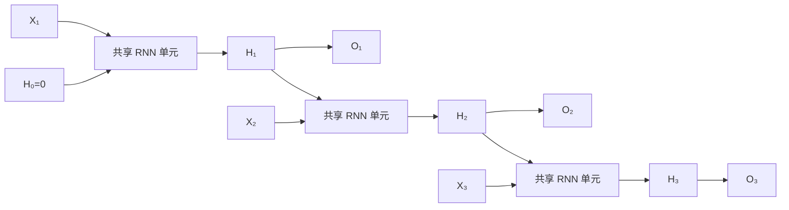

图中三个单元不是三套参数，而是同一个函数在三个时间步复用。序列变长会增加计算量和激活存储，不增加参数数量。

### Shape 总表

设批量 $B$、时间步 $T$、输入维度 $D$、隐藏维度 $H$、词表大小 $V$：

| 张量 | Shape | 说明 |
| --- | --- | --- |
| 整数输入 X | <code>(B,T)</code> | 字符索引 |
| one-hot | <code>(T,B,V)</code> | 从零版循环层输入 |
| 单步 X_t | <code>(B,V)</code> | 第 t 个时间步 |
| H_t | <code>(B,H)</code> | 每条序列一份状态 |
| W_xh | <code>(V,H)</code> | 输入到状态 |
| W_hh | <code>(H,H)</code> | 旧状态到新状态 |
| W_hq | <code>(H,V)</code> | 状态到词表输出 |
| 单步 logits | <code>(B,V)</code> | 下一字符原始分数 |
| 全序列 logits | <code>(T*B,V)</code> | 一次计算交叉熵 |

### 隐藏层与隐状态不是同义词

- **隐藏层**描述网络结构，它位于输入与输出之间。
- **隐状态**描述时间依赖，它是由过去算出、传给下一时间步的动态值。

同一个 RNN 隐藏层在各时间步产生不同隐状态。

### 困惑度

平均每词元交叉熵为 $L$ 时：

$$
\operatorname{PPL}=\exp(L).
$$

它可粗略理解为模型每一步像在多少个候选间犹豫。均匀地在 $V$ 个字符中猜时，困惑度约为 $V$；完美预测时趋近 1。只有词元化、词表与数据口径一致时，困惑度才适合比较。

### 新手例子：当前输入为 0，状态为什么仍不为 0

- **小输入**：取标量 RNN，`H0=0`、`W_xh=1`、`W_hh=0.5`、偏置为 0，激活为 `tanh`；输入依次为 `X1=1`、`X2=0`。
- **逐步过程**：`H1=tanh(1×1+0×0.5)=tanh(1)≈0.762`；下一步虽看到 0，仍有 `H2=tanh(0×1+0.762×0.5)=tanh(0.381)≈0.364`。
- **具体输出**：第二步隐状态约为 `0.364`，并非 0；若 `W_hq=2`，第二步输出分数约为 `0.728`。
- **这个例子说明了什么？** `X_t @ W_xh` 处理现在，`H_{t-1} @ W_hh` 把过去带进来，所以相同当前输入可因历史不同产生不同输出。
- **新手最容易误解什么？** 时间展开图里的多个 RNN 单元不是多套参数；这里两步都复用同一个 `W_xh=1` 和 `W_hh=0.5`。

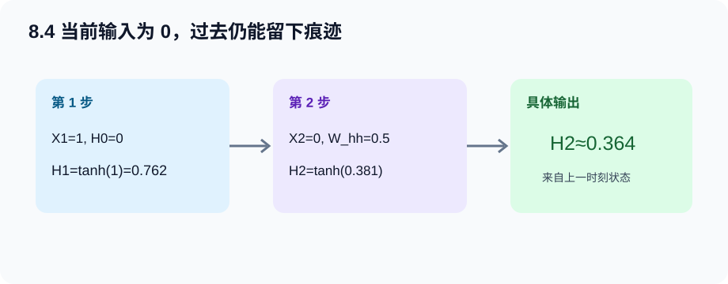

---

## 8.5 循环神经网络的从零开始实现

完整程序：[char_rnn_language_model.py](../code/ch08/char_rnn_language_model.py)

~~~bash
python code/ch08/char_rnn_language_model.py --implementation scratch --epochs 40
~~~

### 参数 Shape 不是靠死记

~~~python
self.W_xh = nn.Parameter(torch.randn(vocab_size, num_hiddens) * 0.01)
self.W_hh = nn.Parameter(torch.randn(num_hiddens, num_hiddens) * 0.01)
self.b_h = nn.Parameter(torch.zeros(num_hiddens))
self.W_hq = nn.Parameter(torch.randn(num_hiddens, vocab_size) * 0.01)
self.b_q = nn.Parameter(torch.zeros(vocab_size))
~~~

从矩阵乘法反推即可：<code>X_t:(B,V)</code> 想得到 <code>(B,H)</code>，右乘矩阵必须是 <code>(V,H)</code>；<code>H_t:(B,H)</code> 想得到 <code>(B,V)</code>，右乘矩阵必须是 <code>(H,V)</code>。

### 前向循环逐段解释

~~~python
one_hot = F.one_hot(inputs.T, self.vocab_size).float()  # (T,B,V)
outputs = []
hidden = state                                           # (B,H)
for X_t in one_hot:                                      # X_t:(B,V)
    hidden = torch.tanh(X_t @ W_xh + hidden @ W_hh + b_h)
    logits_t = hidden @ W_hq + b_q                       # (B,V)
    outputs.append(logits_t)
logits = torch.cat(outputs, dim=0)                        # (T*B,V)
~~~

1. Python 循环沿时间维走，不是沿 batch 逐样本走。
2. <code>hidden</code> 每步被新状态覆盖，但 autograd 仍记录它对旧状态的依赖。
3. 每个时间步都输出，因为语言模型每个位置都有下一字符标签。
4. <code>cat</code> 的时间优先顺序决定标签也必须时间优先展平。

one-hot 乘权重，本质是选取权重矩阵对应字符的一行。工程中用 <code>nn.Embedding(V,H)</code> 可直接查表，不构造巨大稀疏向量；这里保留 one-hot 是为让公式和代码一眼对应。

### 状态何时清零，何时 detach

~~~python
if state is None or random_sampling:
    state = model.begin_state(batch_size, device)
else:
    state = state.detach()
~~~

- 新序列开始或随机采样：状态清零，避免把不相干文本硬接在一起。
- 顺序采样的相邻批次：保留数值记忆，但 detach 旧计算图。

这就是截断 BPTT：前向记忆可以跨批延续，梯度不会无限跨批追溯。

### 梯度裁剪的位置

~~~python
optimizer.zero_grad(set_to_none=True)
loss.backward()
grad_clipping(model, theta=1.0)
optimizer.step()
~~~

按全局范数裁剪：

$$
\mathbf g\leftarrow
\min\left(1,\frac{\theta}{\lVert\mathbf g\rVert}\right)\mathbf g.
$$

它把过长梯度缩到阈值，方向不变。放在 backward 前没有梯度可裁，放在 step 后异常更新已经发生。裁剪不能修复梯度消失，也不能替代合理学习率。

### 预测为何分为预热与生成

给定前缀时，先依次输入所有已知字符以更新隐状态；然后才把模型预测当下一步输入，自回归生成。若只给最后一个前缀字符，模型不知道此前上下文。

### 新手例子：one-hot 乘权重其实只是选一行

- **小输入**：词表 `V=3`、隐藏维 `H=2`，当前词索引为 1，所以 `X_t=[0,1,0]`；令 `W_xh` 三行分别为 `[0.1,0.2]`、`[0.5,-0.5]`、`[-0.2,0.3]`，旧状态贡献已算成 `[0.2,0.4]`。
- **逐步过程**：`X_t @ W_xh` 只选出第 1 行 `[0.5,-0.5]`；与旧状态贡献相加得 `[0.7,-0.1]`；逐元素 `tanh` 得约 `[0.604,-0.100]`。
- **具体输出**：新状态 `H_t` Shape 为 `(1,2)`，数值约为 `[[0.604,-0.100]]`。
- **这个例子说明了什么？** 从零版用 one-hot 是为了对应公式；工程里的 `Embedding(3,2)` 可直接查出 `[0.5,-0.5]`，省掉稀疏乘法。
- **新手最容易误解什么？** `for X_t in one_hot` 遍历的是时间维；每个 `X_t` 仍含整个批量 `(B,V)`，不是一次只算一个样本。

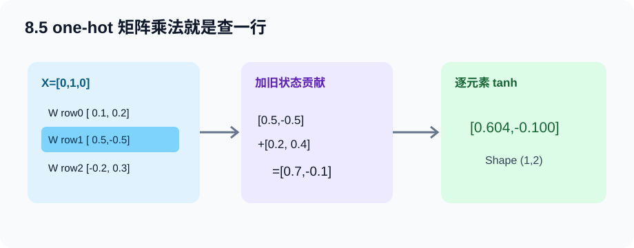

---

## 8.6 循环神经网络的简洁实现

~~~bash
python code/ch08/char_rnn_language_model.py --implementation concise --epochs 40
~~~

~~~python
self.rnn = nn.RNN(vocab_size, num_hiddens)
self.output = nn.Linear(num_hiddens, vocab_size)

one_hot = F.one_hot(inputs.T, vocab_size).float()  # (T,B,V)
outputs, new_state = self.rnn(one_hot, state)      # (T,B,H), (1,B,H)
logits = self.output(outputs.reshape(-1, H))       # (T*B,V)
~~~

<code>nn.RNN</code> 只完成循环层，不会自动知道任务要预测词表，因此仍需 <code>Linear(H,V)</code> 输出层。

| 从零实现 | PyTorch API | 仍需自己负责 |
| --- | --- | --- |
| XW_xh + HW_hh + b | <code>nn.RNN</code> | 输入轴顺序、初始状态 |
| 每步收集 H_t | <code>outputs</code> | 输出怎样用于任务 |
| 最后一个 H_t | <code>new_state</code> | 跨批 detach 或重置 |
| H_t W_hq + b_q | <code>nn.Linear(H,V)</code> | 词表输出头 |
| 手写交叉熵 | <code>nn.CrossEntropyLoss</code> | logits/标签展平对齐 |
| 手写裁剪 | <code>clip_grad_norm_</code> | 阈值与调用时机 |

对单层单向 RNN，<code>outputs:(T,B,H)</code> 包含全部时间步，<code>new_state:(1,B,H)</code> 只保留最终状态和层维。语言模型使用全部 outputs；整句分类常读取最终 state。

设置 <code>batch_first=True</code> 只会把输入和 outputs 改为 <code>(B,T,*)</code>，状态永远保持 <code>(layers*directions,B,H)</code>。

### 新手例子：`nn.RNN` 的三个 Shape 怎样接起来

- **小输入**：`B=2,T=3,V=4,H=5`，整数输入 Shape 是 `(2,3)`，使用默认 `batch_first=False`。
- **逐步过程**：先转置并 one-hot：`(2,3)→(3,2,4)`；送入 `nn.RNN(4,5)` 得全部状态 `(3,2,5)` 和最终状态 `(1,2,5)`；把全部状态展平成 `(6,5)` 再接 `Linear(5,4)`。
- **具体输出**：词表 logits 为 `(6,4)`，可与 6 个下一词标签直接计算交叉熵；`new_state` 保持 `(1,2,5)`。
- **这个例子说明了什么？** `nn.RNN` 替代手写时间循环，但不会替你完成词表输出头和标签对齐。
- **新手最容易误解什么？** `batch_first=True` 不会把状态变成 `(B,1,H)`；状态第一维始终是 `层数×方向数`。

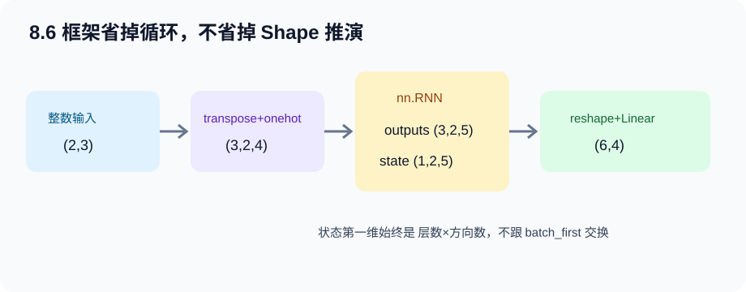

---

## 8.7 通过时间反向传播

前向虽然写作循环，求导时可将其展开为深计算图。设：

$$
h_t=f(x_t,h_{t-1},w_h),\qquad o_t=g(h_t,w_o).
$$

早期状态对晚期状态的影响含雅可比连乘：

$$
\frac{\partial h_t}{\partial h_k}
=\prod_{j=k+1}^{t}\frac{\partial h_j}{\partial h_{j-1}}.
$$

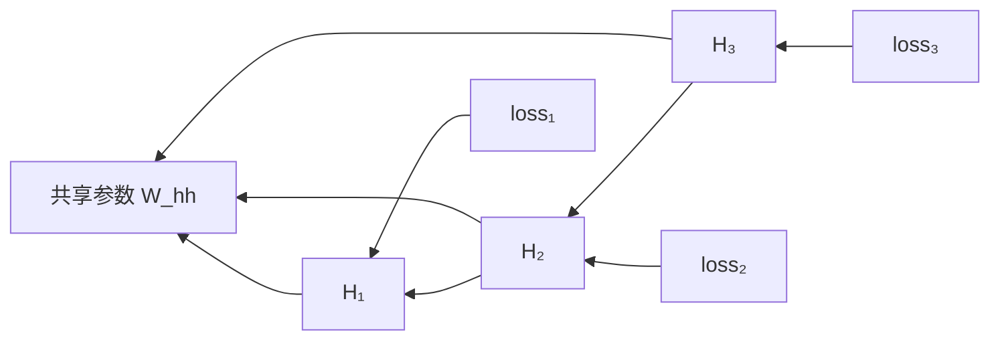

若连乘的典型尺度小于 1，远处贡献指数衰减，形成梯度消失；若大于 1，则指数增长，形成梯度爆炸。共享参数还会汇总来自多个时间步的梯度贡献。

| 方法 | 主要作用 | 局限 |
| --- | --- | --- |
| 梯度裁剪 | 限制爆炸梯度造成的单步更新 | 不解决梯度消失 |
| 截断 BPTT | 控制图长度、显存和计算量 | 放弃截断范围外的直接梯度 |
| GRU/LSTM | 用门和加法状态通路改善长程记忆 | 仍不保证任意长依赖 |

### 四个容易混淆的操作

| 操作 | 作用对象 | 本章用途 |
| --- | --- | --- |
| <code>state.detach()</code> | 状态与旧图的联系 | 截断跨批 BPTT |
| <code>zero_grad()</code> | 参数已有梯度 | 防止批间梯度累加 |
| <code>torch.no_grad()</code> | 代码块中新运算 | 手动更新或验证 |
| <code>inference_mode()</code> | 整段纯推理 | 文本生成与评估 |

### 新手例子：同一个三步连乘怎样消失或爆炸

- **小输入**：忽略输入与非线性，取最简单标量递推 `h_t=a·h_{t-1}`，从 `h0=1` 走 3 步，并观察 `∂h3/∂h0=a³`。
- **逐步过程**：若 `a=0.5`，梯度链为 `0.5×0.5×0.5=0.125`；若 `a=2`，梯度链为 `2×2×2=8`。
- **具体输出**：同样只走 3 步，早期状态收到的梯度可以缩到 `0.125`，也可以放大到 `8`；步数继续增加时差距呈指数扩大。
- **这个例子说明了什么？** BPTT 的难点来自跨时间雅可比反复连乘，不是 `backward()` 这个 API 本身有随机故障。
- **新手最容易误解什么？** 梯度裁剪能把过大的 `8` 限住，却不能把已经缩小的 `0.125` 自动恢复；它主要处理爆炸，不解决消失。

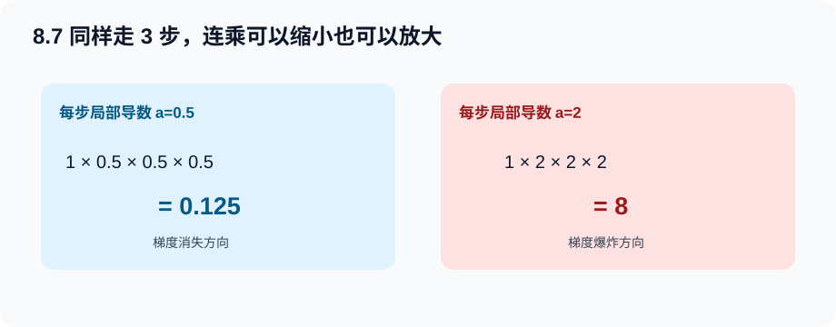

---

## 两份完整程序怎么读

### 时间序列预测

[打开完整代码](../code/ch08/sequence_forecasting.py)

| 代码块 | 输入 → 输出 | 学习重点 |
| --- | --- | --- |
| <code>make_series</code> | N → (N,) | 周期、趋势与噪声 |
| <code>make_lagged_dataset</code> | (N,) → (N-tau,tau)、(N-tau,1) | 滑窗与防广播 |
| <code>train_model</code> | 窗口 → 回归器 | 五步训练法 |
| <code>recursive_forecast</code> | 初始窗口 → k 个预测 | 误差反馈 |

### 字符语言模型

[打开完整代码](../code/ch08/char_rnn_language_model.py)

| 代码块 | 主要职责 | 调试时看什么 |
| --- | --- | --- |
| <code>CharVocab</code> | 字符 ↔ 索引 | 词表长度、往返编码 |
| <code>sequential_batches</code> | 连续子序列 | X、Y 是否右移 |
| <code>random_batches</code> | 随机子序列 | 每批状态是否重置 |
| <code>ScratchRNNLM.forward</code> | 手写递推 | one-hot、state、logits Shape |
| <code>ConciseRNNLM.forward</code> | 框架递推 | outputs/state Shape |
| <code>train_epoch</code> | 对齐、反向、裁剪、更新 | PPL、梯度范数 |
| <code>predict</code> | 预热、自回归 | 每步输入输出索引 |

~~~bash
python code/ch08/char_rnn_language_model.py --implementation both --epochs 40
~~~

快速验证：

~~~bash
python code/ch08/char_rnn_language_model.py --implementation both --epochs 2
~~~

两轮只证明 Shape、loss、backward 与生成链路可运行，不代表文本已经学好。

---

## Hot 100 算法迁移：3. 无重复字符的最长子串

> 出处：[LeetCode 热题 100 官方题单](https://leetcode.cn/studyplan/top-100-liked/) 
> 原题直达：[3. 无重复字符的最长子串](https://leetcode.cn/problems/longest-substring-without-repeating-characters/) 
> 完整答案：[hot100_longest_substring.py](../code/ch08/hot100_longest_substring.py)

### 为什么它和本章有关

RNN 逐个读取序列，并用状态概括“到目前为止的重要历史”。滑动窗口也逐个读取字符，不过它保存的是一个精确定义的状态：当前不重复子串的左边界，以及每个字符最近出现的位置。

两者不能混为一谈。这里的字典是人工设计、可精确解释的离散状态；RNN 隐状态是从数据学到的连续向量，不保证逐维对应某个字符位置。

### 原题的原创摘要

给定字符串，寻找不包含重复字符的最长**连续**片段，返回它的长度。连续子串不能跳过中间字符。

### 本题学习目标

- 用 <code>[left,right]</code> 明确定义当前窗口；
- 维护“窗口内没有重复字符”这一不变量；
- 遇到重复字符时把左边界一次跳到正确位置；
- 解释为什么左边界只能向右，绝不能被更早的记录拉回。

### 白话例子：<code>abba</code>

这个例子专门暴露最常见的边界错误：

| 读到的位置 | 字符 | 处理后的 left | 当前合法窗口 | 最长长度 |
| --- | --- | --- | --- | --- |
| 0 | a | 0 | a | 1 |
| 1 | b | 0 | ab | 2 |
| 2 | b | 2 | b | 2 |
| 3 | a | 2 | ba | 2 |

读到第二个 <code>b</code> 时，上一个 <code>b</code> 位于 1，所以 <code>left</code> 跳到 2。最后读到 <code>a</code> 时，旧 <code>a</code> 在位置 0，已经不在当前窗口里；此时不能把 <code>left</code> 从 2 拉回 1。

~~~python
# 只有旧位置仍在当前窗口内，才需要移动左边界。
if character in last_seen and last_seen[character] >= left:
    left = last_seen[character] + 1

# 更新字符最近位置，再计算当前连续窗口长度。
last_seen[character] = right
best = max(best, right - left + 1)
~~~

**这个例子说明了什么？** 状态不是保存全部历史，而是保存回答当前问题所需的最少信息：窗口左边界和最近位置。

**新手最容易误解什么？** 题目要的是子串，不是子序列；<code>pwke</code> 可以跳着选，但不是连续片段。

### 复杂度与易错点

- 时间复杂度：$O(n)$，每个字符只作为右边界处理一次。
- 空间复杂度：$O(\min(n,|字符集|))$，字典保存出现过的字符。
- 易错点 1：更新左边界前要确认旧位置仍在窗口内。
- 易错点 2：当前长度是 <code>right-left+1</code>，不要漏掉加一。
- 易错点 3：空字符串答案为 0，不要默认初始化为 1。

运行离线自测：

~~~bash
python code/ch08/hot100_longest_substring.py
~~~

---

## 常见坑与排错顺序

### 损失不降

1. 验证 Y 是否为 X 右移一位；
2. 验证 logits 和 targets 展平顺序；
3. 确认交叉熵收到 logits 与 long 索引；
4. 确认执行 zero_grad → backward → clip → step；
5. 检查学习率、序列长度与隐藏维度；
6. 最后再换模型。

### 第二批 backward 报“再次反向传播”

顺序采样时通常漏了 <code>state.detach()</code>。不要用 <code>retain_graph=True</code> 长期掩盖，它会让图滞留并扩大内存。

### 内存不断增长

不要把带图的 loss、state、logits 长期存进列表。统计用 <code>loss.item()</code>，跨批状态 detach，评估用 inference mode。

### 困惑度极大或为 inf

先打印裁剪前梯度范数，再降低学习率；确认裁剪发生在 step 前。对指数显示限幅只能防止打印溢出，不能修复发散。

### 生成只重复空格

检查对齐与损失，再看语料是否太短或频率极不平衡、训练是否足够。高频字符往往是未学会上下文时的安全答案。

### nn.RNN 状态 Shape 报错

核对 <code>(layers*directions,B,H)</code>。batch_first 不改变状态轴顺序；批量大小变化时也必须创建匹配的新状态。

---

### 面试八股加练：不能只背结论

17. 【八股深答】RNN 为什么能处理变长序列而参数量不随长度增长？

**结论：**同一个状态转移单元在每个时间步复用同一组参数，序列变长只增加计算次数和中间状态，不增加参数副本。**机制：**$h_t=f(x_t,h_{t-1};\theta)$ 中 $\theta$ 对所有 $t$ 共享。**工程影响：**显存仍会因 BPTT 保存更多时间步激活而增长，训练长序列常需截断并 detach 状态。**误区：**“参数量不变”不等于计算量、显存或学习难度不变。**追问：**若每个时间步用不同参数，就失去时间共享，也很难泛化到训练长度之外。

18. 【八股深答】detach 隐状态与把隐状态清零有什么区别？

**结论：**detach 保留数值记忆但切断到旧计算图的梯度；清零同时丢掉数值记忆。**机制：**前者令下一批从旧 $h$ 的值继续，却把它当常量；后者相当于开始一条新序列。**工程影响：**连续语料分块训练常 detach，独立样本批次通常重置；选择错误会导致跨样本泄漏或“再次反向计算图”错误。**误区：**detach 不是关闭当前批梯度，当前批新建的状态转移仍可反向。**追问：**截断 BPTT 是优化近似，会舍弃跨截断边界的梯度依赖。

19. 【八股深答】为什么单步预测误差很小，递归多步预测仍会崩？

**结论：**递归预测把自己的输出当下一步输入，误差会改变后续输入分布并逐步累积。**机制：**训练常见的输入来自真实历史，而推理第 $t+1$ 步读到的是带误差的 $\hat x_t$；局部偏差可经动态系统放大。**工程影响：**必须分别报告 one-step 与 recursive horizon 指标，可考虑直接多步预测、scheduled sampling 或概率模型。**误区：**低一步 MSE 不能推出长时轨迹正确。**追问：**这与 seq2seq 的 exposure bias 同源，但时间序列还可能受系统稳定性影响。

## 本章速查表

| 问题 | 一句话答案 |
| --- | --- |
| 为什么序列不能随意打乱？ | 顺序含信息，还可能造成未来泄漏 |
| 语言模型标签怎样得到？ | 输入序列整体右移一位 |
| 参数随序列变长吗？ | 不会，同一套参数跨时间复用 |
| H_t 表示什么？ | 截至 t 的压缩历史状态 |
| 为何 targets 用 Y.T 展平？ | 对齐时间优先的 logits |
| 困惑度越大越好吗？ | 越小越好，下限为 1 |
| detach 会清空状态吗？ | 不会，只切断旧计算图 |
| 裁剪何时做？ | backward 后、step 前 |
| nn.RNN 含词表输出层吗？ | 不含，还需 Linear(H,V) |
| 为什么多步预测更难？ | 自身误差会继续成为输入 |

---

## Hot 100 加练（本章共 3 题）

原有 #3 之外，新增 [#560 和为 K 的子数组](https://leetcode.cn/problems/subarray-sum-equals-k/) 与 [#739 每日温度](https://leetcode.cn/problems/daily-temperatures/)，练前缀历史摘要与“尚未解决状态”的单调栈。解析见[新增题完整解析](leetcode-hot100-expanded-practice.md#第-8-章序列历史摘要)，代码见 [hot100_subarray_sum_equals_k.py](../code/ch08/hot100_subarray_sum_equals_k.py) 与 [hot100_daily_temperatures.py](../code/ch08/hot100_daily_temperatures.py)。

## 主动回忆：先遮住答案再作答

1. 【解释】为什么序列样本不能沿用“随意打乱也无所谓”的直觉？

相邻观测存在条件依赖，位置和顺序本身就是特征。打乱会破坏语义或动态关系；若划分前混合高度重叠的时间窗口，还可能让训练数据含测试时刻附近甚至未来的信息，造成泄漏。

2. 【Shape】长度 100 的序列取 tau=8，样本数及 X、y Shape 是什么？

得到 92 个样本。<code>X.shape=(92,8)</code>，保留回归输出维时 <code>y.shape=(92,1)</code>。第 i 行特征是原序列 i 到 i+7，标签是 i+8。

3. 【代码推演】为何标签写 windows[:, -1:] 而不是 windows[:, -1]？

前者保留末维，得到 (B,1)，与预测一致；后者得到 (B,)。它与 (B,1) 相减会广播成 (B,B)，程序可能不报错却计算错误的批内两两误差。

4. 【解释】单步 MSE 很小，为何 50 步递归预测仍可能很差？

单步始终使用真实历史；递归预测从第二步起使用模型输出。第一步误差改变下一步输入，输入逐渐偏离训练分布，偏差反复反馈并积累。

5. 【推导】语言模型怎样把一句话联合概率拆成逐步预测？

用链式法则：$P(x_1,\ldots,x_T)=\prod_tP(x_t\mid x_1,\ldots,x_{t-1})$。因此可将原序列右移一位作标签，每步预测下一个词元。

6. 【代码推演】为何 logits 为 (T*B,V) 时 targets 应写 Y.T.reshape(-1)？

前向按时间循环，每次追加该时间的全部 B 个样本，所以 logits 是时间优先。Y.T 变为 (T,B) 后展平才对应；直接展平 Y 是样本优先，Shape 对但配对错。

7. 【Shape】单层单向 nn.RNN 输入 (T,B,D)，输出和状态 Shape 是什么？

outputs 是 (T,B,H)，包含每个时间步最后一层状态；state 是 (1,B,H)。batch_first 只把 outputs 改为 (B,T,H)，state 仍是 (1,B,H)。

8. 【解释】为什么 RNN 处理更长序列时参数量不增加？

各时间步复用相同的输入权重、状态权重、偏置和输出权重。展开图中多个单元是同一函数的多次调用。序列变长增加运算和激活，不增加参数。

9. 【诊断】第二个 batch 报“再次反向传播计算图”，最可能缺什么？

顺序采样时缺少 state.detach。状态带着上一批的旧图，上一批 backward 已释放图，下一批再次追溯便报错。应 detach 截断，而非长期 retain_graph。

10. 【辨析】state.detach 与把 state 置零有什么区别？

detach 保留状态数值，只切断梯度路径；置零同时丢掉数值记忆和旧图。顺序相邻批通常 detach，随机批或新序列通常置零。

11. 【公式】困惑度为 20 怎么理解？能跨不同词表直接比吗？

可粗略理解为模型平均每步像在 20 个等可能候选中犹豫。它越小越好、下限 1。不同词元化、词表或数据集改变任务难度，不能脱离口径直接比较。

12. 【诊断】模型只生成空格但不报错，先检查什么？

先查输入标签右移、logits/targets 展平顺序和损失曲线；再查语料长度、字符频率、训练轮数与学习率。重复高频字符通常表示模型尚未学到上下文。

13. 【机制】BPTT 为什么产生梯度消失或爆炸？

晚期损失传回早期状态要连乘多个状态雅可比。典型尺度反复小于 1 时贡献指数衰减，反复大于 1 时指数放大。

14. 【顺序】梯度裁剪应放在哪两句之间？为什么？

放在 loss.backward 与 optimizer.step 之间。backward 前没有本批梯度；step 后参数已按异常梯度更新。优化器应读取裁剪后的 grad。

15. 【辨析】梯度裁剪能解决梯度消失吗？

不能。裁剪只缩短过大的梯度，主要防止爆炸；很小的梯度不会被放大。梯度消失需通过门控结构、初始化、残差或更合适架构改善。

16. 【实现】字符预测为何先用完整 prefix 预热状态？

隐状态要逐字符递推才包含完整前缀。只输入最后一个字符无法知道此前内容；预热阶段读已知字符，生成阶段才反馈模型输出。

## 学完本章应该能做到

- 从一条序列构造滞后特征，并避免时间泄漏；
- 解释词元化、词表、右移标签和困惑度；
- 根据矩阵乘法写出 RNN 参数与每一步 Shape；
- 分清随机采样、顺序采样和状态策略；
- 从零复写 RNN 前向、BPTT 截断、梯度裁剪与自回归预测；
- 读懂 nn.RNN 的 outputs/state，并按排错顺序定位问题。

下一章会给简单状态通路加门：GRU 决定保留与重算的比例，LSTM 把内部记忆与对外输出分开；随后把循环网络扩展到机器翻译的编码器－解码器结构。

[上一章：现代卷积神经网络](ch07-modern-convolutional-neural-networks.md) · [下一章：现代循环神经网络](ch09-modern-recurrent-neural-networks.md) · [返回总目录](../README.md)
