# 第 9 章：现代循环神经网络

> 复习定位：给记忆加“门”，再把一个序列变成另一个序列  
> 内容脉络：9.1–9.8 · PyTorch · 离线可运行  
> 原创学习笔记，章节顺序参考[《动手学深度学习》官方目录](https://zh-v2.d2l.ai/chapter_recurrent-modern/index.html)

[门控循环网络完整代码](../code/ch09/gated_rnn_demo.py) · [seq2seq 翻译完整代码](../code/ch09/seq2seq_translation.py)

## 一句话主线

**GRU 和 LSTM 用可学习的门决定信息该保留、遗忘还是输出；深层与双向结构扩展信息处理范围；编码器－解码器再把变长输入压成状态，由解码器逐步生成变长输出，束搜索则在推理时保留多条候选，减少一步贪心造成的后悔。**

## 三个月后复习入口

| 场景 | 先看什么 | 达标标准 |
| --- | --- | --- |
| 新手第一次学 | 普通 RNN 的遗忘问题 → GRU → LSTM → seq2seq | 能用“门是 0～1 的软开关”解释状态更新 |
| 90 天后复习 | GRU/LSTM 极端门值 → 编码器解码器图 → teacher forcing | 能写出输入、状态、logits 的时间关系 |
| 面试前复习 | 双向泄漏、深层状态 Shape、曝光偏差、beam 状态复制 | 能指出训练与推理条件哪里不同 |

**最小记忆集：**

1. 门控不是删除梯度，而是学习旧信息和新候选各保留多少；
2. GRU 用一个隐藏状态，LSTM 额外维护细胞状态 $C$；
3. 双向 RNN 读取左右上下文，不适合直接做因果下一词生成；
4. seq2seq 训练常读真实前缀，推理读自身预测，因此有 exposure bias；
5. beam search 保留多条完整前缀及其独立状态，但更宽不保证语义更好。

### 专有名词白话表

| 术语 | 白话解释 | 机制位置 |
| --- | --- | --- |
| 门（gate） | 0～1 之间的逐元素软开关，控制信息通过比例 | sigmoid 输出 |
| 候选状态 | 根据当前输入和部分旧状态算出的“新记忆草稿” | GRU/LSTM 更新式 |
| 细胞状态（cell state） | LSTM 专门承载长期记忆的通道 | `C_t` |
| 双向 RNN | 一条从左读、一条从右读，再合并上下文 | 输出宽度常翻倍 |
| 编码器（encoder） | 把输入序列加工成供解码器读取的表示 | source outputs/state |
| 解码器（decoder） | 根据编码结果和已生成前缀逐步产生输出 | target logits |
| teacher forcing | 训练时把真实上一个 token 喂给解码器 | 目标序列右移 |
| 束搜索（beam search） | 每步保留若干高分前缀，而不是只留一个 | beam size |

### 教材高价值问答

【比较】GRU 比 LSTM 门少，应该直接认为 GRU 更差吗？

不能。GRU 结构更简、参数和计算通常更少；LSTM 用独立细胞状态和三类门提供更细控制。两者都通过加性状态路径改善普通 RNN 的长依赖优化，但任务、数据和预算不同会改变结果。面试时应比较状态方程、参数量和验证表现，而不是给出固定胜负。

【因果性】为什么双向 RNN 能做文本分类，却不能直接做下一词生成？

整句分类时完整输入已经给出，读取左右上下文是合法的；下一词生成时未来 token 尚不存在。若训练因果模型时使用反向状态，就等于提前看答案，训练指标会虚高且推理无法复现。双向编码器仍可服务于非因果理解任务或作为已知源序列的编码器。

【搜索】beam size 增大为什么有时让结果更差或更短？

beam 更宽只表示更充分地寻找“模型分数高”的序列，不保证模型分数与人类质量完全一致。对数概率逐词累加常偏向短句，EOS 校准、长度惩罚和重复模式都会影响结果。还必须为每条候选保存独立解码状态，否则搜索分数本身就不可信。

## 本章地图

先建立一个总直觉：

| 结构 | 它主要在解决什么 |
| --- | --- |
| 梯度裁剪 | 防止单次爆炸梯度造成破坏性更新 |
| GRU | 用两扇门控制旧状态保留与候选状态重算 |
| LSTM | 用独立记忆元和三扇门建立更清晰的长程通道 |
| 深层 RNN | 在同一时刻增加表示变换深度 |
| 双向 RNN | 同时利用当前位置左侧和右侧上下文 |
| 编码器－解码器 | 允许输入与输出都是变长序列 |
| seq2seq | 用循环编码器和循环解码器实现序列转换 |
| 束搜索 | 推理时保留多个部分序列，平衡质量与计算量 |

---

## 开场复习：梯度裁剪是安全带，不是发动机

梯度裁剪已在第 8 章从零实现中出现，但它是训练 GRU、LSTM 和 seq2seq 的共同基础，因此先复习。

设所有参数梯度拼成向量 $\mathbf g$，全局范数裁剪为：

$$
\mathbf g\leftarrow
\min\left(1,\frac{\theta}{\lVert\mathbf g\rVert_2}\right)\mathbf g.
$$

若范数未超过阈值 $\theta$，什么也不做；超过时所有梯度乘同一个比例，整体方向不变。

~~~python
optimizer.zero_grad(set_to_none=True)
loss.backward()
norm = torch.nn.utils.clip_grad_norm_(model.parameters(), max_norm=1.0)
optimizer.step()
~~~

<code>clip_grad_norm_</code> 返回裁剪前范数，适合日志监控。如果每批都远超阈值，裁剪可能只是在掩盖过大学习率、异常输入或不稳定初始化。

---

## 9.1 门控循环单元（GRU）

### 重新打开时先看这里

- **本节位置**：在普通 RNN 状态更新上加两扇门。
- **核心直觉**：更新门决定“旧笔记保留多少”，重置门决定“写新笔记时参考多少旧内容”。
- **数学与 Shape**：门、候选状态、新状态均为 <code>(B,H)</code>。
- **代码落点**：<code>gru_step</code> 展示一个完整时间步；<code>nn.GRU</code> 负责全序列。
- **复习闭环**：分别令更新门趋近 0 与 1，推演状态会怎样。
- **排查顺序**：先看门值范围 → 再看按元素乘法 → 再看旧/新状态插值方向。

### 两扇门分别做什么

设当前输入 $\mathbf X_t\in\mathbb R^{B\times D}$、旧状态 $\mathbf H_{t-1}\in\mathbb R^{B\times H}$：

$$
\mathbf Z_t=\sigma(
\mathbf X_t\mathbf W_{xz}
+\mathbf H_{t-1}\mathbf W_{hz}
+\mathbf b_z),
$$

$$
\mathbf R_t=\sigma(
\mathbf X_t\mathbf W_{xr}
+\mathbf H_{t-1}\mathbf W_{hr}
+\mathbf b_r).
$$

$\sigma$ 把每个门值压到 0 和 1 之间。它不是整条序列共用一个开关，而是每个样本、每个隐藏维都有自己的软开关。

候选隐状态为：

$$
\widetilde{\mathbf H}_t
=\tanh\left(
\mathbf X_t\mathbf W_{xh}
+(\mathbf R_t\odot\mathbf H_{t-1})\mathbf W_{hh}
+\mathbf b_h\right).
$$

最终更新：

$$
\mathbf H_t
=\mathbf Z_t\odot\mathbf H_{t-1}
+(1-\mathbf Z_t)\odot\widetilde{\mathbf H}_t.
$$

本笔记采用“$Z$ 越大越保留旧状态”的约定。不同资料可能把两项对调；不要只背符号，要看公式中哪个系数乘旧状态。

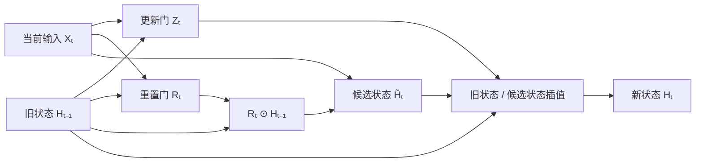

### 两个极端最能帮助记忆

- 若 $\mathbf Z_t\approx 1$：$\mathbf H_t\approx\mathbf H_{t-1}$，像“这一刻没重要信息，旧记忆继续传”。
- 若 $\mathbf Z_t\approx 0$：$\mathbf H_t\approx\widetilde{\mathbf H}_t$，像“当前信息重要，重写记忆”。
- 若 $\mathbf R_t\approx 0$：计算候选状态时几乎忽略旧记忆，适合处理上下文边界。
- 若 $\mathbf R_t\approx 1$：候选状态充分参考过去。

### Shape 与代码

~~~python
Z = torch.sigmoid(X @ W_xz + H_previous @ W_hz + b_z)  # (B,H)
R = torch.sigmoid(X @ W_xr + H_previous @ W_hr + b_r)  # (B,H)
H_tilde = torch.tanh(X @ W_xh + (R * H_previous) @ W_hh + b_h)
H = Z * H_previous + (1.0 - Z) * H_tilde
~~~

星号是按元素乘法，不是矩阵乘法。门与状态同 Shape，意味着不同隐藏通道能选择不同记忆策略。

简洁实现：

~~~python
gru = nn.GRU(input_size=D, hidden_size=H, batch_first=True)
outputs, state = gru(X)
~~~

输入 <code>X:(B,T,D)</code>，输出 <code>outputs:(B,T,H)</code>，最终状态 <code>state:(1,B,H)</code>。

### 新手例子：更新门在不同隐藏维上可以作不同决定

- **小输入**：旧状态 `H_prev=[10,2]`，候选状态 `H_tilde=[0,6]`，更新门 `Z=[0.9,0.25]`；采用本节公式 `H=Z⊙H_prev+(1-Z)⊙H_tilde`。
- **逐步过程**：第 1 维为 `0.9×10+0.1×0=9`；第 2 维为 `0.25×2+0.75×6=0.5+4.5=5`。
- **具体输出**：新状态 `H=[9,5]`。第一维大多保留旧记忆，第二维大多采用候选记忆。
- **这个例子说明了什么？** 门不是给整条样本一个开/关值，而是与状态同 Shape，可让每个隐藏通道选择不同保留比例。
- **新手最容易误解什么？** 不同资料可能把 `Z` 与 `1-Z` 的两项对调；不要背“Z 大就是更新多”，要看它在当前公式里乘的是旧状态还是候选状态。重置门 `R` 则作用在候选状态的计算阶段，不直接出现在最后插值里。

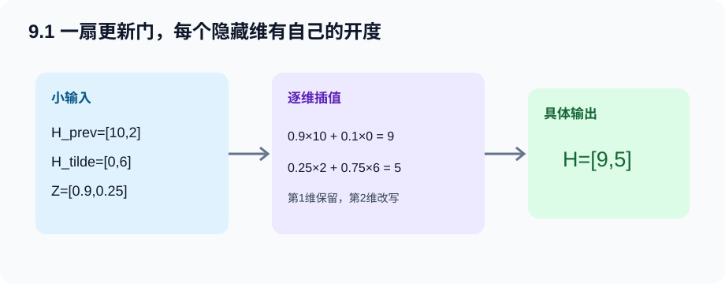

---

## 9.2 长短期记忆网络（LSTM）

### 重新打开时先看这里

- **本节位置**：把内部记忆 $C_t$ 与对外状态 $H_t$ 分开。
- **核心直觉**：记忆元像内部笔记本，输入门控制写入，遗忘门控制擦除，输出门控制对外展示。
- **数学与 Shape**：$I,F,O,\widetilde C,C,H$ 均为 <code>(B,H)</code>。
- **代码落点**：<code>lstm_step</code> 展示一个时间步；框架状态是 <code>(H,C)</code> 元组。
- **复习闭环**：只看公式说出每一项是谁控制谁。
- **排查顺序**：先确认状态元组 → 再查三个 sigmoid 门 → 再查 C 的加法更新。

### 三扇门与候选记忆

$$
\mathbf I_t=\sigma(\mathbf X_t\mathbf W_{xi}+\mathbf H_{t-1}\mathbf W_{hi}+\mathbf b_i),
$$

$$
\mathbf F_t=\sigma(\mathbf X_t\mathbf W_{xf}+\mathbf H_{t-1}\mathbf W_{hf}+\mathbf b_f),
$$

$$
\mathbf O_t=\sigma(\mathbf X_t\mathbf W_{xo}+\mathbf H_{t-1}\mathbf W_{ho}+\mathbf b_o),
$$

$$
\widetilde{\mathbf C}_t
=\tanh(\mathbf X_t\mathbf W_{xc}+\mathbf H_{t-1}\mathbf W_{hc}+\mathbf b_c).
$$

记忆元和隐状态更新：

$$
\mathbf C_t
=\mathbf F_t\odot\mathbf C_{t-1}
+\mathbf I_t\odot\widetilde{\mathbf C}_t,
$$

$$
\mathbf H_t=\mathbf O_t\odot\tanh(\mathbf C_t).
$$

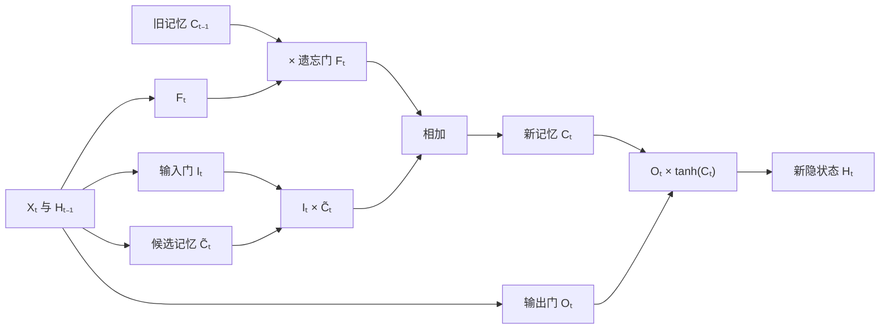

### 为什么加法记忆通路有帮助

普通 RNN 每步都把旧状态送进非线性变换，长距离梯度要反复穿过矩阵和激活导数。LSTM 的记忆更新包含 $\mathbf F_t\odot\mathbf C_{t-1}$ 这条较直接的加法通路；当遗忘门接近 1 时，信息和梯度更容易跨时间保持。

这不意味着 LSTM 永不梯度消失，而是它能学习何时打开一条更顺畅的通路。

### GRU 与 LSTM 对照

| 对比 | GRU | LSTM |
| --- | --- | --- |
| 动态状态 | 一个 H | H 与 C |
| 主要门 | 更新门、重置门 | 输入门、遗忘门、输出门 |
| 参数量 | 通常更少 | 通常更多 |
| 解释重点 | 旧状态与候选状态插值 | 内部记忆与对外输出分离 |
| 选型 | 速度/容量折中较好 | 需要更细记忆控制时常用 |

没有“LSTM 必然优于 GRU”的规则。应在相同数据划分、隐藏规模、训练预算和评价指标下验证。

### 框架 Shape

~~~python
lstm = nn.LSTM(D, H, batch_first=True)
outputs, (H_n, C_n) = lstm(X)
~~~

- <code>outputs:(B,T,H)</code>：最后一层各时间步输出；
- <code>H_n:(layers*directions,B,H)</code>：各层各方向最终隐状态；
- <code>C_n:(layers*directions,B,H)</code>：各层各方向最终记忆元。

最常见错误是把 LSTM 的 state 当成单个张量调用 detach。应分别处理元组成员，或统一写递归状态处理函数。

### 新手例子：内部记忆很大，对外输出仍可以很小

- **小输入**：标量 LSTM 中，旧记忆 `C_prev=4`，遗忘门 `F=0.75`，输入门 `I=0.5`，候选记忆 `C_tilde=0.8`，输出门 `O=0.25`。
- **逐步过程**：先更新内部记忆：`C=0.75×4+0.5×0.8=3+0.4=3.4`；再计算对外状态：`H=0.25×tanh(3.4)≈0.25×0.998≈0.249`。
- **具体输出**：`C≈3.4`，而 `H≈0.249`；二者数值与职责都不同。
- **这个例子说明了什么？** 遗忘门和输入门决定内部笔记如何改，输出门再决定当前向外展示多少；LSTM 因此同时携带 `(H,C)`。
- **新手最容易误解什么？** `C_tilde` 经过 `tanh`，通常在 `[-1,1]`，但累积后的 `C` 不必落在这个范围；也不能用 `H` 替代 `C` 传到下一步。

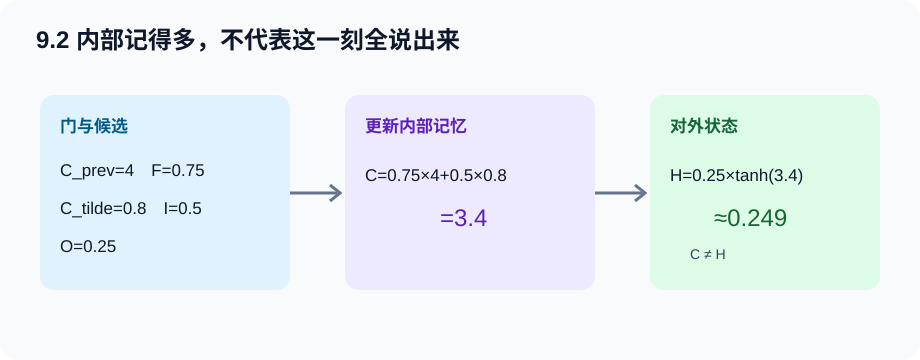

---

## 9.3 深度循环神经网络

单层 RNN 在时间轴上很深，但同一时刻的表示变换只有一层。深层 RNN 把下层在时间 $t$ 的输出作为上层在同一时间的输入：

$$
\mathbf H_t^{(l)}
=\phi_l\left(
\mathbf H_t^{(l-1)}\mathbf W_{xh}^{(l)}
+\mathbf H_{t-1}^{(l)}\mathbf W_{hh}^{(l)}
+\mathbf b_h^{(l)}
\right).
$$

其中第一层的 $\mathbf H_t^{(0)}=\mathbf X_t$。

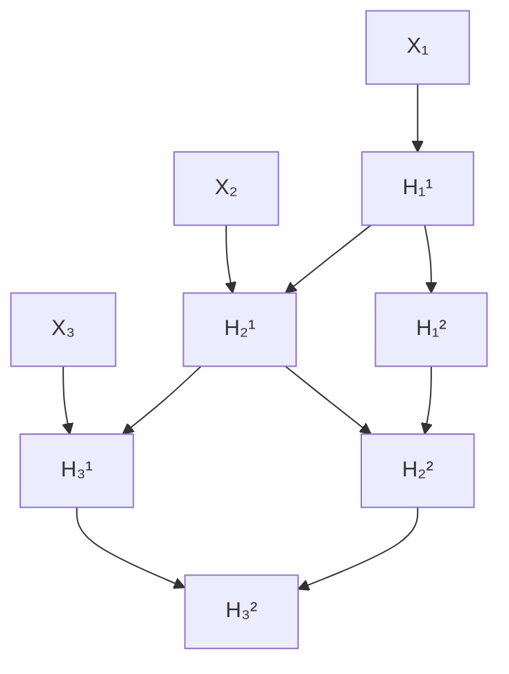

图中横向是时间递推，纵向是层间变换。深层 RNN 同时存在两类依赖，调试 Shape 时要明确当前在处理哪一条轴。

~~~python
rnn = nn.GRU(
    input_size=D,
    hidden_size=H,
    num_layers=2,
    dropout=0.15,
    batch_first=True,
)
~~~

输入为 <code>(B,T,D)</code>，outputs 仍是 <code>(B,T,H)</code>，state 变为 <code>(2,B,H)</code>。框架的 recurrent dropout 只加在相邻循环层之间，<code>num_layers=1</code> 时不会生效。

增加层数带来更强表示能力，也增加训练难度、延迟和过拟合风险。先让单层模型在小数据上过拟合，再逐层增加，通常比一开始堆深更容易排错。

### 新手例子：两层不等于输出宽度翻两倍

- **小输入**：`B=2,T=3,D=4,H=5,L=2`，建立两层单向 GRU。
- **逐步过程**：第 1 层读取 `(2,3,4)`，在每个时间步输出 5 维表示，所以得到 `(2,3,5)`；第 2 层再读取它，仍输出 `(2,3,5)`。每层各保存一份最终状态 `(2,5)`。
- **具体输出**：整个模块 `outputs:(2,3,5)`，`state:(L,B,H)=(2,2,5)`。
- **这个例子说明了什么？** 层数增加的是纵向变换次数；最终 `outputs` 默认只返回最上层，隐藏宽度仍是 `H=5`。
- **新手最容易误解什么？** `state` 的第一维 2 表示层数，不是时间步；`dropout` 只作用在第 1 层到第 2 层之间，单层时没有“层间”可丢弃。

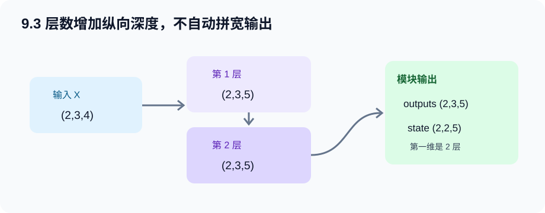

---

## 9.4 双向循环神经网络

### 从前向－后向推断理解“双向”

在隐马尔可夫模型中，若要判断完整观测序列中位置 $t$ 的隐变量，只看左侧历史并不充分。前向量汇总左侧证据：

$$
\alpha_t(h)=P(x_1,\ldots,x_t,h_t=h),
$$

后向量汇总右侧证据：

$$
\beta_t(h)=P(x_{t+1},\ldots,x_T\mid h_t=h).
$$

二者相乘并归一化后，才得到利用完整序列的平滑后验。动态规划之所以高效，是因为它缓存每个位置的前向/后向中间结果，而不是枚举所有隐状态路径。双向 RNN 不是隐马尔可夫模型，但借用了相同的信息观：**当前位置的表示可以由左侧摘要与右侧摘要共同决定。**

### 两个方向在同一位置汇合

正向状态读取 $x_1$ 到 $x_t$，反向状态读取 $x_T$ 到 $x_t$：

$$
\overrightarrow{\mathbf H}_t
=f(\mathbf X_t,\overrightarrow{\mathbf H}_{t-1}),
\qquad
\overleftarrow{\mathbf H}_t
=f(\mathbf X_t,\overleftarrow{\mathbf H}_{t+1}).
$$

输出通常拼接两个方向：

$$
\mathbf H_t=[
\overrightarrow{\mathbf H}_t;
\overleftarrow{\mathbf H}_t
]\in\mathbb R^{B\times 2H}.
$$

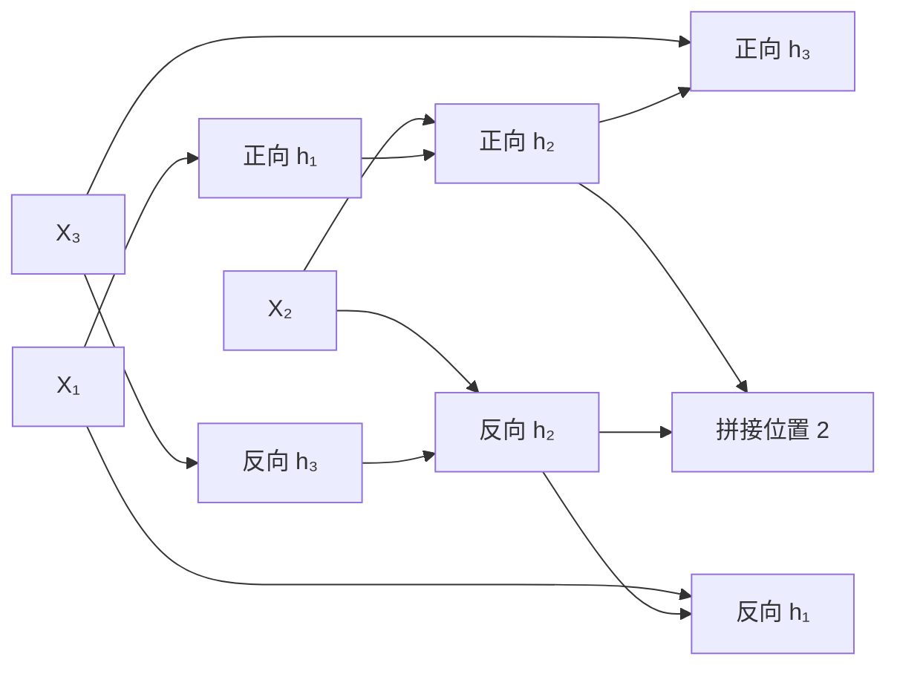

### 什么时候可以用，什么时候不能用

双向网络适合整段输入已知的任务，例如文本标注、句子分类、离线语音识别。它不适合严格因果预测：预测下一字符时不能偷看未来真实字符。

这就是“双向 RNN 的错误应用”：训练时如果把完整目标序列送入双向网络，位置 $t$ 的表示已经含 $t+1$ 之后的信息，生成时这些未来词不存在，训练与推理不一致并造成泄漏。

~~~python
bilstm = nn.LSTM(D, H, bidirectional=True, batch_first=True)
outputs, (H_n, C_n) = bilstm(X)
~~~

此时 <code>outputs:(B,T,2H)</code>，状态第一维为 <code>2</code>。最后一层正向最终状态是 <code>H_n[-2]</code>，反向最终状态是 <code>H_n[-1]</code>，整句分类可将它们拼成 <code>(B,2H)</code>。

不要把 <code>outputs[:,-1,:]</code> 机械当作“双向最终表示”：最后位置的反向输出只看到了序列末端附近。读取 <code>H_n</code> 的两个方向更清晰。

### 新手例子：中间词怎样同时看到左边和右边

- **小输入**：完整序列是 `[我, 不, 开心]`，单方向隐藏宽度 `H=2`，关注位置 2 的词“不”。
- **逐步过程**：正向状态在“不”处已经读过 `[我,不]`，得到 2 维摘要；反向状态从句尾走来，在“不”处已经读过 `[开心,不]`，也得到 2 维摘要；两者沿特征维拼接。
- **具体输出**：该位置表示从 `(1,2)` 与 `(1,2)` 合成 `(1,4)`；整句输出 Shape 为 `(B=1,T=3,2H=4)`。
- **这个例子说明了什么？** 判断“不”的作用时，右侧“开心”是关键；双向结构能在离线编码中直接利用这份未来上下文。
- **新手最容易误解什么？** 这种“看右边”不适合下一词生成。若训练时让位置 `t` 看见未来真实词，推理时未来并不存在，模型就发生信息泄漏。

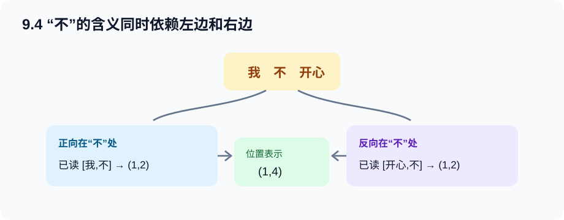

---

## 9.5 机器翻译与数据集

### 从文本行到训练批次

机器翻译数据通常是一行一个平行句对，例如：

~~~text
go .        va !
i am home . je suis chez moi .
~~~

完整预处理链：

源语言和目标语言通常分开建词表，因为符号系统、频率分布和词元集合不同。共享词表在语言或子词重叠较大时可以考虑，但不是默认必须。

### 四个特殊词元

| 词元 | 作用 | 是否参与损失 |
| --- | --- | --- |
| <code>&lt;pad&gt;</code> | 补齐批内短序列 | 不应参与 |
| <code>&lt;bos&gt;</code> | 告诉解码器“现在开始生成” | 通常只作输入 |
| <code>&lt;eos&gt;</code> | 表示序列结束 | 必须学习预测 |
| <code>&lt;unk&gt;</code> | 表示词表外词元 | 作为普通词元处理 |

很多初学代码只 padding 却不保存有效长度。这样编码器会继续读取 pad，解码器损失也会把 pad 当答案。结果可能仍能下降，却主要学会预测填充符。

### 批次 Shape

设源句补齐长度 $S$、目标句补齐长度 $T$：

| 张量 | Shape | 含义 |
| --- | --- | --- |
| source | <code>(B,S)</code> | 源词元索引 |
| source_valid_lengths | <code>(B,)</code> | 每句含 eos 的真实长度 |
| target | <code>(B,T)</code> | bos + 目标正文 + eos + pad |
| target_valid_lengths | <code>(B,)</code> | 每句含 bos/eos 的真实长度 |

本章程序使用 <code>pad_sequence</code> 动态补到当前 batch 最长句，并用 <code>pack_padded_sequence</code> 让编码器跳过 pad。

### 新手例子：两对翻译句怎样补成同一个批量

- **小输入**：源句 1 是 `go .`，源句 2 是 `hi`；目标分别是 `va !` 与 `salut`。
- **逐步过程**：源端都追加 `<eos>`：`[go,.,eos]`、`[hi,eos]`，第二条补一个 pad；目标端加 `<bos>` 与 `<eos>`：`[bos,va,!,eos]`、`[bos,salut,eos]`，第二条再补一个 pad。
- **具体输出**：`source:(2,3)`、源有效长度 `[3,2]`；`target:(2,4)`、目标有效长度 `[4,3]`。
- **这个例子说明了什么？** padding 只为组成矩形批量，有效长度才告诉模型每行真实结束在哪里；源、目标语言还可使用不同词表。
- **新手最容易误解什么？** `<eos>` 是模型必须学会预测的真实标签，不能和 `<pad>` 一起全部忽略；`<bos>` 通常作为解码器起始输入，不作为要预测的正文答案。

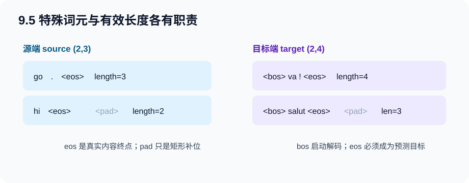

---

## 9.6 编码器－解码器架构

编码器－解码器不是某个固定层，而是一种职责划分：

- 编码器读取整个输入序列，产生上下文状态；
- 解码器基于上下文和已经生成的输出，给出下一词分布；
- 组合模块负责连接两者。

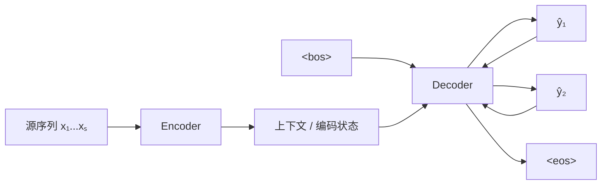

抽象接口可以写成：

~~~python
encoder_state = encoder(source, source_valid_lengths)
decoder_state = decoder.init_state(encoder_state)
logits, decoder_state = decoder(decoder_inputs, decoder_state)
~~~

为什么强调抽象接口？因为编码器可换成 RNN、CNN 或 Transformer，解码器也可更换；只要状态接口匹配，组合逻辑无需重写。

### 固定上下文的瓶颈

本章基础 seq2seq 把整句源信息压进固定维最终状态。源句很长时，这个向量可能成为信息瓶颈。下一章注意力机制会允许解码器每一步回看编码器的所有位置，而不是只依赖一个固定摘要。

### 新手例子：一个固定上下文怎样启动变长生成

- **小输入**：源序列 `[one,four,two,eos]`，编码器最终得到二维上下文 `c=[0.7,-0.2]`；目标生成从 `<bos>` 开始。
- **逐步过程**：解码器第 1 步读取 `<bos>` 与 `c`，预测“一”；第 2 步读取“一”与同一个 `c`，预测“四”；第 3 步读取“四”与 `c`，预测“二”；第 4 步预测 `<eos>` 后停止。
- **具体输出**：去掉特殊词元后得到 `[一,四,二]`。输入含 4 个词元，输出正文含 3 个词元，长度可以不同。
- **这个例子说明了什么？** 编码器负责把源序列变成接口状态，解码器负责按自己的时间轴生成；二者不要求逐位置一一对应。
- **新手最容易误解什么？** 基础模型每步使用的是同一个固定上下文，不是每生成一个词就自动回看对应源词；逐步回看需要下一章的注意力机制。

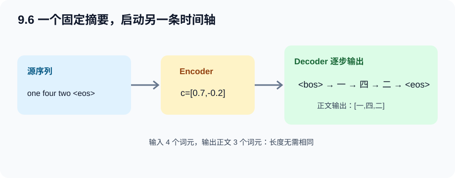

---

## 9.7 序列到序列学习（seq2seq）

完整程序：[seq2seq_translation.py](../code/ch09/seq2seq_translation.py)

~~~bash
python code/ch09/seq2seq_translation.py --epochs 30
~~~

程序用合成数字词平行语料打通完整链路，不需下载数据：

~~~text
one four two  ->  一 四 二
~~~

它是机制 smoke test，不代表真实机器翻译质量。

### 编码器

~~~python
embedded = self.embedding(source)                # (B,S,E)
packed = pack_padded_sequence(
    embedded, valid_lengths.cpu(),
    batch_first=True, enforce_sorted=False
)
_, final_state = self.rnn(packed)                 # (1,B,H)
~~~

Embedding 把整数索引映射为稠密向量。pack 利用有效长度跳过 pad，<code>enforce_sorted=False</code> 允许 batch 不按长度预排序。

### 解码器

基础版本把编码器最终状态既作为初始状态，也作为每一步固定上下文：

~~~python
embedded = self.embedding(tokens)                         # (B,T,E)
context_steps = context.unsqueeze(1).expand(-1, T, -1)   # (B,T,H)
decoder_inputs = torch.cat((embedded, context_steps), 2) # (B,T,E+H)
outputs, state = self.rnn(decoder_inputs, state)          # (B,T,H)
logits = self.output(outputs)                              # (B,T,V_tgt)
~~~

<code>expand</code> 创建广播视图，不真的复制 $T$ 份上下文；拼接后才形成实际的新张量。

### teacher forcing 的输入与标签

假设目标序列是：

~~~text
<bos> 一 四 二 <eos>
~~~

训练时：

~~~text
decoder 输入：<bos> 一 四 二
监督标签：      一 四 二 <eos>
~~~

代码：

~~~python
decoder_inputs = target[:, :-1]
decoder_targets = target[:, 1:]
valid_lengths = target_valid_lengths - 1
~~~

训练时每步看到真实上一个词叫 teacher forcing。它让训练更稳定、可并行处理目标时间步；但推理时只能看到自己上一步预测，由此产生暴露偏差。scheduled sampling 是一种尝试折中，但实现与效果需谨慎验证。

### 遮蔽交叉熵

先得到逐词元损失：

$$
\ell_{bt}=-\log P(y_{bt}\mid y_{b,<t},\mathbf c).
$$

再用有效长度创建掩码 $m_{bt}\in\{0,1\}$：

$$
L=\frac{\sum_{b,t}m_{bt}\ell_{bt}}
{\sum_{b,t}m_{bt}}.
$$

~~~python
token_losses = F.cross_entropy(
    logits.transpose(1, 2), targets, reduction="none"
)                                                  # (B,T)
positions = torch.arange(T).unsqueeze(0)           # (1,T)
mask = positions < valid_lengths.unsqueeze(1)      # (B,T)
loss = (token_losses * mask).sum() / mask.sum()
~~~

为什么不是简单 <code>ignore_index=pad</code>？两者都可正确忽略 pad。显式 mask 能把有效长度这一概念展示清楚，也适用于非固定 pad 值或更复杂权重。工程中 <code>ignore_index</code> 往往更简洁。

### 训练和推理的根本差异

| 阶段 | 上一步输入来自哪里 | 能否并行目标时间 |
| --- | --- | --- |
| 训练 | 真实目标前缀 | 基础 RNN 内部仍递推，但输入已知 |
| 推理 | 模型上一步预测 | 必须逐步生成，直到 eos 或上限 |

预测必须设置最大步数，即使模型没输出 eos 也能停止；否则错误模型可能无限生成。

### BLEU 在衡量什么

BLEU 同时考虑预测与参考译文的 n-gram 重合率，并惩罚过短预测。简化形式：

$$
\operatorname{BLEU}
=\exp\left(\min\left(0,1-\frac{\text{len(label)}}{\text{len(pred)}}\right)\right)
\prod_{n=1}^{k}p_n^{1/2^n}.
$$

它比逐位置准确率更适合可变长文本，但仍无法完整判断语义、流畅度或事实正确性。短句上 BLEU 尤其离散，应结合样例与更多指标。

### 新手例子：teacher forcing 与遮蔽损失一次算清

- **小输入**：样本 1 目标为 `[bos,一,四,eos]`，样本 2 为 `[bos,二,eos,pad]`；逐位置损失分别是 `[0.2,0.3,0.4]` 与 `[0.1,0.2,9.0]`。
- **逐步过程**：解码器输入去掉末位，标签去掉首位；标签分别为 `[一,四,eos]`、`[二,eos,pad]`。有效 mask 是 `[1,1,1]` 与 `[1,1,0]`，所以第二行 pad 上的 `9.0` 被乘成 0。
- **具体输出**：有效损失和为 `0.2+0.3+0.4+0.1+0.2=1.2`，有效词元数为 5，平均损失 `L=1.2/5=0.24`。
- **这个例子说明了什么？** teacher forcing 通过左右错一位构造“真实前缀 → 下一个词”，mask 再确保不同长度句子只按真实目标计分。
- **新手最容易误解什么？** 把 pad 损失设零后还除以全部 6 个位置，会得到 `0.20`，看似更低却只是被 padding 稀释；分母也必须是 mask 的和。

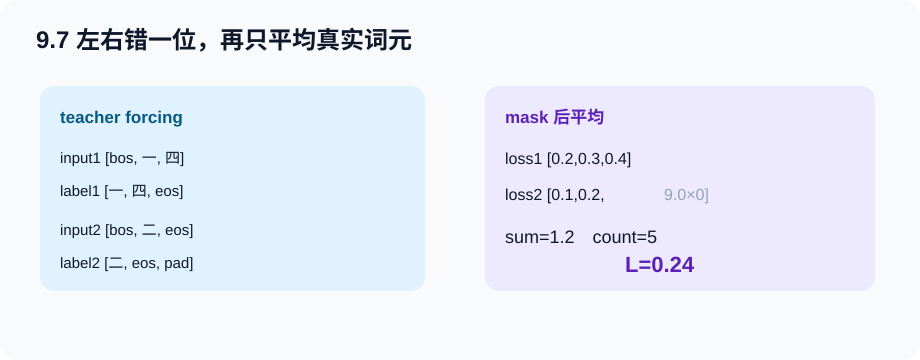

---

## 9.8 束搜索

### 三种搜索策略

设词表大小 $V$、最大生成长度 $T$：

| 策略 | 每步保留 | 近似计算量 | 特点 |
| --- | --- | --- | --- |
| 贪心 | 1 条 | $O(TV)$ | 快，但早期一步选错无法回头 |
| 穷举 | 所有 | $O(V^T)$ | 理论完整，实际不可行 |
| 束搜索 | K 条 | 约 $O(KTV)$ | 在质量与开销间折中 |

贪心每步取局部最大概率，不保证整句概率最大。例如第一步略次的词，可能带来后面一串高概率词；贪心已把它丢掉，无法恢复。

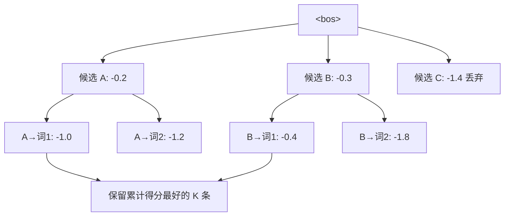

束搜索在对数概率空间累加：

$$
\log P(y_1,\ldots,y_t\mid x)
=\sum_{j=1}^{t}\log P(y_j\mid y_{<j},x).
$$

使用对数可把连乘变累加并防止概率下溢。

### 为什么要长度归一化

每个新词的对数概率不大于 0，句子越长，累计分数通常越负，因此未经修正的搜索偏爱过早输出 eos。常见长度得分：

$$
s(\mathbf y)=
\frac{\log P(\mathbf y\mid\mathbf x)}
{|\mathbf y|^\alpha}.
$$

$\alpha$ 越大，对长句补偿越强。它是推理超参数，应在验证集选择，不是越大越好。

### 每个 beam 必须保存自己的状态

程序中每条候选保存：

1. 已生成词元列表；
2. 累计对数概率；
3. 与这条前缀对应的解码器状态。

不同前缀产生不同状态，不能所有 beam 共享一个可变状态。扩展候选时还要过滤 pad 和 bos；已生成 eos 的候选应停止扩展，但继续参与最终排序。

完整运行：

~~~bash
python code/ch09/seq2seq_translation.py --epochs 30 --beam-size 3
~~~

束搜索不保证一定优于贪心。若模型概率估计很差，更宽的 beam 只是更认真地搜索错误分布；有时还会放大短句偏好。

### 新手例子：第一步略差的候选为何可能最终更好

- **小输入**：beam size `K=2`。第 1 步候选 A、B 的累计对数概率分别为 `-0.2`、`-0.3`；第 2 步扩展后，`A→x=-1.0`、`A→y=-1.2`、`B→x=-0.4`、`B→y=-1.8`，这里都已是累计分数。
- **逐步过程**：第 1 步保留 A 与 B；第 2 步把四条扩展一起排序，保留 `B→x(-0.4)` 与 `A→x(-1.0)`。
- **具体输出**：最佳序列是 `B→x`，累计分数 `-0.4`。贪心第 1 步只留 A，最终最多得到 `A→x=-1.0`，反而更差。
- **这个例子说明了什么？** 束搜索通过暂时保留多个前缀，给“当前略次、后续更顺”的路径一次翻盘机会。
- **新手最容易误解什么？** 排序必须用从开头累加的对数概率，不能只看本步概率；而且每条前缀必须带自己的解码器状态，不能共享同一个状态对象。

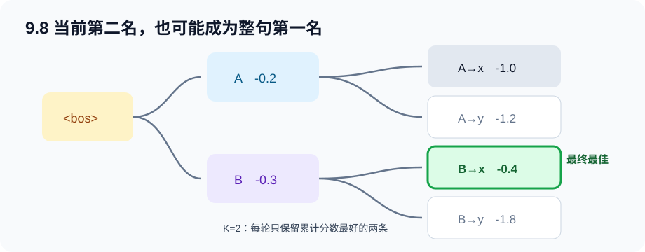

---

## 完整代码职责与逐段解析

### A. 门控、深层与双向网络

[打开 gated_rnn_demo.py](../code/ch09/gated_rnn_demo.py)

| 代码块 | 输入 → 输出 | 重点 |
| --- | --- | --- |
| <code>gru_step</code> | X、H_old → H、Z、R | 两门的元素级控制 |
| <code>lstm_step</code> | X、H_old、C_old → H、C、三门 | 加法记忆通路 |
| <code>SequenceClassifier</code> | (B,T,D) → (B,2) | 统一比较层数和方向 |
| <code>make_classification_data</code> | 参数 → 合成序列 | 标签依赖整段历史 |
| <code>train_classifier</code> | 模型与数据 → 准确率 | forward、loss、clip、update |

~~~bash
python code/ch09/gated_rnn_demo.py --epochs 30
~~~

程序会打印四种网络：

- 单层 GRU；
- 单层 LSTM；
- 两层 GRU；
- 双向 LSTM。

不要只比较一次运行的准确率来宣布“谁最好”。这个小数据用于验证 API、Shape 与状态读取；严谨比较需重复随机种子、控制参数量并使用独立验证集。

### B. seq2seq 翻译

[打开 seq2seq_translation.py](../code/ch09/seq2seq_translation.py)

| 代码块 | 主要职责 | 关键 Shape/规则 |
| --- | --- | --- |
| <code>Vocab</code> | 词元与整数互换 | 特殊词元索引固定 |
| <code>TranslationDataset</code> | 句对编码 | 源加 eos；目标加 bos/eos |
| <code>collate</code> | 动态 padding | 同时返回 valid lengths |
| <code>Encoder</code> | 源句 → 最终状态 | (B,S) → (1,B,H) |
| <code>Decoder</code> | 前缀与状态 → logits | (B,T) → (B,T,V) |
| <code>masked_cross_entropy</code> | 忽略 pad 的损失 | logits 先转 (B,V,T) |
| <code>train_model</code> | teacher forcing 训练 | 目标输入/标签错一位 |
| <code>greedy_decode</code> | 单候选生成 | 每步反馈 argmax |
| <code>beam_search_decode</code> | K 候选生成 | 累计 log 概率与独立状态 |
| <code>bleu</code> | 译文评估 | 短句惩罚与 n-gram |

快速 smoke test：

~~~bash
python code/ch09/seq2seq_translation.py --epochs 2 --num-examples 256
~~~

两轮只检查全链路，不保证译对。想观察明显学习效果，使用默认训练轮数。

---

## Hot 100 算法迁移：215. 数组中的第 K 个最大元素

> 出处：[LeetCode 热题 100 官方题单](https://leetcode.cn/studyplan/top-100-liked/) 
> 原题直达：[215. 数组中的第 K 个最大元素](https://leetcode.cn/problems/kth-largest-element-in-an-array/) 
> 完整答案：[hot100_kth_largest.py](../code/ch09/hot100_kth_largest.py)

### 为什么它和本章有关

束搜索每一步会从许多扩展候选中留下分数较高的一小批，核心操作之一就是 Top-k。本题把序列状态拿掉，只练习“怎样找到排名为 k 的元素，而不完整排序”。

差别同样重要：快速选择只返回一个顺序统计量；束搜索需要保留多条候选序列、各自的累计对数概率和独立解码器状态。因此会做本题，不等于已经实现束搜索。

### 原题的原创摘要

给定可含重复值的整数数组和整数 <code>k</code>，返回数组按降序排列后位于第 <code>k</code> 个的位置的元素。重复元素分别占排名。

### 本题学习目标

- 把“第 k 大”转换为升序下标 <code>n-k</code>；
- 理解分区后为什么只需继续搜索目标所在的一侧；
- 用三路分区正确处理大量重复元素；
- 说清快速选择的期望复杂度和最坏情况，而不是笼统说“比排序快”。

### 白话例子：<code>[3,2,1,5,6,4]</code> 的第 2 大

数组长度为 6，第 2 大等价于升序下标 <code>6-2=4</code>。假设本轮枢轴取 4：

1. 分区后，小于 4 的区域包含 1、2、3；
2. 等于区域包含 4；
3. 大于区域包含 5、6；
4. 目标下标 4 落在“大于 4”的右侧，所以左侧三个数和 4 都不用再排序；
5. 只在 5、6 所在区域继续选择，最终目标是 5。

三路分区把区间保持为：

~~~text
[ 小于 pivot | 等于 pivot | 尚未处理 | 大于 pivot ]
~~~

当目标下标落进“等于 pivot”区域时，答案就是 pivot；否则只保留左侧或右侧继续处理。

**这个例子说明了什么？** 我们只关心一个排名，不需要知道其他所有元素的完整次序，所以每轮可以丢掉与目标无关的一侧。

**新手最容易误解什么？** 第 k 大不是第 k 个不同的数。数组 <code>[5,5,4]</code> 的第 2 大仍是 5。

### 复杂度与易错点

- 期望时间复杂度：$O(n)$。随机枢轴通常让待搜索区间快速缩小。
- 最坏时间复杂度：$O(n^2)$。若连续选到极不平衡枢轴仍可能退化。
- 额外空间：分区本身 $O(1)$；本答案为不修改输入而复制数组，因此实际另用 $O(n)$。
- 易错点 1：目标升序下标是 <code>n-k</code>，不是 <code>k-1</code>。
- 易错点 2：交换右侧元素到扫描位置后，不能立即前进，因为换来的值还没检查。
- 易错点 3：束搜索若要保留完整前 k 个候选，除了阈值还要保存候选身份和各自状态。

运行离线自测：

~~~bash
python code/ch09/hot100_kth_largest.py
~~~

---

## 常见坑与排错顺序

### GRU/LSTM 的 loss 不下降

1. 先在极小数据上尝试过拟合；
2. 打印输入、outputs、state、logits Shape；
3. 检查分类到底取了哪一个状态；
4. 检查 LSTM 是否正确解包 H 与 C；
5. 打印裁剪前梯度范数和学习率；
6. 再检查门偏置、初始化与层数。

### 双向输出维度突然翻倍

双向 outputs 最后一维为 $2H$。下游 Linear 的输入维必须同步改为 $2H$；state 第一维也变为 <code>layers*2</code>。

### 机器翻译损失很低但只输出 pad

检查 pad 是否参与损失。最可靠的诊断是打印每句 mask 的 True 数是否等于去掉 bos 后的有效目标长度；同时确认 eos 仍被计入监督。

### 输出永远不出现 eos

检查训练标签是否保留 eos、decoder targets 是否右移正确、推理是否把 bos 当首输入。始终设置最大生成步数作为安全边界。

### 训练好、推理差

先做 teacher-forced 准确率与自回归结果对照。若前者高、后者差，可能是暴露偏差或早期错误累积；也要排除推理状态未更新、每步输入 Shape 错和忘记 eval/inference mode。

### 束搜索比贪心更差

检查累计的是 log 概率还是原概率、是否为每条候选保存独立状态、长度归一化是否合理、eos 候选是否正确停止。模型本身未学好时，更宽 beam 也不会神奇修复。

### pack_padded_sequence 报错

有效长度必须是一维、为正且对应当前 batch，通常放在 CPU；若没有按长度降序排序，就使用 <code>enforce_sorted=False</code>。源句应至少含 eos，因此长度不会为 0。

---

### 面试八股加练：不能只背结论

21. 【八股深答】GRU 与 LSTM 应怎样比较，不能只说谁参数少？

**结论：**GRU 用更新门、重置门和单一隐藏状态，结构较简；LSTM 用输入、遗忘、输出门及独立细胞状态，控制更细。**机制：**两者都通过加性状态路径缓解普通 RNN 的长链乘积问题，但门控方程和可保存的信息不同。**工程影响：**GRU 通常参数和计算更少，LSTM 在部分长依赖任务更灵活；最终应在相同预算和验证集上比较。**误区：**不存在“LSTM 一定更准”或“GRU 已解决所有梯度消失”。**追问：**参数量比较必须基于相同输入维、隐藏维和层数推导。

22. 【八股深答】teacher forcing 为什么造成 exposure bias？

**结论：**训练时解码器读真实上一个 token，推理时却读自己的预测，两阶段输入分布不一致。**机制：**推理中一次错误会成为下一步条件并继续传播，而训练很少学到如何从自己的错误前缀恢复。**工程影响：**评估必须自回归生成，不能只看 teacher-forced loss；可尝试 scheduled sampling、序列级目标或更强搜索，但各有偏差。**误区：**把 teacher forcing 比例降到 0 不一定更好，训练可能更不稳定。**追问：**因果 mask 解决“偷看未来”，teacher forcing 解决输入构造，两者不是同一件事。

23. 【八股深答】beam size 越大为什么不保证翻译越好？

**结论：**更大的 beam 更充分地优化模型给出的序列分数，但模型分数本身不等于人工质量。**机制：**对数概率按长度累加会偏爱短句，模型还可能校准不佳或把高分给重复序列。**工程影响：**需正确复制每条候选状态，设置长度归一化、停止条件，并用任务指标和样例共同选 beam。**误区：**beam search 不是穷举；有限 beam 仍会剪枝，beam=1 才退化为贪心。**追问：**增大 beam 后句子变短时，先检查 EOS 分数与长度惩罚。

## 本章速查表

| 问题 | 一句话答案 |
| --- | --- |
| GRU 更新门大意味着什么？ | 按本文公式，更保留旧状态 |
| GRU 重置门控制什么？ | 生成候选状态时读取多少旧状态 |
| LSTM 为何有 H 和 C？ | C 是内部记忆，H 是对外暴露状态 |
| LSTM 哪条通路利于长依赖？ | C 的门控加法更新 |
| 深层 RNN 增加哪种深度？ | 同一时间步的层间表示深度 |
| 双向 RNN 输出宽度？ | 通常为 2H |
| 双向 RNN 能用于因果生成吗？ | 不能直接用，它需要未来输入 |
| 目标序列为何加 bos/eos？ | 标记开始输入和可学习的停止位置 |
| pad 是否计入 loss？ | 不应计入 |
| teacher forcing 是什么？ | 训练时输入真实目标前缀 |
| 束搜索为何用 log 概率？ | 防下溢并把乘积变为和 |
| beam 越宽越好吗？ | 不一定，更慢且可能放大模型偏差 |

---

## Hot 100 加练（本章共 3 题）

原有 #215 之外，新增 [#1143 最长公共子序列](https://leetcode.cn/problems/longest-common-subsequence/) 与 [#72 编辑距离](https://leetcode.cn/problems/edit-distance/)，练双序列前缀状态和转移。解析见[新增题完整解析](leetcode-hot100-expanded-practice.md#第-9-章双序列状态转移)，代码见 [hot100_longest_common_subsequence.py](../code/ch09/hot100_longest_common_subsequence.py) 与 [hot100_edit_distance.py](../code/ch09/hot100_edit_distance.py)。

## 主动回忆：先遮住答案再作答

1. 【解释】GRU 更新门和重置门分别控制什么？

按本文公式，更新门 Z 控制旧状态在最终状态中保留多少；重置门 R 控制生成候选状态时读取多少旧状态。Z 接近 1 更像复制旧记忆，R 接近 0 则候选状态近似忽略过去。

2. 【极端推演】若 GRU 的 Z 全为 1，新状态是什么？梯度通路有何直觉？

$H_t=H_{t-1}$，候选状态不写入。状态有一条近似恒等复制通路，信息与梯度更容易跨过该时间步；但若长期总为 1，模型也无法吸收新输入。

3. 【Shape】X 为 (32,16)、H_old 为 (32,64)，GRU 各门和新 H 是什么 Shape？

更新门、重置门、候选状态与新状态全部是 (32,64)。输入到门的权重是 (16,64)，状态到门的权重是 (64,64)。

4. 【辨析】为什么不能把 GRU 的星号门控乘法写成矩阵乘法？

门要逐样本、逐隐藏通道地控制对应状态分量，所以是同 Shape 张量按元素乘。矩阵乘法会混合通道并改变语义或 Shape，不再是软开关。

5. 【解释】LSTM 的 C 与 H 分别是什么？

C 是内部记忆元，通过遗忘与写入的加法通路更新；H 是对外状态，为输出门乘 tanh(C)，既传给下一时间步的门计算，也供下游读取。二者 Shape 通常相同但职责不同。

6. 【公式推演】若遗忘门 F=1、输入门 I=0，C 如何变化？

$C_t=1\odot C_{t-1}+0\odot\widetilde C_t=C_{t-1}$。旧记忆原样保留，没有新内容写入。这条近似恒等通路有利于长期保存信息。

7. 【代码诊断】对 LSTM 返回的 state 直接调用 state.detach 为什么失败？

因为 state 是 (H_n,C_n) 元组，不是张量。应分别 detach，例如 <code>(H_n.detach(), C_n.detach())</code>，或写能递归处理元组的状态函数。

8. 【Shape】两层双向 LSTM 的 H_n 是什么 Shape？

是 (4,B,H)，因为第一维等于 layers × directions = 2 × 2。outputs 最后一维是 2H；batch_first 只影响 inputs/outputs，不影响 H_n 和 C_n。

9. 【解释】时间上已经展开很深，为何还要深层 RNN？

时间深度负责在不同位置传递信息；层深度负责在同一位置进行多级表示变换。两者作用不同。增加层数可提升抽象能力，但也增加计算、优化难度和过拟合风险。

10. 【诊断】为何双向网络不能直接做下一词因果预测？

反向状态读取了当前位置之后的真实词元。训练时使用它等于泄露答案，而推理生成时未来词根本不存在，造成不可实现的输入条件与训练推理错位。

11. 【数据】pad、bos、eos 在 seq2seq 中分别扮演什么角色？

pad 只用于补齐批次并应从 loss 排除；bos 是解码器第一步的输入起点，通常不是预测目标；eos 是真实停止标记，必须作为监督目标让模型学会结束。

12. 【代码推演】目标为 bos A B eos，teacher forcing 的输入和标签各是什么？

解码器输入是 bos A B，标签是 A B eos。代码分别为 target[:, :-1] 与 target[:, 1:]，二者时间长度相同且整体错开一位。

13. 【Shape】logits 为 (B,T,V)，为什么交叉熵前要 transpose(1,2)？

PyTorch 对高维 CrossEntropyLoss 约定类别维在第 1 维，期望输入 (B,V,T) 与标签 (B,T)。转置只换轴，不改变每个位置对应的类别分数。

14. 【诊断】masked loss 忘记减去 bos 对应长度会怎样？

decoder targets 已比原 target 少一个位置，有效长度也应减 1。忘记后 mask 可能多包含一个 pad 位置，使短句损失被填充符污染，并改变不同长度样本的权重。

15. 【解释】训练时 teacher forcing 很准，推理仍可能迅速跑偏，为什么？

训练每步看到真实前缀，即使模型上一位置会猜错也不会污染下一输入；推理只能看自己的预测，一个早期错误会改变后续条件分布并持续累积，这称为暴露偏差的一部分。

16. 【搜索】为什么贪心每步最优不保证整句最优？

序列概率是各步条件概率乘积。第一步概率略低的候选可能让后续多个词概率很高，从而整句总概率更大；贪心第一步已永久丢弃它，无法回头。

17. 【实现】束搜索中每条候选为何必须保存独立解码器状态？

状态是该候选完整前缀的函数。不同词元前缀产生不同状态；若共享状态，就会用另一条路径的历史计算下一词，候选分数与序列都失去含义。

18. 【诊断】增大 beam size 后结果反而更短，先检查什么？

先检查是否直接累计负 log 概率而没有长度归一化，导致搜索偏爱早出 eos；再查 eos 候选是否停止扩展、长度是否包含 bos、alpha 是否过小。模型自身的长度偏差也可能随更宽 beam 被放大。

19. 【训练安全】梯度裁剪为什么不能替代调低学习率？

裁剪只在范数超过阈值时缩放当前梯度，无法修复长期过大的基础步长，也可能让大量 batch 都被压到同一边界。若裁剪频繁触发，应检查学习率、数据与初始化，而不是只依赖安全带。

20. 【评价】BLEU 高是否等于翻译一定正确？

不等于。BLEU 主要衡量与参考文本的 n-gram 重合并做长度惩罚；合法同义改写可能分低，词面重合但语义错误也可能分高。应结合多参考、人工样例与任务相关指标。

## 学完本章应该能做到

- 不看笔记画出 GRU 两门、LSTM 三门及其信息流；
- 正确推导门、状态、深层和双向输出的 Shape；
- 说明梯度裁剪能做什么、不能做什么及调用位置；
- 判断双向模型是否造成未来信息泄漏；
- 从平行句对构建词表、特殊词元、padding 和有效长度；
- 解释编码器、解码器、teacher forcing、遮蔽损失与自回归推理；
- 从零说明贪心、穷举、束搜索、对数得分和长度归一化；
- 直接运行两份完整程序，并按本章排错顺序定位问题。

下一章将引入注意力机制：解码器不必把所有源句信息挤进一个固定向量，而能在生成每个目标词时选择性读取最相关的源位置。

[上一章：循环神经网络](ch08-recurrent-neural-networks.md) · [下一章：注意力机制](ch10-attention-mechanisms.md) · [返回总目录](../README.md)
