# 第 10 章：注意力机制

> 复习定位：让模型按当前问题，从一组信息中动态读取最相关的部分 
> 内容脉络：10.1–10.7 · PyTorch · 离线可运行 
> 原创学习笔记，正式小节对照[《动手学深度学习》中文 2.0 官方目录](https://zh-v2.d2l.ai/chapter_attention-mechanisms/index.html)

[注意力评分完整代码](../code/ch10/attention_scoring.py) · [多头自注意力完整代码](../code/ch10/multihead_self_attention.py) · [Transformer 复制任务完整代码](../code/ch10/transformer_copy_task.py)

## 一句话主线

**注意力把“查询与哪些键相关”变成一组归一化权重，再用权重汇聚对应的值；多头、自注意力和 Transformer 都是在扩展这套读信息的方法。**

## 三个月后复习入口

| 场景 | 先看什么 | 达标标准 |
| --- | --- | --- |
| 新手第一次学 | Q/K/V 白话 → 手算两项 Softmax → mask → 多头 | 能说清“匹配谁”和“读取什么”不是同一个张量 |
| 90 天后复习 | Shape 表 → 缩放点积推导 → mask 图 → Transformer 数据流 | 能从 `(B,T,D)` 推出注意力权重和输出 Shape |
| 面试前复习 | $\sqrt{d_k}$、padding/causal mask、多头拆并、位置编码、训练推理解耦 | 答案包含公式、数值稳定和泄漏风险 |

**最小记忆集：**

1. Q 提问题、K 供匹配、V 提供真正被加权读取的内容；
2. 分数先 mask 再 Softmax，非法键不能占用概率质量；
3. 点积除以 $\sqrt{d_k}$ 是为了稳定标准差而不是改变 Shape；
4. 多头是不同投影子空间，不是复制同一个注意力；
5. 自注意力没有天然顺序，需要位置编码；解码训练还要 causal mask。

### 专有名词白话表

| 术语 | 白话解释 | 常见 Shape |
| --- | --- | --- |
| 查询（query） | 当前这个位置想找什么 | `(B,Q,D_k)` |
| 键（key） | 每个候选位置拿什么特征与查询比较 | `(B,K,D_k)` |
| 值（value） | 匹配完成后真正被加权读取的内容 | `(B,K,D_v)` |
| 注意力分数 | 查询和每个键的原始匹配程度 | `(B,Q,K)` |
| mask | 把 padding 或未来位置标成不能读取 | 布尔/加性张量 |
| 多头 | 用多套投影并行学习不同关系，再拼回去 | `(B,H,T,d_h)` |
| 位置编码 | 给 token 加入“它在第几个位置”的信息 | `(1,T,D)` 等 |
| 残差与归一化 | 保留原输入并稳定每层数值尺度 | Add & Norm |

### 教材高价值问答

【角色】既然 Q、K、V 都来自同一个输入，自注意力为什么还要三个投影？

三个投影承担不同角色：Q 表示当前位置的检索需求，K 表示各位置可被匹配的索引，V 表示匹配后要汇聚的内容。独立参数允许“用一种特征判断相关性、用另一种特征传递信息”。它们可以来自同一输入，但数值和学习目标不必相同；交叉注意力中 Q 与 K/V 甚至来自不同序列。

【遮蔽】padding mask 和 causal mask 同时存在时应该怎样理解？

padding mask 屏蔽某个样本补齐出来的无效键，causal mask 屏蔽当前目标位置右侧的未来键。二者解决不同泄漏，通常取逻辑并集后作用于 Softmax 前的 logits。只把 value 置零仍会让无效位置占概率，先 Softmax 后清零又会破坏合法权重和为 1。

【并行】Transformer 训练能并行所有位置，为什么生成仍常逐词进行？

训练时真实目标前缀整段已知，causal mask 能在一次矩阵运算中同时保证每个位置只读左侧。生成时第 $t$ 个 token 是模型上一步预测结果，在得到它之前无法构造第 $t+1$ 步输入。因此注意力层内部可并行，外部自回归依赖仍串行；KV cache 只减少重复计算，不消除依赖。

不要先背 Transformer 方框图。先把这句说清：

> 查询决定此刻要找什么，键负责被匹配，值才是最后被读取的内容。

## 本章地图

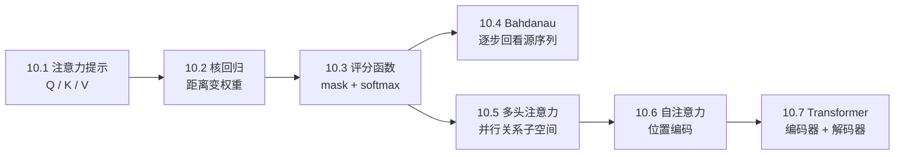

| 记号 | 常见 Shape | 白话含义 |
| --- | --- | --- |
| $Q$ | `(B,Q,D_q)` | 一批查询，共 `Q` 个问题 |
| $K$ | `(B,K,D_k)` | 一批键，共 `K` 个可匹配位置 |
| $V$ | `(B,K,D_v)` | 每个键对应的实际内容 |
| scores | `(B,Q,K)` | 每个查询对每个键的原始匹配分 |
| weights | `(B,Q,K)` | mask 后 softmax 的读取比例 |
| output | `(B,Q,D_v)` | 每个查询汇聚出一个值向量 |

这里最重要的 Shape 规律是：**输出的查询数来自 $Q$，输出宽度来自 $V$。**

---

## 10.1 注意力提示

### 为什么需要“选择性读取”

人在书桌上找红色水杯时，不会把桌上每个像素平均处理。颜色和“水杯”这个任务是主动提示；突然闪烁的屏幕则会成为无意提示。机器注意力借用的是这种**按线索分配处理权重**的思想，不是在声称神经网络拥有人的意识。

没有注意力时，常见做法是把所有信息压进固定向量，或对所有位置平均。问题是：同一组信息面对不同问题，重要位置会变。问“谁做了什么”与问“事情发生在哪”，需要读的词并不相同。

### 查询、键和值不是三个固定物体

- **查询 query**：当前问题或需求；
- **键 key**：用于判断“是否匹配查询”的标签；
- **值 value**：匹配后真正取回的内容。

可以把数据库检索当直觉：输入检索词是查询，索引字段是键，整条记录是值。键和值经常来自同一个位置，却不必数值相等、维度相等。

注意力汇聚的一般形式是：

$$
\mathrm{Attention}(q,K,V)
=\sum_{i=1}^{K}\alpha(q,k_i)v_i,
\qquad
\alpha(q,k_i)\ge 0,
\quad
\sum_i\alpha(q,k_i)=1.
$$

权重 $alpha$ 由查询和键决定，输出是值的加权和。

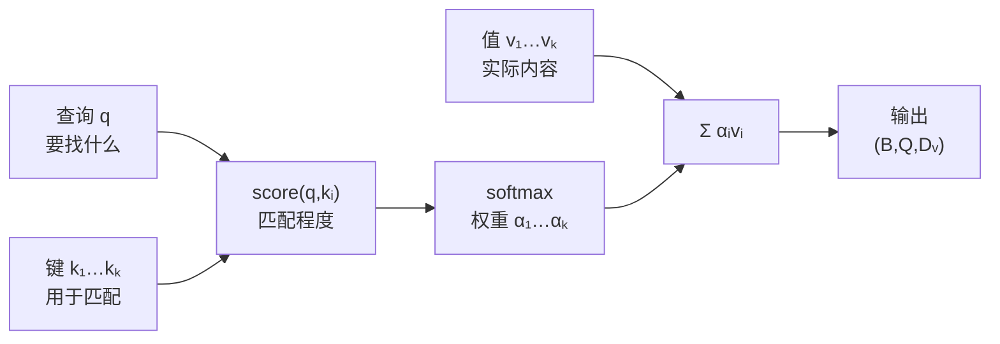

最容易混淆的是“权重由谁决定”。值参与最后的加权和，但标准注意力的匹配权重由查询与键计算。

### 可视化能证明什么，不能证明什么

注意力热图能显示某层、某头在一次前向中的权重分配，适合查 padding 是否被读到、不同查询是否关注不同位置。它不能自动证明模型的因果解释：权重大只说明这条计算路径分到的比例大，不等于该输入一定是人类意义上的唯一原因。

### 新手例子：在桌面清单中找红杯子

- **生活化问题 / 小数据输入**：桌上有三件物品。键是 `[(蓝,书), (红,杯), (红,笔)]`，值是 `[《D2L》, 350mL水杯, 中性笔]`。查询是“红色杯子”。
- **逐步过程**：查询分别与三个键比较，假设原始分数为 `[0, 4, 1]`；softmax 后约为 `[0.017, 0.936, 0.047]`；再按这些比例加权三个值的表示。
- **具体输出**：输出主要由“350mL 水杯”的值向量贡献，而红笔仍有少量权重，因为它只匹配了颜色。
- **它说明什么**：查询不是直接挑值，而是先与键做相关性判断；键可以只保存适合检索的属性，值保存更完整内容。
- **常见误解**：注意力并非一定只选一个位置。softmax 是软选择，多个值可以同时参与。

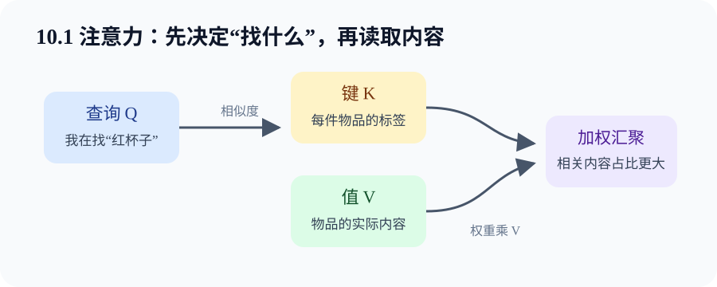

---

## 10.2 注意力汇聚：Nadaraya–Watson 核回归

### 从平均到“近邻多说几句”

有一组训练点 $(x_i,y_i)$，想预测新位置 $x$ 的函数值。最朴素的平均汇聚完全忽略 $x$：

$$
\hat y=\frac{1}{n}\sum_{i=1}^n y_i.
$$

它对所有查询给同一个答案。核回归改成按查询与训练点的距离加权：

$$
\hat y(x)=\sum_i \alpha(x,x_i)y_i,
\qquad
\alpha(x,x_i)=
\frac{K(x-x_i)}{\sum_jK(x-x_j)}.
$$

若使用高斯核并省略公共常数：

$$
\alpha(x,x_i)
=\mathrm{softmax}\left(-\frac{(x-x_i)^2}{2h^2}\right)_i.
$$

$h$ 是带宽：小 $h$ 更信附近少数点，曲线灵活但可能抖；大 $h$ 会平均更远的点，曲线平滑但可能欠拟合。

### 它为什么已经是注意力

| 核回归元素 | 注意力角色 |
| --- | --- |
| 新位置 $x$ | query |
| 训练输入 $x_i$ | keys |
| 训练标签 $y_i$ | values |
| 距离核 | score function |
| 归一化核值 | attention weights |

对一批查询，若 `queries:(Q,1)`、`keys:(1,K)`，广播距离得到 `(Q,K)`；权重乘 `values:(K,1)` 后得到 `(Q,1)`。

### 非参数与带参数版本

非参数版本直接使用固定带宽。带参数版本可以学习缩放 $w$：

$$
\alpha(x,x_i)=
\mathrm{softmax}
\left(-\frac{1}{2}((x-x_i)w)^2\right)_i.
$$

$w$ 大，相当于有效带宽变小，注意力更尖；$w$ 小，注意力更平。训练 $w$ 时要对每个训练点做 leave-one-out：预测 $y_i$ 时不要把它自己放进键值集合，否则模型只需把自己权重拉满。

### 代码映射

完整程序中的 `nadaraya_watson_demo`：

~~~python
scores = -0.5 * ((query[:, None] - train_x[None, :]) / bandwidth).square()
weights = torch.softmax(scores, dim=-1)
prediction = weights @ train_y[:, None]
~~~

- 输入 `query:(Q,)`、`train_x:(K,)`，广播分数为 `(Q,K)`；
- 输出 `prediction:(Q,1)`；
- 若 `bandwidth` 需要梯度，会建立关于它的计算图；
- 这三行只计算输出，直到 optimizer 的 `step()` 才改变参数。

### 新手例子：用邻居估计 1.6 处的温度

- **生活化问题 / 小数据输入**：距离位置 `[0,1,2,3,4]` 的测温值是 `[0.0,0.84,0.91,0.14,-0.76]`。现在问位置 `1.6` 的估计，带宽取 `0.6`。
- **逐步过程**：先算与各点距离 `[1.6,0.6,0.4,1.4,2.4]`；变成负平方分数并 softmax，程序得到约 `[0.019,0.404,0.533,0.044,0.000]`；再用这些权重乘温度值求和。
- **具体输出**：预测约 `0.831`。离 1.6 最近的 2 和 1 权重最大。
- **它说明什么**：注意力可以没有神经网络；核心只是“查询相关性 → 归一化权重 → 汇聚值”。
- **常见误解**：最近邻不等于核回归。最近邻只取一个点，核回归通常软汇聚多个点。

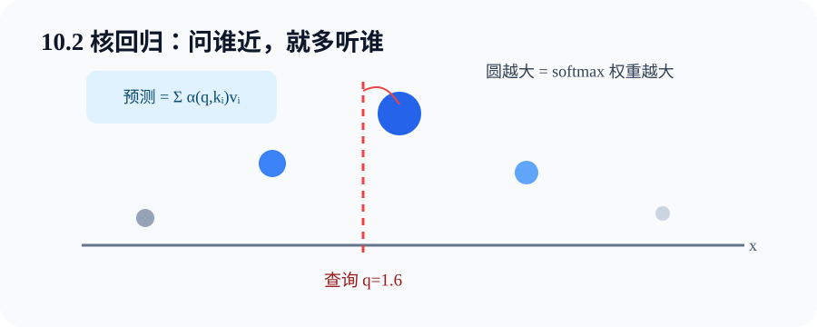

---

## 10.3 注意力评分函数

评分函数把查询－键对变成标量；softmax 再把一行分数变成可解释的权重。真正写代码时，遮蔽、维度与数值尺度比公式名称更容易出错。

### 先遮蔽，再 softmax

批次中的序列通常 padding 到同一长度。若样本有效键数是 `valid_length`，无效位置不能分到概率：

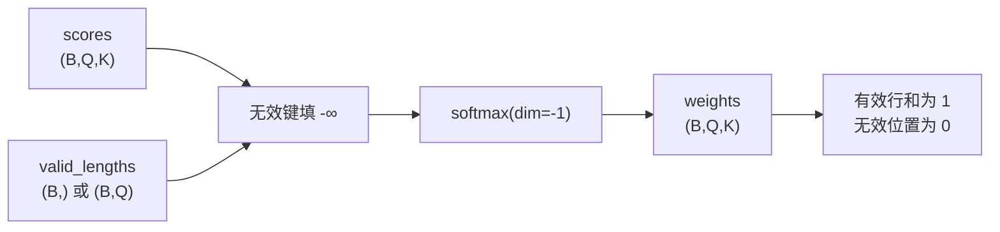

如果先 softmax 再把 padding 权重置零，有效权重之和会小于 1；除非重新归一化，否则输出尺度被错误缩小。

`valid_lengths:(B,)` 表示同一样本所有查询共享键长度；`(B,Q)` 可表达因果注意力中每个查询各有可见前缀。

### 加性注意力

$$
a(q,k)=\mathbf v^\top
\tanh(W_q q+W_k k).
$$

加性注意力先把不同维度的查询和键投影到共同隐藏空间，所以 $D_q$ 与 $D_k$ 可以不同。

对 `queries:(B,Q,Dq)`、`keys:(B,K,Dk)`：

1. 投影成 `(B,Q,H)` 和 `(B,K,H)`；
2. 分别插入键/查询轴并广播相加，得到 `(B,Q,K,H)`；
3. `tanh` 后投影到 `(B,Q,K)`；
4. mask + softmax 得权重；
5. `bmm(weights, values)` 得 `(B,Q,Dv)`。

### 缩放点积注意力

当查询和键宽度都是 $d$：

$$
a(q,k)=\frac{q^\top k}{\sqrt d},
\qquad
\mathrm{Attention}(Q,K,V)
=\mathrm{softmax}\left(\frac{QK^\top}{\sqrt d}\right)V.
$$

不缩放时，如果各分量方差约为 1，点积方差会随 $d$ 增大。大绝对值分数让 softmax 很尖，非最大位置梯度接近 0。除以 $\sqrt d$ 把尺度拉回更稳定范围。

| 对比 | 加性 | 缩放点积 |
| --- | --- | --- |
| 查询/键宽度 | 可不同 | 必须相同 |
| 可训练评分参数 | 有 | 评分本身没有，Q/K 投影通常有 |
| 核心运算 | 广播 + MLP | 批量矩阵乘 |
| 常见使用 | Bahdanau 等 | 多头注意力、Transformer |

完整代码：[attention_scoring.py](../code/ch10/attention_scoring.py)

~~~bash
python code/ch10/attention_scoring.py
~~~

### 新手例子：最后两格是 padding，不能“偷票”

- **生活化问题 / 小数据输入**：某查询对 4 个键的分数是 `[1,2,100,100]`，但有效长度为 `2`，所以后两格只是 padding。
- **逐步过程**：先把后两格改成极小值，成为 `[1,2,-∞,-∞]`；再 softmax 前两项。
- **具体输出**：权重约为 `[0.269,0.731,0,0]`，而不是让两个 `100` 几乎拿走全部权重。
- **它说明什么**：mask 处理的是“可不可以看”，评分处理的是“有多相关”；合法性必须先于归一化。
- **常见误解**：给 padding 分数填 `0` 不够，因为有效分数可能是负数，padding 反而会得到较大权重。

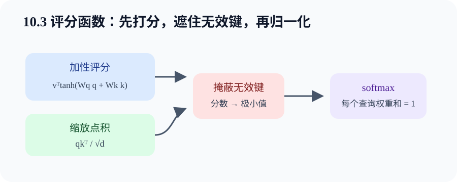

---

## 10.4 Bahdanau 注意力

### 固定上下文为什么不够

第 9 章基础 seq2seq 把整个源句压进最终隐状态。短句还能工作，长句就像读完整页后合上书，只靠一句摘要逐词翻译。Bahdanau 注意力让解码器每生成一步，都用当前状态查询**全部编码器输出**。

设编码器输出 $h_i\in\mathbb R^{H_e}$，解码器上一步状态 $s_{t-1}\in\mathbb R^{H_d}$：

$$
e_{ti}=v^\top\tanh(W_s s_{t-1}+W_hh_i),
$$

$$
\alpha_{ti}=\mathrm{softmax}_i(e_{ti}),
\qquad
c_t=\sum_i\alpha_{ti}h_i.
$$

上下文 $c_t$ 与当前目标词嵌入共同送进解码器，产生 $s_t$ 和下一个词分布。

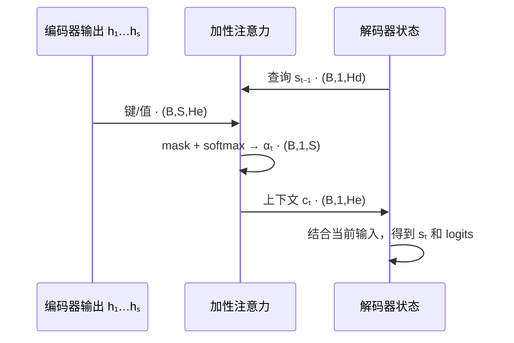

最容易混淆的是查询时刻：常见实现用 $s_{t-1}$ 先取得 $c_t$，再计算 $s_t$。若代码采用别的更新顺序，应以数据流为准，不要只认下标。

### Shape 跟踪

| 张量 | Shape | 说明 |
| --- | --- | --- |
| encoder outputs | `(B,S,He)` | 每个源位置都保留 |
| decoder state | `(B,Hd)` | 当前查询来源 |
| attention scores | `(B,1,S)` | 本步对所有源位置打分 |
| context | `(B,1,He)` | 本步动态摘要 |
| attention history | `(B,T,S)` | 全部目标步的对齐图 |

Bahdanau 不是“翻译专用层”。只要一个生成状态需要逐步读取输入位置，它都可作为软对齐模块。

### 代码映射

`bahdanau_decoder_step` 是一个独立时间步：

~~~python
query = decoder_state.unsqueeze(1)
context = attention(query, encoder_outputs, encoder_outputs, source_valid_lengths)
context = context.squeeze(1)
next_state = gru_cell(context, decoder_state)
~~~

- 输入 `decoder_state:(B,H)`、`encoder_outputs:(B,S,H)`；
- 输出 `context` 与 `next_state` 都是 `(B,H)`；
- forward 建立跨注意力与 GRU 的计算图；
- 代码没有 `step()`，因此只算梯度、不改变参数。

### 新手例子：翻译“我 爱 猫”时逐词翻原文

- **生活化问题 / 小数据输入**：源位置是 `[我, 爱, 猫]`。生成第一个目标词时，注意力权重是 `[0.85,0.10,0.05]`；生成第三个目标词时变为 `[0.05,0.10,0.85]`。
- **逐步过程**：第 1 步用解码状态查询三个编码输出，汇聚出偏向“我”的上下文；状态更新后，第 3 步同样查询，但新状态表达“现在缺宾语”，所以“猫”权重变大。
- **具体输出**：不同目标步得到不同 $c_t$，注意力历史形成 `T×S` 的软对齐矩阵。
- **它说明什么**：输入表示没有被压成唯一固定摘要；“读哪里”会随生成进度变化。
- **常见误解**：注意力权重不必严格一对一，也不保证单调。一个目标词可能结合多个源词。

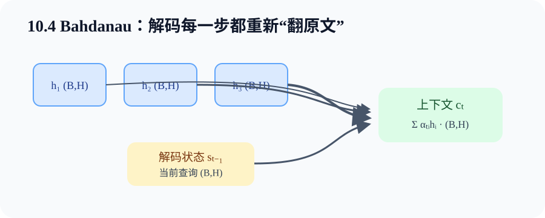

---

## 10.5 多头注意力

### 为什么一个权重矩阵可能不够

一句话中同时存在指代、语法、位置、实体等关系。单头把所有匹配压进一套权重。多头先做不同的可学习投影，让每个头在较小子空间里独立评分，再把结果拼接。

对第 $h$ 个头：

$$
\mathrm{head}_h
=\mathrm{Attention}(QW_h^Q,KW_h^K,VW_h^V),
$$

$$
\mathrm{MHA}(Q,K,V)
=\mathrm{Concat}(\mathrm{head}_1,\ldots,\mathrm{head}_H)W^O.
$$

若模型宽度 $D=8$、头数 $H=2$，每头宽度 $d_h=4$。必须满足 $D\bmod H=0$。

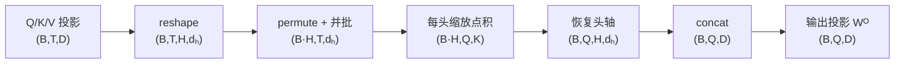

最常见 Shape 错误是直接 `reshape(B*H,T,d_h)` 却没先把头轴移到序列轴前。正确顺序通常是 `reshape(B,T,H,d_h) -> permute(B,H,T,d_h) -> reshape(B*H,T,d_h)`。

### 每个头真的会学到人类命名的关系吗

不保证。多头提供的是多个投影与权重分布的容量，不是“头 1 必然语法、头 2 必然指代”。部分头可能冗余，功能也会随数据与随机种子变化。分析头时要看任务表现、消融和多个样本，而不是给单张热图讲故事。

### 代码映射

完整程序：[multihead_self_attention.py](../code/ch10/multihead_self_attention.py)

~~~bash
python code/ch10/multihead_self_attention.py
~~~

`MultiHeadAttention.forward` 中只有线性层包含参数；拆头、换轴、`bmm` 和拼头只是改变数据视图或执行张量运算。`loss.backward()` 会计算投影梯度，仍需 optimizer 才会更新参数。

### 新手例子：两个头分别看“谁”和“离多远”

- **生活化问题 / 小数据输入**：序列 `[小王, 把, 书, 给, 小李]`，模型宽度 `D=8`、头数 `2`，所以每头宽 `4`。
- **逐步过程**：查询“给”时，头 1 的投影可能让人物键更匹配，权重偏向“小王、小李”；头 2 的投影可能强调局部搭配，权重偏向“书、给”。每头各输出 `(B,T,4)`，拼成 `(B,T,8)`，再过 $W^O$。
- **具体输出**：最终仍是 `(B,T,8)`，下游接口不因头数改变；内部却保留两套不同权重图 `(B,2,T,T)`。
- **它说明什么**：多头不是把同一结果复制两份，而是先用不同参数投影再各自汇聚。
- **常见误解**：头数翻倍不等于总宽度翻倍。固定 `D` 时，每头反而变窄；头太多会让 `d_h` 太小。

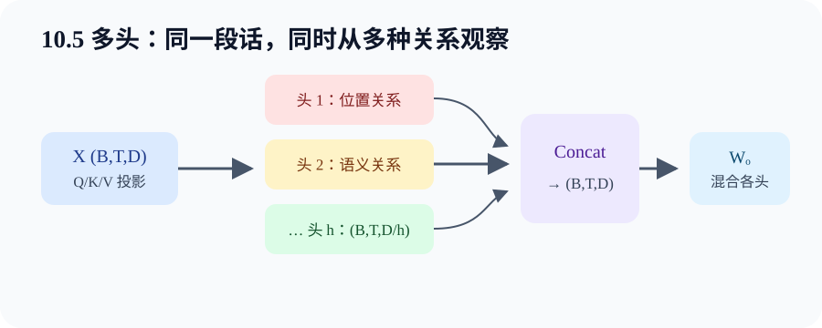

---

## 10.6 自注意力和位置编码

### 自注意力就是 Q、K、V 来自同一序列

输入 $X\in\mathbb R^{B\times T\times D}$，经过不同投影得到 $Q=XW^Q$、$K=XW^K$、$V=XW^V$。每个位置都能根据自身查询，读取序列中其他位置。

自注意力很适合建立远距离依赖，因为任意两位置的最短信息路径是一层。但标准全注意力要存 `(B,H,T,T)` 权重，时间和显存关于序列长度是 $O(T^2)$。

### CNN、RNN、自注意力对照

| 结构 | 每层并行 | 两个远位置的最短路径 | 主要代价（忽略宽度常数） |
| --- | --- | --- | --- |
| CNN（核宽 k） | 高 | 约 $O(T/k)$ 层 | $O(kT)$ |
| RNN | 时间步不可完全并行 | $O(T)$ 步 | $O(T)$ |
| 自注意力 | 高 | $O(1)$ 层 | $O(T^2)$ |

这张表不是说自注意力永远更快。短序列、很宽的隐藏层、硬件和实现都会改变实际耗时；长序列的平方权重矩阵尤其昂贵。

### 注意力本身不知道顺序

若只同时置换输入位置，未加位置的自注意力输出也会跟着同样置换。它知道“哪些内容相关”，却没有天然的第 1、第 2 个位置概念。因此输入通常加位置编码。

正弦位置编码：

$$
P_{pos,2i}=\sin\left(\frac{pos}{10000^{2i/D}}\right),
\qquad
P_{pos,2i+1}=\cos\left(\frac{pos}{10000^{2i/D}}\right).
$$

不同维度使用不同频率。输入变为：

$$
X_{in}=\mathrm{Embedding}(tokens)\sqrt D+P.
$$

`P:(1,T,D)` 沿 batch 广播，不需要为每个样本复制一份。

### 编码器 mask 与解码器因果 mask

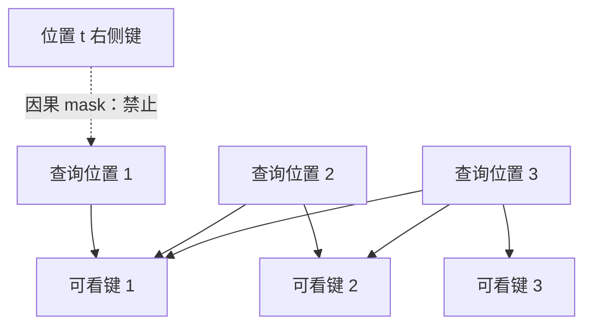

padding mask 防止读取“补齐出来的位置”；causal mask 防止读取“未来真实词”。两者解决不同问题，在解码器训练中往往同时存在。

### 新手例子：“我爱你”与“你爱我”不能相同

- **生活化问题 / 小数据输入**：两句使用相同词元集合：`[我,爱,你]` 与 `[你,爱,我]`。假设“我”和“你”的词嵌入固定。
- **逐步过程**：没有位置编码时，交换词元只会交换输出位置，模型没有额外信号说明哪个先出现；加入 `P[0],P[1],P[2]` 后，同一个“我”位于位置 0 或 2 时输入向量不同。
- **具体输出**：程序把同一零向量放在位置 0 和 1，加位置编码后 `torch.allclose` 返回 `False`。
- **它说明什么**：自注意力负责内容之间的全局交互，位置编码负责把顺序注入表示；二者职责不同。
- **常见误解**：因果 mask 不能替代位置编码。mask 只说明可见范围，仍未给出丰富的相对/绝对位置信号。

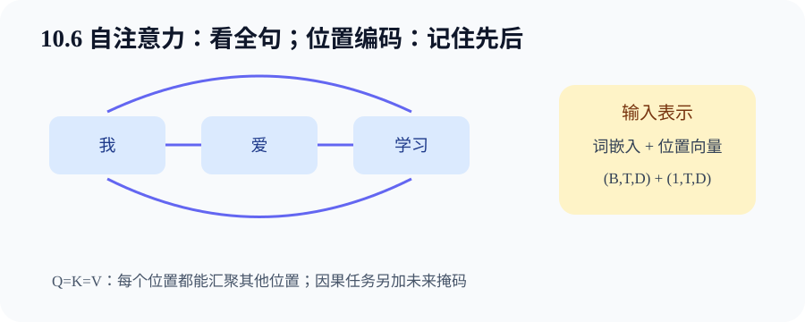

---

## 10.7 Transformer

Transformer 把多头注意力、逐位置前馈网络、残差连接、层规范化和位置编码组合成可堆叠的编码器－解码器。

### 逐位置前馈网络（Position-wise FFN）

$$
\mathrm{FFN}(x)=W_2\,\sigma(W_1x+b_1)+b_2.
$$

它对每个 token 独立使用**同一组参数**。输入 `(B,T,D)`，中间通常 `(B,T,D_ff)`，再回到 `(B,T,D)`。FFN 负责特征维内的非线性变换；跨 token 的信息混合已由注意力完成。

### 残差连接与层规范化

AddNorm 的共同要求是子层输出与残差输入 Shape 相同：

$$
Y=\mathrm{LayerNorm}(X+\mathrm{Sublayer}(X)).
$$

教材常用 post-LN 表达；现代实现也常见 pre-LN：

$$
Y=X+\mathrm{Sublayer}(\mathrm{LayerNorm}(X)).
$$

两者不是只换一行的完全等价模型。阅读代码时先看 LayerNorm 在子层前还是后。LayerNorm 在每个样本、每个 token 的最后特征维上规范化，不依赖 batch 统计，适合变长序列。

### 编码器

一个编码器块包含：

1. 多头自注意力：所有非 padding 源位置互相读取；
2. 残差 + LayerNorm；
3. 逐位置 FFN；
4. 残差 + LayerNorm。

堆叠 $N$ 层后得到 `memory:(B,S,D)`。它不是单个句向量，而是每个源位置的上下文表示。

### 解码器

一个解码器块多出交叉注意力：

1. **因果自注意力**：$Q,K,V$ 来自目标前缀；
2. **编码器－解码器注意力**：$Q$ 来自解码器，$K,V$ 来自编码器 memory；
3. **逐位置 FFN**。

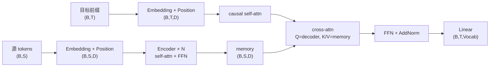

最容易把交叉注意力写反。判断方法：输出有 `T` 个目标查询，所以查询必须来自解码器；可被读取的 `S` 个键和值来自编码器。

### 训练与推理

训练时目标输入为 `[bos,y_1,...,y_{T-1}]`，标签为 `[y_1,...,y_T]`。因果 mask 阻止位置 $t$ 偷看标签右侧，但所有目标输入位置仍能并行计算。

推理时没有真实未来目标，只能一步步把预测拼回输入。训练并行不代表生成也能一次输出整句。

### 完整离线程序

[transformer_copy_task.py](../code/ch10/transformer_copy_task.py) 用动态长度合成序列做复制任务，覆盖：

- 源/目标 padding mask；
- 目标 causal mask；
- teacher forcing 错位；
- encoder-decoder `nn.Transformer`；
- `zero_grad → forward → loss → backward → clip → step`；
- `eval + inference_mode` 自回归生成。

~~~bash
python code/ch10/transformer_copy_task.py --epochs 25 --steps-per-epoch 40
~~~

这是机制小任务，不是语言模型。默认配置在固定随机种子下能复制测试序列；若只想检查 Shape 和训练链路，可用 `--epochs 2 --steps-per-epoch 3` 做快速 smoke test。

### 新手例子：复制 `[4,7,9]`

- **生活化问题 / 小数据输入**：源序列是 `[4,7,9,eos,pad,pad]`；训练目标是 `[bos,4,7,9,eos,pad,pad]`。
- **逐步过程**：编码器得到 `(B,6,D)` memory；解码输入去掉最后一格，标签去掉第一格；因果 mask 让第 1 个解码位置只能看 `bos`，交叉注意力却可以看全部有效源位置；损失忽略 pad。
- **具体输出**：前向 logits 为 `(B,6,V)`。训练充分后，自回归结果应接近 `[bos,4,7,9,eos]`。
- **它说明什么**：Transformer 不靠循环保存状态，但解码合法性仍由因果 mask 和逐步反馈保证。
- **常见误解**：源序列不需要 causal mask；编码器应同时看完整源上下文，只需屏蔽 padding。

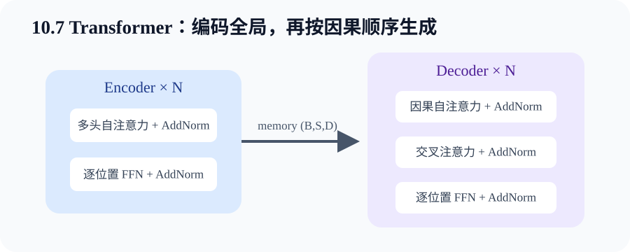

---

## 三份完整程序怎么读

| 程序 | 先看哪些函数 | 你要验证的核心 |
| --- | --- | --- |
| [attention_scoring.py](../code/ch10/attention_scoring.py) | `masked_softmax`、两个评分类、`bahdanau_decoder_step` | mask、加性/点积、动态上下文 |
| [multihead_self_attention.py](../code/ch10/multihead_self_attention.py) | `transpose_qkv`、`MultiHeadAttention`、`PositionalEncoding` | 分头 Shape、自注意力、因果权重 |
| [transformer_copy_task.py](../code/ch10/transformer_copy_task.py) | `TinyTransformer.forward`、`train_model`、`greedy_decode` | 三类 mask、训练/推理差异 |

建议阅读顺序不是从第一行看到最后一行，而是：

1. 先看 `main()` 中实际输入 Shape；
2. 跟进一次 `forward()`；
3. 打印权重被遮蔽位置是否为 0；
4. 再看 `loss.backward()` 到哪些参数；
5. 最后看 `optimizer.step()` 在哪里发生。

## 排错路径

按统一顺序查：**数据 → Shape/dtype/device → 前向 → 损失 → 梯度 → 更新 → 指标**。

### 1. 权重出现 NaN

- 检查某一行是否所有键都被 mask；
- 检查是否手写 `exp(scores)` 而没用稳定 softmax；
- 检查点积是否除以 $\sqrt d$；
- 打印 mask 前后分数的有限性。

### 2. padding 仍有权重

- 确认 mask 发生在 softmax 前；
- 确认比较轴是键轴 `K`；
- `valid_lengths:(B,)` 扩展到查询轴，而不是错误扩展到特征轴；
- 检查多头后长度是否 `repeat_interleave(num_heads, dim=0)`。

### 3. `bmm` Shape 报错

目标关系应是 `(B,Q,K) @ (B,K,Dv) -> (B,Q,Dv)`。若中间两维不是同一个 `K`，优先检查键转置和头轴重排。

### 4. 解码训练 loss 很低，推理输出异常

- 检查 teacher forcing 输入与标签是否错一位；
- 检查 causal mask 是否生效；
- 检查推理是否每步只取最后位置 logits；
- 检查是否反馈了预测 token 并更新整个前缀；
- 检查 eos 是否作为监督目标且设置最大生成长度。

### 5. 换头数后无法 reshape

确认 `hidden_size % num_heads == 0`，并跟踪 `(B,T,D) -> (B,T,H,d_h) -> (B,H,T,d_h)` 的换轴顺序。

### 6. 训练参数完全不变

打印一个参数在 `step()` 前后的差；确认没有在 `torch.no_grad()` 包住 forward；确认执行了 `zero_grad → forward → loss → backward → step`，且参数被传给 optimizer。

## 一页速查

| 问题 | 快速答案 |
| --- | --- |
| 注意力输出宽度由谁决定？ | values 的最后一维 $D_v$ |
| 权重由谁决定？ | query 与 key 的评分 |
| mask 放在哪里？ | softmax 之前 |
| 为什么点积除以 $\sqrt d$？ | 控制分数方差，防 softmax 过饱和 |
| 加性注意力优势？ | 查询、键原始宽度可不同 |
| Bahdanau 查询是什么？ | 常见为解码器上一步状态 |
| 多头为何要求整除？ | 每头宽度 $d_h=D/H$ |
| 自注意力是什么？ | Q、K、V 都由同一序列投影 |
| 为什么要位置编码？ | 注意力本身没有顺序信息 |
| padding mask 与 causal mask 区别？ | 前者遮补齐，后者遮未来 |
| FFN 是否跨 token 混合？ | 不，逐位置共享同一 MLP |
| 交叉注意力 Q/K/V 来自哪？ | Q 来自解码器，K/V 来自编码器 |
| LayerNorm 规范化哪一维？ | 通常每个 token 的特征维 |
| 训练能并行，生成也能吗？ | 生成仍通常逐步自回归 |

---

## Hot 100 加练（本章共 1 题）

新增 [#347 前 K 个高频元素](https://leetcode.cn/problems/top-k-frequent-elements/)，训练频次统计和 Top-k 候选选择；它只与注意力筛选共享抽象，并不等于注意力计算。解析见[新增题完整解析](leetcode-hot100-expanded-practice.md#第-10-章top-k-选择)，代码见 [hot100_top_k_frequent.py](../code/ch10/hot100_top_k_frequent.py)。

## 主动回忆：先遮住答案再作答

1. 【解释】查询、键、值分别承担什么职责？

结论：查询表达当前需求，键负责与需求匹配，值是最终读取内容。原因：权重由 query-key 评分归一化得到，输出再对 values 加权。影响：调试时要分别检查评分输入与汇聚输入，不能把三者当成必须相同的张量。

2. 【Shape】Q=(32,5,16)、K=(32,7,16)、V=(32,7,24)，输出和权重是什么 Shape？

权重是 `(32,5,7)`，输出是 `(32,5,24)`。每个 5 个查询都对 7 个键评分，再加权 7 个值；因此输出查询轴跟 Q，最后宽度跟 V。代码中对应 `(B,Q,K) @ (B,K,Dv)`。

3. 【解释】核回归为什么可看成注意力？

查询点是 query，训练输入是 keys，训练标签是 values，距离核生成注意力权重。它说明注意力的本质不是特定神经网络，而是内容相关的加权汇聚；代码可用广播距离、softmax 和矩阵乘完整实现。

4. 【推演】核带宽变得很小时，预测通常怎样变化？

权重会更集中在最近训练点，预测更局部、更灵活。原因是相同距离除以更小带宽后负平方差异被放大。影响是偏差可能下降但方差增大，数据有噪声时曲线更抖。

5. 【诊断】为什么不能 softmax 后直接把 padding 权重清零就结束？

因为 softmax 已把一部分概率质量分给 padding，清零后有效权重和小于 1，汇聚输出被缩小。应在 softmax 前把无效分数设为极小值，或清零后再次归一化；代码还应断言无效权重为 0。

6. 【代码】valid_lengths 是 `(B,)` 与 `(B,Q)` 各表示什么？

`(B,)` 表示样本内所有查询共享相同有效键数，典型是源序列 padding；`(B,Q)` 表示每个查询有自己的可见键数，典型是因果前缀 `[1,2,...,Q]`。错误广播会导致不同查询看到错误范围。

7. 【解释】缩放点积为何除以 $\sqrt d$ 而不是 $d$？

**结论：**除以 $\sqrt d$ 是按点积的“标准差”缩放，使不同维度下的注意力 logits 保持大致相同的波动尺度。除以 $d$ 会缩得过头，让分数随维度增大反而越来越接近 0。

**推导：**设 $q_i,k_i$ 近似独立、均值为 0、方差为 1。单项 $q_i k_i$ 的方差约为 1，因此

$$
s=q^\top k=\sum_{i=1}^{d}q_i k_i,
\qquad \mathrm{Var}(s)\approx d,
\qquad \mathrm{Std}(s)\approx\sqrt d.
$$

所以 $s/\sqrt d$ 的方差约为 1。若改成 $s/d$，方差约为 $1/d$、标准差约为 $1/\sqrt d$；$d$ 越大，所有 logits 越挤在 0 附近，softmax 越接近平均分配。

**工程影响：**不缩放时，大维度点积容易产生绝对值很大的 logits，softmax 过尖；最大概率接近 1、其余接近 0 时，$p(1-p)$ 一类导数变小，训练更难。除以 $d$ 又可能让注意力过平，模型难以突出真正相关的位置。$1/\sqrt d$ 在两种极端之间稳定数值尺度。

**边界与误区：**这不是说真实网络中的 Q、K 必然严格独立且方差恰好为 1；线性投影、LayerNorm 和训练都会改变分布。它是一种有统计动机的尺度校准，不是把向量长度严格归一化，也不是为了改变矩阵 Shape。公式中的 $d$ 通常是每个头的键维度 $d_k$，不是模型总宽度。

**面试追问：**若每个头的 $d_k$ 不同，应按哪个维度缩放？答：按各头实际用于点积的 $d_k$。若把 Q、K 都做 L2 归一化，点积变成余弦相似度，尺度行为会改变，但温度参数、表示幅值信息和优化性质也随之改变，不能直接说与缩放点积完全等价。

8. 【辨析】加性注意力与缩放点积注意力如何选？

查询/键宽度不同或想用小 MLP 学评分时，加性注意力自然；大规模矩阵并行且投影后宽度相同时，缩放点积高效。两者都需 mask 和 softmax，选型应结合 Shape、吞吐量和验证结果，而非断言谁总更准。

9. 【解释】Bahdanau 注意力比固定上下文多了什么能力？

它让每个解码步用当前状态重新查询所有编码位置，得到不同上下文。原因是不同目标词依赖不同源位置。代码影响是编码器必须保留全序列 outputs，而不只返回最终 state，并保存 `(B,T,S)` 权重便于排错。

10. 【Shape】Bahdanau 中 scores=(B,1,S)，values=(B,S,H)，context 是什么 Shape？

批量矩阵乘得到 `(B,1,H)`，若送入 `GRUCell` 常再 `squeeze(1)` 为 `(B,H)`。不能挤掉 batch 轴；使用无参数的 `squeeze()` 在 B=1 时可能把所有大小为 1 的轴都删掉。

11. 【解释】多头注意力为何不是“把一个头复制 H 次”？

每个头有独立 Q/K/V 投影，所以在不同子空间产生不同评分和汇聚。拼接后还有输出投影混合各头。若投影参数被错误共享且输入相同，各头才可能退化成重复计算。

12. 【Shape】D=96、头数=8，每头宽多少？内部 Q 从 `(B,T,96)` 如何变形？

每头宽 12。正确顺序是 `(B,T,96) -> (B,T,8,12) -> (B,8,T,12) -> (B*8,T,12)`。必须先 permute 再合并，否则内存中的 token 与头元素会被错误分组。

13. 【解释】自注意力为什么仍需要位置编码？

注意力评分只看向量内容，对位置置换具有等变性，没有天然的先后概念。加入位置向量后，同一词在不同位置的输入不同。对代码的影响是位置表 Shape 应能广播到 `(B,T,D)`，并随 device/dtype 对齐。

14. 【诊断】训练解码器时不加 causal mask 会发生什么？

位置 t 能直接读取右侧真实目标词，训练损失会异常漂亮，却用了推理时不存在的信息。生成时未来词未知，性能会崩。应检查注意力矩阵严格上三角权重是否为 0，并保留 teacher forcing 的错位标签。

15. 【辨析】padding mask 和 causal mask 能否互相替代？

不能。padding mask 对不同样本屏蔽补齐位置；causal mask 对每个目标查询屏蔽右侧未来位置。解码器有 padding 的批训练通常两者都要，且二者合并后任何非法键都不能分到权重。

16. 【解释】逐位置 FFN 的“逐位置”是什么意思？

同一 MLP 独立作用于每个 token 的特征向量，不在时间轴混合信息。输入/输出前两轴 `(B,T)` 不变，只有最后维经历 `D -> D_ff -> D`。跨位置关系由注意力承担。

17. 【Shape】为何残差连接要求子层输出与输入 Shape 一致？

残差执行逐元素相加，两个张量需同 Shape 或至少有明确、正确的广播语义。Transformer 中通常严格保持 `(B,T,D)`；若多头拼接或 FFN 没投影回 D，AddNorm 会报错或产生危险广播。

18. 【代码推演】`zero_grad → forward → loss → backward → step` 中何时参数真正改变？

只有 `optimizer.step()` 改变参数。forward 建图，loss 生成标量目标，backward 把梯度写入 `.grad`，zero_grad 清旧梯度。调试“没学习”时应比较 step 前后参数，并确认梯度不是 None。

19. 【诊断】多头后 padding 开始出现非零权重，优先查什么？

先查 `valid_lengths` 是否按头使用 `repeat_interleave(H, dim=0)`，顺序是否与 `(B,H)` 合并批量轴一致；再查 mask 键轴 K 和 softmax 轴。若用了 `repeat(H)`，样本与头顺序可能错配。

20. 【解释】为什么训练 Transformer 可并行目标位置，生成却通常不行？

训练时真实目标前缀全部已知，因果 mask 保证每个位置只读左侧，但所有位置矩阵仍可同时计算。生成时第 t 个 token 是第 t-1 步预测的结果，未知前不能构造下一输入，所以必须逐步反馈。

21. 【诊断】注意力权重全都接近平均，可能有哪些原因？

先查 Q/K 是否全零或投影未注册；再查输入是否几乎相同、缩放是否过强、学习率和梯度是否有效。平均权重不一定错误——任务确实需要全局平均时合理，因此还要结合 loss、样例和消融判断。

22. 【解释】注意力热图为什么不能直接当因果解释？

权重只描述当前模型一次前向中的内部汇聚比例，输出还经过值投影、残差、FFN 和后续层；高权重输入也可能被值方向抵消。代码分析应结合梯度、遮蔽/替换实验和任务性能，而非只凭颜色深浅下结论。

### 面试八股加练：不能只背结论

23. 【八股深答】为什么 mask 必须在 Softmax 前作用于 logits？

**结论：**非法位置必须在归一化前失去竞争资格，通常把其 logits 设为负无穷。**机制：**若先 Softmax 再清零，合法位置的权重和会小于 1；后续若重新归一化又增加额外逻辑与数值风险。**工程影响：**mask 要能广播到分数 Shape，并在键轴做 Softmax；混合精度下用 dtype 可表示的足够小值。**误区：**把 padding 的 value 设为 0 也不够，因为它仍占用概率质量并改变其他位置权重。**追问：**全行都被 mask 时 Softmax 可能产生 NaN，数据和 mask 设计必须避免或显式处理。

24. 【八股深答】多头注意力相比一个同宽的大头，多了什么能力？

**结论：**多头把表示投影到多个独立子空间，各自形成注意力分布，再拼接混合；它不是单纯增加总宽度。**机制：**每头拥有独立 $W_Q,W_K,W_V$，可同时关注不同关系或位置模式。**工程影响：**模型宽度通常需被头数整除，拆头和并头的 permute/reshape 顺序必须正确。**误区：**不能保证每个头自动获得可解释角色，部分头可能冗余。**追问：**固定总宽度时，头越多意味着每头 $d_k$ 越小，表达粒度与计算效率需权衡。

25. 【八股深答】为什么 Transformer 仍需要位置编码？

**结论：**纯自注意力只根据内容两两评分，没有天然顺序；位置编码把顺序信息注入 token 表示或注意力分数。**机制：**若同时置换输入 token，自注意力输出会对应置换，无法区分“狗咬人”和“人咬狗”的顺序。**工程影响：**绝对、相对和旋转位置编码的长度外推、缓存与实现方式不同。**误区：**因果 mask 只限制能看哪些位置，不充分表示相对距离。**追问：**正弦位置编码可用频率结构表达相对位移，但并不等于模型天然掌握所有长度外推。

## 学完本章应该能做到

- 不看笔记说清 query、key、value 和注意力输出 Shape；
- 手算一个 masked softmax，并解释为何必须先 mask；
- 比较核回归、加性与缩放点积评分；
- 画出 Bahdanau 每一步动态读取源序列的数据流；
- 推导多头拆分、合并及权重 Shape；
- 区分 padding mask、causal mask 与位置编码；
- 解释 Transformer 中注意力、FFN、残差、LayerNorm 的分工；
- 运行三份程序，并按统一排错路径定位问题。

下一章转向优化：模型结构决定“能表示什么”，优化算法决定“训练时怎样走到一个好参数”。

[上一章：现代循环神经网络](ch09-modern-recurrent-neural-networks.md) · [下一章：优化算法](ch11-optimization-algorithms.md) · [返回总目录](../README.md)
