# 第 11 章：优化算法

> 复习定位：理解梯度给出的只是局部方向，优化器如何把它变成稳定、高效的参数更新 
> 内容脉络：11.1–11.11 · PyTorch · 离线可运行 
> 原创学习笔记，正式小节对照[《动手学深度学习》中文 2.0 官方目录](https://zh.d2l.ai/chapter_optimization/index.html)

[六种优化器从零实现](../code/ch11/optimizers_from_scratch.py) · [小批量与向量化](../code/ch11/minibatch_vectorization.py) · [学习率调度器](../code/ch11/scheduler_demo.py) · [跳跃游戏算法迁移](../code/ch11/jump_game.py)

## 一句话主线

**梯度描述当前位置最陡的上升方向；优化算法决定用多大的步子、怎样利用历史、怎样按坐标缩放，并在有限数据与计算预算下把训练损失降下来。**

优化器不是“自动找到最好模型”的按钮。它只看到训练目标给出的局部信号；泛化、数据质量、模型结构与评价指标仍需单独判断。

## 本章地图

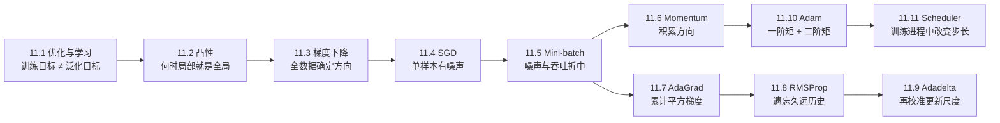

先分清三个容易混用的量：

| 量 | 白话含义 | 典型代码位置 |
| --- | --- | --- |
| gradient | 当前 batch 建议往哪走 | `loss.backward()` 写入 `.grad` |
| optimizer state | 历史速度、平方梯度等记忆 | optimizer 内部 state dict |
| learning rate | 把更新方向缩放为多大一步 | optimizer 的 param group，可由 scheduler 改 |

---

## 11.1 优化和深度学习

### 训练目标与真正目标不是同一个东西

训练时直接最小化经验风险：

$$
f_{train}(\theta)=\frac{1}{n}\sum_{i=1}^n\ell(x_i,y_i;\theta).
$$

真正关心的是未知数据分布上的期望风险：

$$
f_{test}(\theta)=\mathbb E_{(x,y)\sim P}[\ell(x,y;\theta)].
$$

优化器只能反复访问训练数据。训练损失更低可能提升泛化，也可能只是在记忆噪声；因此模型选择要看验证集，最终只在流程固定后使用测试集。

### 深度学习目标为什么难

深度网络一般是非凸的，可能遇到：

- **局部极小值**：附近任何小移动都更差，但不保证全局最好；
- **鞍点**：某些方向向上、另一些方向向下，梯度可能为 0；
- **平坦区域**：梯度很小，进展缓慢；
- **陡峭峡谷**：不同坐标曲率差异大，单一学习率会来回振荡；
- **噪声梯度**：mini-batch 方向只是全数据方向的估计。

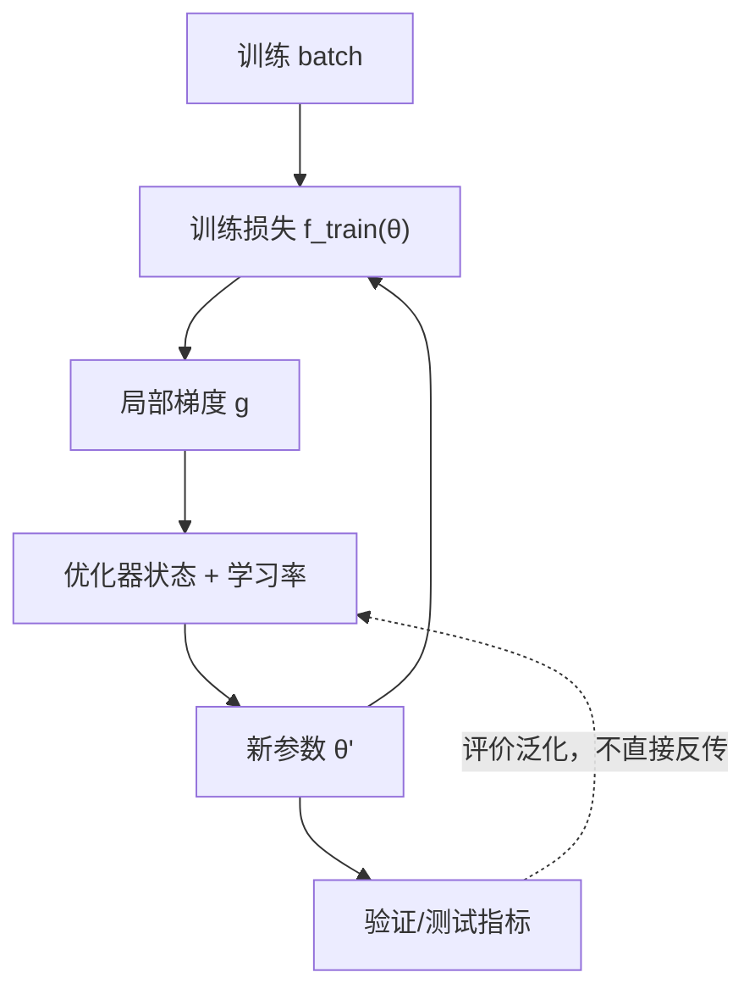

图中虚线非常关键：验证指标帮助选模型和超参数，却通常不直接进入每个 batch 的反向传播。

### 新手例子：刷题分数下降不等于新题会做

- **生活化问题 / 小数据输入**：学生反复练同 100 道题，训练错误数从 `30` 降到 `0`；另取 20 道同类新题，只做对 `11` 道。
- **逐步过程**：优化过程确实把“做过题的错误”降到最低；但学生可能背答案，没有学到可迁移规则。换题后输入分布变化，表现暴露问题。
- **具体输出**：训练准确率 `100%`，测试准确率 `55%`。优化成功，学习目标却没有完全成功。
- **它说明什么**：优化质量看训练目标是否降低；泛化质量要看独立数据。二者相关但不等价。
- **常见误解**：不能因为测试差就说优化器“没收敛”，也不能因为训练 loss 很低就宣布模型可用。

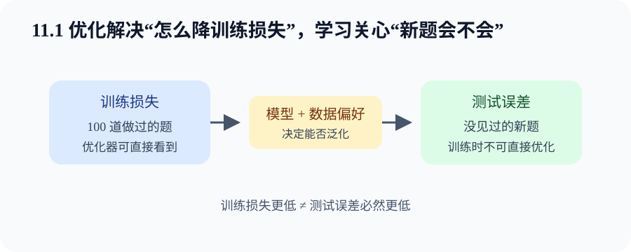

---

## 11.2 凸性

### 凸集与凸函数

集合 $X$ 是凸集：任取 $x,y\in X$，连接它们的整条线段仍在集合内。

函数 $f$ 是凸函数：对任意 $\lambda\in[0,1]$，

$$
f(\lambda x+(1-\lambda)y)
\le \lambda f(x)+(1-\lambda)f(y).
$$

白话说，函数曲线不能拱到两点弦线之上。若可微，还有一阶判据：

$$
f(y)\ge f(x)+\nabla f(x)^\top(y-x).
$$

切平面是全局下界。若二阶可微，Hessian 半正定是凸性的常用判据。

### 凸性为何让优化容易分析

对凸目标，任何局部极小值都是全局极小值；若严格凸，最小点至多一个。约束优化还要求可行域为凸集，否则即使目标凸，整体问题也未必是凸优化。

Jensen 不等式把凸性推广到随机变量：

$$
f(\mathbb E[X])\le \mathbb E[f(X)].
$$

它直观地说：对凸损失，输入波动之后再求损失，平均结果通常不低于先平均输入再求损失。

深度网络不是凸目标，但凸分析仍有价值：线性回归、局部二次近似、学习率稳定区间和许多优化器动机都从这里来。

### 新手例子：手算 $f(x)=x^2$ 的中点

- **生活化问题 / 小数据输入**：取 $x=0$、$y=4$、$\lambda=0.5$，比较函数中点与端点函数值的平均。
- **逐步过程**：输入中点是 `2`，所以 $f(2)=4$；端点函数值是 `0` 和 `16`，平均为 `8`。
- **具体输出**：`4 ≤ 8`，满足凸性不等式。图上抛物线中点低于连接 `(0,0)` 与 `(4,16)` 的弦。
- **它说明什么**：凸性约束的是任意两点之间的整体形状，不只是“看起来像碗”。
- **常见误解**：凸函数不一定严格凸，也不一定处处二阶可微；用定义判断最稳妥。

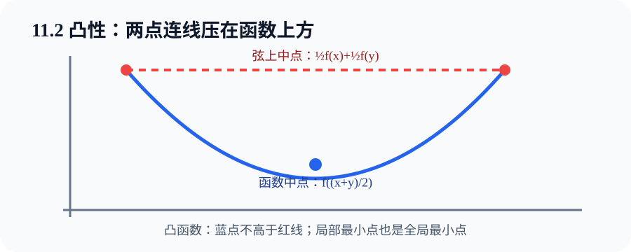

---

## 11.3 梯度下降

### 一维：导数给方向，学习率给距离

$$
x_{t+1}=x_t-\eta f'(x_t).
$$

若导数为正，函数向右上升，因此向左走；若导数为负，则向右走。$\eta>0$ 太小会慢，太大可能越过谷底甚至发散。

用一阶泰勒展开：

$$
f(x-\eta g)\approx f(x)-\eta g^2,
$$

其中 $g=f'(x)$。足够小的正学习率会让局部近似下降，但“足够小”取决于曲率。

### 多维：负梯度是局部最陡下降方向

$$
\theta_{t+1}=\theta_t-\eta\nabla f(\theta_t).
$$

对二次函数 $f(\theta)=\frac12\theta^\top A\theta$，梯度是 $A\theta$。若 $A$ 不同特征值相差很大，等高线狭长：沿陡方向步子过大，沿缓方向又太慢。这正是动量和坐标自适应方法要处理的问题。

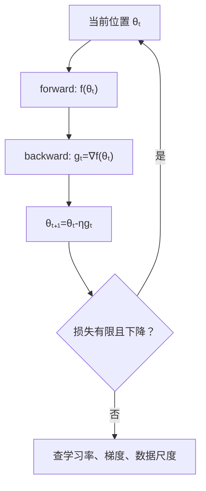

### 学习率不是“越小越保险”

极小学习率可能在有限预算内几乎不动；过大学习率会振荡或发散。诊断时同时看 loss、梯度范数与参数更新范数：

$$
\text{update ratio}
=\frac{\lVert\Delta\theta\rVert}{\lVert\theta\rVert+\epsilon}.
$$

### 新手例子：从 $x=4$ 走向 $f(x)=x^2$ 的谷底

- **生活化问题 / 小数据输入**：当前位置 `x=4`，目标 $f(x)=x^2$，学习率 `η=0.1`。
- **逐步过程**：导数 $f'(x)=2x=8$；更新 $x'=4-0.1×8=3.2$；损失从 `16` 变成 `10.24`。
- **具体输出**：一步后位置 `3.2`，确实更靠近最优点 `0`。
- **它说明什么**：梯度不是新位置，而是“每改变一点参数，损失怎样变”；学习率把方向转换为实际位移。
- **常见误解**：若 `η=1`，一步会到 `-4`，损失仍是 `16`；方向正确不保证步长正确。

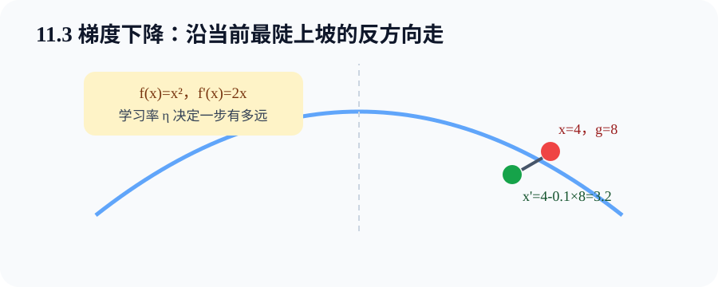

---

## 11.4 随机梯度下降

### 为什么不用每次看完所有样本

全数据目标为：

$$
f(\theta)=\frac1n\sum_{i=1}^n f_i(\theta).
$$

完整梯度每步要读 $n$ 个样本。随机梯度下降（SGD）抽一个样本 $i_t$：

$$
\theta_{t+1}
=\theta_t-\eta_t\nabla f_{i_t}(\theta_t).
$$

均匀抽样时：

$$
\mathbb E_{i_t}[\nabla f_{i_t}(\theta)]
=\nabla f(\theta).
$$

这叫无偏：重复很多次的平均方向正确，不代表任何单步都等于全梯度。

### 噪声既是代价也是特性

随机方向会让 loss 抖动，靠近最优点也不会完全停止。好处是每步便宜，且噪声可能帮助离开鞍点或尖锐区域。为了后期稳定，理论与实践都常让学习率随时间下降：

- 分段常数；
- $\eta_t=\eta_0/(1+at)$；
- $\eta_t=\eta_0/\sqrt t$。

不能只看每个 batch 的 loss 是否单调；更合理的是滑动平均、epoch 平均和验证指标。

### 新手例子：四位路人给出不同坡度

- **生活化问题 / 小数据输入**：四个样本在同一点给出的梯度是 `[-1, 3, 1, 1]`，全数据平均梯度为 `1`。
- **逐步过程**：SGD 若抽到第 1 个样本会向正方向更新；抽到第 2 个则向负方向走得更远。每步方向会抖，但均匀重复抽样的期望仍是梯度 `1`。
- **具体输出**：四种可能更新的平均值与使用全梯度的一步相同；单次更新不一定降低全数据 loss。
- **它说明什么**：无偏是统计意义，不是逐步保证；看趋势要跨多个 batch。
- **常见误解**：SGD 这个名字有时泛指 mini-batch SGD。严格说本节单样本，工程中通常使用下一节的小批量。

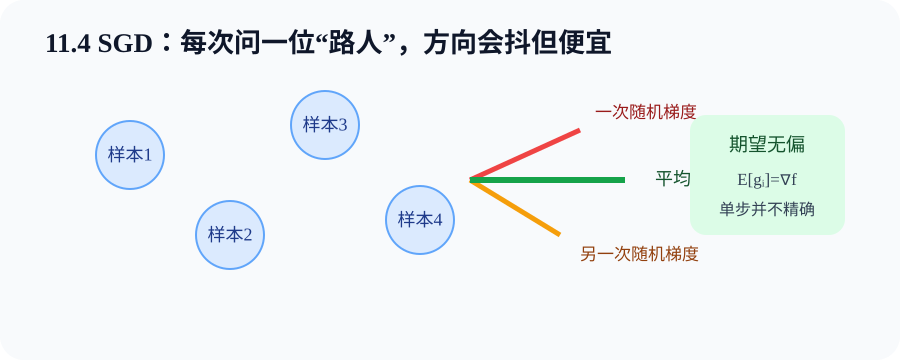

---

## 11.5 小批量随机梯度下降

### batch size 是统计与硬件的折中

对小批量 $B_t$：

$$
g_t=\frac{1}{|B_t|}\sum_{i\in B_t}\nabla f_i(\theta_t),
\qquad
\theta_{t+1}=\theta_t-\eta g_t.
$$

相较单样本，平均后的梯度方差更小；相较全数据，每次更新便宜。更重要的是，矩阵乘可同时处理多样本，充分利用 CPU/GPU 向量单元与内存带宽。

### 为什么 batch 翻倍不一定快一倍

实际每批时间可以粗略看成：

$$
t_{batch}=t_{launch}+t_{data}+t_{compute}.
$$

很小 batch 被启动、Python、数据搬运等固定开销支配；增大 batch 能摊薄开销。超过硬件高效区后，显存压力、缓存和计算量上升，吞吐不再线性提高。

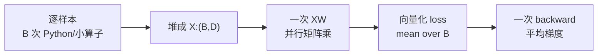

图中“向量化”不是改变数学结果，而是把独立的同类运算交给高效张量内核。

### batch size 改变时要观察什么

- 每秒样本数，而不只每 step 时间；
- 每个 epoch 的 step 数；
- 梯度噪声与泛化；
- 学习率是否需要一起调整；
- BatchNorm 等依赖 batch 统计的层是否稳定。

完整程序：[minibatch_vectorization.py](../code/ch11/minibatch_vectorization.py)

~~~bash
python code/ch11/minibatch_vectorization.py
~~~

程序先验证循环与向量化梯度数值相同，再比较不同 batch size 的梯度均方偏差，并用手写 mini-batch SGD 拟合线性回归。

### 新手例子：四份作业一次矩阵批改

- **生活化问题 / 小数据输入**：4 个样本，每个有 3 个特征，堆成 `X:(4,3)`；权重 `w:(3,)`。
- **逐步过程**：逐样本要做 4 次点积；向量化只写一次 `pred=X@w` 得 `(4,)`，误差也是 `(4,)`，梯度 `2*X.T@error/4` 得 `(3,)`。
- **具体输出**：两种方法梯度在浮点误差内一致；仓库程序通常能看到向量化明显更快。
- **它说明什么**：batch 不是把 4 个样本混成一个，而是在额外批量轴上并行计算，最后对损失求平均。
- **常见误解**：把 loss 从 `mean` 改成 `sum` 会让梯度随 batch size 放大，学习率比较失去公平性。

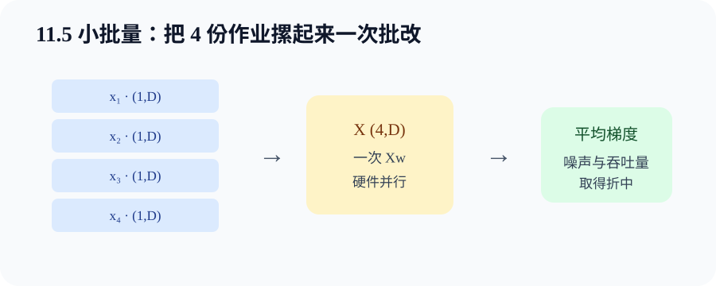

---

## 11.6 动量法

### 给梯度加一份“速度记忆”

本章代码采用：

$$
v_t=\beta v_{t-1}+g_t,
\qquad
\theta_t=\theta_{t-1}-\eta v_t.
$$

有些资料把 $(1-\beta)$ 乘在 $g_t$ 前，超参数尺度会相应变化。不要只背公式外观，要看实现与学习率的组合。

展开可见：

$$
v_t=g_t+\beta g_{t-1}+\beta^2g_{t-2}+\cdots.
$$

相反方向的梯度在历史平均中抵消，一致方向会累积。因此在狭长谷底，动量能减少陡峭方向来回摆动，并沿平缓方向加速。

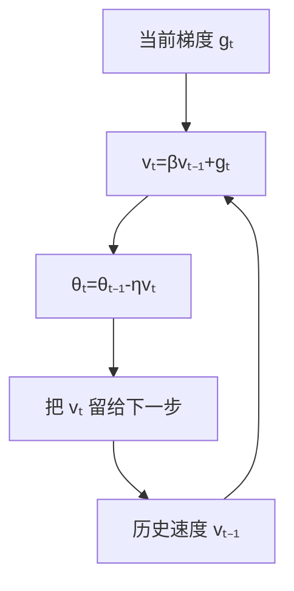

### 有效历史长度

$\beta=0.9$ 时，很久以前梯度的权重指数衰减。常用直觉“记住约 $1/(1-\beta)$ 步”：0.9 约 10 步，0.99 约 100 步。这是尺度直觉，不是严格截断。

### 新手例子：连续两步梯度都等于 2

- **生活化问题 / 小数据输入**：一维参数，`β=0.9`、`η=0.1`、`v0=0`，连续两步梯度 `g1=g2=2`。
- **逐步过程**：`v1=0.9×0+2=2`，参数走 `-0.2`；`v2=0.9×2+2=3.8`，第二步走 `-0.38`。
- **具体输出**：同方向梯度让速度从 `2` 累积到 `3.8`，第二步比普通 SGD 的 `-0.2` 更大。
- **它说明什么**：动量在稳定方向加速；若下一梯度为 `-2`，历史会与当前方向部分抵消。
- **常见误解**：动量不一定让每一步 loss 下降，也不是梯度裁剪；速度过大仍可能冲过谷底。

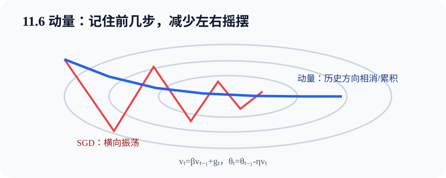

---

## 11.7 AdaGrad 算法

### 每个坐标有自己的有效学习率

$$
s_t=s_{t-1}+g_t\odot g_t,
$$

$$
\theta_t=\theta_{t-1}
-\frac{\eta}{\sqrt{s_t}+\epsilon}\odot g_t.
$$

$s_t$ 与参数同 Shape，逐坐标累计平方梯度。过去梯度大的坐标分母大，后续步长小；稀疏特征很少得到梯度，累计量小，出现时仍能得到较大更新。

### 优点为何也会成为缺点

$s_t$ 只增不减，所以有效学习率几乎单调下降。凸、稀疏问题中这可自动退火；深度网络长训练时，历史大梯度可能让步长过早接近 0，模型像“刹死”。

从零实现的关键不是开平方，而是：

1. 为每个参数保存独立 `s`；
2. 每步在 `no_grad` 下原地更新 `s` 和参数；
3. `epsilon` 放在分母防止除 0；
4. state 不应参与反向传播。

### 新手例子：两个坐标走过的路不同

- **生活化问题 / 小数据输入**：坐标 A 前两步梯度 `[4,4]`，坐标 B 是 `[1,1]`，基础学习率相同。
- **逐步过程**：A 的累计平方 `sA=32`，B 的 `sB=2`；下一次相同单位梯度会分别除以 `√32≈5.66` 与 `√2≈1.41`。
- **具体输出**：A 的有效步长约为 B 的四分之一。
- **它说明什么**：AdaGrad 根据每个坐标的历史梯度尺度自动归一化，不是整层共用一个缩放数。
- **常见误解**：累计平方大不代表该坐标“不重要”，只代表它过去梯度尺度大或出现频繁。

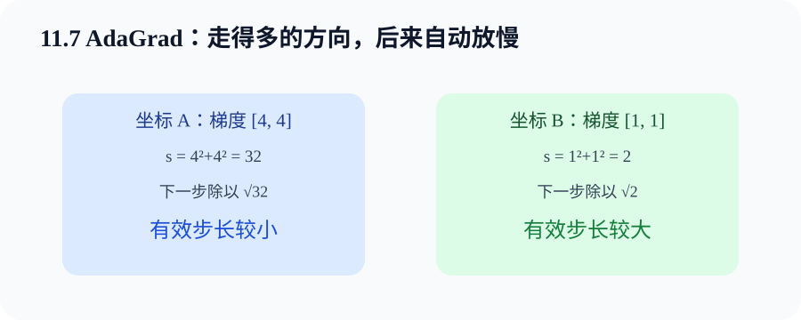

---

## 11.8 RMSProp 算法

### 让很久以前的梯度逐渐淡出

RMSProp 把 AdaGrad 的永久累加改成指数移动平均：

$$
s_t=\gamma s_{t-1}+(1-\gamma)g_t^2,
$$

$$
\theta_t=\theta_{t-1}
-\frac{\eta}{\sqrt{s_t}+\epsilon}\odot g_t.
$$

当近期梯度变小，$s_t$ 也能随时间下降，有效学习率可以恢复，不会被训练早期的大梯度永久锁死。

$\gamma$ 大，尺度估计更平滑但反应慢；$\gamma$ 小，更跟随当前 batch 但噪声大。它估计的是**近期平方梯度尺度**，不是损失的 Hessian，也不是梯度方差的严格无偏估计。

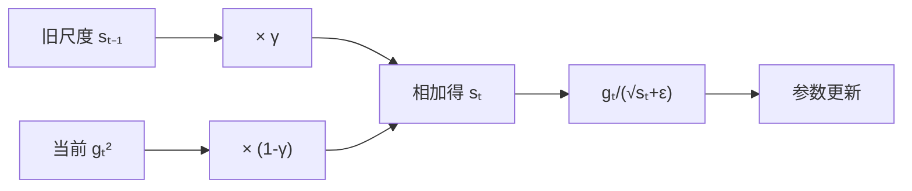

### 新手例子：旧大梯度会逐步被忘记

- **生活化问题 / 小数据输入**：一维 `γ=0.9`，旧 `s0=100`，之后连续遇到小梯度 `g=0`。
- **逐步过程**：`s1=90`，`s2=81`，`s3=72.9`；每一步旧信息乘 `0.9`。
- **具体输出**：平方尺度不断下降，而 AdaGrad 的累计值会一直停在 `100`。
- **它说明什么**：RMSProp 使用有限记忆，更适合训练过程中梯度尺度会变化的非平稳目标。
- **常见误解**：RMSProp 不是把原梯度做普通平均；它平均的是平方梯度，用于分母缩放。

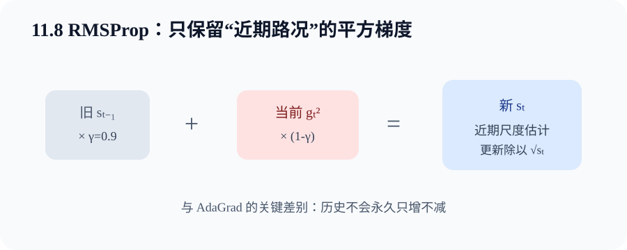

---

## 11.9 Adadelta

### 为什么还要记录参数更新平方

RMSProp 仍需选择全局学习率。Adadelta 同时维护：

$$
s_t=\rho s_{t-1}+(1-\rho)g_t^2,
$$

$$
\Delta\theta_t
=-\frac{\sqrt{\Delta_{t-1}+\epsilon}}
{\sqrt{s_t+\epsilon}}\odot g_t,
$$

$$
\Delta_t
=\rho\Delta_{t-1}+(1-\rho)(\Delta\theta_t)^2,
\qquad
\theta_t=\theta_{t-1}+\Delta\theta_t.
$$

$s_t$ 记录近期梯度平方，$\Delta_t$ 记录近期参数更新平方。分子用过去更新的 RMS 校准步幅，分母用当前梯度 RMS 做尺度归一。

### 单位直觉

若损失无单位，梯度单位约是 `1/参数`；直接用 `g/RMS(g)` 会失去参数单位。再乘 `RMS(Δθ)`，更新量恢复类似参数的单位。这是设计直觉，不意味着 Adadelta 无需任何调参；$\rho$、$\epsilon$ 和任务仍会影响表现。

### 新手例子：把当前坡度换算成历史步幅

- **生活化问题 / 小数据输入**：某坐标 `RMS(过去更新)=0.2`、`RMS(当前梯度)=4`、当前梯度 `g=3`。
- **逐步过程**：比例 `0.2/4=0.05`；更新 `Δθ=-0.05×3=-0.15`；再把 `0.15²` 纳入更新平方移动平均。
- **具体输出**：本步参数减少 `0.15`，不需另乘显式基础学习率。
- **它说明什么**：Adadelta 用两份状态把“坡度大小”转换为与过去参数步幅相称的更新。
- **常见误解**：没有显式学习率不等于步长固定或算法自动最优；初始 `Δ` 为 0 时仍靠 epsilon 启动。

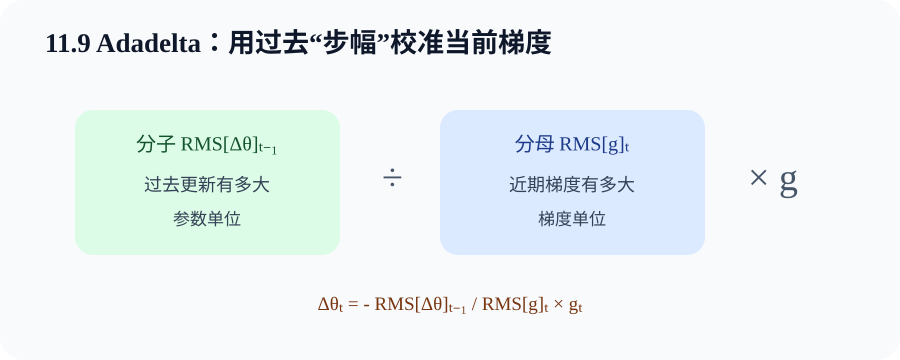

---

## 11.10 Adam 算法

### 一阶矩负责方向，二阶矩负责尺度

$$
m_t=\beta_1m_{t-1}+(1-\beta_1)g_t,
$$

$$
v_t=\beta_2v_{t-1}+(1-\beta_2)g_t^2.
$$

状态从 0 开始，训练初期会偏小，因此做偏差修正：

$$
\hat m_t=\frac{m_t}{1-\beta_1^t},
\qquad
\hat v_t=\frac{v_t}{1-\beta_2^t}.
$$

更新：

$$
\theta_t=\theta_{t-1}
-\eta\frac{\hat m_t}{\sqrt{\hat v_t}+\epsilon}.
$$

Adam 把类似动量的一阶矩和类似 RMSProp 的二阶矩结合起来，常作为深度学习强基线。但它并不保证在每个任务上泛化最好，也不能免除学习率选择。

### 为什么偏差修正很重要

第一步 $m_1=(1-\beta_1)g_1$。若 $\beta_1=0.9$，未修正只剩真实梯度的 0.1；除以 $1-0.9^1$ 后恢复为 $g_1$。二阶矩同理。

### Adam 与 AdamW

把 L2 正则项梯度直接加进 Adam 的梯度，会被自适应分母一起缩放；AdamW 将 weight decay 与梯度更新解耦。现代 Transformer 常用 AdamW。不要在同一参数上同时手写 L2 loss 又设置 AdamW weight decay，除非明确想叠加。

完整从零代码：[optimizers_from_scratch.py](../code/ch11/optimizers_from_scratch.py)

~~~bash
python code/ch11/optimizers_from_scratch.py
~~~

该程序在同一狭长二次目标上运行 SGD、Momentum、AdaGrad、RMSProp、Adadelta 与 Adam。轨迹差异同时受算法和超参数影响，不能用一次小实验给优化器做绝对排名。

### 新手例子：Adam 第一步的偏差修正

- **生活化问题 / 小数据输入**：一维 `g1=2`、`β1=0.9`、`β2=0.999`。
- **逐步过程**：`m1=0.2`，`v1=0.004`；修正后 `m_hat=0.2/(1-0.9)=2`，`v_hat=0.004/(1-0.999)=4`；归一化方向约 `2/√4=1`。
- **具体输出**：忽略 epsilon，本步位移约为 `-η`，而不是被初始零状态错误缩小。
- **它说明什么**：偏差修正只在早期显著，时间步 `t` 必须从 1 开始并正确累计。
- **常见误解**：Adam 的二阶矩是梯度平方的移动平均，不是 Hessian，也不代表真正的二阶优化。

---

## 11.11 学习率调度器

### 为什么训练中要改变学习率

前期参数离好区域远，大步能快速探索；后期靠近谷底，小步可减少振荡并细化。调度器只改变 optimizer param group 中的 `lr`，不替代梯度计算和参数更新。

常见策略：

| 策略 | 形式 | 适用直觉 |
| --- | --- | --- |
| 固定 | $\eta_t=\eta_0$ | 简单基线 |
| 指数/乘法衰减 | $\eta_t=\eta_0\gamma^t$ | 持续按比例减小 |
| 多阶段/Step | 在里程碑乘 $\gamma$ | 已知训练阶段 |
| 余弦退火 | 平滑从最大值降到最小值 | 无需手工选多个跳变点 |
| warmup | 前若干步从小到大 | 大模型初期稳定 |

余弦退火常写为：

$$
\eta_t=\eta_{min}
+\frac12(\eta_{max}-\eta_{min})
\left(1+\cos\frac{\pi t}{T}\right).
$$

### `scheduler.step()` 放在哪里

按 epoch 调度的常见顺序：

~~~python
for epoch in range(epochs):
    for X, y in loader:
        optimizer.zero_grad(set_to_none=True)
        loss = criterion(model(X), y)
        loss.backward()
        optimizer.step()
    scheduler.step()
~~~

若调度器按 batch 更新，就在每个 `optimizer.step()` 后调用。具体以调度器文档的计数单位为准。顺序错一位会让第一轮学习率与预期不同。

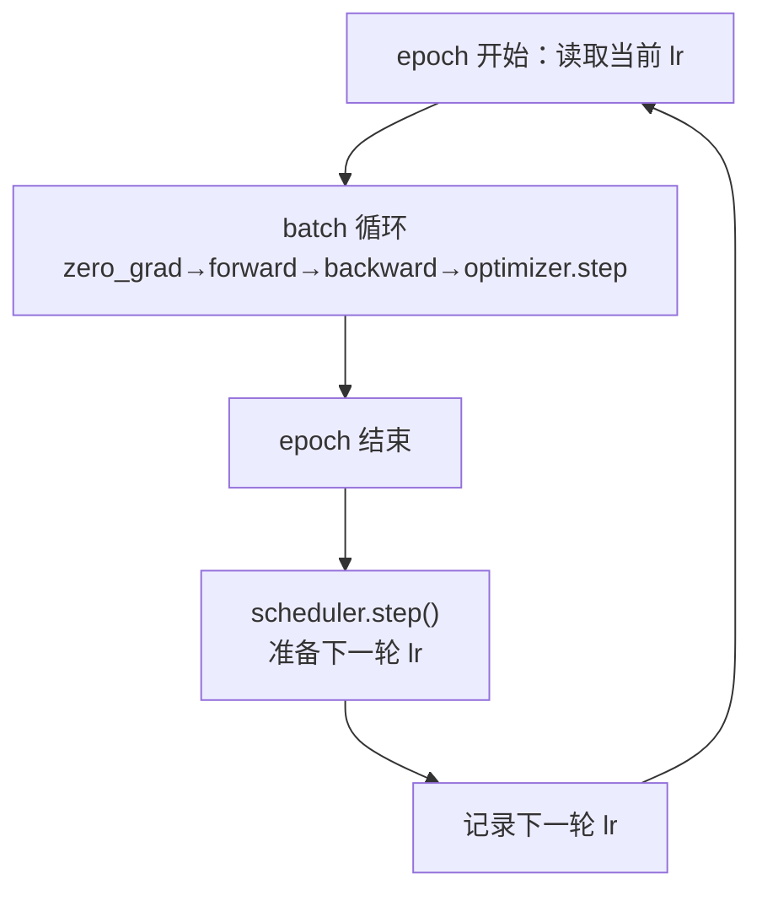

### 完整对照程序

[scheduler_demo.py](../code/ch11/scheduler_demo.py) 在同一圆形分类任务、同一初始参数和同一 batch 顺序下比较固定、StepLR 与 CosineAnnealingLR：

~~~bash
python code/ch11/scheduler_demo.py --epochs 20
~~~

只看最终准确率不足以选策略，还应画 loss/lr 曲线、重复随机种子并保持总训练预算一致。

### 新手例子：20 轮学习率从 0.4 收尾

- **生活化问题 / 小数据输入**：训练 20 轮，初始 `lr=0.4`。StepLR 在第 6、12、18 轮后乘 `0.3`；余弦调度平滑下降到 `0.01`。
- **逐步过程**：StepLR 大致经历 `0.4 → 0.12 → 0.036 → 0.0108`；余弦前期下降慢，中后期逐渐接近下限。
- **具体输出**：程序打印每种策略首轮、中间、末轮学习率以及测试准确率，且断言两种调度确实降低 lr。
- **它说明什么**：调度器定义的是时间轴上的步长计划；同一个 SGD/Adam 可以搭配不同计划。
- **常见误解**：不能在验证指标刚坏一次就随意手改 lr 并继续把测试集当反馈，否则评估也被调参污染。

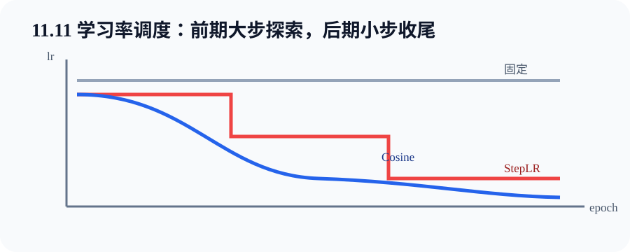

---

## 从零实现与 PyTorch API 一一对应

| 从零状态/语句 | PyTorch 对应 | Shape / 是否改参数 |
| --- | --- | --- |
| `velocity` | `SGD(momentum=...)` 内部 state | 与参数同 Shape，不是参数 |
| `squares += g*g` | `Adagrad` state | 与参数同 Shape |
| `s = γs+(1-γ)g²` | `RMSprop(alpha=γ)` | 与参数同 Shape |
| `grad_squares`、`delta_squares` | `Adadelta` 两类 state | 与参数同 Shape |
| `first`、`second`、`step` | `Adam` 的 m、v、t | 两张量 + 标量计数 |
| `loss.backward()` | autograd | 写 `.grad`，不改参数 |
| `optimizer.step()` | 优化器更新 | 真正改变参数和 state |
| `scheduler.step()` | 学习率计划 | 改 lr，不做 backward/参数步 |

### 三份实验的职责

1. [optimizers_from_scratch.py](../code/ch11/optimizers_from_scratch.py)：看每种状态怎样更新；
2. [minibatch_vectorization.py](../code/ch11/minibatch_vectorization.py)：看统计噪声和硬件向量化；
3. [scheduler_demo.py](../code/ch11/scheduler_demo.py)：看学习率随 epoch 改变，但训练闭环保持不变。

快速验证：

~~~bash
python code/ch11/optimizers_from_scratch.py
python code/ch11/minibatch_vectorization.py
python code/ch11/scheduler_demo.py --epochs 8
~~~

---

## 算法迁移专题：LeetCode Hot 100 #55 跳跃游戏

> 来源：[LeetCode 热题 100 官方题单](https://leetcode.cn/studyplan/top-100-liked/)中的[第 55 题：跳跃游戏](https://leetcode.cn/problems/jump-game/)。下面是原创题意摘要与推导，不复制官方题解。

### 原创题意摘要

给一个非负整数数组，从下标 0 出发；`nums[i]` 表示在位置 `i` 最多能向右跳多远。判断能否覆盖到最后一个下标。

### 它与本章有什么关系

共同训练的是：**不要保存全部历史细节，只保留足以决定下一步的状态。**

- 优化器把历史梯度压缩成速度、平方梯度等 state；
- 跳跃游戏把所有可能路径压缩成一个状态 `farthest`：目前最远可达边界。

但必须明确：**贪心 ≠ 梯度下降。**

| 跳跃游戏贪心 | 梯度下降 |
| --- | --- |
| 离散可达性问题 | 连续参数优化 |
| 依据已扫描前缀维护精确不变量 | 依据局部导数做数值更新 |
| `max` 扩大覆盖集合 | `-ηg` 改参数 |
| 正确性来自可达区间证明 | 收敛依赖目标、曲率、步长等条件 |

“都做局部更新”只是表面相似，不能把一个算法的证明套给另一个。

### 学习目标

- 识别足够状态 `farthest`；
- 用循环不变量解释正确性；
- 区分“最远可达”与“当前真的跳到哪里”；
- 写出 $O(n)$ 时间、$O(1)$ 额外空间实现；
- 通过断点、单元素和 0 等边界自测。

### 白话推导

以 `[2,3,1,1,4]` 为例：

1. 起点 0 可达，`farthest=0`；位置 0 最多跳 2，边界变 2；
2. 位置 1 在边界内，说明它可达；从这里最远到 4，边界变 4；
3. 边界已覆盖最后下标 4，直接返回 `True`。

失败例 `[3,2,1,0,4]`：扫描到位置 3 时边界仍是 3；下一位置 4 大于边界，说明不存在任何已扫描可达点能跨过这个断口，返回 `False`。

循环不变量：**处理下标 `i` 前，`farthest` 等于所有已确认可达位置能覆盖的最远下标。** 若 `i > farthest`，`i` 不可达，后面更不可达；否则用 `max(farthest, i+nums[i])` 保持不变量。

### 复杂度与易错点

- 时间复杂度：$O(n)$，每个位置最多访问一次；
- 额外空间：$O(1)$，只维护边界；
- 易错 1：把 `farthest` 当成必须落脚的位置；它表示整个可达集合的右边界；
- 易错 2：遇到 `0` 就失败。只要已有边界能跨过它，0 不影响；
- 易错 3：先更新不可达位置。必须先判断 `i > farthest`；
- 易错 4：长度为 1 时起点就是终点，应返回 `True`。

### 完整可运行代码与自测

[打开 jump_game.py](../code/ch11/jump_game.py)

~~~bash
python code/ch11/jump_game.py
~~~

核心循环逐行对应推导：

~~~python
farthest = 0                          # 已确认可达区域的右边界
for index, max_step in enumerate(nums):
    if index > farthest:              # 当前点不在可达区域内
        return False
    farthest = max(farthest, index + max_step)  # 用可达点扩张边界
    if farthest >= len(nums) - 1:     # 边界已经包含终点
        return True
return True                           # 单元素数组的起点就是终点
~~~

完整文件还包含输入合法性检查、逐步轨迹与 7 个断言自测，关键代码尽量一行一个中文注释。

---

## 排错路径

### 1. loss 第一轮就 NaN/Inf

按顺序查：输入与标签有限性 → dtype/device → forward 中间值 → loss 数值 → 梯度范数 → 学习率。先把学习率减 10 倍只是诊断手段，仍要找是数据、数值还是步长问题。

### 2. loss 完全不动

- 确认参数被传给 optimizer；
- 确认 `requires_grad=True` 且 `.grad` 非 None；
- 确认没有在 forward 外层误用 `no_grad`；
- 比较 `optimizer.step()` 前后参数；
- 查看 lr 是否被 scheduler 提前降到近 0；
- 在极小数据上测试能否过拟合。

### 3. Adam/动量恢复 checkpoint 后结果突变

只恢复模型参数不够，还需恢复 optimizer state；调度训练还要恢复 scheduler state 和 epoch/step。m、v、velocity 丢失后，相当于参数在旧位置、优化器记忆却回到第 0 步。

### 4. 改 batch size 后训练行为变了

确认 loss 是 mean 还是 sum；记录每 epoch 更新步数、每秒样本数与梯度范数；再考虑学习率缩放。不要只比较相同步数，因为 batch 不同意味着看过的数据量不同。

### 5. scheduler 曲线错一轮

打印每个 epoch **实际用于 optimizer.step 的 lr**。确认 scheduler 按 batch 还是 epoch 计数，并按 API 要求放在 optimizer.step 后。不要只在更新后打印下一轮 lr 再误标为本轮。

### 6. 自适应优化器显存增加

Momentum 通常每参数多一份状态；Adam 通常多两份 m/v，混合精度还可能保留主参数。显存规划不能只算模型权重和激活。

### 面试八股加练：不能只背结论

26. 【八股深答】Momentum、RMSProp 与 Adam 分别在解决什么？

**结论：**Momentum 平滑一阶梯度方向；RMSProp 用平方梯度移动平均做坐标自适应缩放；Adam 组合一阶动量与二阶矩缩放并做偏差修正。**机制：**前者积累速度，后两者让历史梯度大的坐标步长相对变小。**工程影响：**优化器状态需要显存并必须随 checkpoint 保存；超参数默认值不是所有任务最优。**误区：**Adam 的二阶矩不是 Hessian，也不能保证泛化优于 SGD。**追问：**AdamW 再把权重衰减从梯度预条件中解耦。

27. 【八股深答】为什么 batch size 改变后常要重新考虑学习率？

**结论：**batch 改变了梯度估计的方差、每个 epoch 的更新次数以及损失归约下的尺度。**机制：**较大 batch 的平均梯度噪声通常更小，但同样 epoch 内 step 更少；线性缩放只是特定条件下的经验起点。**工程影响：**同时记录有效 batch、梯度累积、学习率、warmup 和训练步数，并重新验证稳定性与泛化。**误区：**batch 翻倍不意味着学习率在所有优化器和任务上必须机械翻倍。**追问：**若 loss 用 sum 而非 mean，梯度还会直接随 batch 变化，需先统一归约口径。

28. 【八股深答】学习率 warmup 为什么常见于大模型训练？

**结论：**训练初期参数、激活和优化器矩估计尚未稳定，直接使用峰值学习率容易产生过大更新。**机制：**Adam 的矩估计虽有偏差修正，早期梯度分布仍可能剧烈变化；大 batch 和深层残差也会放大风险。**工程影响：**按 step 明确 warmup 长度和后续调度，恢复训练时必须恢复 scheduler 进度。**误区：**warmup 不是修复错误数据、爆炸损失或不合理峰值学习率的万能补丁。**追问：**scheduler.step 的调用频率必须与设计单位一致，是按 batch 还是按 epoch 不能混淆。

## 一页速查

| 问题 | 一句话答案 |
| --- | --- |
| 优化成功是否等于泛化好？ | 不等于，训练目标与未知分布目标不同 |
| 凸目标的重要性质？ | 局部极小就是全局极小 |
| 负梯度表示什么？ | 当前点欧氏范数下最陡下降方向 |
| SGD 为什么可用？ | 随机梯度在均匀抽样下通常无偏 |
| mini-batch 的两重价值？ | 降低梯度噪声、提高硬件吞吐 |
| Momentum 存什么？ | 历史梯度的指数加权速度 |
| AdaGrad 的主要问题？ | 累计平方只增，步长可能过早衰减 |
| RMSProp 改了什么？ | 用平方梯度 EMA 代替永久累加 |
| Adadelta 多存什么？ | 参数更新平方的 EMA |
| Adam 两个矩是什么？ | 梯度 EMA 与平方梯度 EMA |
| Adam 为何偏差修正？ | 初始 0 使早期矩估计偏小 |
| scheduler 改什么？ | optimizer 的学习率 |
| `backward()` 改参数吗？ | 不，只写梯度 |
| `step()` 前为何清梯度？ | PyTorch 默认累积 `.grad` |
| 贪心等于梯度下降吗？ | 不等于，问题、状态和正确性依据都不同 |

---

## Hot 100 加练（本章共 3 题）

原有 #55 之外，新增 [#45 跳跃游戏 II](https://leetcode.cn/problems/jump-game-ii/) 与 [#121 买卖股票的最佳时机](https://leetcode.cn/problems/best-time-to-buy-and-sell-stock/)，要求能说出分层边界和最小前缀两个贪心不变量。解析见[新增题完整解析](leetcode-hot100-expanded-practice.md#第-11-章可证明的贪心状态)，代码见 [hot100_jump_game_ii.py](../code/ch11/hot100_jump_game_ii.py) 与 [hot100_best_time_stock.py](../code/ch11/hot100_best_time_stock.py)。

## 主动回忆：先遮住答案再作答

1. 【解释】训练损失下降为何不保证测试误差下降？

结论：两者衡量不同数据集合/分布。优化器直接最小化经验训练目标，模型可能拟合噪声或捷径。代码上应保留独立验证流程，不能把测试集反复用于调参。

2. 【辨析】鞍点与局部极小点有什么不同？

鞍点某些方向向上、另一些方向向下，梯度也可能为 0；局部极小在足够小邻域内所有方向都不更低。影响是仅凭梯度范数小不能宣布找到最小值，还要结合曲率、扰动或训练进展判断。

3. 【凸性】为什么凸函数的局部极小也是全局极小？

若存在更低远点，连接局部点与远点的线段由凸性保证沿线立即出现更低值，这与局部极小矛盾。因此凸优化能给更强全局保证；深度网络非凸时不能直接套用。

4. 【计算】$f(x)=x^2$，x=4，η=0.1，一步梯度下降后 x 与 loss 是多少？

梯度为 8，新位置 `4-0.1×8=3.2`，新损失 `10.24`。结论是方向和步长共同决定结果；代码应在 backward 后由 step 实现这次位移。

5. 【诊断】梯度有限但 loss 来回振荡，先怀疑什么？

先查学习率相对曲率是否过大，再看数据尺度和 batch 噪声。可临时减小 lr、记录参数更新范数；动量虽能缓和某些振荡，但参数错误或异常数据仍需先修复。

6. 【解释】随机梯度“无偏”是否保证每一步都下降？

不保证。无偏只说对抽样取期望等于全梯度，单个样本方向可能让全目标上升。代码监控应看窗口/epoch 平均与验证趋势，而不是强求每批 loss 单调。

7. 【计算】四个样本梯度为 -1、3、1、1，均匀抽一个样本时期望梯度是多少？

期望是四者平均 `1`。任何一次可能取到 -1 或 3，因此更新有噪声；扩大 mini-batch 会平均更多样本并通常降低方差。

8. 【Shape】X=(64,100)、w=(100,10)，预测、标签和参数梯度常见 Shape 是什么？

预测为 `(64,10)`；若是相同输出格式的回归，标签也是 `(64,10)`；w.grad 为 `(100,10)`。batch 轴在 loss 中被 reduce，不能出现在参数梯度 Shape 中。

9. 【代码】loss 从 mean 改成 sum，batch 从 32 改成 128，梯度尺度大致怎样？

若样本贡献相近，sum 梯度会随 batch 大约放大 4 倍；mean 则尺度大致稳定。影响是固定 lr 下 sum 可能导致更新突然过大，比较 batch size 时应明确 reduction。

10. 【解释】向量化为何数学结果相同却运行更快？

它把多个独立点积堆成矩阵运算，减少 Python/算子启动和内存往返，并利用硬件并行。代码仍对 batch 样本计算相同预测与平均梯度；仓库程序用 allclose 验证一致性。

11. 【动量计算】β=0.9、v0=0、连续梯度 2、2，v1 与 v2 是多少？

按本文约定 `v1=2`，`v2=0.9×2+2=3.8`。同方向累积会加速；若所读实现写 `(1-β)g`，数值尺度不同，必须连同学习率一起理解。

12. 【解释】动量为什么能减少峡谷横向振荡？

陡峭方向梯度常正负交替，指数累积时互相抵消；沿谷底方向更一致，会累积。结果是轨迹更顺，但大 β 与大 lr 仍可能产生过冲，需要联合调参。

13. 【AdaGrad】某坐标累计平方梯度很大，下一步怎样变化？

该坐标分母 `sqrt(s)` 变大，有效学习率变小。原因是 AdaGrad 按历史尺度归一化。它适合稀疏特征，但长期只增的 s 可能让深度网络后期几乎停住。

14. 【辨析】RMSProp 相比 AdaGrad 的关键改变是什么？

RMSProp 用平方梯度指数移动平均，旧历史会衰减；AdaGrad 永久累加。因而 RMSProp 的有效步长能在近期梯度变小时恢复，状态仍与参数同 Shape。

15. 【计算】RMSProp 中 γ=0.9、s_old=100、g=0，新 s 是多少？连续两步呢？

一步是 90，两步是 81。旧平方尺度按 0.9 指数衰减，说明它不是永久记忆。代码应原地更新 state，但放在 no_grad 环境中。

16. 【解释】Adadelta 为什么维护更新平方的移动平均？

它用过去参数更新的 RMS 作分子、近期梯度 RMS 作分母，把归一化方向校准到类似历史参数步幅。影响是通常无需显式基础 lr，但仍受 rho、epsilon 与初始化影响。

17. 【Adam】一阶矩和二阶矩各回答什么问题？

一阶矩平滑梯度方向，近似回答“往哪走”；二阶矩平滑平方梯度，回答“每个坐标的尺度有多大”。更新用修正后 m 除以 sqrt(v)，再乘全局学习率。

18. 【计算】Adam 第一步 β1=0.9、g=2，未修正 m1 与修正后 m_hat 是多少？

`m1=(1-0.9)×2=0.2`，修正 `0.2/(1-0.9)=2`。偏差来自状态从零开始；代码若时间步从 0 代入会出现分母 0，因此 t 从 1 计。

19. 【辨析】Adam 的二阶矩是否等于 Hessian？

不等于。它是逐坐标梯度平方的移动平均，没有参数间二阶交叉项，也不是损失曲率矩阵。把它理解为自适应尺度估计更准确，不能据此声称 Adam 是完整牛顿法。

20. 【代码推演】`backward()`、`optimizer.step()`、`scheduler.step()` 各改变什么？

backward 写参数 `.grad`；optimizer.step 根据梯度与优化器 state 改参数，并更新 state；scheduler.step 改未来使用的 lr。三者职责不同，漏掉 optimizer.step 时即使有梯度参数也不动。

21. 【诊断】恢复模型后 Adam 像重新热身，可能漏了什么？

可能只恢复模型参数，漏掉 optimizer 的 m、v、step；调度训练还可能漏 scheduler state。应把 model、optimizer、scheduler、epoch/step 一起存取，并核对恢复后的 lr。

22. 【调度】StepLR 按 epoch 调用时，为何常放在 epoch 训练完成后？

这样本轮所有 batch 使用记录的当前 lr，epoch 结束后准备下一轮 lr，语义清楚。放在首个 optimizer.step 前可能造成整体提前一轮；最终以调度器 API 约定为准并打印实际 lr 验证。

23. 【算法迁移】跳跃游戏中 `farthest` 的循环不变量是什么？

在处理下标 i 前，它等于所有已确认可达位置能覆盖的最远下标。若 `i>farthest`，当前及后续都不能通过已扫描前缀到达；否则用 `max(farthest,i+nums[i])` 保持不变量。

24. 【辨析】为什么跳跃游戏贪心不能称作梯度下降？

跳跃游戏在离散数组上维护精确可达边界，正确性来自区间不变量；梯度下降在连续参数空间用局部导数做数值步进，收敛依赖目标和步长。两者都“逐步更新状态”，但问题结构、更新依据和证明完全不同。

25. 【故障诊断】loss 不降时最先查哪条完整链？

按数据 → Shape/dtype/device → forward 中间值 → loss 定义/数值 → 梯度 None/范数 → step 前后参数 → lr/scheduler → 评价指标。先建立可观测证据，再换优化器，避免用 Adam 掩盖数据或标签错误。

## 学完本章应该能做到

- 分开解释训练优化与泛化评价；
- 用凸性说明局部极小何时具有全局保证；
- 手算梯度下降、Momentum、AdaGrad、RMSProp、Adadelta、Adam 的一两步；
- 解释 batch size 对噪声、吞吐量和梯度尺度的影响；
- 说出六种优化器各自保存的 state 与 Shape；
- 正确安排 `zero_grad → backward → optimizer.step → scheduler.step`；
- 运行三份优化实验并读取曲线，而非用单次结果绝对排名；
- 用 `farthest` 不变量独立写出并验证跳跃游戏，同时明确贪心不等于梯度下降。

下一章将讨论计算性能：同一个数学模型，执行方式、并行策略与硬件数据流会决定它能否在现实时间和资源内训练。

[上一章：注意力机制](ch10-attention-mechanisms.md) · [下一章：计算性能](ch12-computational-performance.md) · [返回总目录](../README.md)
