# 第 12 章：计算性能

> 复习定位：从“模型能跑”走到“知道时间花在哪、怎样安全并行” 
> 内容脉络：12.1–12.7 · PyTorch · 离线可运行 
> 原创学习笔记，章节顺序参考[《动手学深度学习》中文 2.0 官方目录](https://zh-v2.d2l.ai/chapter_computational-performance/index.html)

[执行模式、计时与硬件诊断](../code/ch12/performance_basics.py) · [数据/模型并行与 DataParallel](../code/ch12/parallelism_demo.py) · [参数服务器与环形规约](../code/ch12/distributed_systems.py) · [Hot 100：LRU 缓存](../code/ch12/lru_cache.py)

## 一句话主线

**性能优化不是把代码改得更“高级”，而是先用正确计时找到瓶颈，再让编译器减少调度、让计算与通信重叠、让硬件吃到合适的数据，并在多设备间保持“与单设备同一数学更新”。**

## 三个月后复习入口

| 场景 | 先看什么 | 达标标准 |
| --- | --- | --- |
| 新手第一次学 | 延迟/吞吐 → CUDA 异步 → 计算/访存 → 数据并行 | 能解释为什么“程序返回”不等于 GPU 已完成 |
| 90 天后复习 | 正确计时清单 → 并行等价公式 → all-reduce 图 | 能先测量再定位瓶颈，而不是直接换 API |
| 面试前复习 | 算术强度、扩展效率、梯度同步、陈旧梯度、compile 边界 | 能同时讨论正确性、通信和硬件利用率 |

**最小记忆集：**

1. 延迟看一次多久，吞吐看单位时间多少，优化目标不能混；
2. CUDA 默认异步，正确基准要预热并在计时边界同步；
3. FLOPs 高不代表快，低算术强度算子常受内存带宽限制；
4. 数据并行切样本并同步梯度，模型并行切计算图并传激活；
5. 多设备只有计算收益超过通信、调度和不均衡开销才会加速。

### 专有名词白话表

| 术语 | 白话解释 | 常见现象 |
| --- | --- | --- |
| 延迟（latency） | 一次任务从开始到完成要多久 | 单请求毫秒数 |
| 吞吐（throughput） | 单位时间能处理多少样本 | samples/s |
| 异步执行 | CPU 先把任务放进 GPU 队列，不等完成就继续 | 墙钟计时偏小 |
| kernel | GPU 上执行的一小段计算任务 | kernel launch |
| 算术强度 | 每搬一个字节数据能做多少计算 | 低时常受带宽限制 |
| 数据并行 | 每张卡有完整模型，各算不同样本，再同步梯度 | DDP |
| all-reduce | 多卡把梯度求和/平均，并把结果发回所有卡 | 梯度同步 |
| 陈旧梯度 | 梯度基于旧参数算出，到达时模型已更新 | 异步参数服务器 |

### 教材高价值问答

【计时】为什么 CUDA 代码前后都要同步，但真实训练中不能每步都同步？

基准开始前同步是清空旧队列，结束前同步是等待本次 kernel 真正完成，否则只测到 CPU 提交时间。真实训练若每步强制同步，会打断 CPU/GPU 重叠并降低吞吐。因此同步用于明确的测量边界和排错点，不应无脑塞进正常热路径。

【数学等价】不同 GPU 的本地平均梯度为什么不能总是直接再平均？

只有各卡本地样本数相同，平均本地平均梯度才等于全局样本平均。若一张卡 5 个样本、另一张 3 个，应按样本数加权：$(5g_1+3g_2)/8$。分布式训练还要保证各副本从同一参数版本开始，并明确损失是 sum 还是 mean。

【扩展性】GPU 越多为什么可能反而越慢？

每卡计算变少后，固定的 kernel 启动、梯度同步和数据加载开销占比会变大；网络互联慢、模型太小、batch 太小或负载不均也会让设备等待。应比较单卡基线、每卡计算时间、通信占比和有效 batch，而不是只看设备数量。

## 本章地图

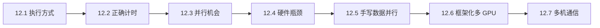

### 先记住三个指标

| 指标 | 公式 | 回答的问题 |
| --- | --- | --- |
| 延迟 latency | 完成一次请求的时间 | 一张图多久出结果？ |
| 吞吐 throughput | 处理量 / 墙钟时间 | 每秒能训练多少样本？ |
| 利用率 utilization | 忙碌资源 / 可用资源 | 设备为何大量时间在等待？ |

吞吐高不等于延迟低。把 batch 从 1 增到 512 往往提高每秒样本数，却也可能让单个样本等待更久。优化前必须先说清目标。

---

## 12.1 编译器和解释器

### 白话直觉：边走边看，还是先看整张地图

命令式（imperative/eager）执行像照着菜谱逐句做：Python 看到一行，就派发一个算子。它便于打印中间量、写条件分支和调试。符号式执行则先收集完整计算流程，再统一优化和运行：编译器能合并算子、删除无用结果、规划内存，却要求流程更容易被分析。

现代 PyTorch 不是二选一：平时用 eager 写自然 Python，需要性能时用 `torch.compile` 捕获可编译区域；捕获不了的动态部分可以发生 graph break，并回到 Python。

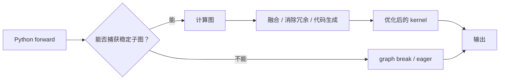

### 正确性、首轮成本与 Shape

设 `X:(B,D)`，两层 MLP 为：

$$
H=\operatorname{ReLU}(XW_1+b_1),\qquad
Y=\operatorname{ReLU}(HW_2+b_2).
$$

其中 $W_1:(D,2D)$、$H:(B,2D)$、$W_2:(2D,D)$、$Y:(B,D)$。eager 与 compiled 应计算同一函数，因此先检查输出误差，再比较速度。

编译通常包含三段时间：

$$
T_{\text{总}}=T_{\text{捕获/编译}}+N\cdot T_{\text{编译后单次}}.
$$

只有当重复次数 $N$ 足够大，节省的单次时间才可能覆盖首轮成本。频繁改变 Shape、dtype 或控制流还可能导致重新编译。

### 代码映射

~~~python
model = TinyMLP(width).eval()                 # 参数不变，切到推理态
compiled = torch.compile(model, backend="eager")
y_eager = model(x)                           # (B,D) -> (B,D)
y_compiled = compiled(x)                     # 语义应与 eager 一致
torch.testing.assert_close(y_eager, y_compiled)
~~~

- 输入/输出 Shape：均为 `(B,D)`。
- 计算图：`inference_mode` 下不建 autograd 反向图；`torch.compile` 捕获的是执行图，二者不是同一个概念。
- 参数变化：只有 forward，不改变参数。
- 完整程序：[`performance_basics.py`](../code/ch12/performance_basics.py) 会在编译不可用或首次执行失败时明确回退 eager。

### 排错

1. 先用相同输入比较 eager/compiled 数值；
2. 看日志是否频繁 graph break 或重编译；
3. 固定输入 Shape 后再基准测试；
4. 把编译首轮与稳定阶段分开报告；
5. 若动态 Python 是业务必需，不要为消灭 graph break 破坏正确性。

### 新手例子：两个执行方式为什么输出相同

- **问题/小输入**：$f(x)=\operatorname{ReLU}(2x+1)$，输入 `x=[-1,2]`。
- **逐步过程**：先乘 2 得 `[-2,4]`；再加 1 得 `[-1,5]`；ReLU 把负数截为 0。
- **具体输出**：eager 和 compiled 都应得到 `[0,5]`。
- **说明什么**：编译改变“怎样执行”，不该改变“算什么”。
- **常见误解**：以为编译后第一次必然更快；第一次常在付捕获和编译成本。

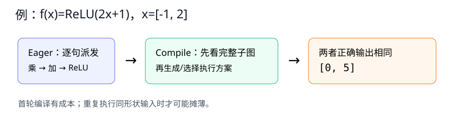

---

## 12.2 异步计算

### 白话直觉：下单不等于送达

CPU 调用 CUDA 算子时，常常只是把任务放入设备队列，随后立刻返回。像外卖 App 显示“订单已提交”，并不表示餐已经送到。如果计时器只包围“提交订单”，就会得到虚假的极短时间。

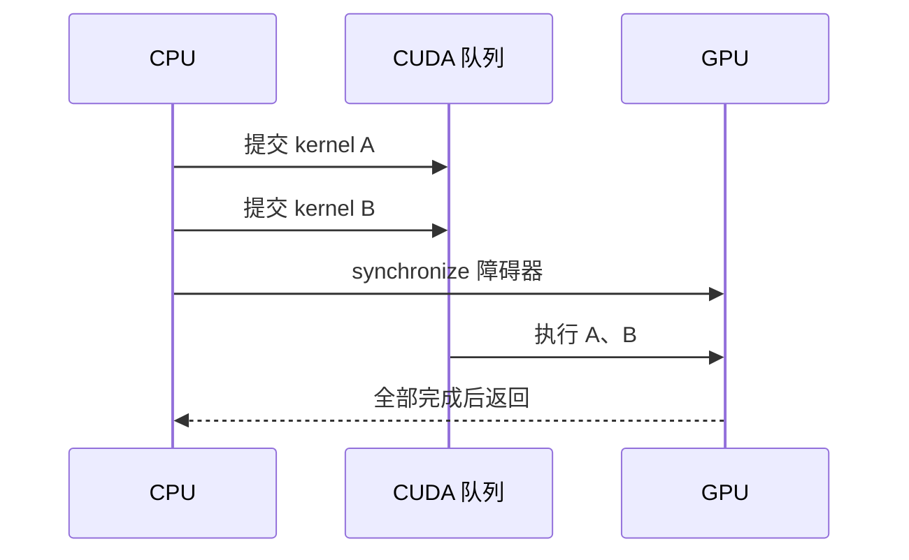

### 障碍器与隐式阻塞器

- `torch.cuda.synchronize()`：显式等待指定设备完成此前任务；
- `.item()`：要把设备标量取到 Python，通常必须等待；
- `.cpu()` / 打印 CUDA 张量：需要把结果搬回主机，也可能阻塞；
- 同一 stream 内算子按顺序，但 CPU 与 GPU 可并行推进；不同 stream 的依赖需谨慎管理。

正确墙钟计时模板：

~~~python
torch.cuda.synchronize()
start = time.perf_counter()
for _ in range(steps):
    y = model(x)
torch.cuda.synchronize()
elapsed = time.perf_counter() - start
~~~

为什么前后都同步？前同步排除之前遗留工作，后同步确保本轮工作真正结束。

### 怎样改进吞吐

1. **预热**：先触发缓存、内存分配和可能的编译；
2. **批处理**：一次派发更多工作，摊薄 Python/kernel launch 开销；
3. **减少不必要阻塞**：训练循环中不要每步 `.item()`；按间隔记日志；
4. **固定测量口径**：报告设备、dtype、batch、预热次数、正式次数；
5. **多次统计**：至少观察中位数和波动，不凭一次读数下结论。

### 新手例子：为什么计时少了 30 倍

- **问题/小输入**：一次 GPU 运算真正执行 3.0 ms，CPU 入队只花 0.1 ms。
- **逐步过程**：不加同步时，计时器在任务刚入队便停止；加同步时，CPU 会等 GPU 完成。
- **具体输出**：错误计时约 `0.1 ms`，同步计时约 `3.1 ms`。
- **说明什么**：测到的是哪条时间线，决定数字是否有意义。
- **常见误解**：认为 `.item()` 只是“取一个数”没有代价；它常把等待时间集中暴露在这一行。

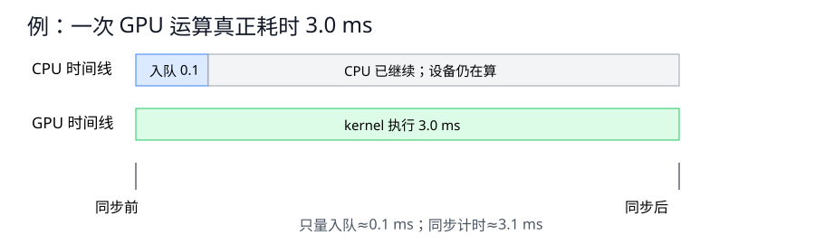

---

## 12.3 自动并行

### 哪些工作能够同时做

若 $A=f(X)$ 与 $B=g(Y)$ 没有数据依赖，且位于可并行资源上，它们可以重叠；若 $B=g(A)$，B 必须等 A。自动并行的核心不是“看到两行就同时跑”，而是从依赖图中找互不相干的分支。

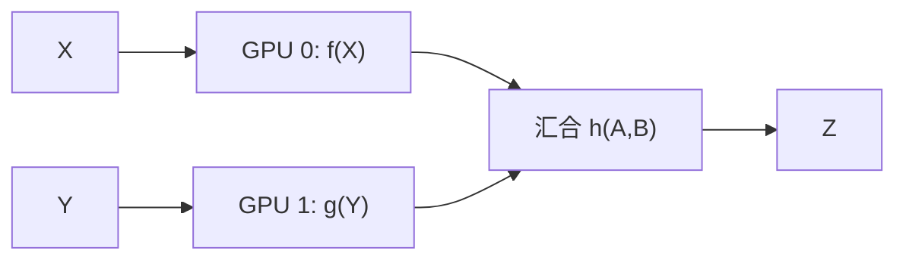

理想并行时间近似：

$$
T_{\text{parallel}}\approx \max(T_A,T_B)+T_{\text{调度}}+T_{\text{通信}}.
$$

因此并行的上界不是 $T_A+T_B$，而是较慢分支加额外开销。任务太小时，开销可能比节省的时间更大。

### 计算与通信重叠

多 GPU 反向传播从输出层向输入层生成梯度。一旦某层梯度就绪，就可启动该梯度 bucket 的 all-reduce，同时继续计算更早层梯度。理想情况下通信藏在计算背后；最后一个 bucket 仍处在关键路径上。

判断能否重叠要问：

- 数据是否已经在正确设备？
- 两项任务是否真的无依赖？
- 是否无意中 `.item()` 或同步？
- 通信量是否足以抵消并行收益？
- 最慢分支是否成为新的尾部延迟？

### 模型并行与流水线

模型太大放不进一块卡时，可以按层切分：`encoder` 在设备 0，`head` 在设备 1。边界上必须传激活 `(B,H)`，反向还要传激活梯度。流水线把大 batch 切成 micro-batch，减少下游设备空等，但会引入“气泡”和更复杂的调度。

完整程序 [`parallelism_demo.py`](../code/ch12/parallelism_demo.py) 的 `model_parallel_forward` 在两块 GPU 时跨卡，在单设备时安全退化，便于先验证 Shape。

### 新手例子：两项任务能省多少时间

- **问题/小输入**：A 需 4 ms，B 需 6 ms，二者无依赖。
- **逐步过程**：串行是先 A 后 B；并行是同时开始，A 先结束，等待 B。
- **具体输出**：串行理想值 `10 ms`；并行无开销上界 `max(4,6)=6 ms`。
- **说明什么**：并行速度由最慢分支决定，理论加速比是 `10/6≈1.67`，不是 2。
- **常见误解**：只要有两块 GPU 就自动快两倍；数据搬运和调度可能让实际值高于 6 ms。

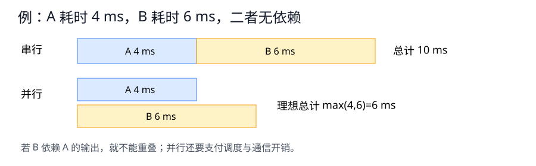

---

## 12.4 硬件

### 先把计算机看成一条供水链

计算单元像水轮机，内存和总线像水管。水轮机标称转得再快，水管太细也会空转。深度学习性能至少受计算量、访存量、容量、通信和软件调度共同限制。

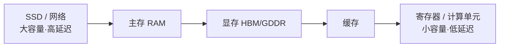

越靠近计算单元通常越快、越小、越贵。缓存命中就是在近处找到数据；缓存未命中则要去更远层级等待。

### CPU、GPU 与其他加速器

| 硬件 | 擅长 | 不擅长 |
| --- | --- | --- |
| CPU | 分支、串行控制、数据预处理、少量低延迟任务 | 海量同构矩阵计算的单位吞吐 |
| GPU | 大规模并行矩阵/卷积、规则批处理 | 很小算子、频繁主机交互、复杂分支 |
| 专用加速器 | 固定数值格式和常见神经网络算子的高能效 | 灵活性与通用生态可能有限 |

GPU 也不是一个数字。显存容量决定模型能否放下；显存带宽影响数据供给；计算能力与 dtype 决定可用指令；PCIe/NVLink 和网络决定设备间通信。

### 算术强度与 roofline 直觉

$$
I=\frac{\text{FLOPs}}{\text{搬运字节数}},\qquad
P\le \min(P_{\text{峰值}}, I\times BW).
$$

- $I$ 很低：每搬一个字节只做少量计算，常是内存带宽受限；
- $I$ 很高：数据被充分复用，才可能靠近峰值算力；
- 增大 batch 有时能提升权重复用，但也会增加显存占用。

### 延迟不只来自算子

磁盘读取、数据解码、Python worker、CPU→GPU 拷贝、kernel launch、GPU 计算、梯度通信、检查点写盘都可能在关键路径上。一次端到端 profile 比只看 GPU 利用率更可靠。

[`performance_basics.py`](../code/ch12/performance_basics.py) 打印 CPU 线程、GPU 型号/显存、粗略 FLOPs 与算术强度，并按 `samples/s` 报告吞吐。

### 新手例子：向量加法为什么不是“算力题”

- **问题/小输入**：两个长度 1000 的 float32 向量相加。
- **逐步过程**：读两个输入约 8000 B，做 1000 次加法，再写 4000 B 输出。
- **具体输出**：约 `1000 FLOPs / 12000 B = 0.083 FLOPs/byte`。
- **说明什么**：每搬很多数据只做一点计算，往往更受内存带宽限制。
- **常见误解**：GPU 峰值 FLOPs 高，任何算子都应接近峰值；低算术强度算子根本喂不满计算单元。

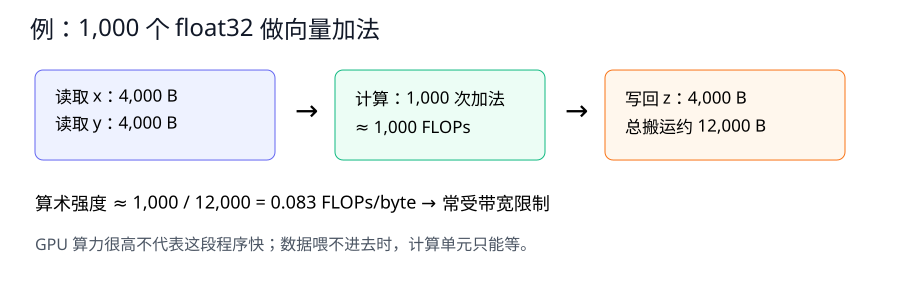

---

## 12.5 多 GPU 训练

### 问题怎样拆

- **数据并行**：每块设备保存完整模型，切分 batch；适合模型放得下一张卡。
- **模型并行**：切分层或张量，设备间传激活；适合模型过大。
- **流水线并行**：按层切模型，再用 micro-batch 填充流水线。

本节重点是数据并行。全局 batch 有 $B$ 个样本，分给 $K$ 个工作器。若损失对样本取平均，则正确全局梯度为：

$$
g=\sum_{k=1}^{K}\frac{B_k}{B}g_k,
$$

其中 $g_k$ 是第 $k$ 个工作器的本地平均梯度。只有各 $B_k$ 完全相等时，才可直接取 $\frac1K\sum g_k$。

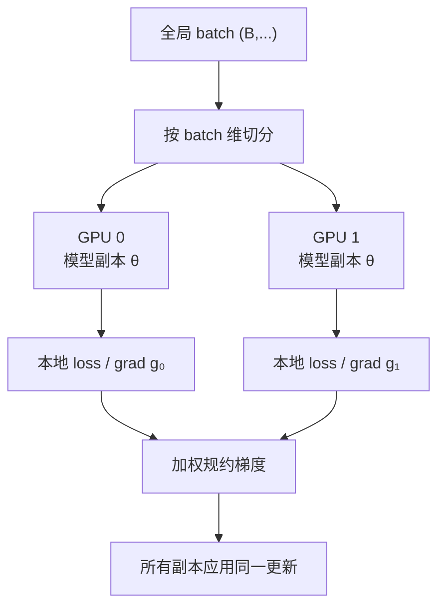

### 一次训练迭代的状态变化

1. 广播/复制同一参数 $\theta_t$；
2. scatter 不同样本；
3. 各副本前向和反向；
4. reduce/all-reduce 得到 $g_t$；
5. 所有副本应用同一优化器更新，得到一致的 $\theta_{t+1}$。

若某个副本少同步一次、随机跳过更新或优化器状态不一致，参数会分叉。

### 从零模拟的代码映射

~~~python
x_parts = torch.tensor_split(x, replicas, dim=0)
workers = [copy.deepcopy(base_model) for _ in range(replicas)]
weight = len(x_part) / len(x)
reduced_grad.add_(local_parameter.grad, alpha=weight)
~~~

- 数据切分只改 batch 维：`(B,D) -> (B_k,D)`；
- 模型参数 Shape 不变，每个工作器都有一份；
- `backward()` 建立的本地梯度先写入本地副本；
- 规约后才得到与完整 batch 一致的梯度。

运行 [`parallelism_demo.py`](../code/ch12/parallelism_demo.py)，它故意使用奇数 batch，验证加权规约误差小于 `1e-6`。

### 新手例子：本地平均怎样还原全局平均

- **问题/小输入**：四个样本的标量梯度为 `[2,4,6,8]`，前两项在 GPU 0，后两项在 GPU 1。
- **逐步过程**：本地平均分别是 3 和 7；等量切分后再平均 `(3+7)/2`。
- **具体输出**：全局梯度为 5，与四项直接平均一致。
- **说明什么**：规约方式必须与 loss 的 reduction 和切片大小一致。
- **常见误解**：把两个本地平均相加得到 10 并直接更新，相当于把学习率无意放大两倍。

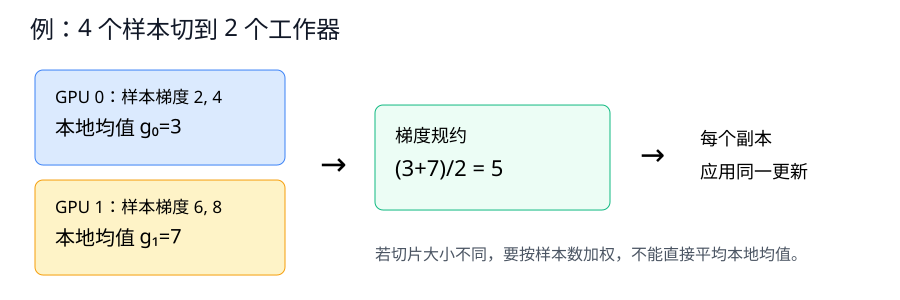

---

## 12.6 多 GPU 的简洁实现

### DataParallel 与 DDP

`nn.DataParallel` 单进程管理多个设备，易上手，但主设备 scatter/gather 和 Python 调度可能成为瓶颈。`DistributedDataParallel`（DDP）通常每 GPU 一个进程，反向时以 bucket 做 all-reduce，是更常用的训练方案。

| 责任 | `DistributedSampler` | DDP |
| --- | --- | --- |
| 数据 | 让不同 rank 读取不同样本，并按 epoch 重新洗牌 | 不自动切 Dataset |
| 模型 | 不管理 | 启动时同步参数，反向时规约梯度 |
| 指标 | 不汇总 | 也不会自动替你汇总任意日志指标 |

DDP 基本骨架：

~~~python
torch.distributed.init_process_group(backend="nccl")
torch.cuda.set_device(local_rank)
model = model.to(local_rank)
model = DDP(model, device_ids=[local_rank])
sampler = DistributedSampler(dataset, shuffle=True)
for epoch in range(epochs):
    sampler.set_epoch(epoch)
    for x, y in loader:
        optimizer.zero_grad(set_to_none=True)
        loss = criterion(model(x.to(local_rank)), y.to(local_rank))
        loss.backward()       # DDP hook 在这里规约梯度
        optimizer.step()
~~~

### 全局 batch 与学习率

若每卡 batch 为 $b$、工作器数为 $K$、梯度累积步数为 $a$，有效全局 batch 常为：

$$B_{\text{global}}=bKa.$$

扩大设备数但保持每卡 batch 不变，会扩大优化问题中的 batch。学习率是否线性放大不是定律，要结合优化器、warmup 和验证曲线实验。

### 单设备也能验证什么

没有多 GPU 时仍可验证：

- 输入、logits、loss Shape；
- 包装前后 forward 语义；
- `zero_grad → forward → backward → step` 顺序；
- 参数是否真的变化；
- 数据切片和加权平均公式。

[`parallelism_demo.py`](../code/ch12/parallelism_demo.py) 使用 `nn.DataParallel` 完成一次安全单步：CPU/单 GPU 时退化为普通调用，多 GPU 时自动复制和汇总。

### 新手例子：不能总是除以 GPU 数

- **问题/小输入**：全局 batch=10，分给 3 个 rank，实际大小为 `[4,3,3]`。
- **逐步过程**：各 rank 产生本地平均梯度 $g_0,g_1,g_2$；按样本数加权。
- **具体输出**：全局梯度 `0.4g0 + 0.3g1 + 0.3g2`，不是 `(g0+g1+g2)/3`。
- **说明什么**：最后一个不整齐 batch 会让“平均本地平均”产生偏差。
- **常见误解**：以为 DDP 自动理解任何自定义 loss 的归一化语义；它只规约梯度，数学口径仍由代码决定。

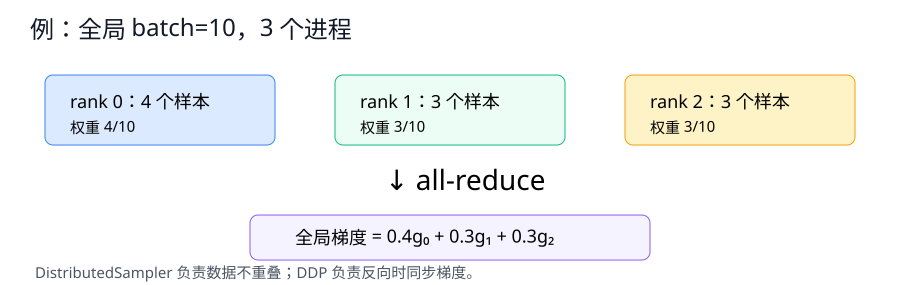

---

## 12.7 参数服务器

### 中心式键值存储

参数服务器把参数按 key 分片保存。工作器拉取参数、计算梯度、推送更新。优点是接口直观、可按 key 分片；风险是中心节点网络/计算热点以及异步更新的梯度陈旧性。

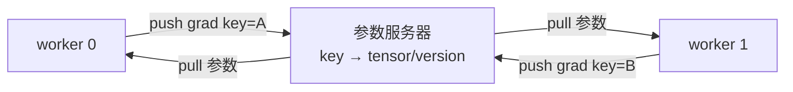

- **同步**：等所有工作器同一版本梯度，数学语义清楚，但最慢工作器拖住全局；
- **异步**：工作器到达即更新，减少等待，却可能用旧参数算出的梯度更新新参数；
- **有界陈旧**：允许有限版本差，折中吞吐与稳定性。

### 环同步为什么能避开中心热点

环形 all-reduce 把长度 $P$ 的梯度分成 $N$ 块：

1. `reduce-scatter`：每轮把一块发给右邻居、接收左邻居一块并累加；
2. `all-gather`：再传播已经规约完整的块；
3. 每个工作器最终拥有完整梯度和，再除以 $N$ 得平均。

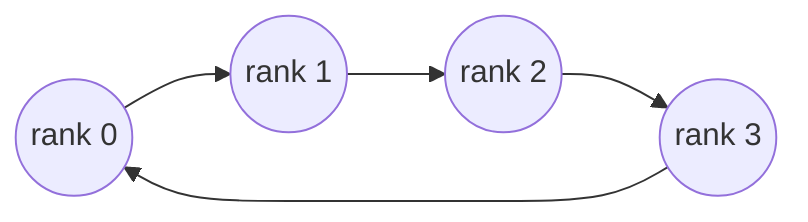

忽略延迟时，每个工作器通信量约为：

$$2P\frac{N-1}{N},$$

且链路负载更均衡。环形并非在所有网络拓扑和小消息上都最优，真实库会依据拓扑选择算法。

[`distributed_systems.py`](../code/ch12/distributed_systems.py) 用纯张量实现参数服务器平均、ring reduce-scatter/all-gather，并断言两者结果一致；还显示异步旧梯度与同步平均会走向不同参数。

### 新手例子：8 个数怎样绕环同步

- **问题/小输入**：4 个工作器各有 8 维梯度。
- **逐步过程**：每份切成 4 块、每块 2 个数；先边传边加 3 轮，再传播完整块 3 轮。
- **具体输出**：每个工作器最终都有相同的 8 维梯度和，除以 4 得平均。
- **说明什么**：没有中心服务器也能让所有副本得到一致更新量。
- **常见误解**：以为一轮绕环就结束；完整 all-reduce 包含规约分散和全收集两个阶段。

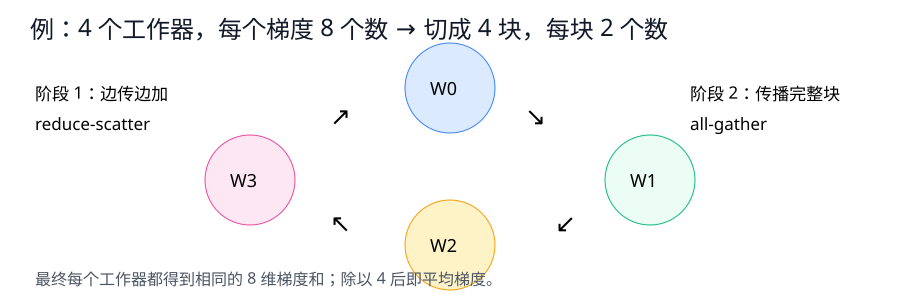

---

## Hot 100 算法迁移：#146 LRU 缓存

题目：[146. LRU 缓存](https://leetcode.cn/problems/lru-cache/) · 来源：[LeetCode 热题 100 官方题单](https://leetcode.cn/studyplan/top-100-liked/) · 完整代码：[`lru_cache.py`](../code/ch12/lru_cache.py)

### 原创摘要与本章关联

容量固定的缓存支持 `get(key)` 和 `put(key,value)`；访问或写入会把条目标成“最近使用”，超容量时淘汰“最久未使用”。这正好把 12.4 的缓存层次具体化：快存储空间小，因此要保留更可能再次访问的数据。

### 目标与白话推导

要求平均 $O(1)$，一套结构不够：

- 只用列表：能维护新旧顺序，但按 key 查找是 $O(n)$；
- 只用字典：能 $O(1)$ 查 key，却不能 $O(1)$ 找到最旧条目；
- **字典 + 双向链表**：字典定位节点，链表维护新旧顺序；两者都只改常数个指针。

约定 `head.next` 最新，`tail.prev` 最旧。容量 2 的过程：

1. `put(1,1)`：顺序 `[1]`；
2. `put(2,2)`：顺序 `[2,1]`；
3. `get(1)`：命中并刷新，顺序 `[1,2]`；
4. `put(3,3)`：先插入，再淘汰尾部 2，顺序 `[3,1]`。

### 复杂度与易错点

- `get` 平均时间 $O(1)$，`put` 平均时间 $O(1)$，空间 $O(C)$；
- 命中 `get` 也必须刷新顺序；
- 更新已有 key 不增加长度，但也要刷新；
- 节点必须保存 key，淘汰时才能同步删除字典项；
- 哨兵节点能统一处理空链表、首尾插删；
- 字典与链表必须同时更新，任何一边遗漏都会产生“幽灵节点”。

运行自测：

~~~bash
python code/ch12/lru_cache.py
~~~

---

## 性能排错总路径

1. **定义目标**：延迟、吞吐、显存还是成本？
2. **保证正确**：固定种子和输入，对照输出/梯度；
3. **数据**：磁盘、解码、DataLoader 是否供得上？
4. **Shape/dtype/device**：是否频繁变化、隐式转换或跨设备复制？
5. **前向/反向**：大算子还是许多碎算子？是否有 graph break？
6. **同步**：计时是否前后同步？是否频繁 `.item()`？
7. **通信**：all-reduce 是否成为关键路径？是否可用 bucket 重叠？
8. **硬件**：算力、带宽、容量、互连哪个先到上限？
9. **复测**：同一口径多次测量，保留正确性回归测试。

### 面试八股加练：不能只背结论

21. 【八股深答】为什么 GPU 计时必须预热并同步？

**结论：**预热排除初始化与编译开销，同步确保计时区间包含设备真正执行时间。**机制：**CUDA kernel 通常异步入队，CPU 调用返回不代表 GPU 完成；首轮还可能触发上下文、算法选择和缓存建立。**工程影响：**固定输入、预热多轮、边界同步并重复统计分位数；端到端延迟与纯 kernel 时间要分开报告。**误区：**在每个训练 step 都同步会破坏流水并降低真实性能。**追问：**`loss.item()` 也会隐式迫使 CPU 等待 GPU，应控制调用频率。

22. 【八股深答】数据并行与模型并行的通信瓶颈分别是什么？

**结论：**数据并行主要同步参数梯度；模型并行主要在分割边界传输激活及其梯度。**机制：**前者每卡处理不同样本但持有完整模型，后者把同一样本计算图切到多个设备。**工程影响：**参数量大且计算少时 all-reduce 占比高；边界激活大时模型并行通信重，应按计算/通信比切分。**误区：**增加 GPU 不保证线性加速，负载不均、启动开销与互联带宽都会限制。**追问：**混合并行会同时面对两类通信，需要拓扑感知布局。

23. 【八股深答】为什么性能优化的第一步是测量而不是换 API？

**结论：**只有测量能确定瓶颈位于数据、CPU、GPU 计算、内存、通信还是同步。**机制：**Amdahl 定律决定优化非瓶颈部分几乎不改变总时间。**工程影响：**先建立正确性基线和端到端 profile，再做单一变更、复测吞吐/延迟/显存并保留回归测试。**误区：**微基准更快不代表完整训练更快，编译首轮成本也不能与稳态吞吐混在一起。**追问：**优化后数值或收敛改变时，应优先视为语义变化而不是“性能收益”。

## 一页速查

| 问题 | 先记这一句 |
| --- | --- |
| eager 与 compile | 前者易调试，后者有全图优化机会；先验正确性再测稳定阶段 |
| GPU 计时 | 入队是异步的，墙钟计时前后要同步 |
| 自动并行 | 只有无依赖工作才能重叠，总时间受最慢分支和开销限制 |
| 算术强度 | FLOPs/byte 低时常受带宽限制 |
| 数据并行 | 切样本、复制模型、规约梯度；不等长切片要加权 |
| 模型并行 | 切模型、传激活；省单卡容量但增加通信 |
| DDP | sampler 切数据，DDP 规约梯度，日志仍需自己汇总 |
| 参数服务器 | 中心式直观但可能热点；异步需处理陈旧梯度 |
| ring all-reduce | reduce-scatter + all-gather，均衡使用环形链路 |

## Hot 100 加练（本章共 3 题）

原有 #146 之外，新增 [#23 合并 K 个升序链表](https://leetcode.cn/problems/merge-k-sorted-lists/) 与 [#295 数据流的中位数](https://leetcode.cn/problems/find-median-from-data-stream/)，练多路候选堆与双堆在线平衡。解析见[新增题完整解析](leetcode-hot100-expanded-practice.md#第-12-章堆与在线数据结构)，代码见 [hot100_merge_k_sorted_lists.py](../code/ch12/hot100_merge_k_sorted_lists.py) 与 [hot100_median_data_stream.py](../code/ch12/hot100_median_data_stream.py)。

## 主动回忆：先遮住答案再作答

1. 【解释】编译为什么可能加速重复执行，却让首轮变慢？

结论：编译用一次捕获、分析和代码生成成本换取后续更少调度与更优算子。首轮含编译成本，所以可能更慢；只有重复次数足够多，单次节省才覆盖前期成本。代码上应分开报告首轮和预热后的稳定吞吐。

2. 【辨析】autograd 计算图与 torch.compile 捕获图是一回事吗？

不是。autograd 图记录求导所需运算，服务 backward；compile 图服务执行优化。推理模式可不建 autograd 图，但仍可捕获执行图。混淆二者会误判内存和性能行为。

3. 【诊断】编译后越来越慢，先查什么？

先查输入 Shape/dtype 与 Python 分支是否不断变化并触发重编译，再查 graph break 和正确计时。若每批都产生新图，编译成本无法摊薄；应稳定输入或保留必要的 eager 区域。

4. 【计时】为何 CUDA 基准前后都要 synchronize？

前同步排除此前队列遗留工作，后同步等待本轮任务真正完成。否则测到的可能只是 CPU 入队时间，吞吐会被严重高估，优化比较失去意义。

5. 【代码推演】训练循环每步 loss.item() 会怎样？

它通常要求把设备标量取回 CPU，从而形成同步点。数值正确，但 CPU/GPU 重叠被打断，吞吐可能下降。可按较大间隔记录，或在设备上累积后再一次取回。

6. 【并行】两个任务分别 3 ms 和 8 ms，理想并行总时间是多少？

无依赖且忽略开销时为 `max(3,8)=8 ms`，而非 5 或 11 ms。实际还要加调度和通信；较慢任务决定尾部延迟。

7. 【诊断】把一个 20 微秒算子分到另一块 GPU 为何可能更慢？

跨设备派发和数据传输可能远高于 20 微秒。并行粒度太小，固定开销超过计算收益。代码应先 profile，再合并小算子或增大任务粒度。

8. 【硬件】峰值 FLOPs 很高，为何向量加法仍慢？

向量加法每搬许多字节只做一次加法，算术强度低，通常被内存带宽限制。提高计算单元峰值无助于解决供数不足，应减少搬运或融合操作。

9. 【Shape】模型并行边界激活为 (B,T,H)，通信量受哪些量影响？

元素数为 $BTH$，字节数还乘 dtype 字节数；训练反向通常还要传同 Shape 梯度。增大 batch、序列长或隐藏宽都会扩大边界通信，可能抵消分层收益。

10. 【公式】本地 batch 大小为 5 和 3，本地平均梯度如何合成？

全局平均是 $\frac58g_0+\frac38g_1$。直接二等分只在两个 batch 等长时正确。实现中应按实际样本数加权，尤其注意最后一个 batch。

11. 【训练】数据并行中为何所有副本必须从同一参数版本开始？

否则本地梯度对应不同函数点，平均后不再等于任何一个统一模型的标准 batch 梯度。同步参数和一致更新能保持副本等价，便于复现单设备数学语义。

12. 【辨析】数据并行和模型并行各切什么？

数据并行切 batch，复制完整参数，之后规约梯度；模型并行切层或张量，在设备间传激活和反向梯度。前者解决吞吐，后者主要解决单卡容量，也可组合使用。

13. 【DDP】DistributedSampler 和 DDP 分别负责什么？

Sampler 让不同 rank 读取不同数据并管理每轮洗牌；DDP 包装模型、在反向 hook 中规约梯度。缺 sampler 会让各 rank 重复样本，缺 DDP 同步则参数副本会分叉。

14. 【Shape】每卡 batch=32、4 卡、累积 2 步，有效 batch 是多少？

通常为 $32\times4\times2=256$。这会改变梯度噪声和优化行为；不能只因为设备增多就假定原学习率仍最佳。

15. 【通信】ring all-reduce 为什么分两个阶段？

reduce-scatter 让每个 rank 得到一块完整规约结果，但还缺其他块；all-gather 再传播这些完整块，使每个 rank 拥有全向量。少任一阶段都得不到完整平均梯度。

16. 【参数服务器】异步梯度“陈旧”是什么意思？

工作器基于旧版本参数计算梯度，但推送时服务器参数已经被其他工作器更新。该梯度方向不再对应当前点，可能提高吞吐也可能损害收敛，需要版本控制或有界陈旧策略。

17. 【诊断】多 GPU 比单 GPU 还慢，优先检查哪四项？

先查每卡任务是否太小、数据是否重复/供给不足、通信占比与互连带宽、是否频繁同步。再看 batch/学习率是否改变了训练轮数，不能只比较单步时间。

18. 【LRU】为什么需要哈希表和双向链表两个结构？

哈希表让按 key 定位节点平均 O(1)，双向链表让已知节点的移动与淘汰 O(1)。二者分别负责“找得到”和“排得快”；任何一者单独都无法满足所有操作平均 O(1)。

19. 【LRU 代码】get 命中后为什么也要移动节点？

读取本身就是一次使用，命中项应变成最新。若只返回值不移动，后续满容量时可能错误淘汰刚访问的项，违背 LRU 语义。

20. 【方法】性能优化的第一步为何不是换 API？

必须先定义目标、验证正确并 profile 瓶颈。没有口径的“优化”可能只把等待挪到别处，或提高吞吐却破坏延迟/精度。证据决定改数据、算子、同步、通信还是硬件。

## 学完本章应该能做到

- 区分 eager、执行图、autograd 图和编译首轮成本；
- 在异步设备上做带预热、前后同步、明确 Shape 的计时；
- 用依赖图判断哪些计算和通信能重叠；
- 用算术强度解释计算受限与带宽受限；
- 手算不等长 batch 的数据并行全局梯度；
- 说明 DataParallel、DDP、模型并行和参数服务器的职责边界；
- 画出 ring all-reduce 两阶段并验证结果；
- 用 LRU 把缓存局部性落实为可运行的数据结构。

[上一章：优化算法](ch11-optimization-algorithms.md) · [下一章：计算机视觉](ch13-computer-vision.md) · [返回总目录](../README.md)
