# 第 13 章：计算机视觉

> 复习定位：从“整张图是什么”扩展到“物体在哪、每个像素是什么、怎样迁移视觉知识” 
> 内容脉络：13.1–13.14 · PyTorch · 合成数据离线可运行 
> 原创学习笔记，章节顺序参考[《动手学深度学习》中文 2.0 官方目录](https://zh-v2.d2l.ai/chapter_computer-vision/index.html)

[增广与微调](../code/ch13/augmentation_finetune.py) · [边界框/锚框/NMS/SSD](../code/ch13/detection_core.py) · [分割/转置卷积/FCN](../code/ch13/segmentation_fcn.py) · [风格损失与小型竞赛流程](../code/ch13/style_and_kaggle.py) · [Hot 100：岛屿数量](../code/ch13/number_of_islands.py)

## 一句话主线

**计算机视觉不只要提取图像特征，还要把标签随空间变换正确搬运：分类给整图一个答案，检测给每个物体类别和框，分割给每个像素类别；增广、微调、多尺度表示和结构化损失让这些任务在有限数据上真正可学。**

## 三个月后复习入口

| 场景 | 先看什么 | 达标标准 |
| --- | --- | --- |
| 新手第一次学 | 分类/检测/分割区别 → 框坐标 → IoU/NMS → 像素标签 | 能根据任务说出标签和输出 Shape |
| 90 天后复习 | 三任务表 → SSD 数据流 → FCN 图 → 微调流程 | 能恢复“数据变换必须同步改标签”的主线 |
| 面试前复习 | anchors、匹配、NMS、mAP/mIoU、转置卷积、RoI Align | 能手算 IoU、候选数和输出尺寸，并说明误区 |

**最小记忆集：**

1. 增广必须保持语义，并同步变换框或 mask；
2. 检测同时解决“是什么”和“在哪里”，锚框负责提供候选参照；
3. IoU 衡量重叠，NMS 删除重复预测，两者不是训练准确率；
4. 分割输出 `(B,C,H,W)`，标签通常是 `(B,H,W)` 的类别索引；
5. 转置卷积是可学习上采样，不是普通卷积的数学逆。

### 专有名词白话表

| 术语 | 白话解释 | 典型对象 |
| --- | --- | --- |
| 图像增广 | 对训练图片做仍不改变类别含义的变化 | flip、crop、color jitter |
| backbone | 负责把图片提取成多层特征的主干网络 | ResNet 等 |
| 微调（fine-tuning） | 从预训练参数出发，用较小步子适应新任务 | 分层学习率 |
| 边界框 | 用四个坐标描述物体位置和范围 | `(x1,y1,x2,y2)` |
| 锚框（anchor） | 预先放置的候选参照框，模型预测类别和偏移 | 每位置多个框 |
| IoU | 两个区域的交集面积除以并集面积 | 0～1 |
| NMS | 优先保留高分框，删除与它过度重叠的重复框 | 推理后处理 |
| 语义分割 | 给每个像素分类，但不区分同类的不同实例 | mask |
| 转置卷积 | 用可学习权重把小特征图放大 | 上采样层 |

### 教材高价值问答

【数据】图像增广为什么可能让模型更差，而不是一定提升泛化？

只有保持标签语义的变换才提供有用不变性。把数字 6 旋转成像 9、裁掉目标、翻转具有方向含义的类别，都会制造矛盾监督；检测和分割还必须同步变换框与 mask。正确顺序是先可视化“增广后图像+标签”，再通过验证集调强度。

【检测】锚框匹配和 NMS 都用 IoU，它们是不是同一步？

不是。训练前的锚框匹配用 IoU 决定哪些候选负责学习哪个真实框，从而产生分类与偏移标签；推理后的 NMS 用 IoU 删除同类重复预测。一个负责构造监督，一个负责整理输出。阈值含义和使用阶段不同，不能混用。

【指标】背景占 95% 时，像素准确率 95% 为什么仍可能是失败模型？

模型若把所有像素都预测为背景，准确率就有 95%，却完全漏掉目标。分割应查看每类 IoU、mIoU、目标召回和可视化；类别极不平衡时还要考虑损失权重或采样。单一总体准确率会被大类掩盖。

## 本章地图

```mermaid
flowchart LR
    A["13.1 增广"] --> B["13.2 微调"]
    B --> C["13.3 边界框"]
    C --> D["13.4 锚框"]
    D --> E["13.5 多尺度"]
    E --> F["13.6 检测数据"]
    F --> G["13.7 SSD"]
    G --> H["13.8 R-CNN 系列"]
    H --> I["13.9 分割"]
    I --> J["13.10 转置卷积"]
    J --> K["13.11 FCN"]
    K --> L["13.12 风格迁移"]
    L --> M["13.13–13.14 竞赛实战"]
```

### 三种核心任务先分清

| 任务 | 标签 | 典型输出 Shape |
| --- | --- | --- |
| 图像分类 | 一张图一个类别 | logits `(B,C)` |
| 目标检测 | 一张图若干 `(类别,框)` | 分类 `(B,N,C+1)`，框 `(B,N,4)` |
| 语义分割 | 每个像素一个类别 | logits `(B,C,H,W)` |

---

## 13.1 图像增广

### 白话直觉：告诉模型“这些变化不该改变答案”

训练集中猫总在正中间，模型可能把“中间有纹理”当成猫。随机裁剪、翻转、亮度变化把同一语义放进不同外观，让模型减少对偶然属性的依赖。增广不是凭空创造新信息，而是把我们认可的不变性写进训练分布。

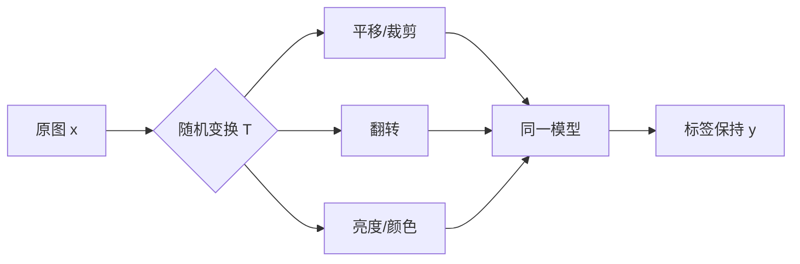

### 什么时候标签能保持

- 自然物体分类中，轻微平移、裁剪和颜色扰动通常不改类别；
- 数字识别里，水平翻转可能把语义变坏；
- 检测中翻图必须同步变换框；
- 分割中几何变换必须同步作用于 mask，颜色扰动只作用于图像；
- 验证/测试通常不做随机增广，否则指标随抽样变化。

输入 `X:(B,C,H,W)`，张量亮度因子可设为 `(B,1,1,1)`，依靠广播逐图作用。几何增广输出仍是 `(B,C,H,W)`，不含可学习参数，但若输入需要梯度，张量运算仍可进入计算图。

完整代码 [`augmentation_finetune.py`](../code/ch13/augmentation_finetune.py) 的 `augment_batch` 依次反射填充、随机裁剪、水平翻转和亮度缩放；数据是横/竖条，所选变换不会交换类别。

### 新手例子：安全的平移增广

- **问题/小输入**：一张 4×4 图里有横条，标签为 1。
- **逐步过程**：先在四周补像素，再随机裁回 4×4，横条从中间移动到上方。
- **具体输出**：像素位置改变，输出 Shape 仍是 `(1,4,4)`，标签仍为 1。
- **说明什么**：增广教模型忽略位置，关注“横向结构”。
- **常见误解**：任何随机变换都能增益；若旋转 90° 把横条变竖条却不改标签，等于主动制造错标。

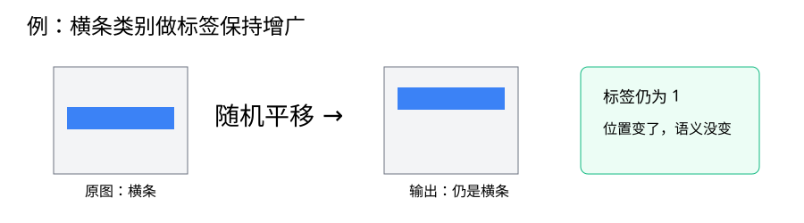

---

## 13.2 微调

### 为什么不从零训练

小目标数据集可能不足以从随机参数学出稳定边缘、纹理和形状。大数据预训练模型已学到一套可复用表示；微调先保留这些知识，再替换任务专用输出头并适度更新。

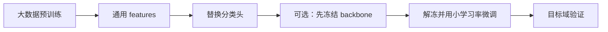

### 参数组与 Shape

若 backbone 输出 `H:(B,D)`，新任务有 $C_{new}$ 类，则新头权重 `W:(C_new,D)`，logits 为 `(B,C_new)`。常用两组学习率：

~~~python
optimizer = torch.optim.SGD([
    {"params": model.features.parameters(), "lr": 1e-3},
    {"params": model.classifier.parameters(), "lr": 1e-2},
])
~~~

新头随机初始化，需要更快适应；旧层已有结构，大学习率容易“灾难性遗忘”。冻结参数时要用 `requires_grad_(False)`；只把优化器排除并不能减少反向图中所有不必要计算。

### 一条实用训练路线

1. 使用与预训练一致的通道、归一化和输入范围；
2. 替换输出头，先只训练新头若干轮；
3. 解冻后层或全部 backbone，用更小学习率；
4. 以目标域验证集选择策略；
5. 域差很大时，预训练不一定优于从零，必须对照实验。

[`augmentation_finetune.py`](../code/ch13/augmentation_finetune.py) 先在居中条纹上预训练，再把分类头替换，在偏移条纹小数据上用十倍头部学习率微调。

### 新手例子：旧层慢学，新头快学

- **问题/小输入**：backbone 已学到 16 维特征，新任务只有 2 类。
- **逐步过程**：保留 features，替换为 `Linear(16,2)`；旧层学习率 0.001，新头 0.01。
- **具体输出**：输入 `(B,1,20,20)`，输出 logits `(B,2)`；两组参数都更新，但步幅不同。
- **说明什么**：迁移不是复制最终答案，而是复用中间表示。
- **常见误解**：微调等于永远冻结 backbone；完全冻结只是一个阶段或基线。

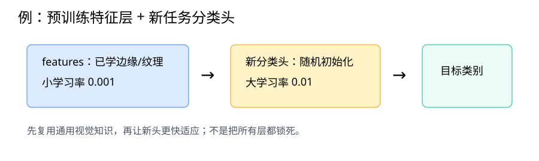

---

## 13.3 目标检测和边界框

### 分类回答“是什么”，检测还要回答“在哪”

最常见轴对齐框表示为角点式：

$$b=(x_{min},y_{min},x_{max},y_{max}),$$

也可写成中心式：

$$c_x=\frac{x_{min}+x_{max}}2,\quad c_y=\frac{y_{min}+y_{max}}2,$$

$$w=x_{max}-x_{min},\quad h=y_{max}-y_{min}.$$

注意坐标顺序是 **x 横向、y 纵向**，而张量索引常是 `[row=y, column=x]`。这是检测代码最常见的错位来源。

### 像素坐标与归一化坐标

图像高 $H$、宽 $W$。归一化角点框为：

$$\left(\frac{x_{min}}W,\frac{y_{min}}H,\frac{x_{max}}W,\frac{y_{max}}H\right).$$

归一化框不依赖具体分辨率，适合模型预测；绘图时要乘回 $W,H$。数据约定还可能决定右下角是否包含边界像素，必须统一。

[`detection_core.py`](../code/ch13/detection_core.py) 提供 `box_corner_to_center` 与逆变换，输入 `(...,4)`，输出同 Shape，不含参数、不改变框张量。

### 新手例子：像素框怎样归一化

- **问题/小输入**：图像 `H=100,W=200`，框 `(50,20,150,80)`。
- **逐步过程**：x 坐标除 200，y 坐标除 100；再可求中心与宽高。
- **具体输出**：归一化角点式 `(0.25,0.20,0.75,0.80)`，中心式 `(0.50,0.50,0.50,0.60)`。
- **说明什么**：同一框可有多种表示，但单位和顺序必须清楚。
- **常见误解**：把所有坐标都除以 H；非正方图像会让 x 坐标错误。

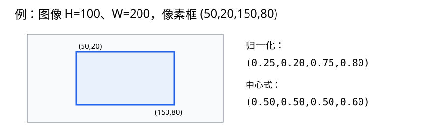

---

## 13.4 锚框

### 锚框是在问一组具体问题

在每个特征位置预放若干尺度和宽高比的参考框，网络回答：这里的每个参考框是背景还是某类物体？若是物体，要向哪里移动、变多大？

每像素锚框常用组合数：

$$A=|S|+|R|-1,$$

即所有 `(size_i, ratio_0)` 加 `(size_0, ratio_j)`，避免完整笛卡尔积过多。特征图 `(H_f,W_f)` 共产生 $N=H_fW_fA$ 个锚框。

### IoU：重叠程度的共同尺子

$$\mathrm{IoU}(A,B)=\frac{|A\cap B|}{|A\cup B|}=\frac{|A\cap B|}{|A|+|B|-|A\cap B|}.$$

IoU 在 `[0,1]`：0 不交，1 完全重合。训练匹配常先让高于阈值的锚框认领 GT，再强制每个 GT 至少匹配一个锚框，避免某物体没有正样本。

### 偏移编码

以中心式锚框 $a=(a_x,a_y,a_w,a_h)$、真值框 $b$ 为例：

$$t_x=10\frac{b_x-a_x}{a_w},\quad t_y=10\frac{b_y-a_y}{a_h},$$

$$t_w=5\log\frac{b_w}{a_w},\quad t_h=5\log\frac{b_h}{a_h}.$$

中心差按锚框尺寸归一化，宽高比取 log，把尺度乘法变成更好回归的加法量。解码时反向执行除缩放、`exp` 和乘锚框尺寸。

### NMS：同一物体只留一个答案

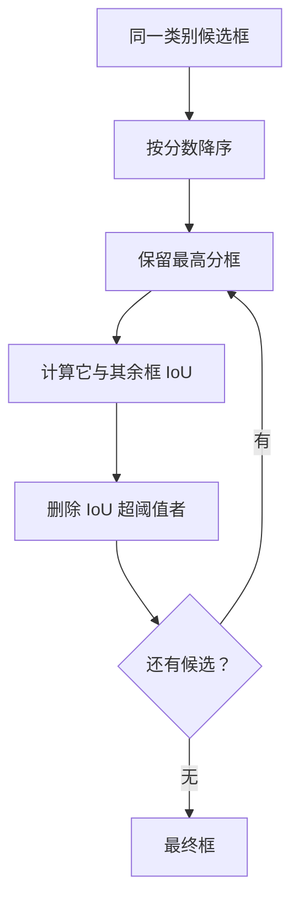

NMS 通常按类别分别做；若把猫框与狗框一起抑制，重叠的不同类别会互相误删。

完整代码 [`detection_core.py`](../code/ch13/detection_core.py) 覆盖两两 IoU `(N,M)`、锚框匹配、偏移往返与 NMS 自测。

### 新手例子：手算一个 IoU

- **问题/小输入**：两个 2×2 方框，第二个向右下各错 1 格。
- **逐步过程**：两框面积各 4，交集是 1×1=1，并集为 `4+4-1=7`。
- **具体输出**：IoU=`1/7≈0.143`。
- **说明什么**：并集必须减一次交集，因为交集在两块面积中被算了两遍。
- **常见误解**：把 IoU 写成 `交集/(面积A+面积B)`，会系统性偏小。

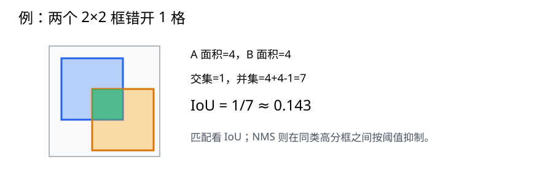

---

## 13.5 多尺度目标检测

### 为什么同一尺度不够

浅层高分辨率特征图位置多、感受野小，适合密集放置小锚框找小目标；深层低分辨率特征图位置少、感受野大，适合较大锚框找大目标。多尺度检测让不同层分工，而不是在一张巨大网格上放所有大小的框。

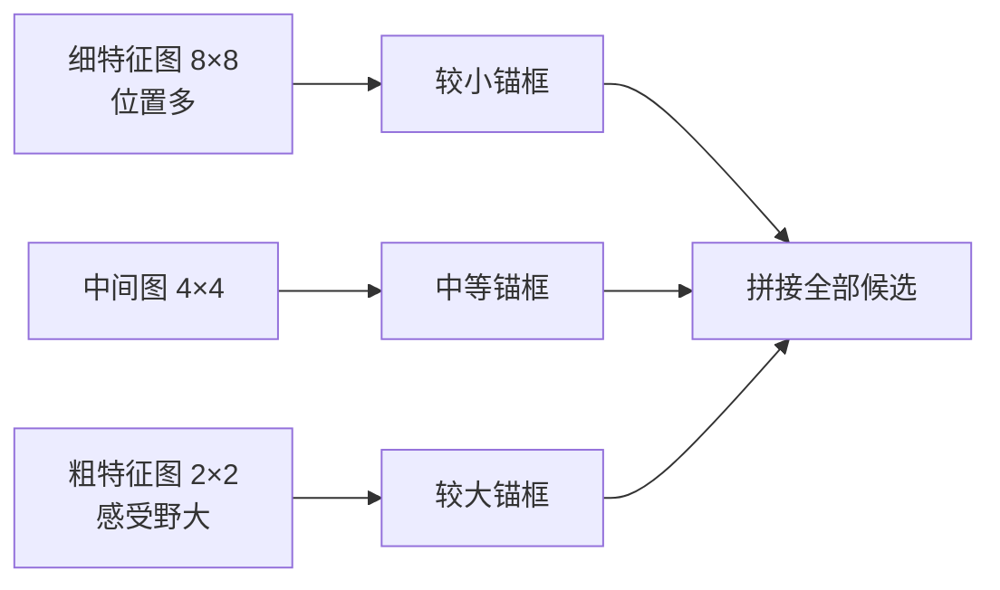

每层候选数为 $H_lW_lA_l$，总候选数：

$$N=\sum_l H_lW_lA_l.$$

锚框中心以该特征像素对应的归一化位置为基准。边界处锚框可以暂时超出 `[0,1]`，训练/显示/评估前是否裁剪要统一。

[`TinySSDCore`](../code/ch13/detection_core.py) 在 16×16 和 8×8 两层特征上生成不同尺度锚框，并沿候选维拼接。

### 新手例子：数清两个尺度的候选框

- **问题/小输入**：4×4 与 2×2 两张特征图，每个像素 4 个锚框。
- **逐步过程**：细图有 `4×4×4=64`，粗图有 `2×2×4=16`。
- **具体输出**：合计 80 个候选，锚框 Shape 为 `(1,80,4)`。
- **说明什么**：候选数量由特征位置数和每位置框数共同决定。
- **常见误解**：认为深层图更大所以框更多；深层空间更小，通常候选反而少、单框覆盖范围更大。

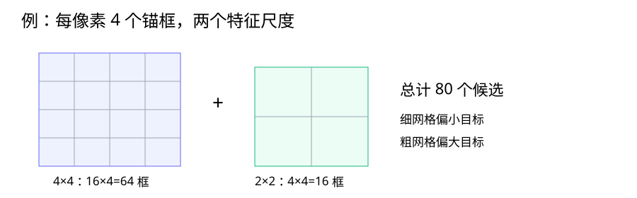

---

## 13.6 目标检测数据集

### 一张图的标签不是一个整数

常见检测标注可表示为每图一个变长列表：

$$[(c_1,x_{min1},y_{min1},x_{max1},y_{max1}),\ldots].$$

不同图物体数不同。组成 batch 时可填充到本批最大数量并配 mask，或保留列表。若用张量 `(B,M,5)`，必须区分真实行与 padding 行。

### 数据检查比模型更优先

1. 随机画出图与框，核对 x/y 和单位；
2. 检查 `xmin < xmax`、`ymin < ymax`；
3. 检查类别索引范围与映射表；
4. 几何增广后同步更新框，裁掉完全不可见框；
5. 划分数据时避免同源连续帧或同一对象泄漏到训练与验证；
6. 类别极不均衡时同时看每类召回，不只看总 loss。

### 裁剪时怎样更新框

原裁剪窗口左上角为 $(x_0,y_0)$，框坐标先平移：

$$x'=x-x_0,\qquad y'=y-y_0,$$

再裁到新图边界。可见面积过小的框应按清晰规则丢弃，而不是保留几乎没有物体的标签。

### 新手例子：图片裁剪，框必须同行

- **问题/小输入**：原图左侧裁掉 20 像素，某框 x 范围 `[40,110]`。
- **逐步过程**：两条 x 边都减裁剪起点 20；y 未裁则不变。
- **具体输出**：新框 x 范围 `[20,90]`。
- **说明什么**：检测的图像和坐标标签是一对，几何变换必须共同执行。
- **常见误解**：只对图片使用分类增广流水线，框仍在旧位置，模型会收到矛盾监督。

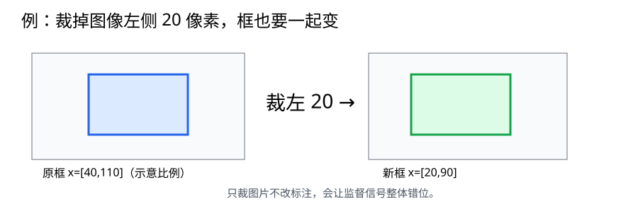

---

## 13.7 单发多框检测（SSD）

### “单发”是什么意思

SSD 一次前向就在多尺度特征图上同时预测所有锚框的类别和偏移，不再为每个候选单独运行一遍骨干网络。

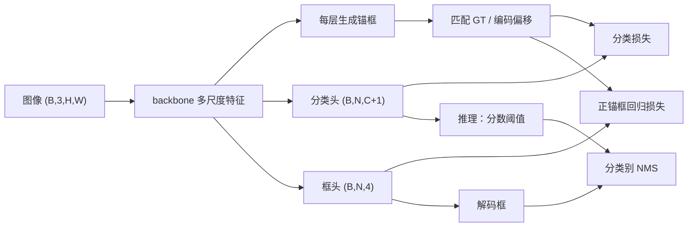

### 预测 Shape

某层输入通道 $C_{in}$、每像素 $A$ 个锚框、目标类别 $C$：

- 分类卷积输出通道：$A(C+1)$，背景也算一类；
- 框卷积输出通道：$4A$；
- 调整轴并摊平后分别是 `(B,N,C+1)` 与 `(B,N,4)`。

训练损失常写 $L=L_{cls}+\lambda L_{box}$。框损失只对正锚框计算，分类损失面对大量背景。可用负样本挖掘、focal loss 或采样缓解极度不平衡。

### 代码映射

[`detection_core.py`](../code/ch13/detection_core.py) 中：

- `multibox_prior`：特征图 → `(1,N_l,4)`，不建参数；
- `class_heads`：特征 → 分类 logits，参与反向；
- `box_heads`：特征 → 偏移，参与反向；
- `offset_inverse`：推理解码，不改变模型参数；
- `nms`：后处理离散选择，不用于普通训练反向。

### 新手例子：一个 SSD 层输出多少数

- **问题/小输入**：4×4 特征图，每位置 3 锚框，2 个目标类。
- **逐步过程**：候选数 `N=4×4×3=48`；每框分类含背景共 3 分，每框 4 个偏移。
- **具体输出**：分类 `(B,48,3)`，框偏移 `(B,48,4)`。
- **说明什么**：分类和定位共享候选维 N，但最后一维语义不同。
- **常见误解**：把分类最后一维写成 2，忘了背景类，导致标签索引与 head 通道错位。

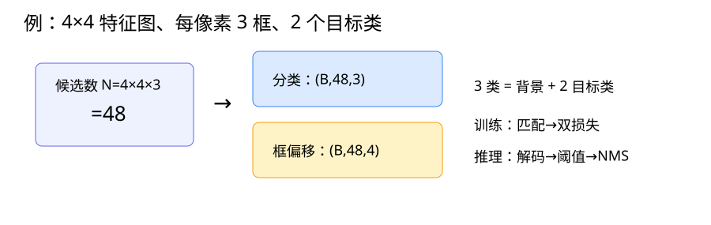

---

## 13.8 区域卷积神经网络（R-CNN）系列

### 系列演进解决了什么重复工作

| 模型 | 主要做法 | 主要改进 |
| --- | --- | --- |
| R-CNN | 每个候选区域单独过 CNN | 深度特征用于检测，但重复卷积昂贵 |
| Fast R-CNN | 整图只卷积一次，在特征图上取 RoI | 候选共享 backbone |
| Faster R-CNN | 用 RPN 学习生成候选 | 候选生成也进入神经网络 |
| Mask R-CNN | 在检测外增加实例 mask 分支 | 同时给每个实例像素级掩码 |

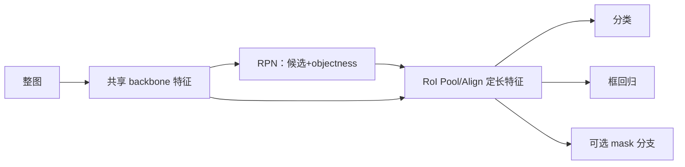

### RoI Pool 与 RoI Align

候选框大小各异，下游检测头需要固定 Shape。RoI Pool 把区域分格后汇聚，但坐标量化可能产生错位；RoI Align 用双线性插值在浮点坐标采样，减少量化误差，对像素级 mask 尤其重要。

### 两阶段与一阶段不是简单的快慢标签

R-CNN 系列先产生候选再精修，通常称两阶段；SSD 直接密集预测，称一阶段。真实精度/速度还取决于 backbone、分辨率、部署硬件和实现，不能只凭类别名称决定。

### 新手例子：为何共享整图特征

- **问题/小输入**：一张图有两个候选框 A、B。
- **逐步过程**：早期 R-CNN 对 A、B 各做整套 CNN；Fast 系列先整图卷积一次，再从同一特征图裁两个 RoI。
- **具体输出**：两个 RoI 都被对齐为例如 `(C,7,7)`，送入相同检测头。
- **说明什么**：大部分卷积被共享，候选数量增加时节省显著。
- **常见误解**：RoI Align 把原图直接缩放；它通常在共享特征图上按候选坐标采样。

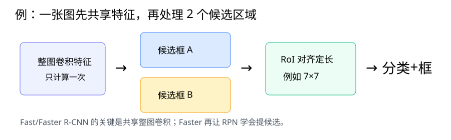

---

## 13.9 语义分割和数据集

### 每个像素都要回答类别

输入图像 `X:(B,C_in,H,W)`，模型输出 logits `Z:(B,C_cls,H,W)`，标签 `Y:(B,H,W)` 为整数类别索引。交叉熵把每个空间位置看成一次 C 分类：

~~~python
loss = F.cross_entropy(logits, masks)
prediction = logits.argmax(dim=1)  # (B,H,W)
~~~

不要先 argmax 再算 loss；argmax 离散且几乎处处无梯度。也不需要先 softmax，交叉熵已稳定地完成相应运算。

### 语义、实例、全景分割

- 语义分割：同类所有物体像素都标同类，不区分个体；
- 实例分割：同类的不同对象也分开；
- 全景分割：为“可数物体”和背景区域提供统一结果。

### 数据变换与指标

图像 resize 可用双线性插值，离散 mask 必须用最近邻，否则会生成不存在的类别编号。随机裁剪/翻转的参数应对图像和 mask 共用；颜色扰动只作用图像。

背景占 95% 时，全预测背景也有 95% 像素准确率。更有信息的是每类 IoU 与 mIoU：

$$\mathrm{IoU}_c=\frac{TP_c}{TP_c+FP_c+FN_c}.$$

[`segmentation_fcn.py`](../code/ch13/segmentation_fcn.py) 合成背景/矩形/圆形三类 mask，真实完成逐像素反向。

### 新手例子：4×4 的标签不是 16 个 RGB 值

- **问题/小输入**：4×4 图像，背景类 0，中间物体类 1。
- **逐步过程**：模型为每像素输出 2 个 logits；沿类别维 argmax。
- **具体输出**：logits `(B,2,4,4)`，类别图 `(B,4,4)`，每格只能是 0 或 1。
- **说明什么**：mask 保存类别索引，通道数在模型输出而不在标签里。
- **常见误解**：把彩色可视化 mask 的 RGB 当训练类别；应先按颜色映射回离散 class id。

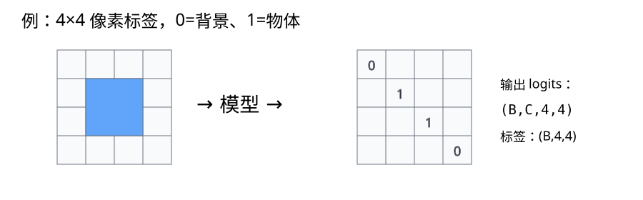

---

## 13.10 转置卷积

### 它不是“卷积的数值逆运算”

普通卷积可写成矩阵乘法 $y=Wx$；对输入梯度的线性操作是 $W^Ty$，其空间展开方式对应转置卷积。它叫“转置”是因为线性算子矩阵转置，不意味着能从输出无损恢复原输入。

一维/单方向输出尺寸（默认 dilation=1）：

$$H_{out}=(H_{in}-1)s-2p+k+\text{output\_padding}.$$

普通卷积多个输入可能映射到同一输出，信息已丢失；转置卷积只学习上采样映射，不会神奇找回细节。

### 重叠与棋盘格

可把转置卷积想成：每个输入元素乘一个核，并把小块“撒”到输出画布；重叠处相加。当 kernel 与 stride 覆盖不均时，某些位置收到更多叠加，容易产生棋盘格。可用合适参数、双线性初始化，或“插值 + 普通卷积”减轻。

[`segmentation_fcn.py`](../code/ch13/segmentation_fcn.py) 用双线性核初始化 `ConvTranspose2d(3,3,kernel_size=4,stride=4)`，输入 `(B,3,8,8)` 输出 `(B,3,32,32)`。

### 新手例子：只靠公式算输出尺寸

- **问题/小输入**：输入高 2，`kernel=2,stride=2,padding=0,output_padding=0`。
- **逐步过程**：代入 `(2-1)×2-0+2+0`。
- **具体输出**：高度 4；宽度参数相同则 2×2 变 4×4。
- **说明什么**：转置卷积 Shape 由离散参数决定，可在运行前手算。
- **常见误解**：`output_padding=1` 是在输出周围补一圈 0；它只用于消除 stride 带来的 Shape 歧义，不等同普通 padding。

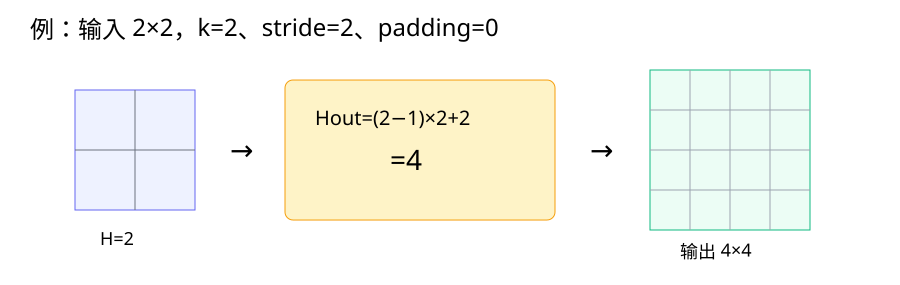

---

## 13.11 全卷积网络

### 从整图分类器变成密集预测器

FCN 去掉固定尺寸全连接分类头，用卷积保持空间结构：backbone 下采样获得语义特征，`1×1` 卷积逐位置映射为类别 logits，再上采样回输入分辨率。

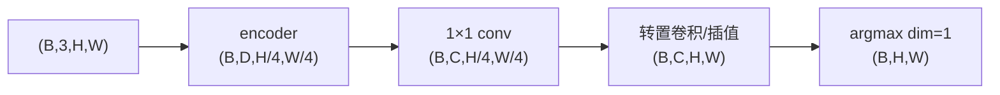

`1×1` 卷积不混合邻近空间，只在每个位置把 $D$ 维特征线性变成 $C$ 类得分。空间细节在下采样中损失，因此实际网络常加 skip connection，把浅层高分辨率特征与深层语义融合。

### 梯度与参数

- encoder、`1×1` classifier、可学习上采样层均参与计算图；
- `cross_entropy(logits,masks)` 会把像素梯度穿过上采样传回 backbone；
- bilinear 初始化只是起点，不等于固定；若希望固定需显式关闭 `requires_grad`。

运行 [`segmentation_fcn.py`](../code/ch13/segmentation_fcn.py)，可看到损失、像素准确率与全链路 Shape。

### 新手例子：通道 C 为什么不能被上采样掉

- **问题/小输入**：32×32 RGB 图像，3 个分割类别，encoder 缩小 4 倍。
- **逐步过程**：输入 `(B,3,32,32)` → 特征 → `1×1` 得 `(B,3,8,8)` → 上采样。
- **具体输出**：logits `(B,3,32,32)`，argmax 后 mask `(B,32,32)`。
- **说明什么**：上采样恢复 H/W，类别通道 C 一直保留到 argmax。
- **常见误解**：让转置卷积直接输出 `(B,1,H,W)` 并用类别索引回归；多类互斥任务通常应输出 C 个 logits。

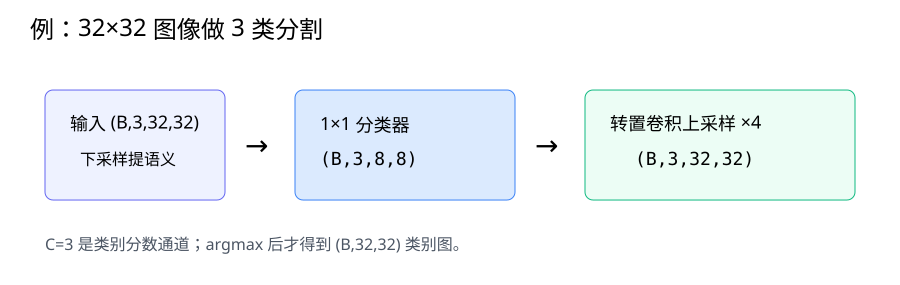

---

## 13.12 风格迁移

### 内容与风格怎样拆开

固定预训练特征网络，选择较深层特征表达内容布局，选择若干层的通道相关统计表达纹理风格。优化变量不是网络权重，而是生成图像 $X$ 的像素。

给定特征 $F:(B,C,H,W)$，摊平为 `(B,C,HW)`，Gram 矩阵：

$$G=\frac{FF^T}{CHW},\qquad G:(B,C,C).$$

它统计通道共同激活程度，丢掉具体空间顺序，因此适合描述“到处都有的纹理”。总损失可写：

$$L=\alpha L_{content}+\beta L_{style}+\gamma L_{TV}.$$

- 内容损失：生成图与内容图深层特征的 MSE；
- 风格损失：生成图与风格图 Gram 的 MSE；
- 总变差 TV：惩罚相邻像素剧烈变化，减少噪点。

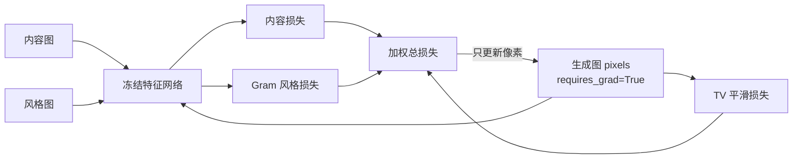

[`style_and_kaggle.py`](../code/ch13/style_and_kaggle.py) 用冻结的小卷积网络演示 Gram Shape、三类损失、像素更新与 `[0,1]` 投影，无需下载图片。

### 新手例子：谁在 optimizer 里

- **问题/小输入**：内容图、风格图、生成图均为 `(1,3,24,24)`。
- **逐步过程**：冻结特征网络；算目标特征；把 `generated` 单独传给 Adam；反向后更新其像素。
- **具体输出**：生成图 Shape 不变，网络参数梯度为空，`generated.grad` 存在。
- **说明什么**：特征网络像固定的“评分器”，生成图才是被调整的答案纸。
- **常见误解**：把网络参数放进优化器，这会改评分标准而不是按标准改图。

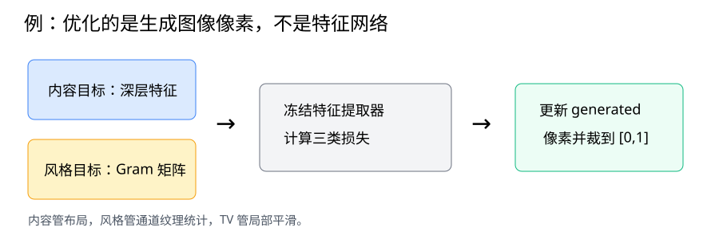

---

## 13.13 实战 Kaggle 比赛：图像分类（CIFAR-10）

### 比模型更重要的是无泄漏流水线

竞赛流程应可复现：读取标签 → 分层训练/验证划分 → 只用训练集拟合 → 用验证集选方案 → 固定方案重训/推理 → 按样例格式提交。

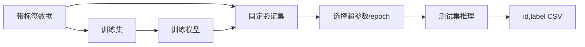

### CIFAR-10 的工程要点

- 小图像 `32×32`，过度下采样会很快抹掉空间信息；
- 随机裁剪与翻转是常用训练增广，验证不用随机增广；
- 按类别分层划分，避免小验证集某类消失；
- 保存类别名到整数的固定映射，提交时逆映射；
- TTA 可对原图与标签保持变换的概率取平均；
- 不要依据测试集结果反复手调，这是隐性泄漏。

[`style_and_kaggle.py`](../code/ch13/style_and_kaggle.py) 生成三类色块，完成分层划分、训练、验证、水平翻转 TTA，并写 UTF-8 `id,label` CSV。

### 新手例子：12 张数据怎样分而不漏

- **问题/小输入**：3 类各 4 张，共 12 张有标签图。
- **逐步过程**：每类取 1 张组成 3 张验证集，剩余 9 张训练；所有超参数只看这 3 张验证。
- **具体输出**：训练类计数 `[3,3,3]`，验证 `[1,1,1]`；测试只输出 `id,label`。
- **说明什么**：分层让小数据各类都有代表，测试集保持盲测。
- **常见误解**：把训练增广后的同一原图分别放进训练与验证；这仍是数据泄漏。

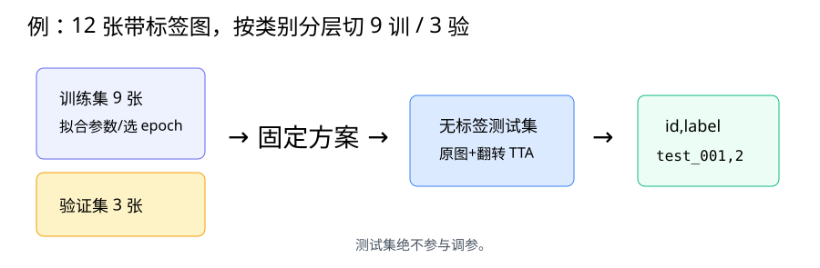

---

## 13.14 实战 Kaggle 比赛：狗的品种识别（ImageNet Dogs）

### 这是细粒度分类

不同犬种外观相近、类内姿态背景又变化大。相比 CIFAR-10，任务更依赖高分辨率细节、预训练表示、可靠类别映射和适度正则化。

典型迁移步骤：

1. 读 `id → breed` 标签并固定 120 类排序；
2. 按 breed 分层划分；
3. 用 ImageNet 预训练 backbone；
4. 把原 1000 类分类头替换为 120 类；
5. 先训练头，再以小学习率解冻；
6. 验证选择分辨率、增广和解冻深度；
7. 测试输出每个犬种概率列，而不是只输出 argmax（以竞赛格式为准）。

### 为什么高分辨率和预训练更重要

犬种差异可能集中在耳形、毛色纹理和脸部比例。过小输入把这些细节抹去；从零训练又很难用有限数据学到稳健底层特征。更大图也会增加显存和计算，应通过 batch、混合精度和梯度累积平衡。

### 复现实验必须固定什么

- 类别到列顺序；
- 图像 ID 与文件路径对应；
- 训练/验证划分和随机种子；
- 预训练权重版本、归一化；
- 最佳 checkpoint 依据；
- 提交列名、行顺序与概率归一化。

### 新手例子：换头不等于重学全部视觉

- **问题/小输入**：预训练模型原头输出 `(B,1000)`，目标是 120 犬种。
- **逐步过程**：保留 backbone 输出 `(B,D)`；删除旧头；新建 `Linear(D,120)`。
- **具体输出**：新 logits `(B,120)`，softmax 每行 120 项和为 1。
- **说明什么**：底层视觉特征复用，最后的类别坐标系必须重建。
- **常见误解**：直接保留 1000 类头，只挑其中“看起来像狗”的列；目标 120 类定义和预训练类别并非一一对应。

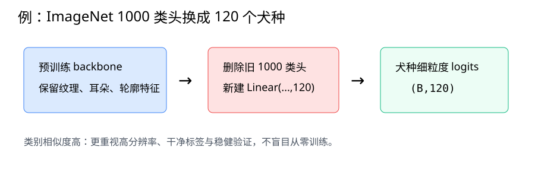

---

## Hot 100 算法迁移：#200 岛屿数量

题目：[200. 岛屿数量](https://leetcode.cn/problems/number-of-islands/) · 来源：[LeetCode 热题 100 官方题单](https://leetcode.cn/studyplan/top-100-liked/) · 完整代码：[`number_of_islands.py`](../code/ch13/number_of_islands.py)

### 原创摘要与视觉关联

给一个 `'1'` 陆地、`'0'` 水面的二维网格，统计上下左右连通的陆地区域数。它把分割 mask 的“像素类别”进一步变成“连通区域”：语义分割只说哪些像素是物体，连通分量能把空间上分离的区域区分开。

### 目标与白话推导

从左到右、从上到下扫描：

1. 水面跳过；
2. 已访问陆地跳过；
3. 遇到新陆地，岛数加 1；
4. 用 DFS/BFS 把与它四连通的所有陆地标为已访问；
5. 后面扫到这一岛的其他像素时不会重复计数。

示例：

~~~text
11000
11010
00000
00101
00101
~~~

左上块、第二行单点、下方中间竖块、右下竖块互不四连通，因此输出 4。

### 复杂度与易错点

- 每格最多入栈一次，时间 $O(HW)$；`visited` 与栈最坏空间 $O(HW)$；
- 题意是四邻域，不要把斜对角合并；
- 入栈时就标记，避免多个邻居重复入栈；
- 先判边界再访问，Python 负索引不会报错而会绕到末尾；
- 空网格要在访问 `grid[0]` 前返回；
- 递归 DFS 在大网格可能触发递归深度限制，迭代栈更稳妥。

运行自测：

~~~bash
python code/ch13/number_of_islands.py
~~~

---

## 综合排错路径

### 分类/微调

数据与类别映射 → NCHW、dtype、归一化 → train/eval → 新头输出 C → 两组学习率/冻结状态 → loss → 梯度 → 验证泄漏。

### 检测

先画原图框 → 核对 x/y、像素/归一化 → 增广后再画 → 锚框数 N → 分类 `(B,N,C+1)` → 偏移 `(B,N,4)` → 正负匹配 → 两类损失 → 解码 → 分类别 NMS → mAP。

### 分割

同步几何增广 → mask 最近邻插值/long dtype → logits `(B,C,H,W)` → label `(B,H,W)` → loss → argmax → 每类 IoU/mIoU → 可视化边界。

### 面试八股加练：不能只背结论

29. 【八股深答】IoU、置信度阈值和 NMS 阈值分别控制什么？

**结论：**IoU 衡量框重叠；置信度阈值先过滤低分预测；NMS 阈值决定高分框会压制多大重叠的同类框。**机制：**NMS 按分数选框，再删除与其 IoU 超阈值的候选。**工程影响：**NMS 阈值太低会误删相邻目标，太高会保留重复框；参数必须按验证集和任务密度调。**误区：**NMS 不参与学习普通模型参数，也不保证保留的框就是真目标。**追问：**Soft-NMS 不直接删除，而是衰减重叠候选分数。

30. 【八股深答】转置卷积为什么不是普通卷积的数学逆运算？

**结论：**它对应卷积线性算子的转置，可学习上采样，但一般不能唯一恢复卷积前输入。**机制：**步幅卷积会丢失信息，卷积矩阵通常非方阵或非满秩；转置只交换线性映射的输入输出方向。**工程影响：**输出 Shape 由 stride、padding、kernel 和 output_padding 决定，棋盘格伪影需通过核步幅设计或插值加卷积缓解。**误区：**Shape 恢复相同不代表像素信息被逆回。**追问：**反向传播求输入梯度时出现转置算子，是其名称来源之一。

31. 【八股深答】语义分割与目标检测的输出和损失有何根本区别？

**结论：**分割为每个像素预测类别；检测预测数量可变的框、类别与置信度。**机制：**分割 logits 常为 `(B,C,H,W)` 并逐像素交叉熵，检测还需锚框/查询匹配、分类与框回归损失。**工程影响：**指标分别常看 mIoU 与 mAP，标签预处理和增广必须同步处理 mask 或框。**误区：**高像素准确率在背景占比很大时可能没有意义。**追问：**实例分割还要区分同类别的不同对象，输出结构比语义分割更复杂。

## 一页速查

| 概念 | 最值得先恢复的结论 |
| --- | --- |
| 增广 | 只使用标签保持变换；检测框和分割 mask 要同步几何变换 |
| 微调 | 换新头、先快学头，再小步调整预训练层 |
| 边界框 | x 对宽 W，y 对高 H；明确角点/中心和像素/归一化 |
| IoU | 交集/并集，并集要减一次交集 |
| 锚框 | 每个参考框预测类别与 4 个偏移；确保每个 GT 有正锚框 |
| NMS | 同类内按分数贪心去重，阈值越低抑制越强 |
| 多尺度 | 细图找小目标，粗图找大目标，候选数逐层相加 |
| SSD | 单次前向、多尺度双头，训练先匹配，推理解码+NMS |
| R-CNN | 两阶段：候选区域 + RoI 特征 + 分类/回归 |
| 分割 | logits `(B,C,H,W)`，mask `(B,H,W)`，mask resize 用最近邻 |
| 转置卷积 | 是线性算子的转置式上采样，不是无损逆卷积 |
| FCN | 1×1 卷积变类别通道，再恢复空间分辨率 |
| 风格迁移 | 冻结特征网，优化生成图像素；Gram 描述通道相关 |
| 竞赛 | 分层验证、固定映射、禁止测试泄漏、严格提交格式 |

## Hot 100 加练（本章共 3 题）

原有 #200 之外，新增 [#994 腐烂的橘子](https://leetcode.cn/problems/rotting-oranges/) 与 [#240 搜索二维矩阵 II](https://leetcode.cn/problems/search-a-2d-matrix-ii/)，练多源 BFS 和二维单调消元。解析见[新增题完整解析](leetcode-hot100-expanded-practice.md#第-13-章二维网格搜索)，代码见 [hot100_rotting_oranges.py](../code/ch13/hot100_rotting_oranges.py) 与 [hot100_search_2d_matrix_ii.py](../code/ch13/hot100_search_2d_matrix_ii.py)。

## 主动回忆：先遮住答案再作答

1. 【解释】增广为什么能减少模型对偶然属性的依赖？

它让同一标签在位置、亮度等允许变化下反复出现，只有跨变化稳定的特征才能持续降低损失。代码上必须确保变换真的保持标签，否则模型学到矛盾监督。

2. 【诊断】训练准确率很低且增广后样例看起来变类，先做什么？

先可视化“变换后图像+标签”，逐项关闭增广定位破坏语义的操作。增广强度不是越大越好；先恢复标签正确，再谈正则化收益。

3. 【微调】为何新头学习率常大于 backbone？

新头随机初始化，需要快速建立目标类别边界；backbone 已有可用表示，大步更新可能破坏它。差分学习率让两者按不同成熟度适应，但最终比例仍由验证集决定。

4. 【Shape】backbone 输出 (32,512)，目标 10 类，新头参数和输出 Shape 是什么？

Linear 权重通常为 `(10,512)`、偏置 `(10,)`，输出 logits `(32,10)`。它建立计算图；`optimizer.step()` 后参数才改变。

5. 【坐标】为什么框的 x 除 W、y 除 H？

x 表示横轴列位置，范围由图像宽 W 决定；y 表示纵轴行位置，范围由高 H 决定。非正方图像若混用分母，框会发生非等比例错位。

6. 【公式】框 (2,3,8,11) 的中心式是什么？

中心是 `(5,7)`，宽 `8-2=6`，高 `11-3=8`，所以 `(5,7,6,8)`。应先确认采用的边界是否连续坐标约定。

7. 【IoU】两个相同框和两个不相交框的 IoU 各是多少？

相同框交集等于并集，IoU=1；不相交时交集为 0，IoU=0。实现需把负交集宽高 clamp 到 0。

8. 【锚框】为何匹配时还要保证每个 GT 至少一个锚框？

单靠固定阈值可能让小或特殊形状物体没有任何正样本，模型就收不到定位监督。强制最佳匹配保证每个 GT 至少贡献一次分类与框回归训练。

9. 【偏移】宽高偏移为何用 log 比值？

目标宽高相对锚框是乘法尺度，log 把倍数变成可正可负的加法量，并使放大/缩小更对称。解码必须用 exp 撤销，否则框尺寸错误。

10. 【NMS】阈值从 0.7 降到 0.3 通常会怎样？

抑制更强，更多与高分框重叠的候选被删除；重复框可能减少，但相邻真实物体也更容易误删。NMS 应按类别执行并在验证集调阈值。

11. 【多尺度 Shape】8×8、4×4 两层各每像素 3 框，总候选数？

$8\times8\times3+4\times4\times3=192+48=240$，锚框 Shape `(1,240,4)`。各预测头也必须沿相同顺序拼接。

12. 【数据诊断】检测 loss 不降时为何先画框而不是调学习率？

坐标顺序、单位或增广错位会让监督本身错误，任何学习率都救不了。可视化能最快证实数据与标签是否对齐，然后再按 Shape、前向、损失、梯度检查。

13. 【SSD Shape】目标类 C=5、每位置 A=4，分类卷积输出通道多少？

每锚框需背景加 5 类共 6 分，因此通道为 $A(C+1)=4\times6=24$。框头通道为 $4A=16$。

14. 【训练】SSD 的框损失为何只算正锚框？

背景锚框没有对应真实框，回归偏移没有定义。它们只参与背景分类；若也回归到随意坐标，会用无意义目标污染定位头。

15. 【R-CNN】Fast R-CNN 相比早期 R-CNN 省在哪里？

整张图只做一次 backbone 卷积，所有候选在共享特征图上提 RoI，而不是每候选重复 CNN。候选越多，共享带来的节省越明显。

16. 【RoI】RoI Align 为什么比量化坐标更适合 mask？

它在浮点坐标用插值采样，减少边界对齐误差。mask 是像素级输出，小坐标偏差会直接造成轮廓错位，因此比粗粒度分类更敏感。

17. 【分割 Shape】logits (8,4,64,64)，标签应是什么 Shape/dtype？

标签应为 `(8,64,64)` 的整型类别索引，PyTorch 交叉熵通常要求 `torch.long`。不要把标签 one-hot 成 `(8,4,64,64)` 再直接传同一接口。

18. 【插值】为什么 mask resize 不能用普通双线性？

双线性会混合相邻类别编号，产生例如 1.4 这种不存在的类别。离散 mask 应用最近邻；图像则可用双线性保持视觉平滑。

19. 【指标】背景 95% 时像素准确率 95% 为什么可能很差？

模型可能把所有像素都预测背景，完全漏掉目标仍有 95%。应看每类 IoU、mIoU、目标召回并可视化预测，避免大类掩盖失败。

20. 【转置卷积 Shape】Hin=8,k=4,s=4,p=0 时 Hout 是多少？

$(8-1)\times4+4=32$。若加 `output_padding` 或 dilation，必须用完整公式；代码前手算能尽早发现标签尺寸不匹配。

21. 【辨析】转置卷积为何不是普通卷积的逆？

下采样卷积通常丢失信息，多个输入可产生同一输出，不存在唯一逆。转置卷积对应线性算子矩阵的转置并学习上采样，不保证恢复原输入。

22. 【FCN】1×1 卷积在分割里做什么？

它在每个低分辨率位置把 D 维特征映射为 C 个类别分数，不改变 H/W。之后上采样恢复空间尺寸；参数会通过像素损失反向更新。

23. 【风格 Shape】特征 (2,16,8,8) 的 Gram Shape 是什么？

摊平为 `(2,16,64)`，与自身转置相乘得 `(2,16,16)`。Gram 描述通道相关，具体 8×8 空间排列不再保留。

24. 【风格代码】优化器为什么只接收 generated？

目标是寻找一张同时符合内容和风格评分的图，特征网络是固定评分器。若更新网络，评分标准会漂移；应冻结其参数，只让生成像素获得梯度并更新。

25. 【竞赛】为何验证集也不能使用随机训练增广？

验证应是固定测量尺。随机增广会让每次指标面对不同输入，噪声掩盖真实改进；验证只做确定性 resize/normalize，TTA 要作为明确固定方案单独报告。

26. 【犬种迁移】替换 1000 类头后，哪些参数是随机的？

新建的 120 类头随机初始化；backbone 保留预训练参数。训练时可先只更新新头，再解冻 backbone 小步调整，避免小数据立即破坏通用特征。

27. 【岛屿】为什么入栈时就标 visited，而不是出栈时？

多个已扩展邻居可能同时发现同一格；若等出栈才标，它会被重复压栈，浪费时间和空间。入栈即标保证每格最多入栈一次，维持 $O(HW)$。

28. 【岛屿】四连通与八连通会怎样改变结果？

四连通只看上下左右，斜角接触仍是不同岛；八连通还看四个对角，可能合并它们。题目定义决定 directions，不能凭视觉直觉自行改变邻接规则。

## 学完本章应该能做到

- 判断一种图像增广是否保持分类、检测或分割标签；
- 用参数组实现“新头快、backbone 慢”的微调；
- 在角点/中心、像素/归一化坐标间转换并手算 IoU；
- 解释锚框匹配、偏移、NMS 和多尺度候选 Shape；
- 从数据到双预测头完整说清 SSD，从共享特征说清 R-CNN 演进；
- 正确组织分割 logits/mask，并推导转置卷积和 FCN Shape；
- 解释 Gram 风格损失为何丢空间顺序以及真正被优化的变量；
- 构建无测试泄漏、类别映射固定的竞赛流程；
- 用网格 DFS 把像素 mask 迁移为连通区域问题。

[上一章：计算性能](ch12-computational-performance.md) · [下一章：自然语言处理预训练](ch14-nlp-pretraining.md) · [返回总目录](../README.md)
