# 第 14 章：自然语言处理——预训练

> 复习定位：先让模型从无标签文本中学会“词与上下文怎样相处”，再把这种表示交给下游任务<br>
> 内容脉络：14.1–14.10 · PyTorch · 离线可运行 · 原创转述<br>
> 章节顺序与小节名称参考[《动手学深度学习》中文 2.0 官方目录](https://zh.d2l.ai/chapter_natural-language-processing-pretraining/index.html)

[Skip-Gram + 负采样](../code/ch14/word2vec_skipgram.py) · [GloVe、BPE 与类比](../code/ch14/glove_bpe_analogy.py) · [微型 BERT 预训练](../code/ch14/mini_bert_pretraining.py) · [Hot100 #208 Trie](../code/ch14/hot100_trie.py)

## 一句话主线

**预训练把文本自己变成监督信号：word2vec 从局部共现学习静态词向量，GloVe 拟合全局共现统计，fastText/BPE 让表示能复用子词，而 BERT 用双向 Transformer 同时做掩蔽词元预测和句子关系预测，得到会随上下文变化的表示。**

## 本章地图


先把三条路线分清：

| 路线 | 学习信号 | 同一个词遇到不同句子时 | 最值得记的量 |
| --- | --- | --- | --- |
| word2vec | 中心词与局部上下文 | 向量不变 | 点积、负采样 |
| GloVe | 全语料共现次数 | 向量不变 | $\log X_{ij}$、加权平方损失 |
| BERT | 被遮住的词与句子关系 | 表示改变 | `(B,S,H)` 上下文表示 |

---

## 14.1 词嵌入（word2vec）

### 为什么独热向量不够

词表大小为 $V$ 时，独热向量 $\mathbf e_i\in\mathbb R^V$ 只表达“这是第几个词”。任意两个不同词的点积都是 0、欧氏距离都相同，因此 `cat` 不会天然比 `table` 更接近 `dog`。词嵌入改为学习一张参数表 $\mathbf E\in\mathbb R^{V\times D}$，查第 $i$ 行得到 $D$ 维稠密向量。

### 自监督从哪里来

无需人工给“猫和狗相似”的标签。文本本身已经告诉我们：若两个词经常出现在相似上下文，它们为了完成预测任务，会被更新到相近方向。这是自监督：输入和目标都由原始文本自动构造。

### Skip-Gram 与 CBOW

Skip-Gram 用中心词预测窗口中的上下文词：

$$
P(w_o\mid w_c)=
\frac{\exp(\mathbf u_o^\top\mathbf v_c)}
{\sum_{i\in\mathcal V}\exp(\mathbf u_i^\top\mathbf v_c)}.
$$

- $\mathbf v_c\in\mathbb R^D$：词作为中心词时的向量；
- $\mathbf u_o\in\mathbb R^D$：词作为上下文词时的向量；
- 一个正样本的输入索引都是标量，查表后均为 `(D,)`，点积后为标量。

CBOW 方向相反：先把多个上下文向量求和或平均，再预测中心词。Skip-Gram 为每个中心－上下文对产生一次监督，稀有词通常得到更细的学习机会；CBOW 汇总上下文后训练通常更快。

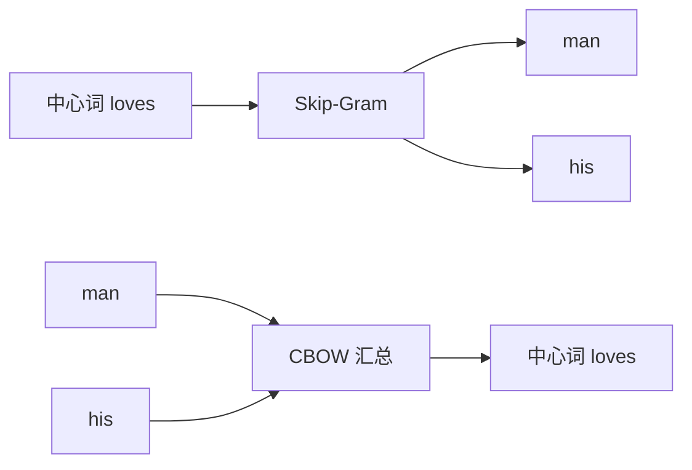

最容易混淆的是：一个词有中心、上下文两套向量，不是代码重复。角色不同，参数表就不同；实际导出词向量时可用中心表，或把两表相加。

### 代码映射

```python
center_vectors = center_embedding(centers)       # (B,) -> (B,D)
context_vectors = context_embedding(contexts)    # (B,) -> (B,D)
logits = (center_vectors * context_vectors).sum(dim=1)  # (B,)
```

查表与点积会建立计算图；只有 `backward()` 生成梯度，`optimizer.step()` 才改变两张参数表。

### 新手例子：用一个中心词造训练题

- **具体问题/小输入**：句子 `the cat likes milk`，中心词取 `cat`，窗口半径为 1。
- **逐步过程**：`cat` 左边是 `the`、右边是 `likes`；Skip-Gram 拆成两个正样本 `(cat,the)`、`(cat,likes)`。若 $D=2$，设 $v_{cat}=(1,2)$、$u_{likes}=(2,1)$，点积为 $1\times2+2\times1=4$。
- **具体输出**：本轮应把正例得分 4 的概率推向 1；CBOW 则会用 `the` 与 `likes` 的向量共同预测 `cat`。
- **说明什么**：训练标签直接来自窗口，不需要人工写“cat 与 likes 有关”。
- **常见误解**：窗口中的词不是输入句子的“类别”；它只是这一次自监督预测的目标。

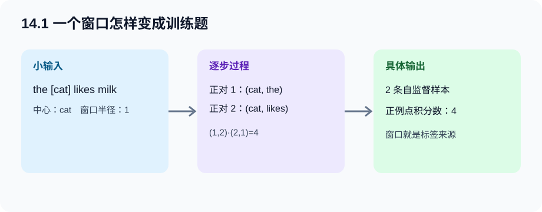

---

## 14.2 近似训练

### 为什么完整 softmax 太贵

完整 softmax 每个正样本都要和词表全部 $V$ 个上下文向量点积，代价约为 $O(VD)$。当 $V$ 是几十万甚至更多时，大部分计算只是再次确认无关词不是答案。

### 负采样

负采样把多分类改成若干二分类：真实中心－上下文对标签为 1，采来的噪声词标签为 0。一个正例配 $K$ 个负例的损失是：

$$
\ell=-\log\sigma(\mathbf u_o^\top\mathbf v_c)
-\sum_{k=1}^{K}\log\sigma(-\mathbf u_{h_k}^\top\mathbf v_c).
$$

计算量从遍历 $V$ 变为 $K+1$ 次点积，约为 $O((K+1)D)$。噪声分布常按词频的 $0.75$ 次幂采样：高频词更常出现，但不会像原词频那样压倒一切。

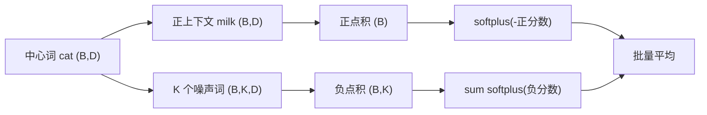

`BCEWithLogitsLoss` 或 `softplus` 应直接接原始点积。先手工 sigmoid 再用 logits 版损失，会把 sigmoid 做两次，还损害数值稳定性。

### 层序 softmax

层序 softmax 把词表组织成二叉树。预测一个词不再比较所有叶子，而是从根到该词叶子依次做左右二分类，若树较平衡约需 $O(\log V)$ 次判断。频繁词可放在较浅路径以减少平均步数。

两种近似都改变了训练计算：负采样改目标为噪声辨别；层序 softmax 用路径概率分解原多分类。它们不是推理阶段“少看几个候选”的小技巧。

### 新手例子：四个负例代替十万词 softmax

- **具体问题/小输入**：词表有 100000 个词，正样本 `(cat,milk)`，取 $K=4$，噪声是 `road, blue, run, desk`。
- **逐步过程**：计算 `cat` 与 `milk` 的 1 个点积，再与 4 个噪声词计算 4 个点积；正点积进入 $-\log\sigma(s)$，负点积进入 $-\log\sigma(-s)$。
- **具体输出**：只产生 5 个分数，而完整 softmax 要产生 100000 个分数。
- **说明什么**：负采样节省来自“每题只核对少量错选项”，不是把嵌入维度变小。
- **常见误解**：负例不是随便设成全零向量；它仍是词表中真实词的可训练向量。

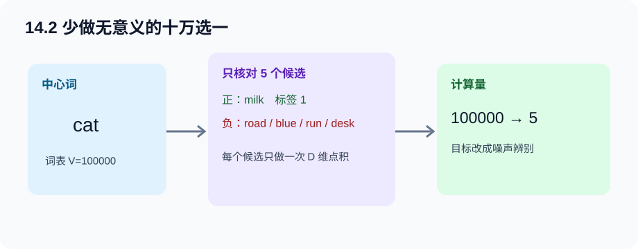

---

## 14.3 用于预训练词嵌入的数据集

正式数据管线不只是 `split()`。它要回答六件事：怎样读句子、怎样减少无信息高频词、怎样取窗口、怎样采负例、怎样把变长候选补齐、怎样产生 mask。

### 读取、下采样与窗口

设词 $w$ 在语料中频率为 $f(w)$。高频虚词能产生海量重复对，却未必提供更多语义。下采样以较低概率保留高频词；它发生在正样本构造前，因此同时减少中心词和上下文词数量。

窗口半径也可随机从 $1\ldots m$ 抽取。近邻位置在更多窗口选择下都会出现，远邻只在较大窗口出现，于是自然形成“近词贡献更多”的效果。

### 负采样、补齐与 mask

一个中心词可能有不同数量的上下文词；每个上下文词再配 $K$ 个负词。若把一个中心词的正负候选合并，批量常见 Shape 是：

- `centers:(B,1)`；
- `contexts_negatives:(B,M)`；
- `masks:(B,M)`，补位为 0；
- `labels:(B,M)`，正例为 1、负例为 0。


错误的 mask 会让补位词也贡献损失。此时 loss 可能下降，但模型主要学会“识别 padding”，所以应打印真实词元数与 mask 求和是否一致。

### 代码映射

[完整 Skip-Gram 程序](../code/ch14/word2vec_skipgram.py)中的 `make_positive_pairs`、`attach_negative_samples` 与 `SkipGramDataset` 分别对应窗口、噪声采样和小批量。程序还保留了高频词保留概率函数，便于换成大语料时启用。

### 新手例子：手工列出窗口样本

- **具体问题/小输入**：索引序列 `[我, 喜欢, 深度, 学习]`，中心位置是 `深度`，本次随机窗口为 2。
- **逐步过程**：左侧可见 `我,喜欢`，右侧可见 `学习`，所以正上下文有 3 个；每个正例配 2 个负例，一共抽 6 个负词。
- **具体输出**：正对为 `(深度,我)`、`(深度,喜欢)`、`(深度,学习)`；若按逐对存储，数据集新增 3 条记录，每条含 2 个负索引。
- **说明什么**：窗口边界会被句首句尾截断，不能假定每个中心词都有 $2m$ 个上下文。
- **常见误解**：padding 的索引即使是 0，也不能自动从损失消失；必须有 mask 或 `ignore_index`。

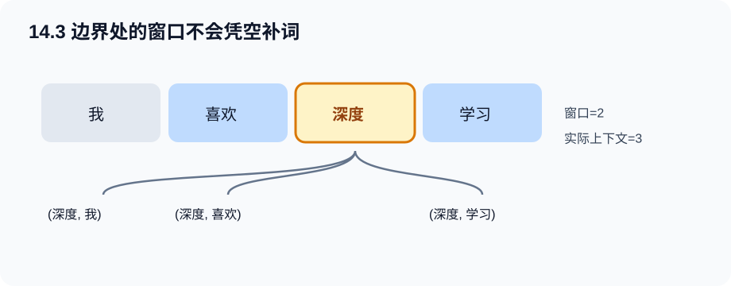

---

## 14.4 预训练 word2vec

### 模型、训练与应用一一对应

`nn.Embedding(V,D)` 本质是形状 `(V,D)` 的参数矩阵加按行索引。Skip-Gram 负采样通常有两张表：

1. `center_embedding` 产生 `(B,D)`；
2. `context_embedding` 对正例产生 `(B,D)`，对负例产生 `(B,K,D)`；
3. 正点积 `(B,)`，负点积 `(B,K)`；
4. 合并二分类损失后对 `B` 求平均。

```python
positive_logits, negative_logits = model(centers, positives, negatives)
loss = F.softplus(-positive_logits).mean()
loss += F.softplus(negative_logits).sum(dim=1).mean()
optimizer.zero_grad(set_to_none=True)
loss.backward()
optimizer.step()
```

### 怎样判断“训练成功”

只看训练损失下降不够。至少做三层检查：

- **数值层**：初始与末尾损失均有限，末尾更低；
- **几何层**：归一化后余弦近邻不是全相同，也不是查询词自身；
- **语义层**：在足够语料上，近邻与类比是否符合任务预期。

小语料的近邻不稳定是正常的。它主要验证机制；不能用几十句话的结果评价真实词向量质量。

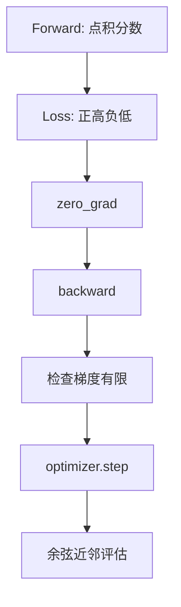

### 新手例子：一次参数更新到底改了谁

- **具体问题/小输入**：批量只有正对 `(cat,milk)` 和负词 `road`。
- **逐步过程**：前向只查 `cat` 的中心行、`milk/road` 的上下文行；反向只给这些被访问的向量行产生梯度；`step()` 再改动它们。
- **具体输出**：本批不会直接修改 `queen` 的向量，因为它没有参与计算图。
- **说明什么**：Embedding 虽是大矩阵，一批数据通常只触达少量行；训练覆盖度取决于采样。
- **常见误解**：`loss.backward()` 不会修改权重，它只填充 `.grad`；真正修改发生在 `optimizer.step()`。

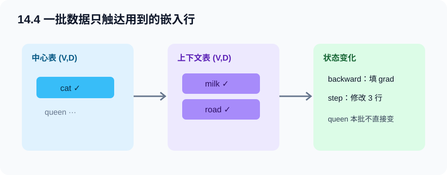

---

## 14.5 全局向量的词嵌入（GloVe）

### 从局部抽样转到全局计数

令 $X_{ij}$ 为词 $j$ 出现在词 $i$ 上下文窗口内的加权次数。GloVe 不逐次抽窗口正例，而是先汇总全语料的共现矩阵，再拟合：

$$
\ell=\sum_{i,j} h(X_{ij})
\left(\mathbf v_i^\top\mathbf u_j+b_i+c_j-\log X_{ij}\right)^2.
$$

- $\mathbf v_i,\mathbf u_j\in\mathbb R^D$；
- $b_i,c_j$ 是标量偏置；
- $h(x)$ 在低频处降权，在高频处封顶；
- 只计算 $X_{ij}>0$ 的位置，避免 $\log 0$。

### 为什么对数与频率比有语义

共现次数分布极偏，取对数把“10 与 1000”的巨大量级差压缩。更深一层，若词 $k$ 与 `ice` 的条件共现概率高、与 `steam` 的低，而另一个词呈相反关系，则概率比能突出它更偏向哪种语义。向量差与点积可以近似保存这类比率关系，这也是类比运算有时有效的原因。

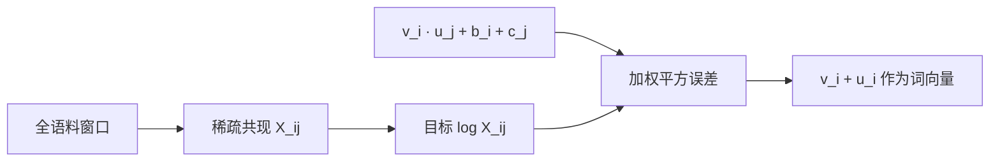

GloVe 与 Skip-Gram 都用两套词向量和点积；差异在监督信号。前者拟合预先统计的全局计数，后者按局部窗口样本训练。

### 代码映射

[GloVe 完整程序](../code/ch14/glove_bpe_analogy.py)先产生 `(V,V)` 共现矩阵，再用 `torch.nonzero(X > 0)` 得到 `N` 个非零对；模型输出 `(N,)`，与 `log_counts:(N,)` 计算加权均方误差。

### 新手例子：手算一项 GloVe 损失

- **具体问题/小输入**：$X_{ice,cold}=100$，权重 $h=1$，当前模型给出 $v^Tu+b+c=4.0$。
- **逐步过程**：目标是 $\log100\approx4.605$；误差 $4.0-4.605=-0.605$；平方约 $0.366$。
- **具体输出**：这一共现对为总损失贡献约 `0.366`，梯度会推动预测靠近 `4.605`。
- **说明什么**：模型拟合的是对数共现次数，不是直接输出“cold 的概率”。
- **常见误解**：$X_{ij}=0$ 不能代入 `log` 后硬设成 0；正式目标通常只遍历非零共现。

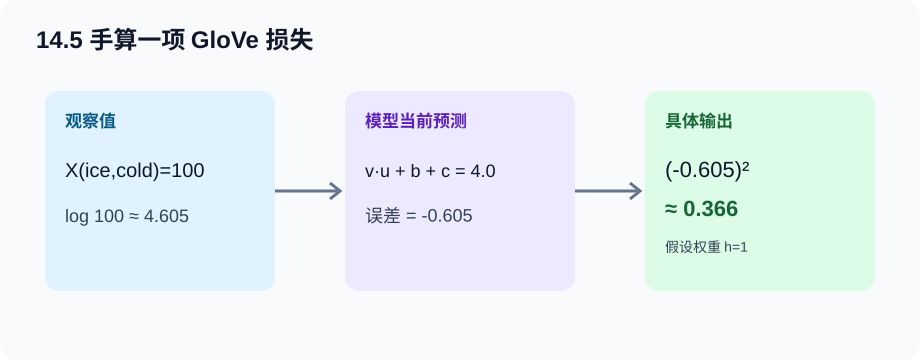

---

## 14.6 子词嵌入

### fastText：一个词由字符 n-gram 共同表示

纯词级模型遇到未登录词只能返回 `<unk>`。fastText 把词加边界标记，再提取字符 n-gram；词向量可写成词本身向量与其子词向量之和：

$$
\mathbf v_w=\sum_{g\in\mathcal G_w}\mathbf z_g.
$$

例如 `<where>` 的 3-gram 包含 `<wh`、`whe`、`her`、`ere`、`re>`。`where` 与 `wherever` 会共享部分子词参数，因此生僻形态也能得到表示。它仍以 Skip-Gram 目标训练，改变的是中心词表示的构成。

### BPE：从字符开始学合并规则

字节对编码（BPE）反复统计相邻符号对，合并频率最高的一对。开始时 `lower` 是 `l o w e r </w>`；若 `l+o`、`lo+w` 很高频，会逐步出现 `low` 子词。最终词表大小由合并次数控制。

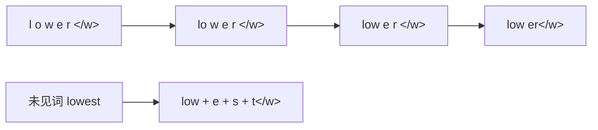

BPE 的合并顺序很重要：应用新词时必须按训练时规则顺序执行，不是把所有已见字符串做最长匹配。边界标记还能区分词中片段和词尾片段。

### 粒度取舍

| 粒度 | 优点 | 代价 |
| --- | --- | --- |
| 字符 | 几乎无 OOV，词表小 | 序列长，语义单元弱 |
| 完整词 | 序列短，单位直观 | OOV 多，词表巨大 |
| 子词 | 两者折中，复用词形 | 切分规则影响长度与含义 |

### 新手例子：两轮 BPE 合并

- **具体问题/小输入**：词频 `low:5, lower:2`，初始字符序列分别为 `l o w </w>` 与 `l o w e r </w>`。
- **逐步过程**：相邻对 `(l,o)` 总计出现 7 次，先合为 `lo`；下一轮 `(lo,w)` 也出现 7 次，再合为 `low`。
- **具体输出**：两词变为 `low </w>` 与 `low e r </w>`，共享子词 `low`。
- **说明什么**：BPE 用频率自动发现可复用片段，不需要语言学家先列词根。
- **常见误解**：BPE 的“byte”名称不意味着本例必须逐 UTF-8 字节画图；教材级演示常以字符符号说明同一合并机制。

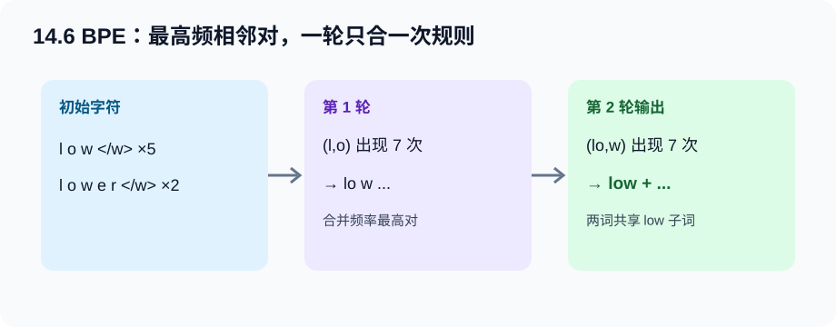

---

## 14.7 词的相似性和类比任务

### 相似性：方向比长度更重要

余弦相似度为：

$$
\operatorname{cos}(\mathbf x,\mathbf y)=
\frac{\mathbf x^\top\mathbf y}{\lVert\mathbf x\rVert\lVert\mathbf y\rVert}.
$$

批量做近邻时，先把 `(V,D)` 每行 L2 归一化，再用矩阵乘法一次得到 `(V,)` 相似度。必须排除查询词本身，否则第一名永远是自己。

### 类比：比较关系方向

`a:b :: c:?` 使用查询：

$$
\mathbf q=\mathbf e_b-\mathbf e_a+\mathbf e_c.
$$

例如 `man:woman :: king:?` 希望 $e_{woman}-e_{man}$ 的关系方向加到 `king` 后靠近 `queen`。这不是严格代数定律，只是分布语义空间可能出现的近似几何规律。

### 加载预训练向量时先验收

- 词表与向量行数是否一致；
- 向量维度是否与模型 `embed_size` 一致；
- `<unk>`、大小写、标点怎样处理；
- 是否冻结参数；若冻结，`requires_grad=False` 后优化器不会更新它；
- 数据许可与来源是否允许当前用途。

### 新手例子：二维余弦近邻

- **具体问题/小输入**：查询 $q=(1,0)$，候选 `A=(2,0)`、`B=(1,1)`、`C=(-1,0)`。
- **逐步过程**：余弦分别为 $1$、$1/\sqrt2\approx0.707$、$-1$。
- **具体输出**：最近的是 A，尽管 A 的长度是 q 的两倍。
- **说明什么**：余弦比较方向，缩放向量长度不改变相似度。
- **常见误解**：类比结果正确不代表模型懂逻辑；它可能只是语料共现结构恰好呈线性方向。

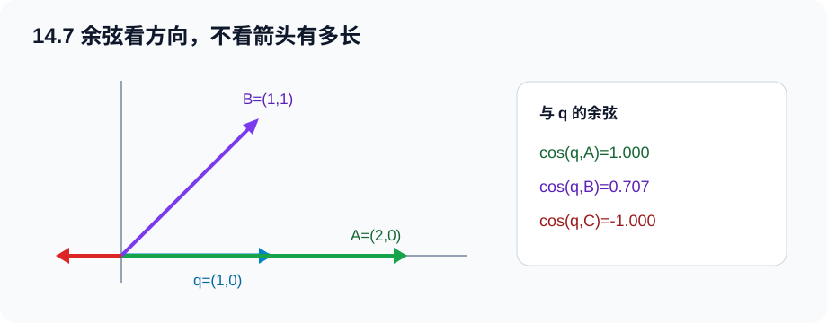

---

## 14.8 来自 Transformer 的双向编码器表示（BERT）

### 从上下文无关到上下文敏感

word2vec/GloVe 给 `bank` 一行固定向量，无法区分银行与河岸。BERT 的输出是整句共同编码后的 `(B,S,H)`；同一个词元在不同上下文的那一行表示会不同。

BERT 同时结合两件事：Transformer 编码器提供双向上下文；大规模自监督预训练提供任务无关的通用参数。下游任务只需增加很小的输出头，再微调整个模型。

### 输入表示

单句输入：`<cls> A <sep>`；句对输入：`<cls> A <sep> B <sep>`。每个位置的初始表示是三项相加：

$$
\mathbf x_i=\mathbf e^{token}_i+\mathbf e^{segment}_i+\mathbf e^{position}_i.
$$

三项 Shape 都为 `(B,S,H)`，所以是相加而不是连接。segment 0/1 区分句子 A/B；位置嵌入在教材实现中可学习；`valid_lens` 或 padding mask 防止注意力读取补位符。

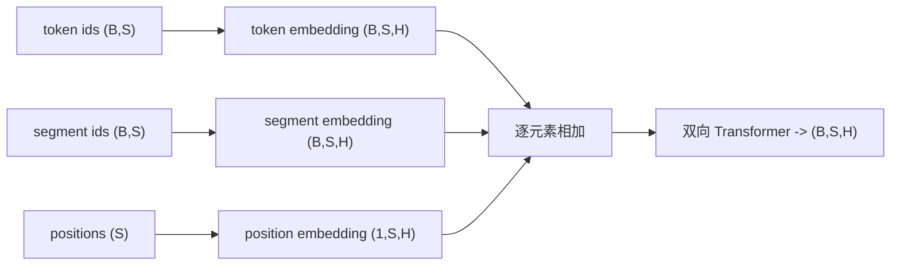

### MLM：被遮住的词从哪里恢复

随机选择约 15% 普通词元作为预测位置。对被选词元，输入中 80% 换 `<mask>`、10% 换随机词、10% 保持原词；标签始终是原词。后三种输入变化只影响模型看到什么，不改变监督答案。

若每样本固定选择 $P$ 个位置，则收集表示为 `(B,P,H)`，MLM 头输出 `(B,P,V)`。也可对全序列输出 `(B,S,V)`，再用 `ignore_index=-100` 只计算选中位置。

### NSP：句子关系的二分类

下一句预测（NSP）一半使用真实相邻句，一半把第二句替换为随机句。`<cls>` 的 `(B,H)` 表示经 MLP 输出 `(B,2)`。MLM 与 NSP 的标签都可从无标签语料自动生成。

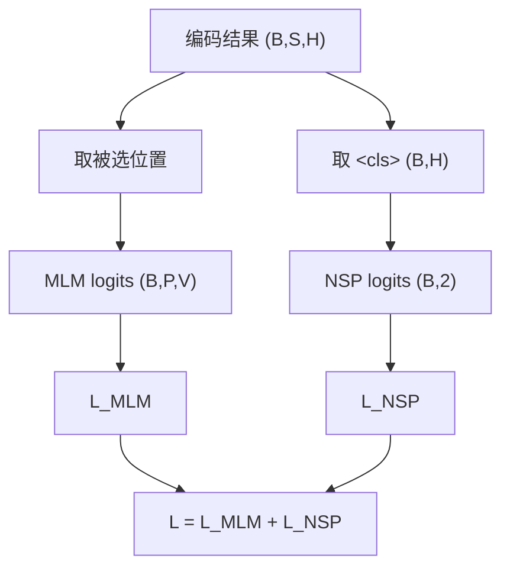

### 新手例子：一句话怎样变成 BERT 输入

- **具体问题/小输入**：句对 A=`i like cats`，B=`cats are cute`，$H=4$。
- **逐步过程**：词元排成 `<cls> i like cats <sep> cats are cute <sep>`，长度 $S=9$；前 5 个 segment 为 0，后 4 个为 1；token/segment/position 三张嵌入都产生 `(1,9,4)` 并相加。
- **具体输出**：编码器输出 `(1,9,4)`；第 0 行是整对文本的 `<cls>` 表示，每个 `cats` 位置也各有一个上下文表示。
- **说明什么**：BERT 没把两句分别压成向量再拼；它让同一 Transformer 在一个序列里建模跨句关系。
- **常见误解**：segment id 不是 attention mask；前者告诉“属于哪句”，后者告诉“哪些位置是 padding”。

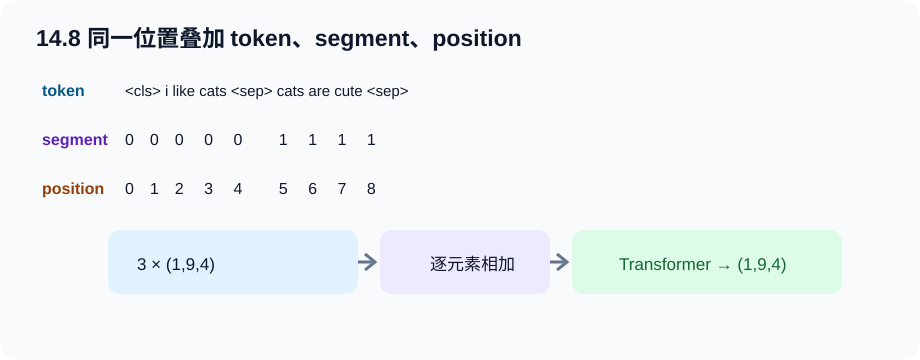

---

## 14.9 用于预训练 BERT 的数据集

### 辅助函数的职责

从段落到训练张量通常经过：

1. 段落切成句子，并保留至少两个句子的段落；
2. 构造真/假下一句与 NSP 标签；
3. 插入 `<cls>/<sep>` 和 segment id；
4. 截断到 `max_len`；
5. 选择 MLM 位置并执行 80/10/10 替换；
6. 补齐 token、segment、MLM 位置/标签，并产生有效权重。

### Shape 清单

一种“只收集 MLM 位置”的批量接口是：

| 张量 | Shape | 作用 |
| --- | --- | --- |
| `tokens` | `(B,S)` | 损坏后的输入索引 |
| `segments` | `(B,S)` | 句 A/B 标记 |
| `valid_lens` | `(B,)` | 排除 padding |
| `pred_positions` | `(B,P)` | MLM 要读的位置 |
| `mlm_weights` | `(B,P)` | 排除补齐的预测槽 |
| `mlm_labels` | `(B,P)` | 原词索引 |
| `nsp_labels` | `(B,)` | 是否真下一句 |

本仓库的[微型 BERT 程序](../code/ch14/mini_bert_pretraining.py)选择更直观的全序列标签 `(B,S)`：非 MLM 位置写 `-100`。两种接口等价，关键是损失只能统计真实预测位置。


### 数据泄漏与随机性

真实项目应先按文档或来源划分训练/验证/测试，再从训练部分构造预训练样本；否则相邻句与重复段落可能跨集合泄漏。验证集的随机掩蔽最好固定种子，否则每次验证题目不同，曲线噪声会被误判为模型变化。

### 新手例子：15% 在短句中怎样落地

- **具体问题/小输入**：可选普通词元只有 7 个，选择比例 15%。
- **逐步过程**：$7\times0.15=1.05$，四舍五入并保证至少 1 个，因此选 1 个位置；若抽到 `cats`，标签记原索引，而输入可能变 `<mask>`、随机词或仍为 `cats`。
- **具体输出**：`mlm_labels` 只有该位置是词表索引，其余全是 `-100`。
- **说明什么**：短句必须处理“选中 0 个”的边界，否则 MLM 损失可能出现无有效标签。
- **常见误解**：80/10/10 是在已选中的 15% 内部分配，不是全体词元的 80% 都换成 `<mask>`。

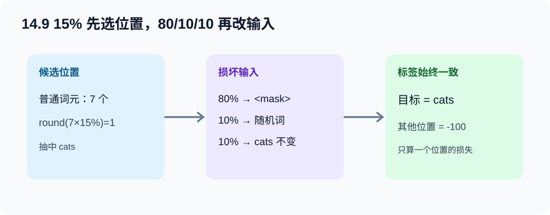

---

## 14.10 预训练 BERT

### 联合训练

编码器同时服务两个头：

$$
\mathcal L=\mathcal L_{MLM}+\lambda\mathcal L_{NSP}.
$$

教材演示通常取简单相加，即 $\lambda=1$。两项的平均口径要先独立正确：MLM 除以有效预测词元数，NSP 除以句子对数；若把 padding 也算入分母，批次中长短句比例会改变损失尺度。

```python
encoded, mlm_logits, nsp_logits = model(tokens, segments, valid_mask)
mlm_loss = F.cross_entropy(mlm_logits.reshape(-1, V), labels.reshape(-1), ignore_index=-100)
nsp_loss = F.cross_entropy(nsp_logits, nsp_labels)
loss = mlm_loss + nsp_loss
optimizer.zero_grad(set_to_none=True)
loss.backward()
torch.nn.utils.clip_grad_norm_(model.parameters(), 1.0)
optimizer.step()
```

输入与输出会建立计算图；`zero_grad` 不改参数；`backward` 填梯度；裁剪改梯度；`step` 才改参数。

### 用 BERT 表示文本

预训练后，单个词元的表示取 `encoded[:,i,:]`，整段序列分类常取 `encoded[:,0,:]` 的 `<cls>` 行。不要把 token embedding 的静态查表行误当 BERT 输出：真正上下文表示必须经过位置/片段相加与全部 Transformer 层。

大模型的训练损失下降也不能单独证明下游有用。正式验收应包括保留集 MLM/NSP、下游微调指标、不同随机种子和与简单基线对比。

### 完整程序怎样运行

```bash
python code/ch14/mini_bert_pretraining.py --epochs 60
```

程序使用小段落自动生成句对，打印 MLM、NSP 与总损失，并比较同一句 A 配不同句 B 时 `<cls>` 表示。它是机制实验，不是可替代真实预训练模型的语言能力基准。

### 新手例子：两个任务怎样共同更新编码器

- **具体问题/小输入**：一个批量中，MLM 损失 `1.8`，NSP 损失 `0.6`，$\lambda=1$。
- **逐步过程**：总损失 `2.4`；反向时 MLM 梯度经词元位置流入编码器，NSP 梯度经 `<cls>` 流入同一编码器，两者在共享参数处相加。
- **具体输出**：分类头、MLM 头与 Transformer 参数都可能改变；没有参与当前前向的独立参数不会得到梯度。
- **说明什么**：联合训练不是先训练完 MLM 再训练 NSP，而是一次反向传播优化共同目标。
- **常见误解**：两项损失数值直接相加不保证贡献相同；规模悬殊时应查看分项梯度或调权重。

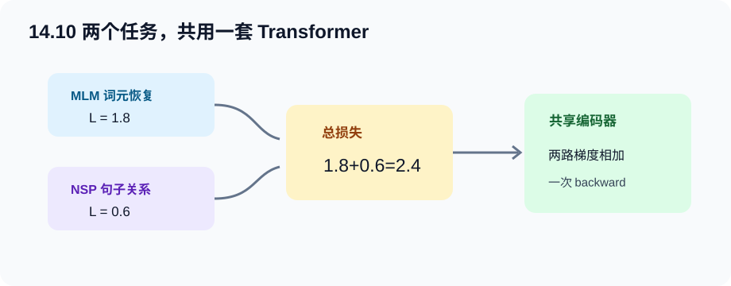

---

## Hot100 算法迁移：#208 实现 Trie（前缀树）

> 题目来自[LeetCode Hot 100 官方题单](https://leetcode.cn/studyplan/top-100-liked/)：[#208 实现 Trie](https://leetcode.cn/problems/implement-trie-prefix-tree/)。以下为原创摘要与推导。

### 为什么放在本章

BPE、子词词表与分词器都在处理前缀复用。Trie 把“已经读过的前缀”变成节点：插入 `app` 与 `apple` 时，`a-p-p` 路径只存一次。它不能直接替代 BPE，但能训练“字符串路径、词尾标记、共享前缀”的数据结构直觉。

### 目标与白话推导

- `insert(word)`：沿字符走；缺边就建；最后标记完整词。
- `search(word)`：路径存在还不够，末节点必须 `is_word=True`。
- `startsWith(prefix)`：只要路径存在即可，不要求是完整词。

若字符串长度为 $L$，三个操作时间都是 $O(L)$；空间最坏为所有插入字符总数，实际因共享前缀而减少。


### 易错点

1. 只看路径就把 `app` 当作已插入完整词；
2. 每个节点错误地共享同一个 `children` 字典；
3. 把 `startsWith` 也写成必须检查 `is_word`；
4. 只支持固定 26 个小写字母，却没在接口契约中说明。

完整逐行中文注释与自测见 [hot100_trie.py](../code/ch14/hot100_trie.py)。运行后会验证 `apple`、`app` 与不存在前缀三种边界。

---

## 统一代码地图

| 程序 | 覆盖内容 | 关键 Shape | 离线数据 |
| --- | --- | --- | --- |
| [word2vec_skipgram.py](../code/ch14/word2vec_skipgram.py) | 14.1–14.4 | 正分数 `(B,)`，负分数 `(B,K)` | 重复小句式 |
| [glove_bpe_analogy.py](../code/ch14/glove_bpe_analogy.py) | 14.5–14.7 | 非零共现对 `(N,)`，词向量 `(V,D)` | 人工共现语料 |
| [mini_bert_pretraining.py](../code/ch14/mini_bert_pretraining.py) | 14.8–14.10 | 编码 `(B,S,H)`，MLM `(B,S,V)`，NSP `(B,2)` | 小段落 |
| [hot100_trie.py](../code/ch14/hot100_trie.py) | 前缀树迁移 | 路径长度 `L` | 内置自测 |

---

## 排错路径

按数据到指标逐层停靠，不要一上来改网络：

1. **数据**：打印原句、词元、正对、负例、MLM 原词与损坏后输入；标签是否真能由原文产生？
2. **Shape / dtype / device**：索引必须 `long`；三种 BERT 嵌入能否相加；padding mask 的真假语义是否与 API 一致？
3. **前向**：点积/attention logits 是否有限；softmax 轴是否对应候选维；`<cls>` 是否确在位置 0？
4. **损失**：交叉熵前不手动 softmax；MLM 非目标位置是否忽略；负采样正负号是否相反？
5. **梯度**：至少一个关键参数梯度非 `None` 且有限；冻结嵌入若预期冻结，梯度应为 `None`。
6. **更新**：比较 `step()` 前后某行权重；只 `backward()` 而不 `step()` 不会学习。
7. **指标**：训练损失、验证损失、近邻/类比或 MLM 准确率分别说明什么，不互相替代。

典型症状速查：

| 症状 | 优先检查 |
| --- | --- |
| 负采样损失变成 NaN | 是否手写 `log(sigmoid)`；改用 `softplus` / logits 损失 |
| 所有近邻几乎一样 | 是否归一化；语料是否太小；负例是否重复正例 |
| BERT MLM loss 不动 | 有效标签数是否大于 0；`ignore_index` 是否写反 |
| NSP 准确率异常高 | 随机负句是否有格式捷径或数据泄漏 |
| padding 越多 loss 越低 | 补位是否进了分母或注意力 |

---

## Hot 100 加练（本章共 2 题）

原有 #208 之外，新增 [#49 字母异位词分组](https://leetcode.cn/problems/group-anagrams/)，练把字符组成映射为可哈希签名。解析见[新增题完整解析](leetcode-hot100-expanded-practice.md#第-14-章离散文本签名)，代码见 [hot100_group_anagrams.py](../code/ch14/hot100_group_anagrams.py)。

## 主动回忆：先遮住答案再作答

### 1. 为什么独热向量不能表达词相似性？

<details><summary>展开答案</summary>

结论：不同词的独热向量互相正交，余弦全为 0。原因：它只编码身份，没有从共现中学习几何位置。影响：必须学习低维嵌入，才能用距离或方向表达分布相似性。

</details>

### 2. Skip-Gram 与 CBOW 的预测方向分别是什么？

<details><summary>展开答案</summary>

结论：Skip-Gram 是中心词预测多个上下文；CBOW 是多个上下文汇总后预测中心词。原因：二者对同一窗口采用相反条件方向。影响：代码中输入/标签组织不同，不能只换类名。

</details>

### 3. 为什么一个词需要中心和上下文两套向量？

<details><summary>展开答案</summary>

结论：两套向量分别承担条件模型的输入角色和输出角色。原因：点积 $u_o^Tv_c$ 的两侧参数语义不同。影响：程序要创建两张 Embedding 表，导出时再决定用中心表或两表和。

</details>

### 4. `centers:(B,)`、`negatives:(B,K)` 经过 Embedding 后是什么 Shape？

<details><summary>展开答案</summary>

结论：分别为 `(B,D)` 与 `(B,K,D)`。原因：Embedding 在每个索引后附加一个长度 D 的行向量。影响：负点积可用 `(B,1,D) @ (B,D,K)` 得 `(B,1,K)`。

</details>

### 5. 负采样为何不用完整词表 softmax？

<details><summary>展开答案</summary>

结论：它把一题 V 分类改为 1 个正例与 K 个负例的二分类。原因：大多数词与当前中心词无关，逐一归一化代价高。影响：每样本点积从 V 次降至 K+1 次，但优化目标也变成噪声辨别近似。

</details>

### 6. 负样本误抽成当前正上下文会怎样？

<details><summary>展开答案</summary>

结论：同一词对同时收到标签 1 和 0。原因：采样器没有排除正例。影响：梯度互相冲突，损失下界与表示质量受损；构造时应拒绝该候选。

</details>

### 7. 高频词下采样发生在窗口构造前还是后，为什么？

<details><summary>展开答案</summary>

结论：通常先下采样再构造窗口。原因：目标是直接减少高频词作为中心和上下文形成的冗余对。影响：若只在最后删部分 loss，数据构造与窗口分布不会得到同样改变。

</details>

### 8. GloVe 为什么不计算 $X_{ij}=0$ 的 `log`？

<details><summary>展开答案</summary>

结论：$\log0$ 未定义且没有观察到的共现不等于一个普通零目标。原因：GloVe 目标建立在非零共现统计上。影响：代码用 `nonzero(X>0)` 只取有效对。

</details>

### 9. GloVe 权重函数解决什么问题？

<details><summary>展开答案</summary>

结论：压低极稀有、噪声大的共现，同时让高频项权重封顶。原因：原始共现次数极偏。影响：没有权重时，大量不可靠罕见项或少量超高频项会支配平方损失。

</details>

### 10. fastText 与 BPE 的“子词”有什么不同？

<details><summary>展开答案</summary>

结论：fastText 通常把字符 n-gram 向量相加构造词表示；BPE 学习有顺序的高频符号合并规则来产生词元序列。原因：前者改变词表示组成，后者改变分词词表。影响：代码数据结构分别偏向 n-gram 集合与合并规则列表。

</details>

### 11. 余弦近邻为什么必须排除查询词自身？

<details><summary>展开答案</summary>

结论：非零向量与自身余弦为 1，通常必排第一。原因：归一化后自己与自己的点积最大。影响：`topk` 应多取一个，再过滤查询索引。

</details>

### 12. BERT 三种输入嵌入为何是相加而不是拼接？

<details><summary>展开答案</summary>

结论：token、segment、position 都是对同一位置的 H 维描述，逐元素相加保持 `(B,S,H)`。原因：Transformer 的隐藏宽度固定为 H。影响：若拼接会变成 `3H`，后续投影与残差 Shape 全不匹配。

</details>

### 13. segment id 和 padding mask 的职责有何不同？

<details><summary>展开答案</summary>

结论：segment id 区分句子 A/B；padding mask 阻止模型读取补位。原因：一个是真实输入特征，一个是有效性约束。影响：只有 segment 而无 mask 时，注意力仍会访问 pad。

</details>

### 14. MLM 的 15% 与 80/10/10 怎样组合？

<details><summary>展开答案</summary>

结论：先从全部普通词元选约 15%，再只在这部分内部按 80/10/10 决定输入替换。原因：前者决定监督位置，后者减轻预训练与微调的 `<mask>` 不一致。影响：标签在三种替换下都保持原词。

</details>

### 15. `mlm_logits:(B,S,V)` 怎样与标签计算损失？

<details><summary>展开答案</summary>

结论：展平为 `(B*S,V)`，标签展平为 `(B*S,)`，非目标位置设 `-100` 并忽略。原因：交叉熵每行对应一个 V 类预测。影响：若未忽略，模型会被迫在未遮位置也复制输入并让 padding 支配损失。

</details>

### 16. 为什么 `<cls>` 能用于 NSP 或下游分类？

<details><summary>展开答案</summary>

结论：自注意力让 `<cls>` 的表示聚合整条输入的信息，训练目标又直接用它分类。原因：它虽是特殊位置，却参与所有编码层。影响：序列级任务通常读取 `encoded[:,0,:]`，不是随便平均 logits。

</details>

### 17. `loss.backward()` 后权重为什么还没变？

<details><summary>展开答案</summary>

结论：反向只计算并累积 `.grad`；`optimizer.step()` 才依据梯度更新参数。原因：PyTorch 分离求导与更新。影响：漏掉 step 时损失每轮近乎不变，漏掉 zero_grad 时梯度跨批累积。

</details>

### 18. BERT 总损失下降、MLM 却不降，应先看什么？

<details><summary>展开答案</summary>

结论：先分开记录 MLM/NSP，有可能 NSP 单独拉低总损失。原因：两任务难度和尺度不同。影响：检查 MLM 有效标签数、mask 位置、词表维与 ignore_index，再考虑调权。

</details>

### 19. 小语料近邻不符合常识，是否证明实现错误？

<details><summary>展开答案</summary>

结论：不能直接证明。原因：分布语义需要足够覆盖，小语料随机性和共现捷径很强。影响：先用损失、Shape、梯度及人工可控共现验机制，再用大语料和标准评测验质量。

</details>

### 20. Trie 中 `search("app")` 与 `startsWith("app")` 为什么可能不同？

<details><summary>展开答案</summary>

结论：插入 `apple` 后，`app` 路径存在但还不是完整词结尾。原因：Trie 用 `is_word` 区分路径与词。影响：`search` 检查节点和结尾标记，`startsWith` 只检查节点。

</details>

---

### 面试八股加练：不能只背结论

<details>
<summary>21. 【八股深答】负采样为什么能加速 Skip-Gram，它近似了什么？</summary>

**结论：**它把每个中心词对整个词表做 Softmax，改成区分少量真实上下文和采样噪声的二分类任务。**机制：**正样本提高点积，若干负样本降低点积，计算从依赖全词表变为依赖采样数。**工程影响：**负样本分布与数量影响训练难度，常对高频词概率做平滑；这并非精确计算原 Softmax。**误区：**负样本不是“错误标签数据”，而是目标函数的一部分。**追问：**层次 Softmax 是另一种降低大词表成本的方法，计算路径不同。

</details>

<details>
<summary>22. 【八股深答】BPE 为什么能同时缓解未登录词和词表过大？</summary>

**结论：**BPE 从字符或基础符号出发，反复合并高频相邻片段，用有限子词组合开放词汇。**机制：**高频词可成为较长单元，罕见词仍能拆成多个已知片段。**工程影响：**词表越大序列通常越短，但嵌入/输出层更大；词表越小序列更长，计算步数增加。**误区：**子词边界不等于语言学词素，合并规则由语料频率驱动。**追问：**训练与推理必须使用同一 tokenizer、词表和规范化规则。

</details>

<details>
<summary>23. 【八股深答】BERT 的 MLM 为什么不是普通自回归语言模型？</summary>

**结论：**MLM 同时利用被遮蔽位置左右两侧上下文预测原 token；自回归模型只条件于左侧或既定方向。**机制：**随机选位置替换/保留后，仅对选中位置计算分类损失，使编码器学习双向表示。**工程影响：**预训练需保存 mask 位置和标签，微调时通常不再插入 `[MASK]`。**误区：**MLM 不是对每个 token 都算损失，也存在预训练 `[MASK]` 与下游输入不一致的问题。**追问：**动态 masking 能让同一句在不同 epoch 暴露不同监督位置。

</details>

## 一页速查

- **Skip-Gram**：中心预测上下文；两套 `(V,D)` 向量；正点积升、负点积降。
- **负采样**：每正例只比较 $K$ 个噪声词；稳定损失用 logits/`softplus`。
- **数据**：下采样 → 随机窗口 → 正对 → 频率$^{0.75}$负例 → padding/mask。
- **GloVe**：拟合 $v_i^Tu_j+b_i+c_j\approx\log X_{ij}$，只遍历非零共现。
- **fastText**：词向量由字符 n-gram 复用；**BPE**：反复合并最高频相邻符号对。
- **相似/类比**：先归一化；类比查 $e_b-e_a+e_c$ 的近邻，排除题目词。
- **BERT 输入**：`<cls> A <sep> B <sep>`；token + segment + position，均为 `(B,S,H)`。
- **MLM**：选 15%，所选内部 80/10/10；**NSP**：真相邻/随机句二分类。
- **预训练输出**：词元表示 `(B,S,H)`；序列表示常读 `<cls>` 的 `(B,H)`。
- **最小排错顺序**：样本可读性 → index/Shape/mask → logits → 分项 loss → grad → step 前后权重 → 保留集指标。

[上一章：计算机视觉](ch13-computer-vision.md) · [下一章：自然语言处理应用](ch15-nlp-applications.md) · [返回总目录](../README.md)
