# 第 15 章：自然语言处理——应用

> 复习定位：把第 14 章得到的文本表示接到真实任务上，并明确“一个序列一个标签”与“一个词元一个标签”的差别<br>
> 内容脉络：15.1–15.7 · PyTorch · 离线可运行 · 原创转述<br>
> 章节顺序与小节名称参考[《动手学深度学习》中文 2.0 官方目录](https://zh.d2l.ai/chapter_natural-language-processing-applications/index.html)

[BiRNN 与 textCNN 情感分类](../code/ch15/sentiment_models.py) · [可分解注意力 NLI](../code/ch15/decomposable_attention.py) · [微型 BERT 微调](../code/ch15/mini_bert_finetuning.py) · [Hot100 #139 单词拆分](../code/ch15/hot100_word_break.py)

## 一句话主线

**文本应用的关键是先确定输出粒度和输入关系：情感分析把一段变长文本压成一个类别，自然语言推断比较前提与假设的逻辑关系；BiRNN、textCNN、可分解注意力各自编码这种关系，而 BERT 则复用同一个预训练骨干，只替换很小的序列级或词元级任务头并整体微调。**

## 本章地图

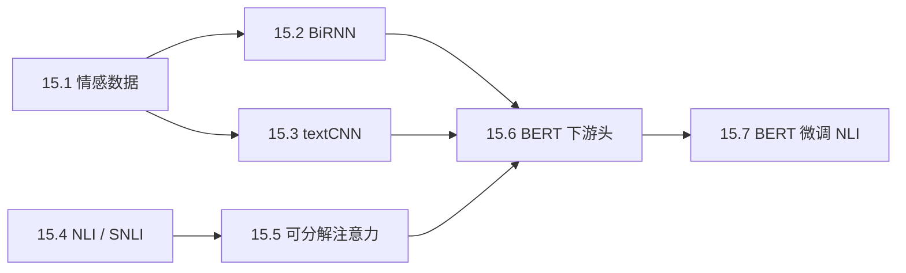

先按输出粒度选头：

| 任务 | 输入 | 输出 Shape | 常用读取位置 |
| --- | --- | --- | --- |
| 情感分类 | 单文本 `(B,S)` | `(B,C)` | BiRNN 末状态 / textCNN 汇聚 / BERT `<cls>` |
| NLI | 文本对 `(B,M),(B,N)` | `(B,3)` | 对齐聚合 / BERT `<cls>` |
| 词性或实体标注 | 单文本 `(B,S)` | `(B,S,C)` | 每个有效词元 |
| 抽取式问答 | 问题 + 段落 `(B,S)` | 两个 `(B,S)` | 每个位置的 start/end 分数 |

---

## 15.1 情感分析及数据集

### 任务到底是什么

情感分析把可变长度文本映射到固定类别。例如二分类标签可约定 `0=消极`、`1=积极`。模型输出 `logits:(B,2)`，标签是 `labels:(B,)` 的整数索引，损失为：

$$
\mathcal L=-\frac1B\sum_{i=1}^{B}\log
\frac{\exp(o_{i,y_i})}{\sum_{c=1}^{2}\exp(o_{i,c})}.
$$

IMDb 数据集在官方章节中用于电影评论情感分析。真实评论长度差异很大，因此数据管线要读取文本与标签、分词、用训练集建词表、截断/补齐、保留有效长度，再组成小批量。

### 读取与预处理的边界


词表必须只从训练集建立，否则测试集出现过的词已经泄漏给预处理。`<pad>` 与 `<unk>` 也不同：前者只是批量补位，后者代表词表外真实词元。

### 长度、截断与 mask

- 固定长度简单，但过短会丢掉评论后半段，过长会浪费计算；
- BiRNN 可用 `pack_padded_sequence` 跳过补位；
- 卷积模型要考虑补位卷积响应；
- Transformer 使用 key padding mask；
- 类别平衡时准确率易读；类别失衡时还要看每类 precision/recall、F1 或混淆矩阵。

### 基线先于大模型

训练前可先做“多数类预测”和“情感词计数”基线。若复杂模型还不如它们，优先怀疑数据、标签和评估，不要先增加层数。

### 新手例子：把三条评论组成一个批量

- **具体问题/小输入**：`good movie`（1）、`very bad ending`（0）、`great`（1）。
- **逐步过程**：本批最大长度为 3；补齐后是 `[good,movie,pad]`、`[very,bad,ending]`、`[great,pad,pad]`；有效长度为 `[2,3,1]`。
- **具体输出**：`tokens:(3,3)`、`lengths:(3,)`、`labels=[1,0,1]`。
- **说明什么**：Shape 相同不代表每行真实长度相同，模型必须知道哪些位置是补位。
- **常见误解**：`<pad>` 的嵌入设成零还不总够；有偏置的卷积/MLP 仍可能在补位位置产生非零响应。

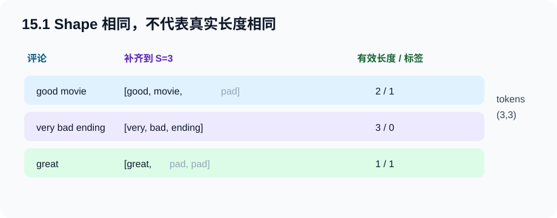

---

## 15.2 情感分析：使用循环神经网络

### 为什么用双向循环网络

情感分类在看到完整评论后才输出标签，没有在线因果限制，因此一个词既可利用左文也可利用右文。双向 LSTM 分别从左到右、从右到左编码：

- 嵌入输入 `(B,S,E)`；
- 每个方向隐藏大小 $H$；
- 全序列输出 `(B,S,2H)`；
- 最后一层两个方向的最终状态连接为 `(B,2H)`；
- 全连接输出 `(B,2)`。

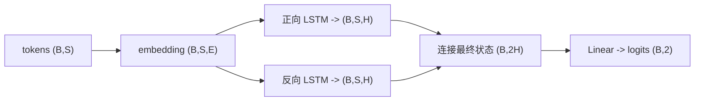

### “最后状态”最常见的 Shape 坑

PyTorch 双向 LSTM 返回 `h_n:(num_layers*2,B,H)`。当只有一层时，`h_n[-2]` 是最后一层正向状态，`h_n[-1]` 是反向状态。不能简单取 `outputs[:,-1,:]` 代替两者：若存在 padding，最后时间步可能是补位；而反向方向中代表全句的状态位置也不是同一语义。

```python
packed = pack_padded_sequence(embedded, lengths.cpu(), batch_first=True, enforce_sorted=False)
_, (h_n, _) = lstm(packed)
text_vector = torch.cat((h_n[-2], h_n[-1]), dim=1)  # (B,2H)
logits = classifier(text_vector)                     # (B,2)
```

### 使用预训练词向量

把 GloVe 等向量复制到 `embedding.weight` 时，行必须与当前词表索引严格对齐。可以先冻结，让分类头稳定学习，再以较小学习率解冻；也可以直接微调。是否冻结应由验证集判断，不是“预训练向量永远不能改”。

### 计算图与参数变化

前向会建立 LSTM、嵌入和分类头的计算图；交叉熵不会改参数；`backward()` 生成梯度；若嵌入被冻结，其 `.grad` 为 `None`；`step()` 改变可训练参数。评估时调用 `eval()` 与 `no_grad()`。

### 新手例子：连接两个方向

- **具体问题/小输入**：一句话长度 4，单层双向 LSTM 隐藏宽度 $H=3$，批量 $B=2$。
- **逐步过程**：`h_n` 为 `(2,2,3)`；取 `h_n[-2]:(2,3)` 与 `h_n[-1]:(2,3)`，沿特征维连接。
- **具体输出**：文本向量为 `(2,6)`；若类别数 2，线性层权重为 `(2,6)`，输出 `(2,2)`。
- **说明什么**：双向意味着特征宽度翻倍，不是批量或时间长度翻倍。
- **常见误解**：反向 LSTM 不是在推理结束后“倒放输出”；它在编码时读取反向序列并有独立参数。

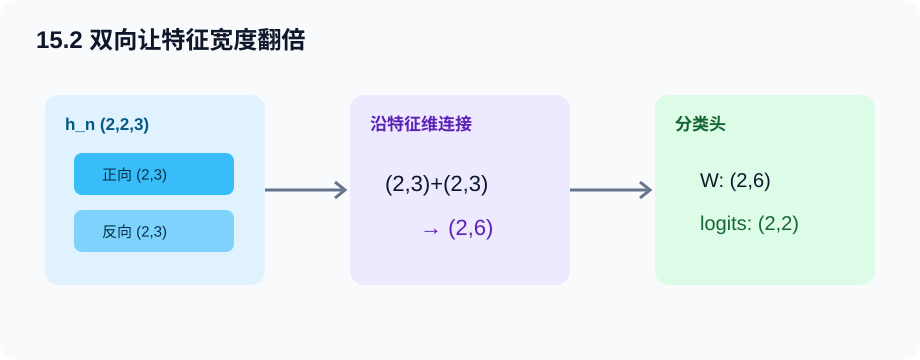

---

## 15.3 情感分析：使用卷积神经网络

### 一维卷积把文本看成什么

文本嵌入是 `(B,S,E)`。对 `Conv1d` 要换成 `(B,E,S)`，让嵌入维作为输入通道。宽度 $K$ 的核跨过连续 $K$ 个词元，像扫描 $K$-gram；若不补零，时间长度变为 $S-K+1$。

对单输入通道的一维互相关：

$$
y_i=\sum_{a=0}^{K-1}x_{i+a}w_a.
$$

实际文本卷积还会对 $E$ 个输入通道求和，并产生 $C$ 个输出通道，所以输出是 `(B,C,S-K+1)`。

### 最大时间汇聚

对每个通道沿时间取最大值：

$$
z_c=\max_t y_{c,t}.
$$

它回答“这种局部模式是否在任何位置强烈出现”，把变长时间轴压成 `(B,C)`。它保留最强证据，但丢掉具体位置与出现次数。

### textCNN 的多尺度与双嵌入通道

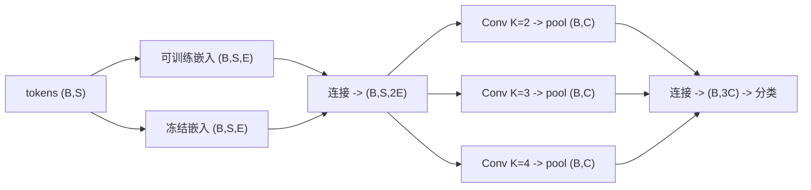

教材 textCNN 思路可同时使用一张可训练嵌入和一张冻结的预训练嵌入，在特征维连接。多个核宽学习不同 n-gram。注意 `AdaptiveMaxPool1d(1)` 才是最大汇聚；`AdaptiveAvgPool1d(1)` 是平均汇聚，语义不同。

### BiRNN 与 textCNN 怎样选

| 维度 | BiRNN | textCNN |
| --- | --- | --- |
| 归纳偏置 | 顺序递推、全局上下文 | 局部 n-gram、位置不敏感 |
| 并行性 | 时间步依赖较强 | 卷积可并行 |
| 长距离 | 通过循环状态 | 需堆层或靠全局汇聚 |
| 可解释检查 | 状态/门 | 卷积通道最高响应片段 |

### 新手例子：最大汇聚抓住否定短语

- **具体问题/小输入**：某卷积通道在 `not good at all` 四个位置的响应为 `[0.2, 2.4, 0.1]`，对应宽度 2 的三个窗口。
- **逐步过程**：最大时间汇聚沿三个位置取 `max=2.4`；后续分类器看到这个强特征，却不关心它在第几个窗口。
- **具体输出**：该通道从 `(1,1,3)` 压成 `(1,1)`，值为 `2.4`。
- **说明什么**：一个通道可学成“是否出现否定+正面词”的检测器。
- **常见误解**：卷积核宽 2 不等于只处理长度 2 的句子；它在整条长序列上滑动。

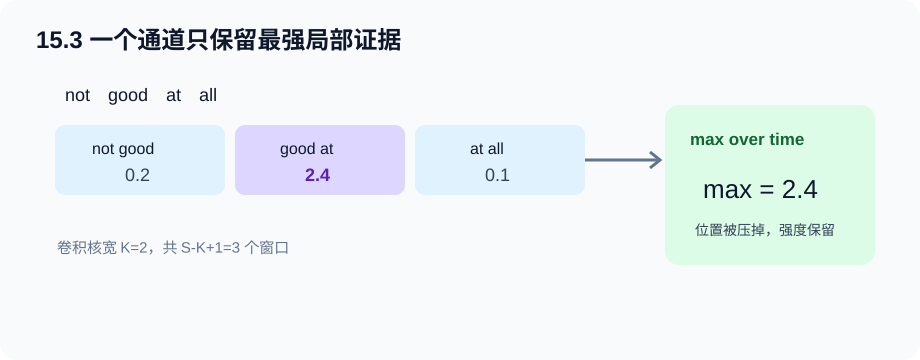

---

## 15.4 自然语言推断与数据集

### 三类关系不能靠词重合直接判断

自然语言推断（NLI）输入前提 $P$ 与假设 $H$，输出：

- **蕴涵（entailment）**：$H$ 可从 $P$ 推出；
- **矛盾（contradiction）**：$H$ 与 $P$ 明确冲突；
- **中性（neutral）**：既不能推出，也不能推出其否定。

“不知道”不是“矛盾”。前提“一个人在看书”、假设“这个人喜欢咖啡”是中性，因为前提没提供咖啡信息。

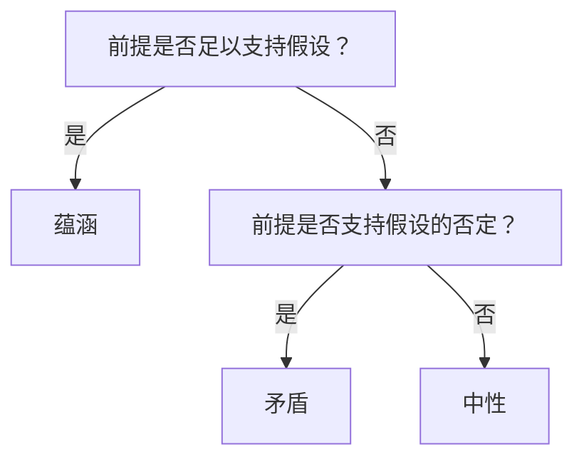

### SNLI 数据集与读取

官方章节使用 SNLI：每条数据含前提、假设和三类标签。原始文件还有解析树等字段，训练前通常只提取文本对与有效标签，清理括号、统一空白，再分词、截断、补齐。

输入可以分别存 `premise:(B,M)`、`hypothesis:(B,N)`，也可为 BERT 拼成 `(B,S)`。分别存时要有两张 mask；拼接时要有 segment id 与一张统一 mask。

### 数据偏差与评价

NLI 数据可能有“否定词就预测矛盾”等标注捷径。应检查只看假设的基线、按长度/词重合分桶的准确率和混淆矩阵。高准确率不自动等于逻辑推理能力。

### 新手例子：中性不是反面

- **具体问题/小输入**：前提 `一只黑狗在公园跑`。假设 A=`一只狗在跑`；B=`没有狗在跑`；C=`这只狗饿了`。
- **逐步过程**：A 删除了细节但保留事实，可推出；B 否定同一事实，冲突；C 添加“饿”这一未给信息，无法判断。
- **具体输出**：A=蕴涵，B=矛盾，C=中性。
- **说明什么**：NLI 判的是“在只相信前提时能否推出”，不是现实常识下哪句更可能。
- **常见误解**：假设与前提词重合少不一定中性，同义改写仍可蕴涵。


---

## 15.5 自然语言推断：使用注意力

可分解注意力不使用 RNN 或卷积，分三步：**对齐（Attend）→ 比较（Compare）→ 聚合（Aggregate）**。

### 第一步：对齐

前提表示 $\mathbf A\in\mathbb R^{B\times M\times E}$，假设表示 $\mathbf B\in\mathbb R^{B\times N\times E}$。共享 MLP $f$ 后计算：

$$
e_{ij}=f(\mathbf a_i)^\top f(\mathbf b_j),
\qquad \mathbf e\in\mathbb R^{B\times M\times N}.
$$

沿 $N$ 维 softmax，把假设软对齐到每个前提词：

$$
\boldsymbol\beta_i=\sum_j\operatorname{softmax}_j(e_{ij})\mathbf b_j.
$$

转置分数并沿 $M$ 维 softmax，可得到每个假设词对应的前提软对齐 $\boldsymbol\alpha_j$。padding 必须在 softmax 前设为很小分数，否则补位也会分到概率。

### 第二步：比较

把原词与对齐表示连接后送入共享 MLP $g$：

$$
\mathbf v_{A,i}=g([\mathbf a_i,\boldsymbol\beta_i]),\quad
\mathbf v_{B,j}=g([\mathbf b_j,\boldsymbol\alpha_j]).
$$

输入从 $E$ 变为 $2E$，输出设为 $H$；Shape 分别为 `(B,M,H)` 与 `(B,N,H)`。这一步学习“原词与它在另一句中的证据是否一致”。

### 第三步：聚合

$$
\mathbf v_A=\sum_i\mathbf v_{A,i},\quad
\mathbf v_B=\sum_j\mathbf v_{B,j},\quad
\hat{\mathbf y}=h([\mathbf v_A,\mathbf v_B]).
$$

聚合前必须把 padding 位置清零。即使 pad 嵌入为零，比较 MLP 的偏置也会让 pad 位置产生非零向量。

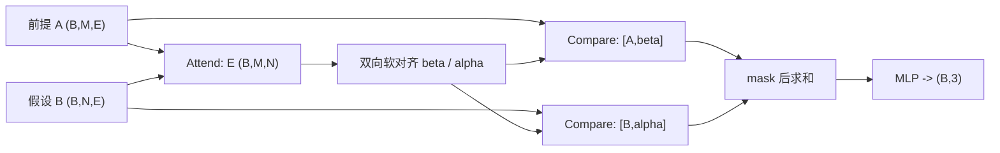

### 为什么叫“可分解”

$f$ 先分别作用于 $M+N$ 个词元，再用矩阵乘得到所有 $MN$ 对分数。若对每个词对都单独跑一个大 MLP，会重复计算同一词表示。分解减少昂贵非线性计算，但注意力分数矩阵本身仍占 $O(MN)$ 存储与点积。

完整训练见 [decomposable_attention.py](../code/ch15/decomposable_attention.py)。程序对两套 padding 显式遮蔽，并返回注意力矩阵供 Shape 断言。

### 新手例子：一行注意力怎样成为软对齐

- **具体问题/小输入**：前提词 `dog` 对假设 `[animal, sleeps]` 的分数为 `[2,0]`。
- **逐步过程**：softmax 得 $[e^2/(e^2+1),1/(e^2+1)]\approx[0.881,0.119]$；对齐向量是 `0.881*animal + 0.119*sleeps`。
- **具体输出**：`dog` 更主要与 `animal` 对齐，但仍保留少量 `sleeps` 信息。
- **说明什么**：软对齐不是选唯一词，而是候选词向量的加权平均。
- **常见误解**：`softmax(dim=-1)` 只适合 A→B 的行归一化；B→A 要转置后再归一化。

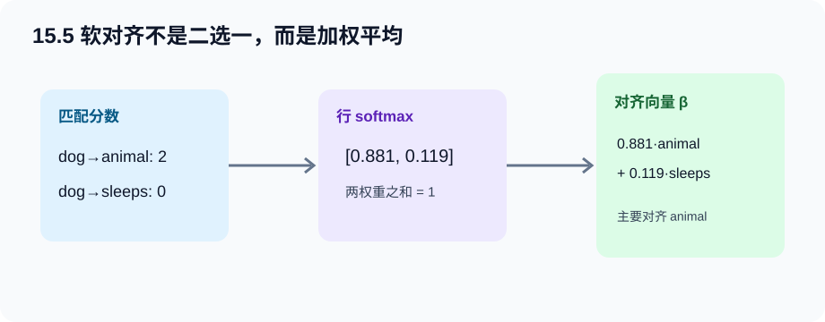

---

## 15.6 针对序列级和词元级应用微调 BERT

### 最小架构改变，输出粒度不同

BERT 编码器统一输出 `encoded:(B,S,H)`。不同任务只决定读哪些行、接什么输出层、用什么标签。

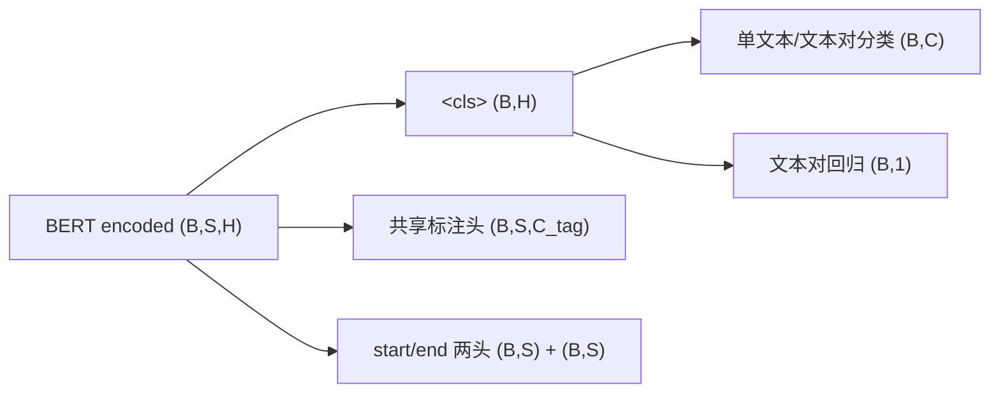

### 单文本分类

输入 `<cls> text <sep>`，取 `<cls>` 的 `(B,H)` 表示，经线性或小 MLP 输出 `(B,C)`。情感分析、语法可接受性都属于这一类。

### 文本对分类或回归

输入 `<cls> A <sep> B <sep>`。NLI 输出 `(B,3)` 并用交叉熵；语义相似度输出 `(B,1)` 连续值并可用均方误差。输入格式相同不代表损失相同。

### 文本标注

每个词元表示都送入同一个线性层，得到 `(B,S,C_tag)`。特殊词、padding 和被拆成多个子词的标签必须制定规则，例如只监督第一个子词，其余设 `ignore_index`。

### 抽取式问答

问题作为 A、段落作为 B。每个位置产生开始分数 $s_i$ 与结束分数 $e_i$，输出两个 `(B,S)`。训练分别对真实起止位置做交叉熵；推理要找满足 $i\le j$、位于段落范围内且长度合理的高分跨度，而不是独立 argmax 后直接拼。

### 冻结还是整体微调

- **只训练头**：快、显存省，适合极少数据或快速基线；
- **整体微调**：编码器适配任务，通常潜力更高；
- **分层学习率**：预训练骨干用小学习率，新头用大学习率；
- **逐步解冻**：先头后骨干，便于控制小数据过拟合。

### 新手例子：同一个 `(2,5,8)` 编码接三种头

- **具体问题/小输入**：`encoded` Shape 为 `(B=2,S=5,H=8)`。
- **逐步过程**：分类取第 0 位成 `(2,8)` 再映射 3 类；标注对全部 5 位映射 4 类；问答把每位映射成 start/end 两个标量。
- **具体输出**：分类 `(2,3)`，标注 `(2,5,4)`，问答为两个 `(2,5)`。
- **说明什么**：BERT 骨干可以相同，任务头决定监督粒度。
- **常见误解**：词元级任务不能只用 `<cls>`，否则丢失每个位置各自的输出。


---

## 15.7 自然语言推断：微调 BERT

### 从预训练权重到三分类

完整流程：加载与配置匹配的预训练 BERT；用同一词表和分词规则构造 `<cls> premise <sep> hypothesis <sep>`；加载编码器参数；新建三分类头；在 NLI 标签上联合更新。

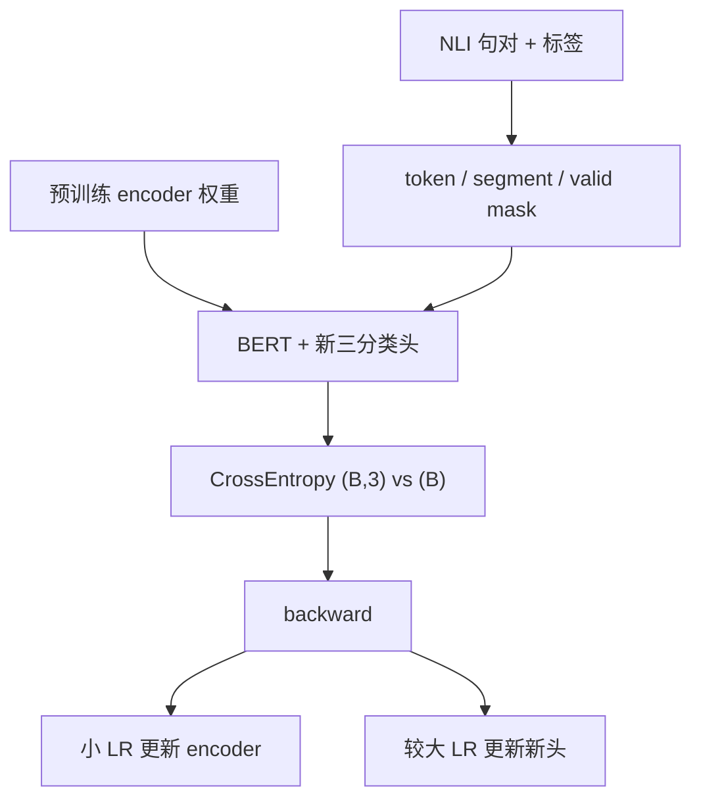

### 加载时最危险的不是报错，而是“静默错位”

- 词表索引与 embedding 行必须来自同一 tokenizer；
- `hidden_size`、层数、注意力头数必须和权重一致；
- 分类头通常随机初始化，不应误读预训练 NSP 头为三分类头；
- 截断应保留两个 `<sep>`，且 premise/hypothesis 的 token budget 有明确策略；
- mask 的 `True/False` 含义要核对当前框架 API。

### 优化与验收

预训练骨干大、新头小，统一过大学习率可能导致灾难性遗忘。常用 AdamW、较小骨干学习率、warmup/衰减、梯度裁剪和少量 epoch。验证时记录三类混淆矩阵；中性常最难，因为它缺少明显肯定或否定标志。

本仓库的 [mini_bert_finetuning.py](../code/ch15/mini_bert_finetuning.py)先在同域合成句子上做短 MLM，再添加 NLI 头。优化器用两个参数组：编码器较小学习率、分类头较大学习率；同时打印分类、标注和问答头 Shape。为让 CPU 冒烟测试在少量 epoch 内稳定收敛，合成假设含 `yes/no/maybe` 关系提示；这故意制造了可检查的捷径，也说明“跑到高准确率”不等于学会真实逻辑。它用于验证机制，而不是复现真实 SNLI 分数。

### 新手例子：两个参数组为何更新幅度不同

- **具体问题/小输入**：同一批梯度范数恰好都为 1，编码器学习率 `0.001`，新头学习率 `0.01`；忽略 Adam 动量只看一阶近似。
- **逐步过程**：参数改变量量级约为学习率乘梯度，编码器约 `0.001`，新头约 `0.01`。
- **具体输出**：新头适应任务约快 10 倍，编码器较温和地偏离预训练点。
- **说明什么**：参数组能表达“新知识快学、旧知识慢改”的工程策略。
- **常见误解**：学习率小不等于冻结；只要 `requires_grad=True` 且在优化器中，编码器仍会改变。

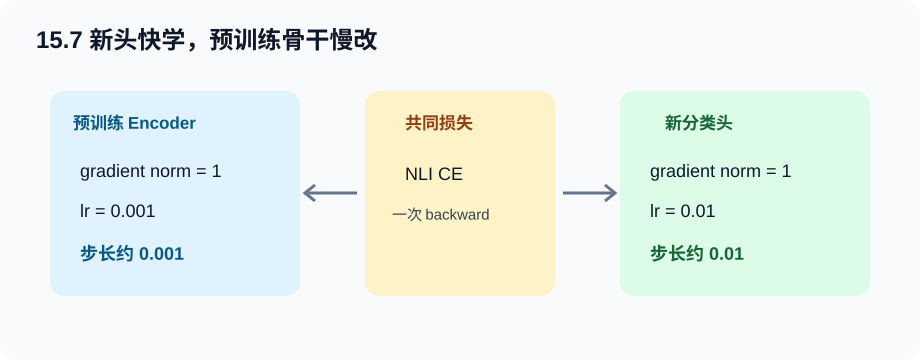

---

## Hot100 算法迁移：#139 单词拆分

> 题目来自[LeetCode Hot 100 官方题单](https://leetcode.cn/studyplan/top-100-liked/)：[#139 单词拆分](https://leetcode.cn/problems/word-break/)。以下为原创摘要与推导。

### 为什么放在本章

深度模型处理 token 序列之前，先要把字符串切成词元。单词拆分把这个前置问题抽象为：给定字符串和词典，是否存在一种合法切法。真实 BPE 用贪心应用合并规则；本题用动态规划搜索“任意可行词典切分”，目标不同，但都训练边界决策意识。

### 白话推导

定义 `dp[i]`：前 `i` 个字符 `s[:i]` 能否合法拆分。若存在一个最后切点 `j`，使 `dp[j]=True` 且 `s[j:i]` 在词典，则 `dp[i]=True`：

$$
dp[i]=\bigvee_{0\le j<i}\left(dp[j]\land s[j:i]\in D\right),
\qquad dp[0]=True.
$$

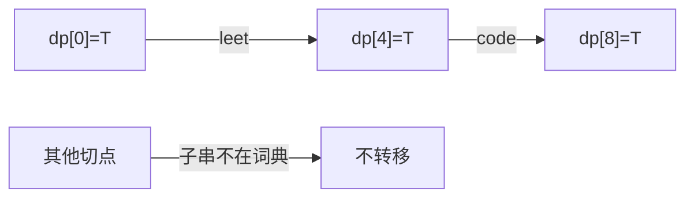

若长度为 $n$，直接枚举切点并切片通常记作 $O(n^3)$（不同语言切片成本不同）；把最长词长限制为 $L$ 后，只回看 $L$ 个字符，可写为约 $O(nL^2)$ 的切片成本，哈希查词平均 $O(1)$。若使用 Trie 逐字符扫描，可进一步避免反复创建子串。

### 易错点

1. 忘记 `dp[0]=True`，第一个词永远接不上；
2. 只做贪心最长词，遇到需要回退的案例失败；
3. 词典用列表，重复做线性查找；
4. 没意识到词可以重复使用；
5. 回溯具体切分时没有保存前驱位置。

完整逐行中文注释、自测与一种具体切分回溯见 [hot100_word_break.py](../code/ch15/hot100_word_break.py)。

### 可算例子：`leetcode`

- `dp[0]=True`；
- 到位置 4，`s[0:4]="leet"` 在词典，所以 `dp[4]=True`；
- 到位置 8，`dp[4]=True` 且 `s[4:8]="code"` 在词典，所以 `dp[8]=True`；
- 输出 `True`，一种切分是 `leet | code`。

---

## 统一代码地图

| 程序 | 正式小节 | 关键输出 | 数据 |
| --- | --- | --- | --- |
| [sentiment_models.py](../code/ch15/sentiment_models.py) | 15.1–15.3 | 两种 `(B,2)` logits | 合成正/负评论 |
| [decomposable_attention.py](../code/ch15/decomposable_attention.py) | 15.4–15.5 | `(B,3)` 与 `(B,M,N)` 注意力 | 合成三类 NLI |
| [mini_bert_finetuning.py](../code/ch15/mini_bert_finetuning.py) | 15.6–15.7 | 分类 `(B,3)`、标注 `(B,S,C)`、问答两个 `(B,S)` | MLM + NLI 小数据 |
| [hot100_word_break.py](../code/ch15/hot100_word_break.py) | 序列切分迁移 | 布尔值与具体切分 | 内置自测 |

---

## 排错路径

1. **数据**：随机打印文本、词元、标签；NLI 三类定义是否写反；训练/测试是否重复模板实例？
2. **Shape / dtype / device**：索引 `long`、mask `bool`、标签 `(B,)`；Conv1d 是否为 `(B,C,T)`；双向宽度是否 `2H`？
3. **前向**：logits 是否有限；注意力每个有效行是否约和为 1；`<cls>` 是否在第 0 位？
4. **损失**：交叉熵前不 softmax；词元任务是否忽略特殊词与 pad；标签范围是否在 `[0,C)`？
5. **梯度**：冻结嵌入是否真无梯度；BERT 骨干若声称微调，至少一个参数梯度应非空。
6. **更新**：两个参数组是否都在优化器里；`step()` 后抽查骨干与新头权重变化。
7. **指标**：准确率之外看每类召回和混淆矩阵；与多数类、词袋或只看假设基线比较。

典型症状：

| 症状 | 首查 |
| --- | --- |
| BiRNN 随 padding 长度改变预测 | 是否 pack；是否误取 `outputs[:,-1]` |
| textCNN 报通道不匹配 | `(B,S,E)` 是否先转为 `(B,E,S)` |
| 注意力 pad 获得高权重 | softmax 前是否 mask，真假语义是否写反 |
| NLI 只会预测矛盾 | 类别是否平衡；`not` 是否形成数据捷径 |
| BERT 训练很快崩 | tokenizer/权重是否匹配；骨干 LR 是否过大 |
| 问答起点在终点之后 | 推理是否联合约束 $i\le j$ |

---

## 主动回忆：先遮住答案

### 1. 情感分析为什么是“变长输入、定长输出”？

<details><summary>展开答案</summary>

结论：评论词元数可不同，但每条评论只输出一个类别。原因：标签描述整段文本。影响：编码器必须把 `(B,S,*)` 汇总为 `(B,H)`，再产生 `(B,C)`。

</details>

### 2. `<pad>` 与 `<unk>` 有什么本质区别？

<details><summary>展开答案</summary>

结论：pad 是批量对齐的非内容位置，unk 是真实但不在词表的内容。原因：二者的数据语义不同。影响：pad 应从注意力/损失排除，unk 通常仍参与编码。

</details>

### 3. 为什么词表只能用训练集建立？

<details><summary>展开答案</summary>

结论：避免测试信息进入训练流程。原因：即使没有标签，测试词是否存在和频率也是未来信息。影响：验证/测试未知词映射到 unk 才是诚实评估。

</details>

### 4. 单层双向 LSTM 的 `h_n:(2,B,H)` 怎样变成文本向量？

<details><summary>展开答案</summary>

结论：沿特征维连接 `h_n[-2]` 与 `h_n[-1]`，得到 `(B,2H)`。原因：两行分别是正向与反向最终状态。影响：分类头输入宽度必须设为 `2H`。

</details>

### 5. 为什么有 padding 时不宜直接取 `outputs[:,-1]`？

<details><summary>展开答案</summary>

结论：最后数组位置可能是 pad，不是每条序列真实结尾。原因：批量统一到最大长度。影响：使用 pack 后的最终状态，或按有效长度索引并正确处理方向。

</details>

### 6. textCNN 输入为何要从 `(B,S,E)` 转为 `(B,E,S)`？

<details><summary>展开答案</summary>

结论：PyTorch `Conv1d` 约定第二维是通道、第三维是长度。原因：卷积 API 沿最后一维滑动。影响：不转置会把 S 当通道，导致通道不匹配或错误卷积。

</details>

### 7. 最大时间汇聚保留和丢失了什么？

<details><summary>展开答案</summary>

结论：保留每通道最强响应，丢失具体位置、次数与较弱证据。原因：时间维只取一个最大值。影响：它适合“是否出现关键 n-gram”，不适合需要完整顺序计数的任务。

</details>

### 8. NLI 中“未知”为什么属于中性而非矛盾？

<details><summary>展开答案</summary>

结论：矛盾要求前提支持假设的否定；缺信息只说明无法判断。原因：开放世界下“不知道”不等于“为假”。影响：数据构造若把所有不可推出样本标矛盾，会破坏三类定义。

</details>

### 9. 可分解注意力的三个步骤是什么？

<details><summary>展开答案</summary>

结论：对齐、比较、聚合。原因：先在句间找对应证据，再逐词判断一致性，最后汇总成关系类别。影响：代码可分别检查 attention Shape、比较向量和求和后的 logits。

</details>

### 10. `scores:(B,M,N)` 给 A 对齐 B 时，softmax 应沿哪一维？

<details><summary>展开答案</summary>

结论：沿最后的 N 维。原因：对每个 A 位置，要让全部 B 候选权重和为 1。影响：B 对齐 A 时需先转成 `(B,N,M)`，再沿 M 维归一化。

</details>

### 11. 为什么 pad 嵌入为零后，比较向量仍要 mask？

<details><summary>展开答案</summary>

结论：MLP 的偏置和非线性可把零输入变成非零输出。原因：$Wx+b$ 在 $x=0$ 时仍等于 $b$。影响：聚合求和前必须再次清零无效位置。

</details>

### 12. 可分解注意力完全是线性复杂度吗？

<details><summary>展开答案</summary>

结论：不是。昂贵 MLP 表示只计算 M+N 次，但所有词对的分数矩阵仍是 $MN$。原因：双向软对齐需要每对相似度。影响：长文本仍要关注 `(B,M,N)` 的显存。

</details>

### 13. BERT 单文本分类与文本对分类的头必须不同吗？

<details><summary>展开答案</summary>

结论：若类别数相同，头结构可以相同；主要差别是输入是否含 B 段。原因：两者都读 `<cls>` 的 `(B,H)`。影响：segment 与特殊词构造比“换一个复杂头”更关键。

</details>

### 14. 文本对回归与分类只差输出维吗？

<details><summary>展开答案</summary>

结论：还差标签 dtype、输出解释和损失。原因：回归预测连续值，分类预测离散类别分布。影响：回归常输出 `(B,1)` 配 MSE；分类输出 `(B,C)` 配交叉熵。

</details>

### 15. 词元标注中子词标签怎样处理？

<details><summary>展开答案</summary>

结论：必须定义对齐策略，例如首子词承接词标签，其余忽略，或把标签扩展到全部子词。原因：原标签按词，BERT 输入按子词。影响：没有显式规则会造成标签长度与 `(B,S,C)` 不一致或重复计权。

</details>

### 16. 问答为何不能分别取 start 与 end 的最大位置就结束？

<details><summary>展开答案</summary>

结论：独立最大可能出现起点晚于终点、落在问题段或跨度过长。原因：两个位置分布独立输出，但答案有结构约束。影响：推理要联合搜索满足 $i\le j$ 等条件的高分跨度。

</details>

### 17. 只训练 BERT 新头与整体微调的区别是什么？

<details><summary>展开答案</summary>

结论：前者编码器参数不变，后者监督梯度也更新编码器。原因：冻结设置和优化器参数范围不同。影响：前者便宜稳定，后者适配能力强但更易过拟合或遗忘。

</details>

### 18. 为什么新头常用比骨干更大的学习率？

<details><summary>展开答案</summary>

结论：新头从随机参数开始要快速学习，骨干已有通用知识应缓慢调整。原因：两者离各自合适解的距离不同。影响：用优化器参数组设置分层学习率，而不是复制两份模型。

</details>

### 19. NLI 准确率很高却可能没有学会推理，为什么？

<details><summary>展开答案</summary>

结论：模型可能利用 `not`、长度或标注模板等捷径。原因：数据分布与标签存在非因果相关。影响：比较只看假设基线、反事实改写和分桶指标。

</details>

### 20. 单词拆分为什么把 `dp[0]` 设为 True？

<details><summary>展开答案</summary>

结论：空前缀可由零个词合法组成，是第一段词的转移起点。原因：若 `s[:i]` 本身在词典，需要依赖 `dp[0]`。影响：设为 False 会导致所有从字符串开头开始的方案都无法成立。

</details>

---

## 一页速查

- **情感数据**：train 建词表；`tokens:(B,S)`、`lengths:(B)`、`labels:(B)`；pad 不等于 unk。
- **BiRNN**：双向最终状态连接 `(B,2H)`；padding 时用 pack 或有效长度。
- **textCNN**：`(B,S,E)->(B,E,S)`；多核宽卷积；最大时间汇聚得到每通道最强证据。
- **NLI**：蕴涵=可推出，矛盾=可推出否定，中性=信息不足。
- **可分解注意力**：Attend `(B,M,N)` → Compare → mask 后 Aggregate → `(B,3)`。
- **BERT 分类**：读 `<cls>`；**标注**：读每个词元；**问答**：每个位置预测 start/end。
- **微调**：tokenizer/权重配置必须一致；新头大 LR、骨干小 LR；冻结不等于小 LR。
- **最小排错顺序**：文本/标签 → padding/segment/Shape → logits/attention → loss → grad → 参数组更新 → 混淆矩阵与基线。

[上一章：自然语言处理预训练](ch14-nlp-pretraining.md) · [下一章：深度学习工具附录](ch16-tools-for-deep-learning.md) · [返回总目录](../README.md)
