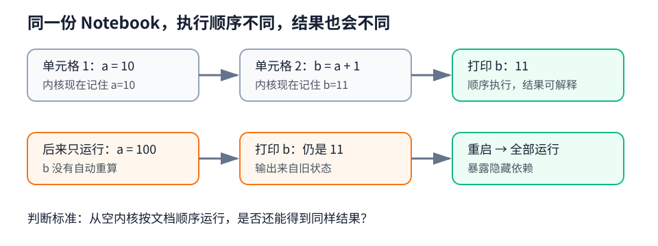
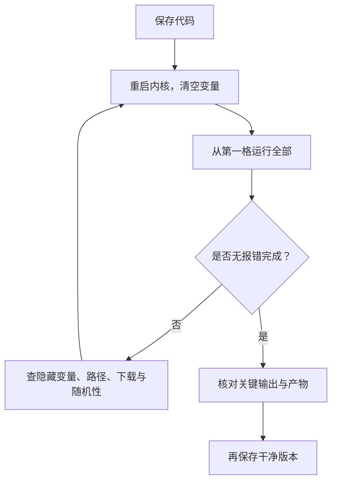
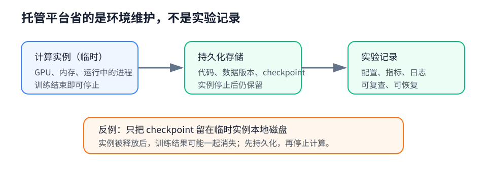
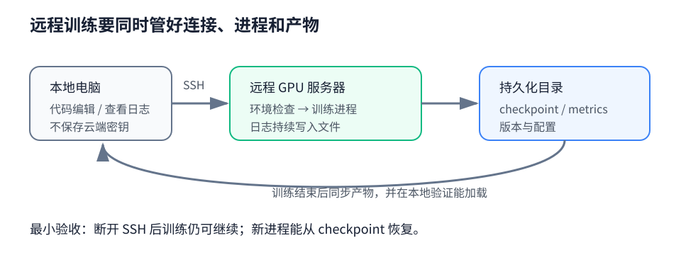
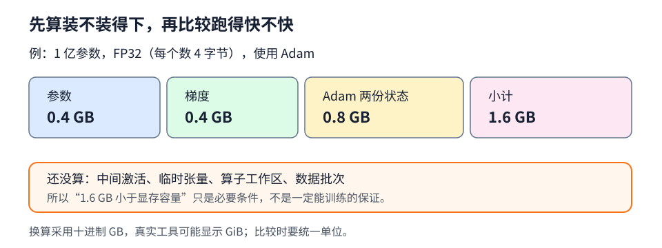
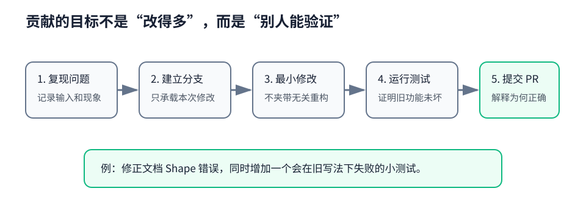
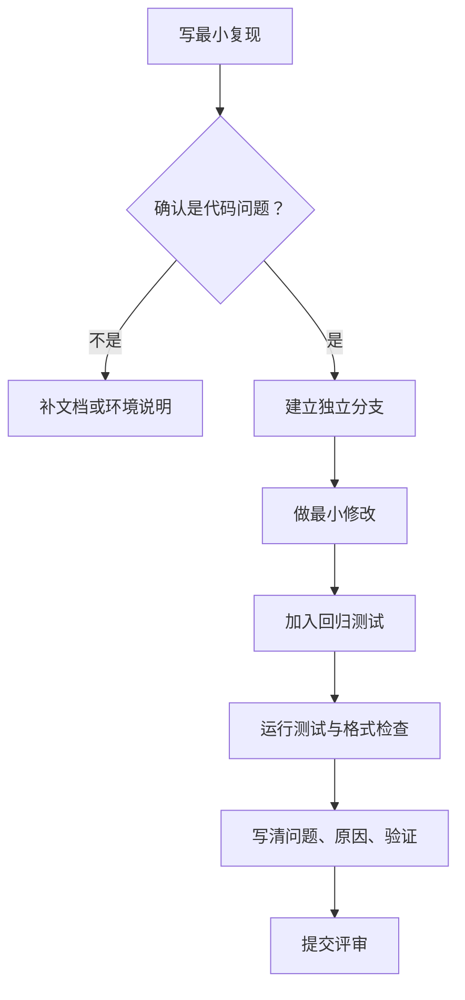
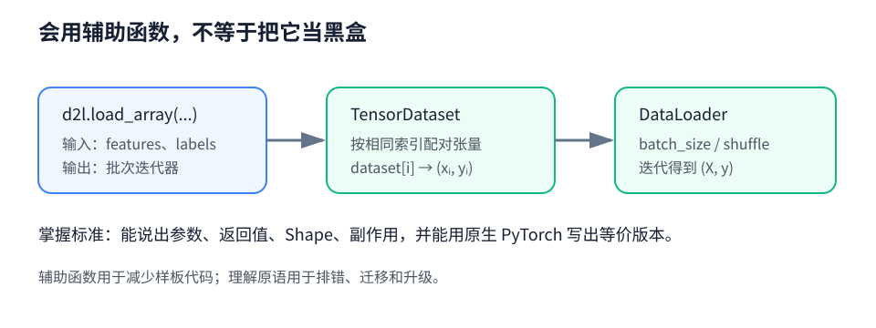
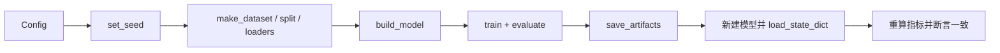
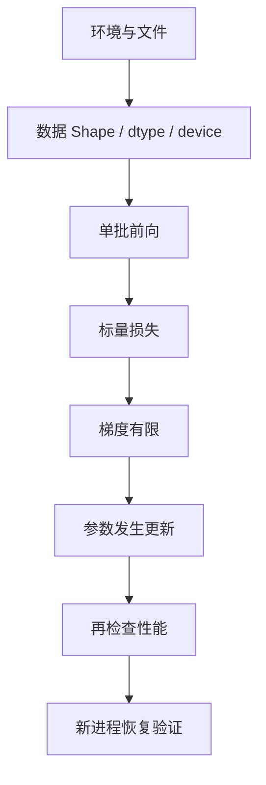

# 第 16 章：深度学习工具附录

> 复习定位：把“能跑一次”变成“换机器也能跑、断线还能恢复、结果可以复查” 
> 内容脉络：16.1–16.6 · PyTorch · 离线示例可运行 
> 原创学习笔记，章节顺序参考[《动手学深度学习》官方目录](https://zh.d2l.ai/chapter_appendix-tools-for-deep-learning/index.html)

[环境诊断完整代码](../code/ch16/environment_diagnostics.py) · [可复现实验完整代码](../code/ch16/reproducible_experiment.py) · [返回目录](../README.md)

## 一句话主线

**工具的价值不是让命令看起来专业，而是把环境、数据、配置、训练状态和结果都变成可检查的对象；这样实验失败时知道查哪里，成功时也知道怎样复现。**

## 学完后应达到什么程度

完成本章后，不要求背云平台界面，而要能独立完成下面这些可验证动作：

- [ ] 解释 Notebook 文件与运行中内核状态为什么不是一回事。
- [ ] 从空内核执行“重启并全部运行”，判断 Notebook 是否有隐藏依赖。
- [ ] 区分计算实例、持久化存储、代码版本和实验记录。
- [ ] 在远程训练前检查环境，在断开连接后保留进程，并验证 checkpoint 可恢复。
- [ ] 先估算显存，再决定批量大小、精度、设备和是否需要多卡。
- [ ] 给 CPU/GPU 计时时处理预热与异步执行，而不是只包一层计时器。
- [ ] 用最小复现、最小修改和测试完成一次可审查的贡献。
- [ ] 看到 <code>d2l</code> 辅助函数时，能说出它封装了哪些 PyTorch 原语。
- [ ] 保存模型参数、优化器状态、配置和指标，并重新加载验证。

## 本章地图

这六节不是六套互不相干的软件说明。它们共同回答一个问题：**一次实验从哪里开始，依赖什么状态，产物放在哪里，别人怎样确认结果是真的。**

---

## 16.1 使用 Jupyter Notebook

### 先抓住一个区别

Notebook 至少有两层东西：

1. 文件里的单元格、文字和已经显示的旧输出；
2. 当前 Python 内核内存里的变量、模型、随机状态和已导入模块。

保存 <code>.ipynb</code> 文件会保存单元格内容和输出，但不会把正在运行的 Python 进程完整冻结下来。下次打开时，页面可能还显示昨天的数字，内核却已经是空的。

### 新手例子：为什么“从上到下看起来没错”仍然不能复现

先建立三个单元格：

~~~python
# 单元格 1
a = 10

# 单元格 2
b = a + 1

# 单元格 3
print(b)
~~~

按 1 → 2 → 3 执行，输出是 <code>11</code>。随后把单元格 1 改为 <code>a = 100</code>，却只执行单元格 1 和 3。

逐步看内核发生了什么：

1. 最初执行单元格 2 时，内核计算并保存了 <code>b = 11</code>。
2. 后来单元格 1 把 <code>a</code> 改成 100。
3. 改变 <code>a</code> 不会自动重新执行 <code>b = a + 1</code>。
4. 所以单元格 3 仍打印旧的 <code>b = 11</code>，而不是 101。
5. 重启内核并从 1 → 2 → 3 全部运行后，才会得到 101。

**这个例子说明了什么？** 页面位置不是执行历史。Notebook 能交互运行，但变量依赖仍然必须由明确的执行顺序保证。

**新手最容易误解什么？** 已显示的输出不等于当前代码重新执行后仍会产生相同输出。提交或分享前要从空内核验证。

### 一个可靠的 Notebook 自检顺序

逐项检查：

- 导入放在前面，不依赖曾经手动执行过的隐藏单元格。
- 路径相对项目根目录，或者由配置参数明确传入。
- 下载数据与训练模型分开；离线阅读时也能看懂核心逻辑。
- 随机种子在创建数据、切分数据和初始化模型之前设置。
- 不把 API 密钥、密码或云凭据写入 Notebook。
- 大张量不整块打印，只展示 Shape、少量样本和统计量。

### Notebook 和脚本怎样分工

Notebook 适合探索：画一个分布、检查一个批次、推导一个小公式。稳定后把数据处理、模型和训练循环移到普通 Python 模块，Notebook 只保留调用、图表和解释。这样既保留交互性，也能用命令行、测试和版本控制验证核心逻辑。

---

## 16.2 使用托管云平台

### 托管到底托管了什么

托管平台通常替你准备计算实例、镜像、Notebook 服务、任务调度和部分日志设施。但实验的四个对象仍要自己分清：

| 对象 | 典型内容 | 生命周期 |
| --- | --- | --- |
| 计算 | CPU/GPU、内存、运行进程 | 可启动、停止或释放 |
| 持久化存储 | 数据、checkpoint、最终模型 | 应独立于临时计算存在 |
| 代码与配置 | Git 提交、依赖版本、超参数 | 决定实验能否复现 |
| 记录 | 日志、指标、运行时间、错误 | 用来比较与排查 |

不要把“平台替我创建了环境”理解成“平台替我保存了全部实验上下文”。

### 新手例子：两小时训练结束后，先停什么

假设你在一台临时 GPU 实例上训练两小时，得到：

- <code>checkpoint.pt</code>：模型和优化器状态；
- <code>metrics.json</code>：配置与每轮指标；
- 终端里的一串日志。

正确收尾顺序是：

1. 把 checkpoint、指标和必要日志写入持久化位置。
2. 新建一个 Python 进程，从该 checkpoint 加载模型。
3. 用一个固定验证批次确认加载后的指标与保存前一致。
4. 记录代码版本与依赖版本。
5. 最后再停止不再需要的计算实例。

如果只在终端看到“训练完成”，却把唯一的 checkpoint 留在临时磁盘上，释放实例后可能没有可用结果。

**这个例子说明了什么？** 计算资源和实验产物是两个生命周期。训练完成不等于结果已经安全保存。

**新手最容易误解什么？** “停止计算”和“删除存储”不是同一个动作；不同服务的具体行为会变化，操作前要核对当前平台说明。

### 一次云端实验的最小记录

~~~text
run_id: 2026-08-12-exp01
code_commit: <Git 提交号>
python: <版本>
torch: <版本>
device: <设备名称>
seed: 42
batch_size: 64
learning_rate: 0.02
checkpoint: <持久化路径>
metric: valid_accuracy=...
~~~

它不需要是复杂系统。关键是下一周的你能回答：**哪份代码、哪组配置、在哪个设备上，产生了哪个模型。**

### 什么时候值得用托管平台

- 本地没有所需 GPU，且任务运行时间明确；
- 团队需要统一环境、权限和实验记录；
- 任务需要排队、自动重试或按计划运行；
- 你愿意用平台费用换取较少的环境维护。

如果只是在 CPU 上跑几十秒的教学示例，本地脚本往往更直接。工具选择服务任务，不是越重越好。

---

## 16.3 使用远程服务器和云主机

### 服务器不是另一种 Python

代码仍然是 Python 和 PyTorch。变化的是运行位置与责任：你需要管理连接、环境、长时间进程、数据路径、日志、权限和产物同步。

### 新手例子：SSH 断开后，训练为什么也停了

你登录服务器后直接运行训练：

~~~powershell
python code/ch16/reproducible_experiment.py --epochs 20 --output-dir runs/remote-demo
~~~

如果进程依附于当前终端，会话断开时它可能收到挂断信号并退出。更稳妥的思路不是“祈祷网络不断”，而是：

1. 在持久终端会话或任务调度器里启动训练。
2. 让标准输出同时写入日志文件。
3. 每隔若干轮保存可恢复 checkpoint。
4. 主动断开一次连接，再登录检查进程是否仍在运行。
5. 停止并重启进程，从 checkpoint 恢复，确认不是只会保存、不会加载。

**这个例子说明了什么？** 网络连接只是控制通道，不应成为训练进程的生命线；真正的恢复点是持久化状态。

**新手最容易误解什么？** 日志文件不是 checkpoint。日志告诉你发生了什么，checkpoint 才保存继续训练需要的参数和优化器状态。

### 上机后的五分钟检查

本章提供一个离线诊断程序：

~~~powershell
python code/ch16/environment_diagnostics.py
~~~

它会完成：

1. 输出 Python、PyTorch、CUDA 可用性和可见设备；
2. 在实际设备上做带预热与同步的矩阵乘法计时；
3. 跑通一次 <code>forward → loss → zero_grad → backward → step</code>；
4. 验证损失和梯度有限，并确认参数真的改变；
5. 可选地写出不含密钥的 JSON 环境摘要。

若这段最小程序都失败，不要立刻运行大型训练。先把环境或设备问题缩小在几十行路径内。

### 权限与安全底线

- 不在仓库、Notebook、截图或日志中保存私钥和访问令牌。
- 只开放必要端口；交互页面优先通过受保护的隧道访问。
- 数据、代码和产物目录分开，防止清理临时文件时误删模型。
- 不用管理员权限运行普通训练任务。
- 删除或释放云资源前，先明确目标并验证产物已经在另一位置可加载。

---

## 16.4 选择服务器与 GPU

### 先问四个问题

1. **装得下吗？** 参数、梯度、优化器状态、激活和临时工作区都占内存。
2. **跑得快吗？** 看真实任务吞吐，不只看峰值算力。
3. **能喂饱吗？** 数据解码、磁盘和 CPU 可能让 GPU 等待。
4. **值得吗？** 总时间、使用频率和维护成本要一起比较。

### 新手例子：1 亿参数为什么不只占 0.4 GB

设模型有 1 亿个参数，全部使用 FP32，每个数 4 字节，并使用 Adam。

只算训练状态：

1. 参数：$10^8\times4$ 字节，约 0.4 GB；
2. 参数梯度：再约 0.4 GB；
3. Adam 的一阶动量：约 0.4 GB；
4. Adam 的二阶动量：约 0.4 GB；
5. 小计约 1.6 GB。

这里还没有算前向中间激活、算子工作区、数据批次、内存碎片，以及某些混合精度配置保留的主权重。因此“参数文件只有 0.4 GB”不能推出“2 GB 显存一定能训练”。

**这个例子说明了什么？** 选设备先列显存账本。训练显存通常明显大于参数本身。

**新手最容易误解什么？** GB 与 GiB 的换算不同；估算与监控工具比较时要统一单位。混合精度也不会自动让全部内存精确减半。

### 激活为什么和批量大小有关

一层输出 Shape 为 <code>(B,C,H,W)</code>，FP32 激活的基础字节数近似为：

$$
B\times C\times H\times W\times4.
$$

把批量 <code>B</code> 从 32 增到 64，这层激活的基础存储近似翻倍。参数量不随批量变化，所以遇到显存不足时，减小批量常常能立即缓解激活压力；但它也可能改变吞吐和优化行为，需要重新观察。

### 正确比较延迟与吞吐

- **延迟**：一次请求从开始到完成用了多久，在线推理常关心它。
- **吞吐**：单位时间处理多少样本，批训练常关心它。
- **预热**：首次运行可能包含内核选择、缓存或编译开销。
- **同步**：GPU 运算通常异步提交，停止计时前要等待设备真正完成。

~~~python
# 先运行预热，避免把一次性准备开销混入正式结果。
for _ in range(2):
    _ = left @ right

# GPU 上先等预热完成，再记录开始时间。
torch.cuda.synchronize() if device.type == "cuda" else None
started_at = time.perf_counter()

# 重复运算，降低一次测量的偶然噪声。
for _ in range(repeats):
    product = left @ right

# 停表前等待 GPU 队列完成，否则只量到“提交任务”的时间。
torch.cuda.synchronize() if device.type == "cuda" else None
elapsed = time.perf_counter() - started_at
~~~

完整、带参数检查的实现见[环境诊断程序](../code/ch16/environment_diagnostics.py)。

### 单卡、多卡还是 CPU

| 情况 | 先尝试什么 | 原因 |
| --- | --- | --- |
| 模型与批次单卡放得下 | 单卡 | 最少通信与排错成本 |
| 单卡放不下，但可减批量/检查点 | 先做内存优化 | 多卡不是免费的显存拼接 |
| 单卡吞吐不足且任务规模稳定 | 数据并行基准 | 需要确认通信后仍加速 |
| 小模型、小数据或预处理 | CPU 基准 | GPU 启动与传输可能不划算 |

多卡前先记录单卡基线。若两张卡只比一张快一点，先查数据输入、通信、批量划分和负载是否均衡。

---

## 16.5 为项目做贡献

### 一个可合并修改需要哪些证据

一次好的贡献至少让审查者看清：

- 原来哪里有问题；
- 怎样稳定复现；
- 你改了什么；
- 为什么这个修改能解决问题；
- 运行了哪些测试；
- 有没有超出问题范围的副作用。

### 新手例子：修正一个错误的 Shape 说明

假设文档把卷积输入写成 <code>(B,H,W,C)</code>，但配套 PyTorch 代码实际要求 <code>(B,C,H,W)</code>。

不要只把四个字母换个顺序就结束。完整的小贡献可以这样做：

1. 用一个 Shape 为 <code>(2,3,28,28)</code> 的张量复现代码确实能运行。
2. 记录旧说明会让新手在哪一步错误地 <code>permute</code>。
3. 在独立分支只修改相关说明和示例。
4. 增加一个断言，验证示例输出 Shape。
5. 运行原有测试和新断言。
6. 提交说明里写清“错误、修正、验证”，不夹带无关格式化。

**这个例子说明了什么？** 修改价值不由改动行数决定，而由问题和验证证据是否清楚决定。

**新手最容易误解什么？** “我的机器上能跑”不是充分证据。审查者需要最小复现、环境信息和能重复执行的测试。

### 从问题到拉取请求

如果问题很大，先在 issue 中确认方向；如果只是明确的小修正，也应保持提交范围单一。项目的具体贡献规范可能更新，实际提交前以目标仓库当前说明为准。

---

## 16.6 使用 d2l API

### 辅助函数解决什么问题

教学代码经常重复数据加载、训练循环、计时和绘图。<code>d2l</code> 辅助函数把这些样板操作压缩，让正文聚焦模型机制。但学习时必须知道它的输入、输出、Shape 和副作用，否则出错时只剩“黑盒不能用”。

### 新手例子：把 load_array 拆回 PyTorch 原语

假设有 6 个二维样本与 6 个标签：

~~~python
features = torch.tensor(
    [[1.0, 2.0], [2.0, 1.0], [3.0, 0.0],
     [0.0, 3.0], [4.0, 1.0], [1.0, 4.0]]
)  # Shape: (6, 2)
labels = torch.tensor([0, 0, 1, 1, 1, 0])  # Shape: (6,)
~~~

辅助函数的目标可以用原生 PyTorch 写成：

~~~python
# TensorDataset 保证第 i 行特征始终配对第 i 个标签。
dataset = torch.utils.data.TensorDataset(features, labels)

# DataLoader 每次返回 2 个样本；训练时允许打乱样本顺序。
loader = torch.utils.data.DataLoader(dataset, batch_size=2, shuffle=True)

# X 的 Shape 为 (2,2)，y 的 Shape 为 (2,)；最后一批也恰好是 2 个样本。
for X, y in loader:
    print(X.shape, y.shape)
~~~

现在你能回答封装背后的四件事：

1. 输入是同样长度的特征张量和标签张量；
2. <code>TensorDataset</code> 按索引配对它们；
3. <code>DataLoader</code> 负责批处理和可选打乱；
4. 迭代器本身不训练模型，也不改变参数。

**这个例子说明了什么？** 封装减少重复代码，原语解释实际行为。两层都懂，才能既读得快又排得动错。

**新手最容易误解什么？** 函数名相似不代表参数和返回值永远不变。版本升级或换框架时，应查看当前签名和源码，而不是靠记忆猜。

### 阅读一个辅助函数的固定四问

| 问题 | 要得到的答案 |
| --- | --- |
| 输入是什么 | 类型、Shape、dtype、device、默认值 |
| 输出是什么 | 返回对象、Shape、批量约定 |
| 有什么副作用 | 是否下载、写文件、修改模型或状态 |
| 原生等价物是什么 | 对应哪些 PyTorch 类和操作 |

若辅助函数同时完成数据下载、预处理、批处理和设备迁移，最好把这四步分别画清，再去读模型代码。

---

## 两份完整程序怎样读

本章代码不依赖联网数据，重点是建立可复制的环境检查与实验模板。

### 程序 A：环境诊断与训练冒烟测试

文件：[environment_diagnostics.py](../code/ch16/environment_diagnostics.py)

~~~powershell
# 自动选择 CUDA 或 CPU，执行完整诊断。
python code/ch16/environment_diagnostics.py

# 强制 CPU 并减小矩阵，适合快速检查。
python code/ch16/environment_diagnostics.py --device cpu --matrix-size 256

# 额外保存一份可附到问题报告的 JSON 摘要。
python code/ch16/environment_diagnostics.py --json-report environment-report.json
~~~

关键路径不是打印设备名称，而是验证完整训练链：

| 步骤 | 程序做什么 | 通过标准 |
| --- | --- | --- |
| 数据 | 创建 <code>features:(32,8)</code>、<code>targets:(32,)</code> | dtype 与设备正确 |
| 前向 | MLP 输出 <code>logits:(32,3)</code> | Shape 精确匹配 |
| 损失 | 交叉熵得到标量 | 有限，不是 NaN/inf |
| 反向 | 计算全部参数梯度 | 梯度范数有限 |
| 更新 | SGD 执行一步 | 参数最大变化大于 0 |

这段程序建立计算图吗？前向与损失在默认梯度模式下会建立图；<code>loss.backward()</code> 使用该图写入梯度。哪一步改变参数？只有 <code>optimizer.step()</code> 真正更新参数，<code>backward()</code> 本身不更新。

### 程序 B：可复现、可保存、可恢复的实验

文件：[reproducible_experiment.py](../code/ch16/reproducible_experiment.py)

~~~powershell
# 默认运行 5 轮；产物放在临时目录，结束后自动清理。
python code/ch16/reproducible_experiment.py

# 明确保留 checkpoint 和 metrics.json。
python code/ch16/reproducible_experiment.py --epochs 8 --output-dir runs/demo
~~~

程序把一次实验拆成可单独检查的函数：

逐步解释：

1. <code>Config</code> 集中保存种子、轮数、批量和学习率，避免配置散落。
2. 造数据、切分数据和 DataLoader 打乱各用明确随机生成器。
3. 训练每批严格执行前向、损失、清梯度、反向、更新。
4. 验证时调用 <code>eval()</code> 与 <code>inference_mode()</code>，不建立梯度图。
5. checkpoint 保存模型状态、优化器状态、配置和训练历史。
6. 程序重新创建一个模型并加载参数，而不是只检查文件存在。
7. 恢复模型重新计算准确率，并断言与保存前一致。

### 为什么要保存优化器状态

AdamW 不只保存参数，还维护一阶和二阶动量。若中断后只加载模型参数，预测通常没问题，但“继续训练”会丢掉优化器历史，接下来的更新轨迹可能改变。因此：

- 只做推理：模型 <code>state_dict</code> 往往足够；
- 要无缝续训：还要保存优化器、学习率调度器、当前轮次和必要随机状态；
- 要解释实验：再保存配置、代码版本和指标历史。

---

## 一条通用排错路径

遇到“换机器不能跑”时，从便宜、确定的检查开始：

1. **文件与版本**：代码提交、Python、PyTorch、依赖是否明确。
2. **设备可见性**：<code>torch.cuda.is_available()</code> 和实际设备是否符合预期。
3. **数据与路径**：文件是否存在，样本数、dtype、Shape 是否正确。
4. **最小前向**：一个小批次能否输出预期 Shape。
5. **损失与梯度**：是否有限，参数是否有非空梯度。
6. **更新**：<code>step()</code> 后参数是否真的改变。
7. **性能**：正确性通过后，再查数据等待、显存、利用率与同步计时。
8. **恢复**：新进程能否加载 checkpoint，并重现关键指标。

不要在第一步就怀疑大型模型结构，也不要在正确性未通过时优化吞吐。

## 本章为什么不硬塞 LeetCode Hot 100

本章重点是实验工程、环境与复现，没有自然出现需要迁移的经典算法题。按照本仓库“确实相关才加入”的规则，这一章不安排 Hot 100，避免为了凑题把云平台操作牵强解释成算法。相关章节的题目会明确给出题号、题名和官方直达链接。

---

## 主动回忆：先遮住答案

### 1. Notebook 文件已经保存，为什么仍可能无法复现？

展开答案

文件保存的是单元格内容和显示输出，不是当前内核的完整执行状态。乱序执行可能让变量来自旧代码。应重启内核、从上到下运行全部，并核对关键产物。

### 2. 修改 <code>a</code> 后，为什么依赖它计算出的 <code>b</code> 不会自动改变？

展开答案

普通 Python 赋值把当时的结果存进 <code>b</code>，不会建立自动重算规则。必须重新执行计算 <code>b</code> 的单元格；这正是 Notebook 隐藏状态常见来源。

### 3. 托管平台替你准备环境后，哪些责任仍然属于你？

展开答案

数据版本、代码版本、超参数、随机性、产物持久化、指标解释和权限安全仍由使用者负责。托管减少基础设施操作，不会自动证明实验可复现。

### 4. 为什么要把计算实例和持久化存储分开理解？

展开答案

计算实例可以停止或释放，训练产物却要长期保留。若 checkpoint 只存在于临时计算环境，释放资源可能同时丢失结果。

### 5. 训练日志能代替 checkpoint 吗？

展开答案

不能。日志记录损失、时间和错误等观察结果；checkpoint 保存模型参数以及可选的优化器状态等恢复材料。两者用途不同，都可能需要。

### 6. 为什么远程训练应主动做一次“断线演练”？

展开答案

它能验证训练进程是否依附当前 SSH 会话、日志是否持续保存、重新连接后能否定位进程。只假设网络稳定，真正断线时才发现问题，代价更高。

### 7. 1 亿个 FP32 参数本身大约占多少十进制 GB？

展开答案

$10^8\times4$ 字节约为 $4\times10^8$ 字节，即 0.4 GB。训练还要加梯度、优化器状态、激活和临时空间，所以不能只按 0.4 GB 选卡。

### 8. 使用 Adam 时，参数、梯度和两份动量为什么约为参数文件的四倍？

展开答案

在都用 FP32 的简化估算中，参数一份、梯度一份、Adam 一阶动量一份、二阶动量一份，共四份同尺寸数组。实际混合精度和实现细节可能增加或改变这笔账。

### 9. 批量翻倍时，哪些内存通常近似翻倍，哪些不变？

展开答案

按样本保存的激活和输入通常近似翻倍；模型参数数量不因批量变化。梯度张量 Shape 也通常与参数相同，而不是与批量一起翻倍。

### 10. 为什么直接用墙钟包住一次 CUDA 运算可能低估耗时？

展开答案

CUDA 调用常把任务异步提交后立即返回。若停止计时前未同步，测到的主要是提交时间。应预热，并在计时边界同步设备。

### 11. 延迟低与吞吐高是一回事吗？

展开答案

不是。延迟关心一次请求多久完成，吞吐关心单位时间完成多少样本。增加批量可能提升吞吐，却让单个请求等待更久。

### 12. 为什么多卡前要先有单卡基线？

展开答案

没有单卡时间、吞吐和显存基线，就无法判断多卡是否真正加速，也无法定位通信、数据输入或负载不均造成的损失。

### 13. 一个好的错误报告至少要包含什么？

展开答案

最小复现、预期结果、实际结果、完整错误信息、必要环境版本和已尝试检查。不要附带密钥、私人数据或无关的大型日志。

### 14. 为什么贡献时强调“最小修改”？

展开答案

范围越单一，审查者越容易确认因果、发现回归和回退修改。把修 bug、重命名和大规模格式化混在一起会增加验证成本。

### 15. 使用 d2l 辅助函数前后要能回答哪四问？

展开答案

输入是什么、输出是什么、有什么副作用、对应哪些原生 PyTorch 操作。再补上 Shape、dtype 和 device，基本就能排查多数接口误用。

### 16. <code>loss.backward()</code> 与 <code>optimizer.step()</code> 谁改变参数？

展开答案

<code>backward()</code> 计算梯度并写入参数的 <code>.grad</code>；<code>step()</code> 读取梯度和优化器状态后修改参数。环境冒烟测试应同时验证梯度存在和参数发生变化。

### 17. 只保存模型参数，为什么未必能无缝续训 AdamW？

展开答案

AdamW 还维护一阶、二阶动量以及步数等状态。只加载模型参数会重置这些历史，后续更新轨迹改变。续训应同时保存和加载优化器状态，并记录当前轮次与调度器状态。

### 18. 为什么“文件成功写出”还不算 checkpoint 验证完成？

展开答案

文件可能缺键、损坏、版本不兼容或加载逻辑错误。正确验收是新建模型、实际加载、运行固定验证数据，并核对恢复后的指标。

---

## 一页速查

| 场景 | 先做什么 | 通过标准 |
| --- | --- | --- |
| 分享 Notebook | 重启并全部运行 | 空内核无隐藏依赖 |
| 启动云训练 | 分开计算与持久化 | 产物路径独立存在 |
| 登录新服务器 | 跑最小环境诊断 | 前向、反向、更新都通过 |
| 选择 GPU | 列参数、梯度、状态、激活账本 | 留有运行时余量 |
| 比较性能 | 预热、同步、多次测量 | 同任务、同配置、同口径 |
| 长时间训练 | 日志与周期 checkpoint | 断线后进程继续，重启后可恢复 |
| 提交贡献 | 最小复现与回归测试 | 别人可重复验证 |
| 使用辅助 API | 查输入、输出、副作用和原语 | 能写等价最小版本 |

最后记住一句：**先证明实验链路正确，再谈规模和速度；先证明产物能恢复，再把计算资源关掉。**

---

[上一章：自然语言处理应用](ch15-nlp-applications.md) · [返回总目录](../README.md)
